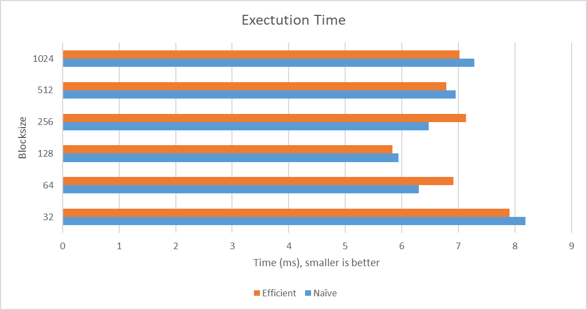

# CIS 565 Proj2

# Project 2, Stream Compaction

**University of Pennsylvania, CIS 5650: GPU Programming and Architecture, Project 1**

- Wang Ruipeng
    - [LinkedIn](https://www.linkedin.com/in/ruipeng-wang-681b89287/)
    - [Personal Website](https://wang-ruipeng.github.io/)
- Tested on: Windows 10, i7-10750H CPU @ 2.60GHz 16GB, RTX 2070 Max-Q 8GB

## **Description**

This project implements GPU stream compaction in CUDA, designed to efficiently remove `0`s from an array of integers. Stream compaction is a vital technique for many GPU-based applications, especially for accelerating ray tracing algorithms in graphics rendering.

The project comes with both CPU and GPU-based implementations of the scan algorithm, and we can compare the differences between naive and work-efficient approaches. Additionally, a GPU-accelerated radix sort is implemented for extra credit.

## **Features**

1. **CPU Scan & Stream Compaction:**
    - Implemented an exclusive prefix sum using a simple `for` loop.
    - Compact stream implementation without scan.
    - Compact stream implementation using scan, which involves mapping, scanning, and scattering steps.
2. **Naive GPU Scan:**
    - Implemented the "Naive" GPU scan algorithm using global memory, with iterative kernel invocations to handle data dependencies.
3. **Work-Efficient GPU Scan & Stream Compaction:**
    - Developed a work-efficient GPU scan using the binary tree structure for better performance.
    - Implemented stream compaction using the scan, including mapping, scanning, and scattering.
4. **Thrust Library Implementation:**
    - Utilized Thrust's `exclusive_scan` for comparison and verification of the custom scan implementations.
5. **Extra Credit: Radix Sort (+10):**
    - Implemented a radix sort algorithm on the GPU, utilizing the custom scan implementation for parallel operations.

## **Questions**

### Roughly optimize the block sizes of each of your implementations for minimal run time on your GPU



*Condition: n=2^20, power-of-two*

From the results, we can determine that both implementations achieve their optimal performance at a specific block size at **128**. Generally, smaller block sizes tend to result in longer runtimes, but as the block size increases, the performance improves up to a certain point before it starts to degrade. 

When comparing the two algorithms across the same block sizes, the Efficient implementation generally performs slightly better than the Naive implementation at smaller to mid-range block sizes. The Efficient implementation **generally outperforms** the Naive method at similar block sizes, particularly in smaller to mid-range values. This may suggest that the work-efficient approach is more suitable for optimizing GPU resources, though both algorithms experience a performance drop-off at excessively large block sizes.

### Compare all of these GPU Scan implementations (Naive, Work-Efficient, and Thrust) to the serial CPU version of Scan. Plot a graph of the comparison (with array size on the independent axis).


*Condition: blocksize = 128, non-power-of-two*

### General Observations:

1. **CPU Implementation:** The runtime for the CPU implementation increases significantly as the input size grows. 
2. **Naive and Efficient Implementations:** Both the Naive and Efficient GPU implementations show a better performance than the CPU for smaller input sizes. However, as the input size increases, their runtimes also grow. Notably, the Naive implementation starts slightly faster at smaller input sizes but becomes comparable to the Efficient implementation at larger input sizes.
3. **Thrust Implementation:** The Thrust implementation generally performs the best at smaller input sizes. It maintains a lower runtime even as input sizes grow, although it starts to show a more noticeable increase at very large sizes. 

### Performance bottlenecks

I first used the profiler from within the visual studio:


We can observe that the GPU usage is generally around 20%, this suggest that the bottle neck is not at the GPU.

And in Nsight Compute, 


I have noticed a bottleneck by cuDevicePrimaryCtxRetain. This maybe the reason that I am doing frequent context creation. This could be avoidable by cache the context globally and reuse it, avoiding multiple calls.

Also, in Nsight Systems, I found out that Cuda Synchronization also takes up a huge amount of time.

The performance bottlenecks for each implementation can stem from different factors, primarily revolving around memory I/O, computation, and GPU resource usage.

### 1. **CPU Implementation:**

- **Bottleneck:** **Computation.**
- The CPU implementation is limited by its single-threaded, sequential nature. As the input size increases The CPU lacks the massive parallelism inherent to GPUs, making it less efficient for large-scale prefix sum and stream compaction tasks. Like here, during CPU sort, most of the time, CPU was using different kernel for parallel optimization.


- Additionally, memory access on the CPU can also slow things down due to cache misses when working with large datasets, but the primary bottleneck here is the computation.

### 2. **Naive GPU Implementation:**

- **Bottleneck:** **Memory I/O and Synchronization.**
- The Naive implementation involves multiple kernel invocations for each step of the scan process. With each invocation, **data is transferred between global memory and the GPU cores**, which can be slow due to high-latency global memory access. The need to read from and write to global memory repeatedly at every step (since it does not use shared memory effectively) adds significant overhead.
- Additionally, the algorithm may suffer from **thread divergence** since my kernel has if statement that may lead to different branches:

```cpp
if (idx >= twoPow(d))
    odata[idx] = idata[idx] + idata[idx - twoPow(d)];
else
    odata[idx] = idata[idx];
```

### 3. **Efficient GPU Implementation:**

- **Bottleneck:** **Memory I/O, Synchronization, and Resource Contention.**
- Although the Efficient implementation makes better use of the GPU's resources, it still has to deal with global memory access when storing intermediate results. These memory I/O operations can become a bottleneck, especially as input sizes increase.
- Another potential bottleneck is the **synchronization** required during the up-sweep and down-sweep phases of the scan. Since threads need to wait for other threads to complete their operations at certain points, this can cause some GPU cores to be idle, reducing overall throughput. This was an observation from Nsight Systems.


- Additionally, the usage of shared memory, while beneficial for reducing global memory latency, is limited by the block size. As block size increases, shared memory usage per block increases, which can reduce the number of active blocks (occupancy) on each streaming multiprocessor (SM), resulting in **resource contention**.

### 4. **Thrust Implementation:**

- **Bottleneck:** **Memory I/O (Allocation, Copying), Overhead.**
- The Thrust library is highly optimized, but it may still incur overhead from internal memory allocations and data copying between host and device memory. For larger datasets, the time required for memory I/O operations could start to dominate overall runtime, especially if not carefully managed or excluded from timing measurements.

### Paste the output of the test program

```cpp

****************
** SCAN TESTS **
****************
    [  46  37  45  13  12  15  30  24  37  35  20  41  49 ...  10   0 ]
==== cpu scan, power-of-two ====
   elapsed time: 41.343ms    (std::chrono Measured)
    [   0  46  83 128 141 153 168 198 222 259 294 314 355 ... 205377453 205377463 ]
==== cpu scan, non-power-of-two ====
   elapsed time: 35.9428ms    (std::chrono Measured)
    [   0  46  83 128 141 153 168 198 222 259 294 314 355 ... 205377387 205377405 ]
    passed
==== naive scan, power-of-two ====
   elapsed time: 19.1273ms    (CUDA Measured)
    passed
==== naive scan, non-power-of-two ====
   elapsed time: 18.4832ms    (CUDA Measured)
    passed
==== work-efficient scan, power-of-two ====
   elapsed time: 18.2371ms    (CUDA Measured)
    passed
==== work-efficient scan, non-power-of-two ====
   elapsed time: 17.8695ms    (CUDA Measured)
    passed
==== thrust scan, power-of-two ====
   elapsed time: 28.836ms    (CUDA Measured)
    passed
==== thrust scan, non-power-of-two ====
   elapsed time: 26.711ms    (CUDA Measured)
    passed

*****************************
** STREAM COMPACTION TESTS **
*****************************
    [   1   1   3   2   2   1   3   3   2   3   2   1   0 ...   1   0 ]
==== cpu compact without scan, power-of-two ====
   elapsed time: 39.6999ms    (std::chrono Measured)
    [   1   1   3   2   2   1   3   3   2   3   2   1   3 ...   2   1 ]
    passed
==== cpu compact without scan, non-power-of-two ====
   elapsed time: 38.4733ms    (std::chrono Measured)
    [   1   1   3   2   2   1   3   3   2   3   2   1   3 ...   3   2 ]
    passed
==== cpu compact with scan ====
   elapsed time: 104.224ms    (std::chrono Measured)
    [   1   1   3   2   2   1   3   3   2   3   2   1   3 ...   2   1 ]
    passed
==== work-efficient compact, power-of-two ====
   elapsed time: 9.1924ms    (CUDA Measured)
    passed
==== work-efficient compact, non-power-of-two ====
   elapsed time: 9.5876ms    (CUDA Measured)
    passed

*****************************
** RADIX SORT TESTS **
*****************************
    [ 6852 1666 16056 12153 11773 10568 22355 8220 29942 12539 13474 3129 191 ... 6808 6503 ]
==== cpu std::sort, power-of-two ====
   elapsed time: 2361.6ms    (std::chrono Measured)
    [ 32767 32767 32767 32767 32767 32767 32767 32767 32767 32767 32767 32767 32767 ...   0   0 ]
==== cpu std::sort, non-power-of-two ====
   elapsed time: 2415.34ms    (std::chrono Measured)
    [ 32767 32767 32767 32767 32767 32767 32767 32767 32767 32767 32767 32767 32767 ...   0   0 ]
==== radix sort, power-of-two ====
   elapsed time: 1007.1ms    (CUDA Measured)
    passed
==== radix sort, non-power-of-two ====
   elapsed time: 742.521ms    (CUDA Measured)
```

## Extra Credits

### **Why is My GPU Approach So Slow? (Extra Credit) (+5)**

In my original implementation, the kernel invocations always used a fixed number of threads equal to the total number of elements in the data array. For instance, in the following code snippet:

```cpp
__global__ void upSweep(int n, int D, int* x) {
    int idx = blockDim.x * blockIdx.x + threadIdx.x;
    if (idx >= n) return;
    if (idx % D != 0) return;
    x[idx + D - 1] += x[idx + D >> 1 - 1];
}
```

I attempted to optimize the performance by dynamically adjusting the number of threads during the up-sweep phase. Specifically, I calculated the required number of threads for each iteration as `n / (1 << (d + 1))`, where `n` is the total number of elements and `d` represents the current iteration level. Surprisingly, this adjustment resulted in an approximate 12% decrease in performance.

Upon further analysis, I identified a few possible reasons for this slowdown:

1. **Early Termination and Minimal Branching in the Original Code:** The original implementation included an early termination condition that effectively reduced unnecessary computations. Additionally, the lack of excessive branching and the relatively short length of each kernel contributed to its efficiency. Thus, changing the number of threads dynamically might have introduced additional overhead, negating any potential benefits of reducing the number of active threads.
2. **Consistency with Fixed Thread Count:** Using a fixed thread count for each kernel invocation maintained a higher level of consistency within the GPU's scheduling. This consistency can be beneficial for performance because the GPU's hardware is optimized for executing parallel tasks in a uniform manner.
3. **Reduced Indexing Overhead:** In the dynamic thread adjustment approach, the kernel has to calculate the number of threads and their indices for every iteration. This introduces additional indexing calculations that can increase the overall runtime. In contrast, maintaining a fixed number of threads minimizes such computations, thereby improving performance.

In conclusion, the bottleneck in the current algorithm does not appear to be related to thread count. Rather, the original approach **benefits from the uniformity** of having a consistent thread count, early termination, and reduced overhead in indexing calculations.

### **Extra Credit 1: Radix Sort (+10)**

In my radix sort implementation, I use a bitwise parallel approach to sort integers in an array. Here’s a breakdown of the process, and how it aligns with the key concepts from the literature on GPU-based radix sort:


- The `kernCheckZeroBit` kernel is used to extract a specific bit from each integer in the input array. For each bit position, the kernel sets up a bit mask to partition the elements based on whether the bit is 0 or 1.
- In each iteration, we perform an exclusive scan on the bit mask (`e`) to compute the indices (`f`) for reordering the elements in the next step. The scan is handled by efficient scan function in my code.
- The number of  `toralFalses` is determined using the last values of the scan and the bit mask arrays.
- The kernel `kernGenerateIndices` calculates the destination indices for each element in the array, which is `d` in the graph above.
- The `kernScatter` kernel reorders the elements in the input array (`idata`) based on the indices generated in the previous step, producing a new partially sorted array (`odata`).
- After scattering, the `dev_input` and `dev_output` arrays are swapped for the next iteration.

This process is repeated for each bit in the integers, which ensures that the array is fully sorted based on all bits.


*Condition: blocksize = 128*

My major observation was this:

- The radix sort performs consistently better for non-power-of-two sizes than for power-of-two sizes. This suggests that the algorithm handles non-power-of-two data sizes efficiently as we would expect. This was possibly due to the scan's handling of array padding and partitioning.
- For smaller input sizes std::sort is relatively competitive with radix sort. Because it was too hard to observe the difference when n=2^18, I will present the number directly:

| Methods | std::sort, power-of-two | std::sort, non-power-of-two | radix sort, power-of-two | radix sort, non-power-of-two |
| --- | --- | --- | --- | --- |
| Elapsed Time (ms) | 97.6852 | 94.1308 | 101.3591 | 97.8606 |
- However, as input sizes increase, radix sort demonstrates a clear advantage. For example, at size 23, the radix sort (non-power-of-two) takes significantly less time (729.655 ms) compared to std::sort (2384.98 ms).
This indicates that radix sort scales more efficiently with **larger datasets**, especially when dealing with non-power-of-two sizes.