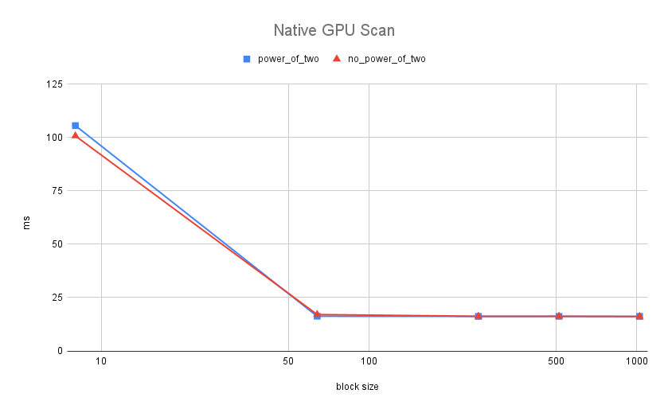
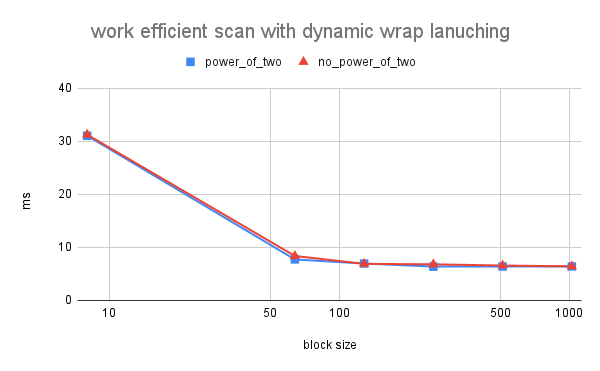
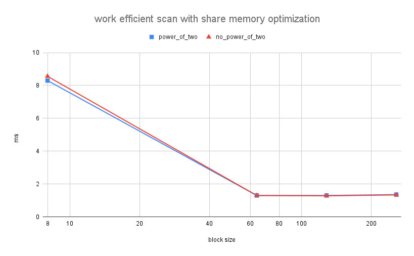
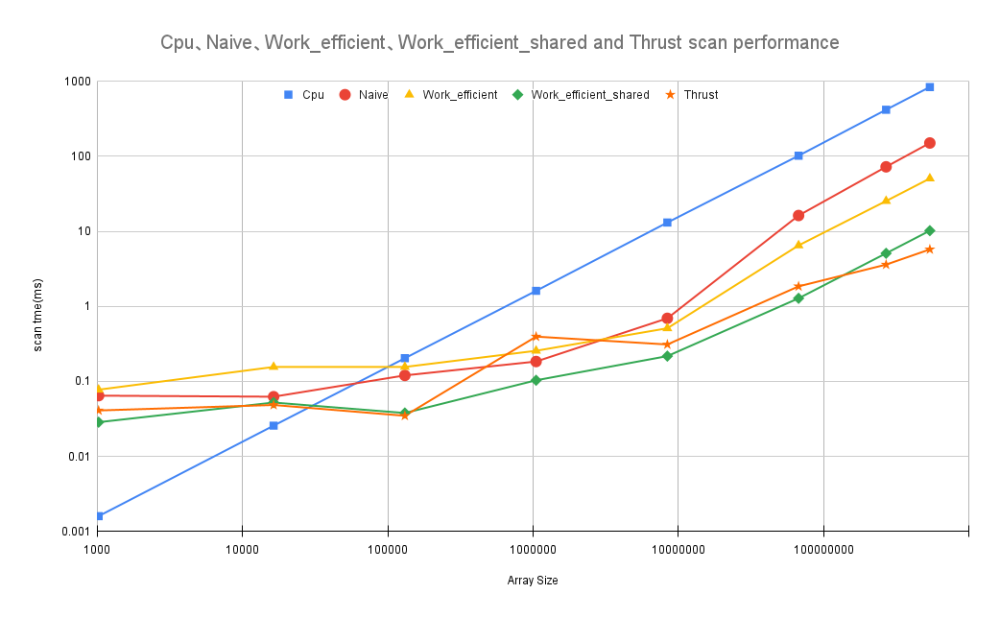
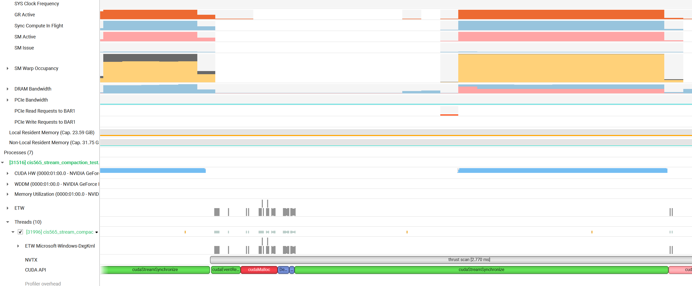

CUDA Stream Compaction
======================

**University of Pennsylvania, CIS 565: GPU Programming and Architecture, Project 2**

* Xitong Zheng
  * [LinkedIn](https://www.linkedin.com/in/xitong-zheng-5b6543205/), [Instagram](https://www.instagram.com/simonz_zheng/), etc.
* Tested on: Windows 11, i7-12700k 32GB, GTX 4090 24GB

### Features Implemented
To make it clear, scan here refers to calculate the prefix sum of an array, whether exclusive or inclusive. Stream Compaction refers to remove the zero data in an array and compact the useful data together with less memory size required. This can be useful in spareMatrix and other fields.
- CPU Scan & Stream Compaction 
- Naive GPU Scan 
- Work-Efficent Algo GPU Scan & Stream Compaction
- Thrust Scan (for comparison)
- Optimized GPU Scan with dynamical wrap control
- Radix Sort
- GPU Scan Using Shared Memory 
#### Features to be included
- bank conflict reduce
- add Nsight Performance Analysis at readme
### Feature Details
### Performance Analysis
#### Find the optimized of each of implementation for minimal run time on GPU
First, I choose array size = 2^26 to find the optimal block size. The reason is that stream generally comes in a large scale and if it is small size, then using cpu is rather fast. 

#### Optimal block Size for GPU naive scan

The x-axis is the block size, which specifys how many threads are in a single block. The y-axis is executation time in ms.
It shows that for native GPU scan, executation time drops drastically after block size increase to around 100 and the time do not change greatly from that scale. So any scale ranging from 100(128) to 1000(1024) is acceptable. I choose 512 blocks for the naive GPU scan

#### Optimal block Size for work efficient GPU scan with dynamic wrap lanuching

The x-axis is the block size, which specifys how many threads are in a single block. The y-axis is executation time in ms.
As blockSize increases, the executation time dropped quickly and bounce up slightlt after 256 blockSize. So 256 is the optimal blockSize.

#### Optimal block Size for work efficient GPU scan with extra share memory

The x-axis is the block size in log, which specifys how many threads are in a single block. The y-axis is executation time in ms.
Based on the picture, the optimal block size is 128. Also, there are some memoery issues when the block size is 512 or higher so I do not plot the data after that, but the time reaches minimal at block size of 128.


#### Compare all of these GPU Scan implementations (Naive, Work-Efficient, and Thrust) to the serial CPU version of Scan. Plot a graph of the comparison (with array size on the independent axis).

The x-axis is the Input Array size in log and the y-axis is scan time in ms in log.
CPU scan is really fast when the input array size is small, only after around 100000 (rougly 2^13), all gpu scans start to run faster than the cpu one. Another interesting fact is that my work efficient scan run faster than thrust library exclusive_scan during the size ranging from 10^5 to 10^8. After that boundary, the thrust scan run superly fast, like for input array of size 2^29, the performance is twice as much as the work efficient shared memory scan.

#### Performance bottlenecks for each implementation.
#### Naive Scan
Naive Scan has an extensive size of global memory access.
Bottleneck: memory bandwidth

#### Efficient Scan with dynamic wrap optimization
Algo time complexity drop but memory has not changed. It also has a lot of global memory access. Some are reduced by dynamic wrap optimization so that threads do not lanuched. But a single thread run similarly.
Bottleneck: memory bandwidth

#### Efficient Scan with extra share memory optimization
Global memory requests drop a lot and compute intensity increase.
Bottleneck: algo implementation, compute compabitity

### Thrust scan

The occupancy is full from the picuture. So it use full potential compute compabitity of hardware.

#### Output of the test program
Input Array Size is 2^29

```
****************
** SCAN TESTS **
****************
    [   1   2   1   3   3   4   6   0   6   2   0   4   8 ...   4   0 ]
==== cpu scan, power-of-two ====
   elapsed time: 830.72ms    (std::chrono Measured)
    [   0   1   3   4   7  10  14  20  20  26  28  28  32 ... -1879071581 -1879071577 ]
==== cpu scan, non-power-of-two ====
   elapsed time: 817.077ms    (std::chrono Measured)
    [   0   1   3   4   7  10  14  20  20  26  28  28  32 ... -1879071590 -1879071590 ]
    passed
==== naive scan, power-of-two ====
   elapsed time: 150.14ms    (CUDA Measured)
    passed
==== naive scan, non-power-of-two ====
   elapsed time: 150.199ms    (CUDA Measured)
    passed
==== work-efficient scan, power-of-two ====
   elapsed time: 51.344ms    (CUDA Measured)
    passed
==== work-efficient scan, non-power-of-two ====
   elapsed time: 51.6955ms    (CUDA Measured)
    passed
==== work-efficient scanShared, power-of-two ====
   elapsed time: 10.537ms    (CUDA Measured)
    [   0   1   3   4   7  10  14  20  20  26  28  28  32 ... -1879071581 -1879071577 ]
    passed
==== work-efficient scanShared, non-power-of-two ====
   elapsed time: 10.1171ms    (CUDA Measured)
    [   0   1   3   4   7  10  14  20  20  26  28  28  32 ... -1879071590 -1879071590 ]
    passed
==== thrust scan, power-of-two ====
   elapsed time: 5.6976ms    (CUDA Measured)
    passed
==== thrust scan, non-power-of-two ====
   elapsed time: 5.82576ms    (CUDA Measured)
    passed

*****************************
** STREAM COMPACTION TESTS **
*****************************
    [   2   3   2   0   3   1   3   3   2   3   3   3   0 ...   0   0 ]
==== cpu compact w ithout scan, power-of-two ====
   elapsed time: 1111.51ms    (std::chrono Measured)
    [   2   3   2   3   1   3   3   2   3   3   3   2   1 ...   3   1 ]
    passed
==== cpu compact without scan, non-power-of-two ====
   elapsed time: 1118.49ms    (std::chrono Measured)
    [   2   3   2   3   1   3   3   2   3   3   3   2   1 ...   2   3 ]
    passed
==== cpu compact with scan ====
   elapsed time: 4087.93ms    (std::chrono Measured)
    [   2   3   2   3   1   3   3   2   3   3   3   2   1 ...   3   1 ]
    passed
==== work-efficient compact, power-of-two ====
   elapsed time: 415.429ms    (CUDA Measured)
    [   2   3   2   3   1   3   3   2   3   3   3   2   1 ...   3   1 ]
    passed
==== work-efficient compact, non-power-of-two ====
   elapsed time: 409.022ms    (CUDA Measured)
    passed

*****************************
** Radix Sort TESTS **
*****************************
    [ 3566 6053 12621 13337 8159 5567 1910 31611 14939 2462 8737 2023 16916 ... 8582   0 ]
==== cpu sort power-of-two ====
   elapsed time: 31606.3ms    (std::chrono Measured)
    [   0   0   0   0   0   0   0   0   0   0   0   0   0 ... 32767 32767 ]
==== my radixsort power-of-two ====
   elapsed time: 3875.56ms    (CUDA Measured)
    [   0   0   0   0   0   0   0   0   0   0   0   0   0 ... 32767 32767 ]
    passed
==== cpu sort non-power-of-two ====
   elapsed time: 26910.9ms    (std::chrono Measured)
    [   0   0   0   0   0   0   0   0   0   0   0   0   0 ... 32767 32767 ]
==== my radixsort non-power-of-two ====
   elapsed time: 3768.46ms    (CUDA Measured)
    [   0   0   0   0   0   0   0   0   0   0   0   0   0 ... 32767 32767 ]
    passed
Press any key to continue . . .```