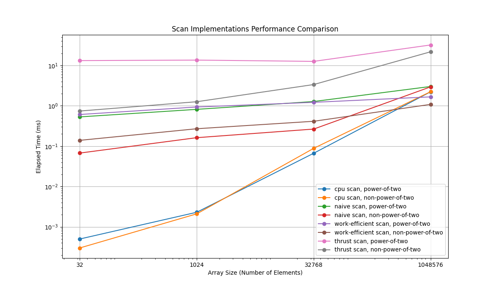

CUDA Stream Compaction
======================

**University of Pennsylvania, CIS 565: GPU Programming and Architecture, Project 2**

* Kevin Dong
  * [LinkedIn](www.linkedin.com/in/xingyu-dong)
* Tested on: Windows 11, Intel(R) Core(TM) i7-10750H CPU @ 2.60GHz 2.59 GHz, GTX 2060

This repo implements several versions of parallel exclusive scan algorithms and used them to implement stream 
compaction. The work-efficient scan algorithm has also been used in implementing a parallel radix sort algorithm.

### Features

#### CPU Scan and Compaction
The CPU scan implementation is fairly straightforward $O(n)$ algorithm. The compaction algorithms, with and without 
scan, also run in $O(n)$ time. All of them perform fairly well on small input sizes and become slow as the input size 
increases.
#### Naive GPU Scan
The naive parallel scan is a $O(log_n)$ algorithm that still performs $O(nlog_n)$ number of adds, which makes it not 
really better than the sequential algorithm.
#### Work-Efficient GPU Scan and Compaction
The work-efficient scan improves upon the naive algorithm by changing the array into a balanced binary tree. It first 
performs a parallel reduction (the up-sweep) and a down-sweep that yields the final scan result. This algorithm has 
$O(n)$ number of adds and performs much better than the naive scan. To accommodate input sizes that are not powers of 2, 
we enlarge the input array to the nearest power of 2 and pad the rest of the array with 0s.
#### Work-Efficient Scan Optimization (Part 5 Extra Credit)
We can further optimize the work-efficient scan by reducing the number of works needed to be done. A lot of threads 
are not needed in the process because only some nodes are required to be updated during each iteration.
#### Thrust Scan
The thrust implementation calls the thrust api to perform the exclusive scan. It is very straightforward.
#### Radix Sort (Extra Credit 1)
The parallel radix sort uses the work-efficient exclusive scan as part of its implementation. We iterate through $k$ 
bits and the exclusive scan take $O(log_n)$ time. The total time complexity is $O(k\cdot log_n)$ because the generation of 
bit array and scatter operation are $O(1)$ due to the parallelism.

### Performance Analysis
We will compare the performance of the different scan algorithms on different input sizes. The graph is shown below in 
log scale.

From the graph, we can see that the work-efficient scan algorithm performs the best among all the scan algorithms. When 
the input size is small, the CPU algorithm is the fastest algorithm, but it quickly becomes slower as the input size 
increases. The thrust implementation is the slowest among all GPU programs.

#### Performance Bottlenecks
Our timer for all the algorithms does not contain the memory allocation process and the process of copying the final 
result array back to the host. Therefore, the execution time should mainly reflect the computation time as well as the 
memory access time while doing the computation.

The CPU implementation is fairly efficient and can hardly be further improved, since it is already a linear time 
algorithm. From the runtime result we can also observe the fact that it runs very fast when the input size is small, 
since comparing to its GPU counterparts it doesn't cause a lot of overheads. 

The naive algorithm generally performs worse than the work-efficient algorithm, since it requires more adds operations 
even comparing to the CPU implementation and have many idle threads that are not actively working. Since our 
implementation uses global memory, the memory access could also potentially slow down the algorithm. It is expected 
that a shared-memory model may further improve the algorithm's performance.

The work-efficient algorithm improves based on the naive algorithm by doing computations like a balanced binary tree. 
The number of adds for both the up-sweep and the down-sweep in this case becomes $O(n)$, thus making this algorithm 
more efficient. The work-efficient algorithm does require more memory access, since there are more steps involved and 
all the data are stored as global memory, so changing it to a shared-memory model should greatly improve its 
performance. In part 5, we implemented an optimization that reduces the number of threads generated and replaced the 
modular operation with a value comparison, which should make the algorithm more efficient.

For both the naive and the efficient algorithm, we can see that having input size as a power-of-two number yields a 
better result compared to a non-power-of-two input size. This is because the non-power-of-two size requires the 
algorithm to append $0's$ to the back of the array to manually make it a power-of-two size, thus creating computations 
that are not relevant. 

The thrust algorithm takes much longer time that expected and becomes the slowest among all the algorithms. It is 
possible that this is caused by a large size memory copy within the algorithm that causes this unexpected situation.

### Output
This output is generated with $2^{20}$ input size and $256$ block size.
```
****************
** SCAN TESTS **
****************
==== cpu scan, power-of-two ====
   elapsed time: 2.2409ms    (std::chrono Measured)
    passed
==== cpu scan, non-power-of-two ====
   elapsed time: 2.2036ms    (std::chrono Measured)
    passed
==== naive scan, power-of-two ====
   elapsed time: 3.0672ms    (CUDA Measured)
    passed
==== naive scan, non-power-of-two ====
   elapsed time: 2.01571ms    (CUDA Measured)
    passed
==== work-efficient scan, power-of-two ====
   elapsed time: 1.51936ms    (CUDA Measured)
    passed
==== work-efficient scan, non-power-of-two ====
   elapsed time: 1.31811ms    (CUDA Measured)
    passed
==== thrust scan, power-of-two ====
   elapsed time: 31.2554ms    (CUDA Measured)
    passed
==== thrust scan, non-power-of-two ====
   elapsed time: 19.5888ms    (CUDA Measured)
    passed

*****************************
** STREAM COMPACTION TESTS **
*****************************
==== cpu compact without scan, power-of-two ====
   elapsed time: 4.2505ms    (std::chrono Measured)
    passed
==== cpu compact without scan, non-power-of-two ====
   elapsed time: 4.0982ms    (std::chrono Measured)
    passed
==== cpu compact with scan ====
   elapsed time: 13.0274ms    (std::chrono Measured)
    passed
==== work-efficient compact, power-of-two ====
   elapsed time: 3.36822ms    (CUDA Measured)
    passed
==== work-efficient compact, non-power-of-two ====
   elapsed time: 1.09792ms    (CUDA Measured)
    passed

**********************
** RADIX SORT TESTS **
**********************
==== radix sort ====
   elapsed time: 17.0703ms    (CUDA Measured)
==== thrust sort ====
   elapsed time: 46.5818ms    (CUDA Measured)
    passed
```