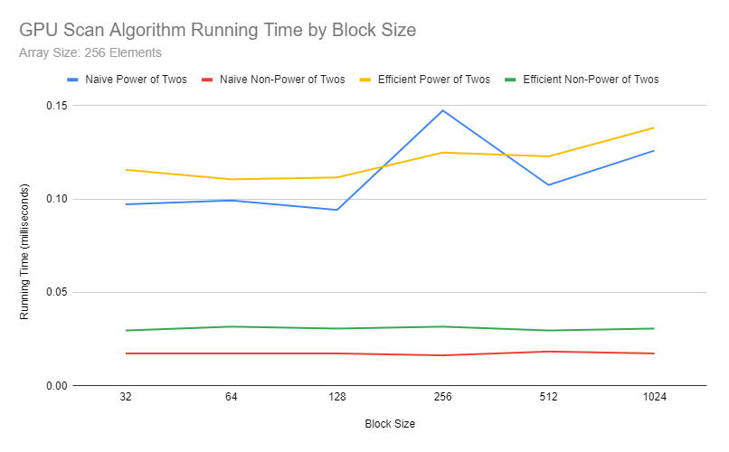
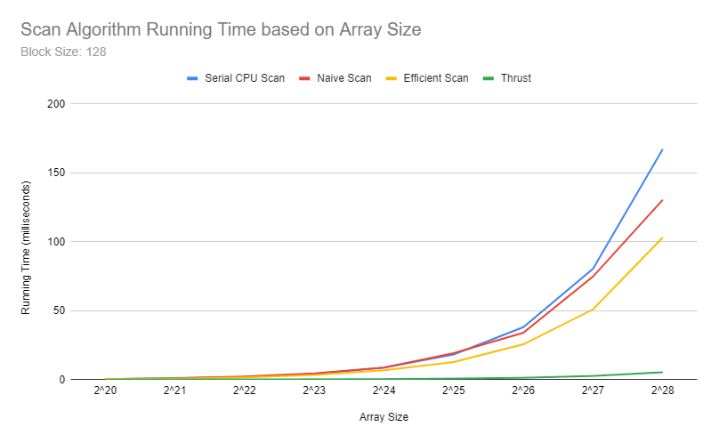
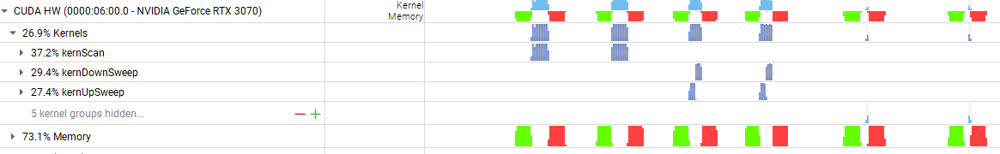

# CUDA Stream Compaction

**University of Pennsylvania, CIS 565: GPU Programming and Architecture, Project 2**

- Dineth Meegoda
  - [LinkedIn](https://www.linkedin.com/in/dinethmeegoda/), [Personal Website](https://www.dinethmeegoda.com).
- Tested on: Windows 10 Pro, Ryzen 9 5900X 12 Core @ 3.7GHz 32GB, RTX 3070 8GB

## Summary

This project implements a stream compaction algorithm with a prefix sum scan using various algorithms on the CPU and GPU. Stream Compaction is a useful algorithm used to reduce the 'un-needed' elements of a stream to improve the efficiency of a variety of algorithms, including path tracing.

This was done with the following approaches:

- **CPU-Based**: A basic CPU based scan and compaction algorithm (with and without using scan) to serve as an accuracy and performance benchmark for the other implementations.

- **Naive GPU Scan**: A parallel algorithm run on the GPU to conduct the scan and utilize multiple threads to find the resulting prefix sum array. However, this is a 'naive' scan since it is not work efficient as there are several idle threads in a warp as it runs. The complexity of this algorithm is O(log_2_n).

- **Work-Efficient GPU**: A parallel algorithm that can be done in place with two stages: an upsweep and a downsweep. This algorithm maximizes usage on each thread such that the complexity of this algorithm is O(n).

- **Thrust**: A wrapper of a call to the Thrust library function exclusive scan. This was done to act as a performance bench mark for the rest of the implementations.

## Performance Analysis

All performance was analyzed on Release mode builds without debugging. The timing was analyzed with std::chrono for CPU high-precision timing and CUDA events to measure the GPU/CUDA performance. Initial/Final memory operations were not included in the GPU/CUDA performance times since the purpose of the analysis is to measure the efficiency of the algorithms, not the associated memory operations.

The arrays tested are randomly generated and were different on each run. As a result, three performance trials were taken to estimate each data point.

### Block Size Analysis:



According to these tests, the optimal block size for both the Naive Algorithm and Work-Efficient Algorithm seems to be **128**. This remains true for regardless if the array tested had a size of a power of two or other. As the block sizes increase, performance slightly decreases with the slight exception at 128.

The work-efficient implementation usually underperformed against the naive algorithm with one exception, but the arrays tested had a comparatively smaller size than arrays tested later on in our performance analysis.

### Approach Comparison:



Generally, performance for all implementations increases as the array size increases, which is expected. The CPU Scan has a faster growing runtime than the other implementations.

Although the efficient scan is more performant than the naive scan, it grows similarly for increasing input sizes. Compared to the smaller 2^8 array input sizes in the block size comparison, the work-efficient scan performs much better than the naive scan. This suggests that with a higher number of elements to process, the work-efficient process is better at optimizing GPU resources and as a result achieves a greater performance than the naive approach.

Meanwhile, the thrust implementation is much faster than any other implementation and also grows at a much slower rate in relation to the increasing input size.

### Performance Bottlenecks:



- **Computation:** The CPU implementation is mainly limited in its compute due to it being single-threaded and not being able to take advantage of parallelization. The naive implementation also suffers from a computation bottleneck due to not being able to properly utilize all of the threads in a warp during computation. The work-efficient implementation does not seem to suffer from as much computational bottlenecks.

- **Memory I/O:** Memory I/O is definitely a bottleneck in the two GPU implementations (non-thrust). Namely, shared memory is not used, and data access to the array during operations is done through global memory reads. This greatly increases latency and can lead to stalls in warps. These reads are used in the same operations in which they are computed, which does not allow for an oppoturnity to 'hide' these latencies with compute operations. These memory operations especially become a problem when it comes to larger input array sizes as we have much more reads that take more cycles than any of our compute operations. This becomes a greater issue during the Naive algorithm since we must constantly do swaps in memory since it suffers from race conditions and does not allow the array to be modified in place.

- **Synchronization:** In the GPU implementation, thread synchronization also becomes a source of bottlenecks. We require threads to be synchronized during the upsweep and downsweep phases of the work-efficient scan. This can lead reduced throughput. In addition, some algorithm implementations can also cause thread divergence due to branch conditions from an if statement which causes threads without that same branch result in the same warp to halt.

## Sample Output

```
****************
** SCAN TESTS **
****************
    [  30   2   7   4  22  10  21   1  12  46  17  27  28 ...   7   0 ]
==== cpu scan, power-of-two ====
   elapsed time: 8.2656ms    (std::chrono Measured)
    [   0  30  32  39  43  65  75  96  97 109 155 172 199 ... 410830655 410830662 ]
==== cpu scan, non-power-of-two ====
   elapsed time: 8.4731ms    (std::chrono Measured)
    [   0  30  32  39  43  65  75  96  97 109 155 172 199 ... 410830574 410830578 ]
    passed
==== naive scan, power-of-two ====
   elapsed time: 9.20499ms    (CUDA Measured)
    passed
==== naive scan, non-power-of-two ====
   elapsed time: 8.86784ms    (CUDA Measured)
    passed
==== work-efficient scan, power-of-two ====
   elapsed time: 6.68979ms    (CUDA Measured)
    passed
==== work-efficient scan, non-power-of-two ====
   elapsed time: 7.08096ms    (CUDA Measured)
    passed
==== thrust scan, power-of-two ====
   elapsed time: 0.491744ms    (CUDA Measured)
    passed
==== thrust scan, non-power-of-two ====
   elapsed time: 0.4608ms    (CUDA Measured)
    passed

*****************************
** STREAM COMPACTION TESTS **
*****************************
    [   1   1   2   0   3   1   1   0   3   2   3   1   1 ...   3   0 ]
==== cpu compact without scan, power-of-two ====
   elapsed time: 24.0825ms    (std::chrono Measured)
    [   1   1   2   3   1   1   3   2   3   1   1   1   1 ...   2   3 ]
    passed
==== cpu compact without scan, non-power-of-two ====
   elapsed time: 23.9509ms    (std::chrono Measured)
    [   1   1   2   3   1   1   3   2   3   1   1   1   1 ...   3   3 ]
    passed
==== cpu compact with scan ====
   elapsed time: 65.608ms    (std::chrono Measured)
    [   1   1   2   3   1   1   3   2   3   1   1   1   1 ...   2   3 ]
    passed
==== work-efficient compact, power-of-two ====
   elapsed time: 8.32102ms    (CUDA Measured)
    passed
==== work-efficient compact, non-power-of-two ====
   elapsed time: 7.97389ms    (CUDA Measured)
    [   1   1   2   3   1   1   3   2   3   1   1   1   1 ...   3   3 ]
    passed
```
