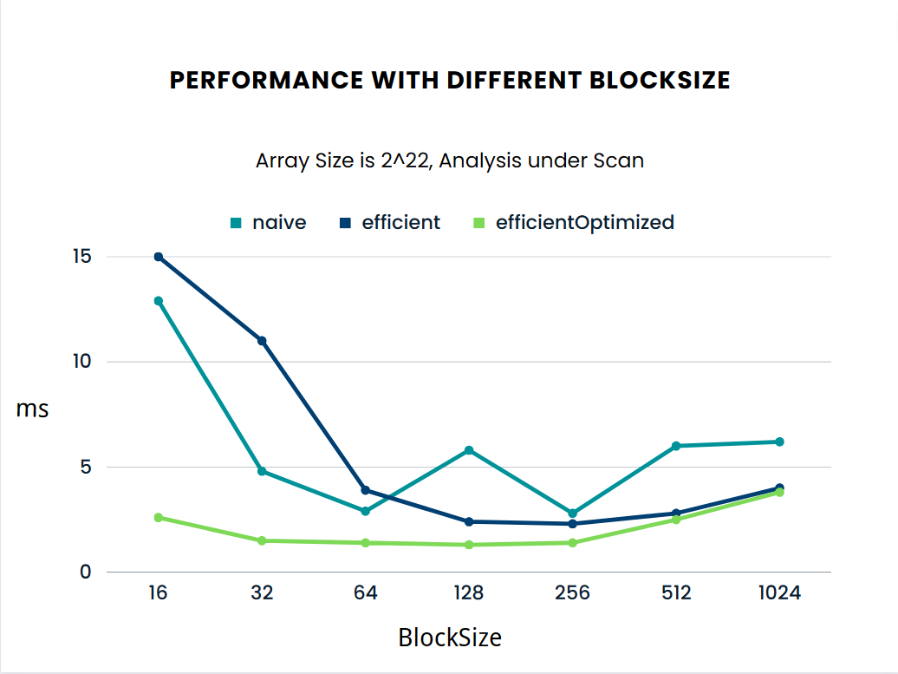
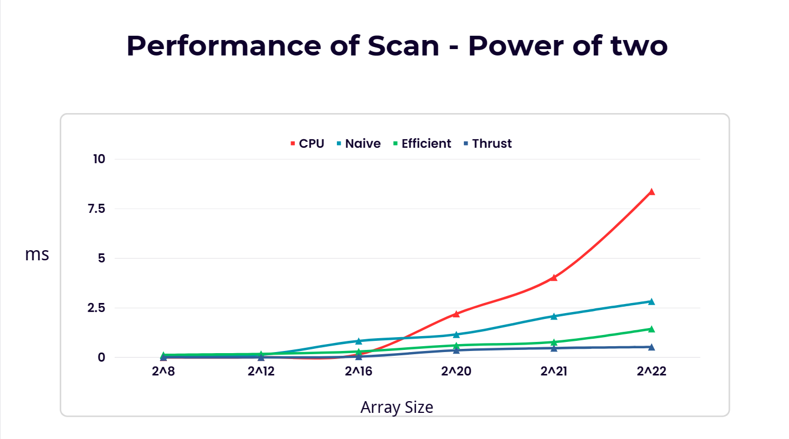
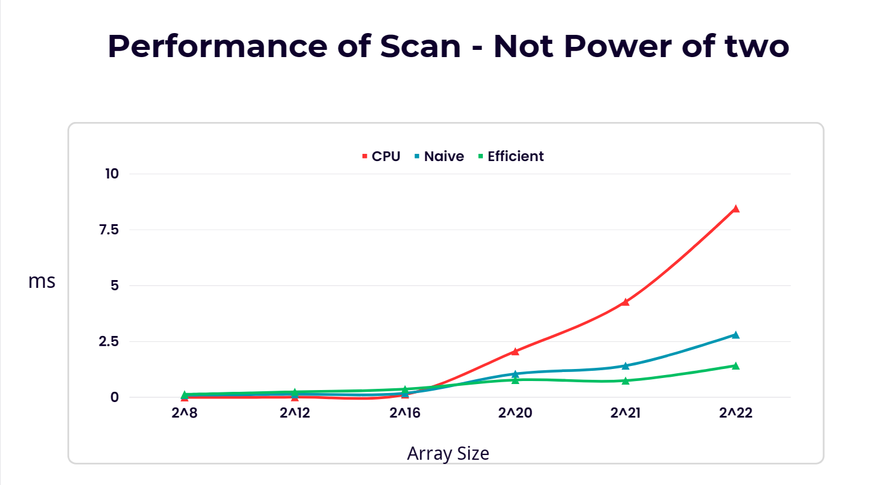
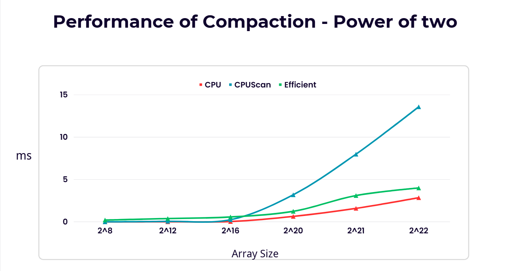
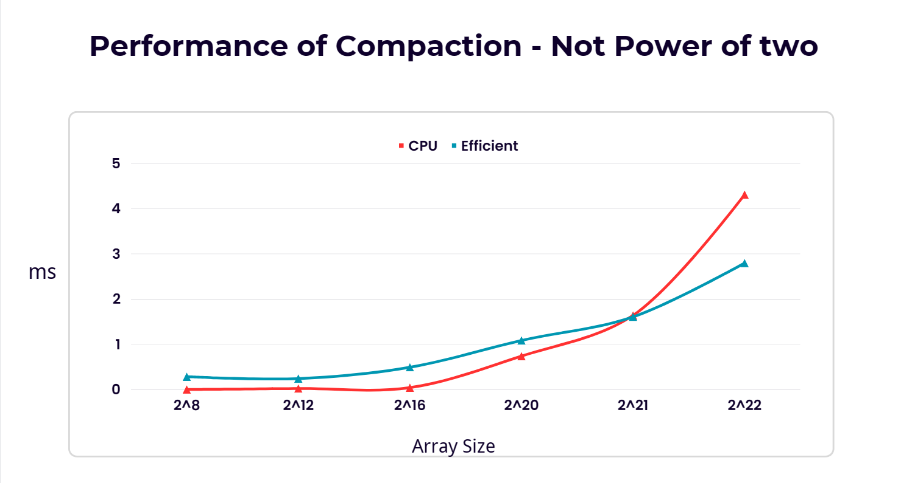
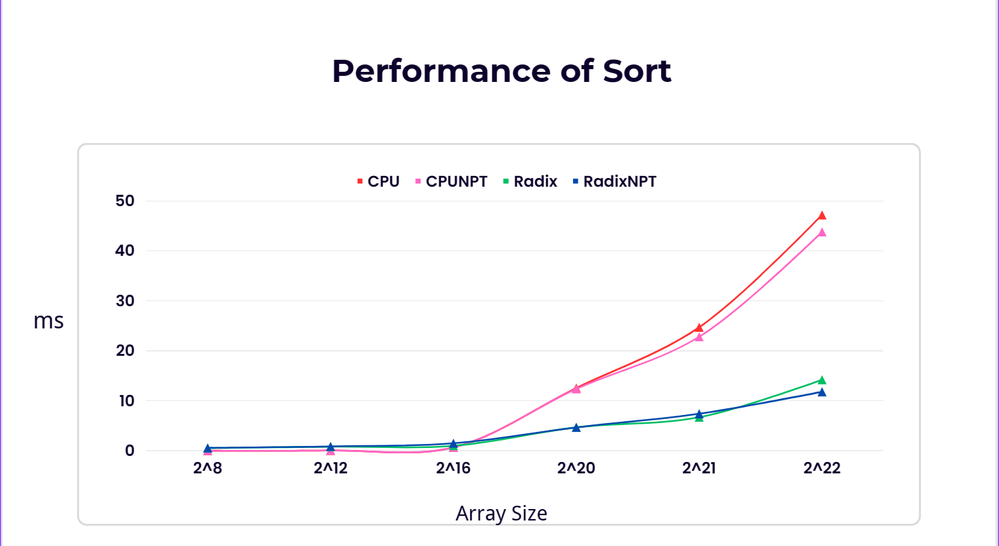

CUDA Stream Compaction
======================

**University of Pennsylvania, CIS 565: GPU Programming and Architecture, Project 2**

* Xiaoyue Ma
  * [LinkedIn](https://www.linkedin.com/in/xiaoyue-ma-6b268b193/)
* Tested on: Windows 10, i7-12700H @ 2.30 GHz 16GB, GTX3060 8GB

# Table of Contents  
[Overview](#overview)

[Features](#features)

[Implementation](#implementation)

[Result](#result)  

[Performance Analysis](#performanceAnalysis) 

[Extra Credit](#extraCredit)   

<a name="overview"/>

# Overview

This project is mainly about Parallel Scan(prefix sum) and Stream Compaction algorithms implemented with CUDA. Scan is about computing the prefix sum of an array, and stream compaction is about deleting all elements in an array that meet certain condition. These algorithms seem to be inherently sequential at the first glance, but with GPU we can convert these algorithms into very efficient parallel algorithms.

One application of Parallel Scan is Summed Area Table, which is a very important algorithm real-time rendering, especially for pre-computation. Another one is Radix Sort, which is a sorting algorithm that can run in parallel. Stream Compaction is very important in ray tracing, which can help delete unnecessory rays.

The data is computed in the Release Mode.
<a name="features"/>

# Features
* CPU Version Scan 
* CPU Version Compaction with/without Scan
* GPU Naive Version Scan
* GPU Work-efficient Version Scan
* GPU Work-efficient Version Compaction with Scan
* Thrust Version Scan/Compaction
* GPU Version Scan Optimization (Extra Credit)
* Radix Sort (Extra Credit)

<a name="implementation"/>

# Implementation
**TBD**

<a name="result"/>

# Result

* Input array Size 2^22
* For Scan and compaction, max element value is 50
* For Sort, max element value is 7
```

****************
** SCAN TESTS **
****************
    [   7   5   8  15  24   5  45  33   9  19  33  37  40 ...  18   0 ]
==== cpu scan, power-of-two ====
   elapsed time: 7.7637ms    (std::chrono Measured)
    [   0   7  12  20  35  59  64 109 142 151 170 203 240 ... 102732720 102732738 ]
==== cpu scan, non-power-of-two ====
   elapsed time: 7.9926ms    (std::chrono Measured)
    [   0   7  12  20  35  59  64 109 142 151 170 203 240 ... 102732598 102732638 ]
    passed
==== naive scan, power-of-two ====
   elapsed time: 2.83472ms    (CUDA Measured)
    passed
==== naive scan, non-power-of-two ====
   elapsed time: 2.75386ms    (CUDA Measured)
    passed
==== work-efficient scan, power-of-two ====
   elapsed time: 2.58877ms    (CUDA Measured)
    passed
==== work-efficient scan, non-power-of-two ====
   elapsed time: 2.49437ms    (CUDA Measured)
    passed
==== work-efficient scanOptimized, power-of-two ====
   elapsed time: 1.47747ms    (CUDA Measured)
    passed
==== work-efficient scanOptimized, non-power-of-two ====
   elapsed time: 1.34262ms    (CUDA Measured)
    passed
==== thrust scan, power-of-two ====
   elapsed time: 0.615424ms    (CUDA Measured)
    passed
==== thrust scan, non-power-of-two ====
   elapsed time: 0.500736ms    (CUDA Measured)
    passed

*****************************
** STREAM COMPACTION TESTS **
*****************************
    [   1   3   0   1   2   3   1   1   1   3   1   3   0 ...   2   0 ]
==== cpu compact without scan, power-of-two ====
   elapsed time: 10.3321ms    (std::chrono Measured)
    [   1   3   1   2   3   1   1   1   3   1   3   2   2 ...   1   2 ]
    passed
==== cpu compact without scan, non-power-of-two ====
   elapsed time: 10.7476ms    (std::chrono Measured)
    [   1   3   1   2   3   1   1   1   3   1   3   2   2 ...   2   1 ]
    passed
==== cpu compact with scan ====
   elapsed time: 22.0692ms    (std::chrono Measured)
    [   1   3   1   2   3   1   1   1   3   1   3   2   2 ...   1   2 ]
    passed
==== work-efficient compact, power-of-two ====
   elapsed time: 3.81203ms    (CUDA Measured)
    passed
==== work-efficient compact, non-power-of-two ====
   elapsed time: 4.11203ms    (CUDA Measured)
    passed
==== work-efficient compactOptimized, power-of-two ====
   elapsed time: 2.52003ms    (CUDA Measured)
    passed
==== work-efficient compactOptimized, non-power-of-two ====
   elapsed time: 2.6936ms    (CUDA Measured)
    passed

*****************************
** RADIX SORT TESTS **
*****************************
    [   4   3   2   6   4   3   1   5   2   5   6   6   2 ...   6   0 ]
==== cpu std::sort, power-of-two ====
   elapsed time: 46.5172ms    (std::chrono Measured)
    [   0   0   0   0   0   0   0   0   0   0   0   0   0 ...   6   6 ]
==== cpu std::sort, non-power-of-two ====
   elapsed time: 45.6927ms    (std::chrono Measured)
    [   0   0   0   0   0   0   0   0   0   0   0   0   0 ...   6   6 ]
==== radix sort, power-of-two ====
   elapsed time: 15.2273ms    (CUDA Measured)
    passed
==== radix sort, non-power-of-two ====
   elapsed time: 14.2143ms    (CUDA Measured)
    passed
```

<a name="performanceAnalysis"/>

# Performance Analysis 

As seen in this graph, **blockSize = 128** has the general best performance:






Thrust's implementation consistently delivers the top performance. Its sort function is not just a simple quicksort or mergesort. Behind the scenes, Thrust might choose the best sorting strategy based on the input data and the specific GPU hardware. Like remove function in Thrust container, it re-partition the element order instead of deleting the element directly. So I guess Thrust's implementation has great Optimized Algorithms, Memory Management and Parallel Patterns.



In the Scan operation, when handling smaller arrays (below 2^12), the CPU consistently delivers better performance than the GPU, irrespective of the GPU's scanning method, be it naive or work-efficient. Yet, as array sizes surpass 2^16, the GPU, with its naive scan, takes the lead, capitalizing on the strengths of parallel computation for handling large datasets. In such cases, following the GPU's naive scan in performance ranking is its work-efficient scan, with the CPU trailing noticeably with extremely large datasets. Interestingly, performance doesn't noticeably differ whether the array sizes are power-of-two or not. This uniformity is attributed to the GPU's approach of padding non-power-of-two arrays to their closest power-of-two counterpart, and the CPU maintaining its efficiency even with slight variations in array sizes.


 



With small datasets, the CPU is faster than the GPU. But as data size increases, the GPU's efficiency, especially using the Work Efficient Scan, surpasses the CPU. This is accentuated in tasks like compaction where parallelism shines. Conversely, the CPU's Compact With Scan lags because it tackles more tasks without benefiting from parallel processing.

 

The CPU employs std::sort with an O(N log(N)) complexity. Yet, for inputs beyond 2^17, the GPU's Radix sort outperforms it(Still slower than thrust).

<a name="extraCredit"/>

# Extra Credit
### Why is My GPU Approach So Slow?

* Global Memory Access: A primary factor causing our GPU to lag behind the CPU in speed is its reliance on global memory for computations. Accessing data from global memory can significantly hamper performance, even if the GPU's parallel processing capability offers advantages with large arrays. To enhance the performance, we should transition to using shared memory rather than global memory and employ an algorithm designed to minimize bank conflicts.

* More Threads Than Needed: The original launches more threads than necessary, especially in the deeper levels of the sweep. Many of these threads do not perform any useful work but still contribute to launch overhead.

* Overhead of Modulo Operation: The use of the modulo operation (index % (2 * path) == 0) in the original methods is computationally more expensive than a simple boundary check.


```
__global__ void kernUpSweepOptimized(int n, int d, int* odata) {
            int path = 1 << d;
            int index = (threadIdx.x + blockIdx.x * blockDim.x) * 2 * path;

            if (index + 2 * path - 1 < n) {
                odata[index + 2 * path - 1] += odata[index + path - 1];
            }
        }

__global__ void kernDownSweepOptimized(int n, int d, int* odata) {
    //same optimization as above
}

void scanUpDownSweepOptimized(int n, int* odata) {
    for (int d = 0; d <= ilog2ceil(n) - 1; ++d) {
        int threadsNeeded = n / (2 << d);
        dim3 BlockDim = (threadsNeeded + BlockSize - 1) / BlockSize;

        kernUpSweepOptimized << < BlockDim, BlockSize >> > (n, d, odata);
    }
    ...

    //Same code
    
    ...
}
 ```

**For my optimization:**

* Thread Index Calculation:

    * Original (kernUpSweep & kernDownSweep): The thread index is calculated as a combination of the block's index and the thread's index within that block: int index = threadIdx.x + (blockIdx.x * blockDim.x);
    * Optimized (kernUpSweepOptimized & kernDownSweepOptimized): The thread index is calculated differently: int index = (threadIdx.x + blockIdx.x * blockDim.x) * 2 * path;. Each thread in the optimized version is responsible for twice as many elements as in the original, which means fewer threads are needed to handle the same amount of data.

* Index Conditions for Operations:

    * Original: Operations are conditioned on index % (2 * path) == 0. This is a more general case that applies to each thread.
    * Optimized: Operations are conditioned on boundary checks, i.e., index + 2 * path - 1 < n. Given the adjusted index calculation, the optimized version has a more straightforward condition that checks if operations will stay within the array bounds.
    
* Thread and Block Launch Calculations:

    * Original (scanUpDownSweep): The block dimensions are calculated based on the BlockSize, without considering the depth d of the sweep.
    * Optimized (scanUpDownSweepOptimized): The block dimensions are calculated based on both the BlockSize and the depth d. Specifically, int threadsNeeded = n / (2 << d); determines the actual number of threads required for each depth, potentially reducing the number of threads launched, especially in the deeper levels of the sweep where fewer updates are needed.
    
In general, Even though I didn't use share memory, I still slowed it down to a much lower speed than the GPU and the original version.

### Radix Sort 
I've crafted a radix sort algorithm in the efficient.cu file and benchmarked it against the std::sort function on the CPU. The results show that my implementation begins to outpace the CPU-based sort when the input exceeds 2^16 elements.

This is the result for ArraySize = 2^22:
```
*****************************
** RADIX SORT TESTS **
*****************************
    [   4   3   2   6   4   3   1   5   2   5   6   6   2 ...   6   0 ]
==== cpu std::sort, power-of-two ====
   elapsed time: 46.5172ms    (std::chrono Measured)
    [   0   0   0   0   0   0   0   0   0   0   0   0   0 ...   6   6 ]
==== cpu std::sort, non-power-of-two ====
   elapsed time: 45.6927ms    (std::chrono Measured)
    [   0   0   0   0   0   0   0   0   0   0   0   0   0 ...   6   6 ]
==== radix sort, power-of-two ====
   elapsed time: 15.2273ms    (CUDA Measured)
    passed
==== radix sort, non-power-of-two ====
   elapsed time: 14.2143ms    (CUDA Measured)
    passed
```
The max element value is 7, cuz Radix Sort is only suitable for small numbers sort. If I set the max element value to be 50, Radix Sort will be slow.
