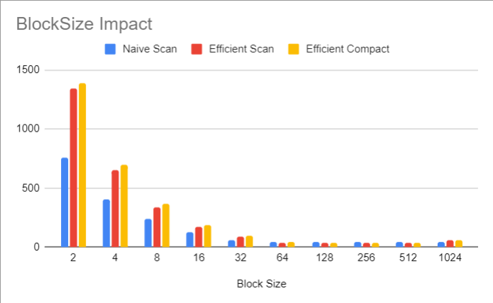

CUDA Stream Compaction
======================

**University of Pennsylvania, CIS 565: GPU Programming and Architecture, Project 2**

* Catherine Cheng
  * [LinkedIn](https://www.linkedin.com/in/catherine-wanning-cheng/), [personal website](https://www.catherine-wanning-cheng.com/projects-1)
* Tested on: Windows 11, AMD Ryzen 7 5800H @ 3.20GHz 16GB, NVIDIA GeForce RTX 3070

Analysis
======================
## Pick the best block size
- Using an int array with $2^{24}$ elements for efficient scan, I have compared how different block sizes perform in order to select the one that works out the best. In this case, the runtime minimizes when the block size is 128.

- 

## Scan Comparison
- Below is a performance comparison for different scan methods:

- **CPU:** From the chart, we can see that CPU runtime increases exponentially when the number of elements in the array gets larger.
- **Naive Parallel:** Although executing in parallel, Naive Parallel method takes longer time to execute than CPU method. As little optimization is done in this method, there are many redundant cycles of calulation taken place in this method (calculating numbers we would not use) and spare threads, which makes it take longer runtime than CPU method.
- **Efficient Parallel:** Compared to Naive Parallel method, this method reduces the number of redundant cycles by first using up-sweep parallel reduction method and then down-sweep to calculate the sums. In addition, it terminates the threads when not to be used. In this way, this method is much more efficient than Naive Parallel method, even when the number of elements in the array is large.
- **Thrust:** Thrust implementation of exclusive scan appears to be the most efficient way comparing to the other methods.

- The performance bottleneck for CPU method could be the lack of parallel computation. When the number of elements becomes larger, this problem would appear to be more apparent. For all other GPU methods, when the number of elements in the array is low, the bottleneck could be each call to kernals. When the array gets larger, the bottleneck could be memory, since all of the methods I implemented used global memory. In addition, since Naive GPU method has more redundant cycles comparing to the efficient GPU method, redundant threads could also be a bottleneck. To further optimize these methods, I could utilize shared memory more.

Test Output
======================
```
****************
** SCAN TESTS **
****************
    [  32   4  33  45   4  20  43  24   9  10  10  27   9 ...  49   0 ]
==== cpu scan, power-of-two ====
   elapsed time: 10.4641ms    (std::chrono Measured)
    [   0  32  36  69 114 118 138 181 205 214 224 234 261 ... 410857462 410857511 ]
==== cpu scan, non-power-of-two ====
   elapsed time: 10.3977ms    (std::chrono Measured)
    [   0  32  36  69 114 118 138 181 205 214 224 234 261 ... 410857381 410857418 ]
    passed
==== naive scan, power-of-two ====
   elapsed time: 19.724ms    (CUDA Measured)
    passed
==== naive scan, non-power-of-two ====
   elapsed time: 19.2408ms    (CUDA Measured)
    passed
==== work-efficient scan, power-of-two ====
   elapsed time: 7.95098ms    (CUDA Measured)
    passed
==== work-efficient scan, non-power-of-two ====
   elapsed time: 7.03126ms    (CUDA Measured)
    passed
==== thrust scan, power-of-two ====
   elapsed time: 0.937984ms    (CUDA Measured)
    passed
==== thrust scan, non-power-of-two ====
   elapsed time: 1.05574ms    (CUDA Measured)
    passed

*****************************
** STREAM COMPACTION TESTS **
*****************************
    [   2   1   3   1   3   1   3   2   2   2   0   3   1 ...   0   0 ]
==== cpu compact without scan, power-of-two ====
   elapsed time: 28.196ms    (std::chrono Measured)
    [   2   1   3   1   3   1   3   2   2   2   3   1   1 ...   3   3 ]
    passed
==== cpu compact without scan, non-power-of-two ====
   elapsed time: 28.7033ms    (std::chrono Measured)
    [   2   1   3   1   3   1   3   2   2   2   3   1   1 ...   3   3 ]
    passed
==== cpu compact with scan ====
   elapsed time: 72.5377ms    (std::chrono Measured)
    [   2   1   3   1   3   1   3   2   2   2   3   1   1 ...   3   3 ]
    passed
==== work-efficient compact, power-of-two ====
   elapsed time: 8.98323ms    (CUDA Measured)
    passed
==== work-efficient compact, non-power-of-two ====
   elapsed time: 8.07325ms    (CUDA Measured)
    passed
```