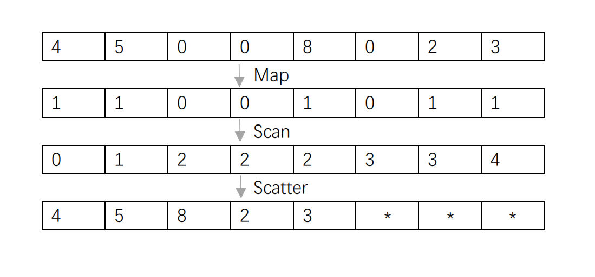
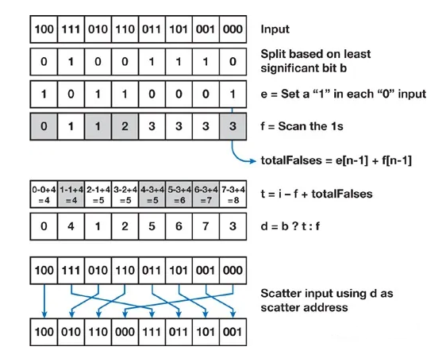
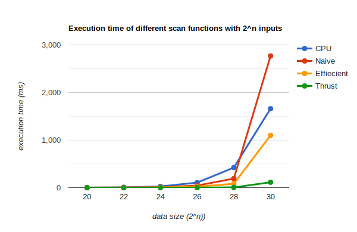
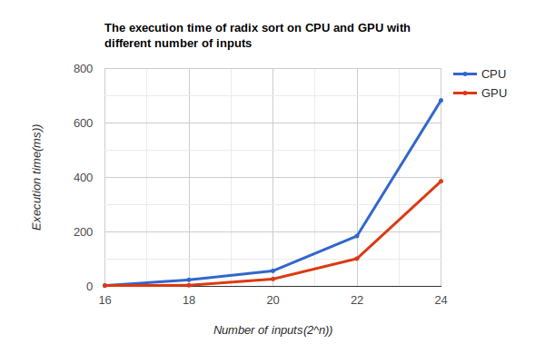

CUDA Stream Compaction
======================

**University of Pennsylvania, CIS 565: GPU Programming and Architecture, Project 2**

* Hanting Xu
* [GitHub](https://github.com/HantingXu), [LinkedIn](www.linkedin.com/in/hanting-xu-25615b28b).
* Tested on: (Personal Computer) Windows 11, i7-12700H @ 2.70GHz 32GB, GeForce RTX 3070 Ti Laptop GPU

### Basic Introduction

This project implements the stream compaction and radix sort on GPU with CUDA.

#### Stream Compaction

Stream Compaction here mainly refers to a process that taking an array of numbers as input and eliminate the zeros in that very array and then output result. A work-efficient implementation of this algorithm in GPU can be roughly devided into 3 parts: map, scan and scatter.
* map: map the elements of the original array onto 1 and 0.
* scan: generate the index that each elements should be at after the compaction by computing their exclusive prefix sum.
* scatter: scatter the elements in the original array to their corresponding place according to the index array generated in the scan function.

* Figure - Map, Scan, Scatter for Stream Compaction

The main focus of this project is on the scan function. There are 3 different scan functions implemented: CPU Scan, Naive GPU Scan and Efficient GPU Scan, and their performance are compared together with CUDA thrust scan method. For more detail on how to implement scan, this is a good reference link - [Parallel Prefix Sum (Scan) with CUDA](https://developer.nvidia.com/gpugems/GPUGems3/gpugems3_ch39.html).

#### Radix sort

Radix sort is a type of sorting algorithm that sort an array according to each digit of an element in the array. The time complexity of this algorithm on CPU is normally O(n). This project implement both the CPU version of radix sort and its GPU version. The basic process for this algorithm in GPU version can also be concluded as Map, Scan and Scatter, but in a slightly different way.
* Figure - Map, Scan, Scatter for Radix Sort

This project compares the efficiency of the CPU and GPU version of Radix Sort. The scan function used in based on the work-efficient GPU scan implemented above.

### Analysis

#### Scan
In the end, we record the execution time of different scan functions implemented. Through my observation, CPU runs the fastest when there are only 2^2 to 2^18 elements in an array. And as we can observe from the graph below, CPU becomes slower than all GPU algorithms when there are 2^20 or more elements in an array. That is basically because the time comlexity of CPU scan is intrinsicly larger than the GPU ones. Thus as the input size grows, it becomes inevitably slower. One interesting discovery here is that when the Naive GPU method deals with array with 2^30 elements, it hits the bottleneck and its speed drop sharply. This is probably have something to do with the shortage of memory.

Note: all the block size for the GPU algorithms used in this project is 128.

#### Radix sort
The graph shown below decribes the exetion time of radix sort on CPU and GPU as the input size changes. Both radix sort on CPU and GPU slows down as the number of inputs increases. However, as the input size increases, the performance of CPU implementation drops faster than GPU one. That is most likely because of the time compexity of the algorithm itself.

