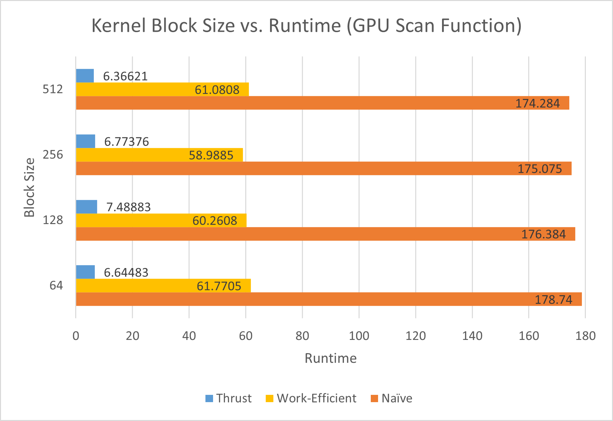
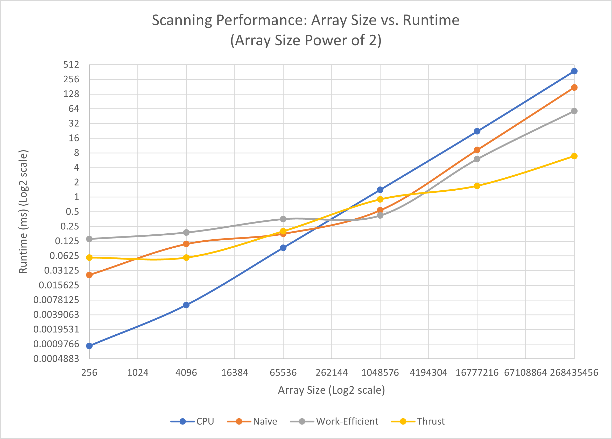
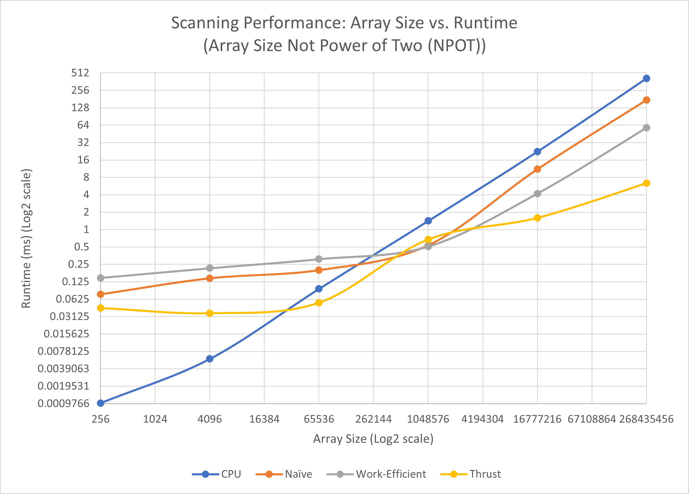
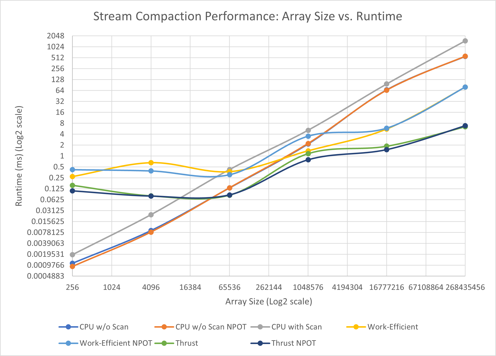

CUDA Stream Compaction
======================

**University of Pennsylvania, CIS 565: GPU Programming and Architecture, Project 2**

* Alan Qiao
* Tested on: Windows 11 22H2, Intel Xeon W-2145 @ 3.70GHz 64GB, RTX 3070 8GB (Dorm Workstation)

## Introduction

This project explores the performance improvement of using GPU to parallelize functions that work on large array inputs. Specifically, this project explores two parallelizable reduction functions: prefix-sum (scan) and stream compaction.

### Prefix Sum (Scan)

Given an array of integers $A$ of length $N$, its inclusive prefix-sum array $P_I$ is defined as 
$$P_I[i] = \sum_{k=0}^{i}{A[k]}, 0\leq i \leq N$$
This is also known as an inclusive scan.  
Similarly, we also define the exclusive prefix-sum array $P_E$ as
$$P_E[i] = \sum_{k=0}^{i-1}{A[k]}, 0\leq i \leq N$$
This is also known as an exclusive scan.

In this project, four different implementations of exclusive scan are explored for performance comparison.
1. **CPU**: Sequential CPU scan that adds the $i^{th}$ value to the $(i-1)^{th}$ prefix sum
2. **GPU Naive**: Naive parallel scan that runs pairwise additions with widening offsets
3. **GPU Work-Efficient**: Better pairwise scan that reduces unnecessary additions by spliting the process into a parallel reduction phase `kernUpSweep()` and a down-sweep phase `kernDownSweep()`
4. **GPU Thrust API**: Uses the `exclusive_scan()` function from Thrust library

### Stream Compaction
Stream compaction is the process of filtering an array down to only the elements that satisfy a certain condition. Conceptually, this is essentially a filter function. In this specific project, the compaction condition is filtering for non-zero values, which has the effect of making the array more compact by removing unnecessary data. This is especially useful in graphics applications for reducing memory transfer by eliminating elements from buffers that are no longer in use.

Four different implementations of stream compaction are explored for performance comparison.
1. **CPU without scan**: A basic but efficient CPU sequential implementation
2. **CPU with scan**: CPU implementation that follows the parallelizable procedure used in GPU implementations. (Not efficient for sequential execution.)
3. **GPU with Work-Efficient Scan**: GPU implementation that creates a boolean array of whether the element satisfies the condition, then exclusively scans the array to get index of kept elements in the output array, and finally scatters the index array to extract the output elements.
4. **GPU Thrust API**: Uses the `remove_if()` function from Thrust API.

## Block Size
The impact of block size is usually relatively miniscule for reasonable block sizes, but the reasonable range changes depending on the hardware. The following diagram illustrates the runtime of the different functions for a range of block sizes between 128 - 512 for the RTX 3070 8GB.


*Figure 1: Impact of kernel block size on GPU scan runtime*

The difference is relatively insignificant, but all subsequent tests were conducted using a **block size of 256** as this seemed to offer best overall performance accross the different functions.

## Sample Output
This is a sample output for the testing program with block size of 256 and input size of $2^{28}$.
```
****************
** SCAN TESTS **
****************
    [  15  15  29  14  43   8   9  44   2   6  42   7  14 ...   2   0 ]
==== cpu scan, power-of-two ====
   elapsed time: 497.847ms    (std::chrono Measured)
    [   0  15  30  59  73 116 124 133 177 179 185 227 234 ... -2015579320 -2015579318 ]
==== cpu scan, non-power-of-two ====
   elapsed time: 485.974ms    (std::chrono Measured)
    [   0  15  30  59  73 116 124 133 177 179 185 227 234 ... -2015579346 -2015579341 ]
    passed
==== naive scan, power-of-two ====
   elapsed time: 177.569ms    (CUDA Measured)
    passed
==== naive scan, non-power-of-two ====
   elapsed time: 177.386ms    (CUDA Measured)
    passed
==== work-efficient scan, power-of-two ====
   elapsed time: 58.0995ms    (CUDA Measured)
    passed
==== work-efficient scan, non-power-of-two ====
   elapsed time: 59.1894ms    (CUDA Measured)
    passed
==== thrust scan, power-of-two ====
   elapsed time: 6.5176ms    (CUDA Measured)
    passed
==== thrust scan, non-power-of-two ====
   elapsed time: 7.06138ms    (CUDA Measured)
    passed

*****************************
** STREAM COMPACTION TESTS **
*****************************
    [   2   2   1   2   2   3   0   0   3   1   1   1   3 ...   2   0 ]
==== cpu compact without scan, power-of-two ====
   elapsed time: 912.455ms    (std::chrono Measured)
    [   2   2   1   2   2   3   3   1   1   1   3   1   1 ...   2   2 ]
    passed
==== cpu compact without scan, non-power-of-two ====
   elapsed time: 689.073ms    (std::chrono Measured)
    [   2   2   1   2   2   3   3   1   1   1   3   1   1 ...   3   3 ]
    passed
==== cpu compact with scan ====
   elapsed time: 2022.49ms    (std::chrono Measured)
    [   2   2   1   2   2   3   3   1   1   1   3   1   1 ...   2   2 ]
    passed
==== work-efficient compact, power-of-two ====
   elapsed time: 79.7784ms    (CUDA Measured)
    passed
==== work-efficient compact, non-power-of-two ====
   elapsed time: 79.9567ms    (CUDA Measured)
    passed
==== thrust compact, power-of-two ====
   elapsed time: 7.84336ms    (CUDA Measured)
    passed
==== thrust compact, non-power-of-two ====
   elapsed time: 7.02477ms    (CUDA Measured)
    passed
```

## Performance Analysis
Since many of these GPU kernel functions only work on array sizes that are powers of two, each implementation is tested with two types of inputs. Arrays with sizes that are powers of two, and arrays with non-power-of-two sizes (NPOT).  
Furthermore, to eliminate the impact of variable and expensive memory allocation and release costs from the analysis. All measurements are taken with all reasonable memory allocations completed before measurement and releases after measurement.

### Scan with Power of 2 Array Sizes

*Figure 2: Performance comparison of scan implementations given power of 2 array sizes. Both axis are displayed on $\log_2$ scale for visibility.*

Some key observations:  
* CPU implementation scales linearly with array size.
* At smaller sizes ($N \lessapprox 2^{18}$), the kernel launching cost outweights the benefit of parallelization, resulting in superior CPU runtime.
* Both Naive and work efficient level-out at large inputs to approximately the same linear scaling as the CPU implementation, but Naive is about $2\times$ faster than CPU, and Work-efficient is about $2\times$ faster than Naive.
* Thrust implementation suffers a similar kernel start cost, but runtime scales slower than the other implementations, resulting in a significant performance improvement at large inputs.

### Scan with Non Power of 2 (NPOT) Array Sizes
To simulate this, the array sizes for the different tests are computed as $2^d - 3$, where $d$ is the power of 2 being tested.

*Figure 2: Performance comparison of scan implementations given NPOT array sizes. Both axis are displayed on $\log_2$ scale for visibility.*

Some key observations:  
* CPU implementation is agnostic to whether input size is a power of 2.
* Naive and Work-efficient implementations scales similarly compared to power of 2 input sizes, but is overall a little bit slower with the additional overhead of morphing the input to a power of 2.
* Thrust implementation seems to actually perform slightly better with NPOT input size, in fact a nearly constant runtime is observed up until the inflection point at ($N \approx 2^{18}$)

### Why is Thrust Implementation much faster
Without inspecting the source code for the Thrust implementation, the cause of the performance difference cannot be accurately deduced, but some insight can be gained from examining the cudaAPI profile.


*Figure 3: NVIDIA SYSTEMS profiling of Thrust::exclusive_scan()*

Perhaps the biggest difference between the implementations is that Thrust likely loads the entire array into shared memory (`DeviceScanInitKernel()`) and makes all calculations (`DeviceScankernel()`) in shared memory. This is suggested by the use of `cudaStreamSynchronize()` to sync threads between iterations. This would be a major improvement as shared memory access is much faster than global memory access that is used exclusively in the Naive and Work-efficient implementation.

### Stream Compaction
The next figure groups all Stream Compaction tests, both power of 2 input size and NPOT input size into one graph for a most explicit side-by-side comparison. The same block size and range of input sizes are tested.


*Figure 4: Performance comparison of stream compaction implementations given NPOT array sizes. Both axis are displayed on $\log_2$ scale for visibility.*

Some key observations:
* CPU implementations are again agnostic to whether input size is a power of 2 and generally scales linearly
* CPU with scan performes $2,3\times$ slower than without scan. This is expected as there are two extra iteration passes compared to the without scan implementation.
* Kernel invocation costs are significant until $(N \approx 2^{22})$, where the parallelization benefit finally outweights the cost of kernel launching. The larger kernel cost is expected because two additional kernel functions are used compared to exclusive scan.
* The difference between NPOT and power of 2 input sizes become insignificant relative to the overall function runtime at large enough inputs.
* The Thrust implementation is much faster than the Work-Efficient implementation, at approximately $8\times$. This makes it faster than CPU implementation by $N \approx 2^{14}$.
