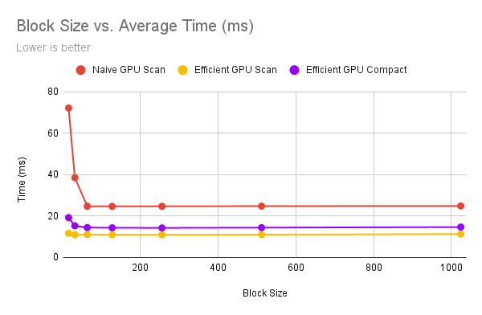
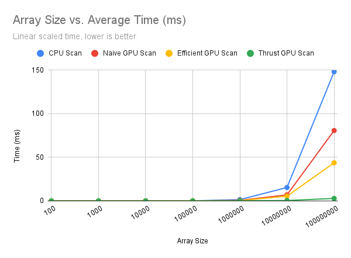
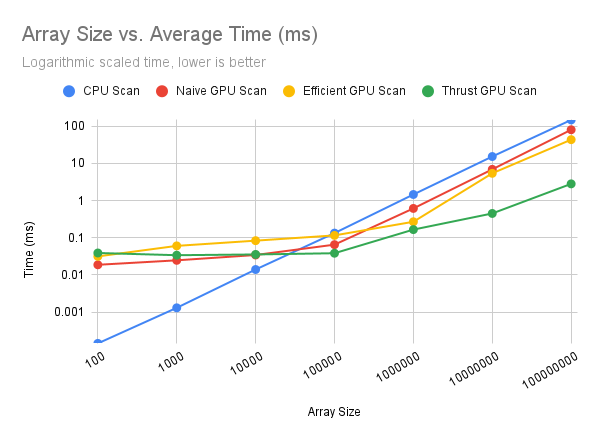
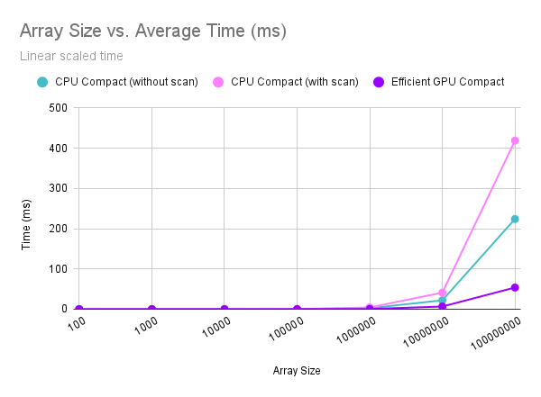
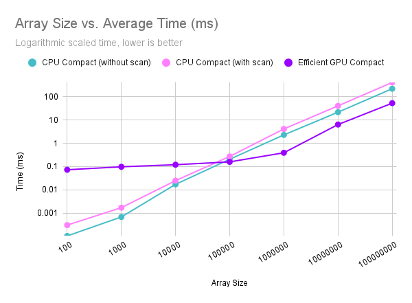
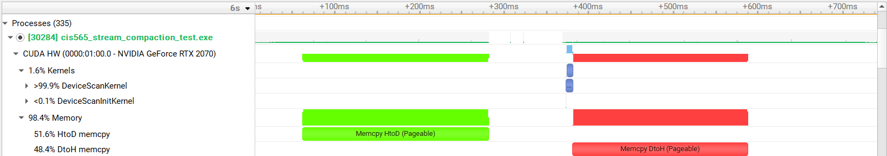

# CUDA Stream Compaction

**University of Pennsylvania, CIS 5650: GPU Programming and Architecture, Project 2**

* Aditya Gupta
  * [Website](http://adityag1.com/), [GitHub](https://github.com/AdityaGupta1), [LinkedIn](https://www.linkedin.com/in/aditya-gupta1/), [3D renders](https://www.instagram.com/sdojhaus/)
* Tested on: Windows 10, i7-10750H @ 2.60GHz 16GB, NVIDIA GeForce RTX 2070 8GB (personal laptop)
  * Compute capability: 7.5

## Introduction

This project covers two important concepts of parallel computing: **Scan** and **Stream Compaction**. It includes their implementations on a GPU and the corresponding performance characteristics when compared to implementations on a CPU.

**Scan** operates on an array to create a new array where each element is the sum of all preceding elements in the input array. For example, given an input array `[a, b, c, d]`, the scan operation results in `[a, a+b, a+b+c, a+b+c+d]`. Scan can be categorized into inclusive and exclusive types. An inclusive scan sums up all elements up to and including the current element, while an exclusive scan sums all elements up to but excluding the current one. Hence, the exclusive scan of `[a, b, c, d]` becomes `[0, a, a+b, a+b+c]`. Scan operations form the core of many parallel algorithms, including sorting and searching, among others.

This project covers four implementations of scan:
- a simple CPU version,
- a naive GPU version which adds previous elements into successively smaller sub-arrays,
- an efficient GPU version which performs an "up-sweep" and a "down-sweep", treating the array like a balanced binary search tree,
- and an implementation from the parallel algorithms library [Thrust](https://thrust.github.io/).

**Stream Compaction** is essentially a filtering operation on an array or a data stream, removing or "compacting" unwanted elements. The output is an array consisting only of elements that satisfy a certain condition, accompanied by a count of these valid elements. Stream compaction proves incredibly useful in scenarios where specific data points need to be disregarded based on set criteria. An example in the context of graphics programming could be in a path tracer, where terminated rays are removed to avoid unnecessary processing. In this project, it will be used to remove any non-zero values from an array of zeroes.

This project covers three implementations of stream compaction:
- a simple CPU version,
- a CPU version which uses a scan,
- and a GPU version which uses a parallel scan.

## Performance Analysis

Each data point was collected by running the associated function 25 times and averaging the measured times.

### Block Size vs. Time

First, I roughly optimized the block size for the GPU implementations using an array size of 2<sup>25</sup>:



Past 32, the block size didn't make a significant difference on performance. I decided to use a block size of 256 for further analysis.

### Array Size vs. Time

With the block size set, I then compared the performance of the different implementations of scan and compact.

#### Scan

|  |  |
|---|---|

As expected, the CPU implementation is the slowest for large array sizes. However, it beats all the GPU implementations for smaller sizes (less than about 100,000). This is likely because the GPU implementations require some overhead for thread scheduling, memory copying (not including initial or final memory operations), etc. However, that overhead becomes relatively insignificant for much larger array sizes, where the GPU's parallelism confers significant performance improvements.

Additionally, the work-efficient GPU scan was significantly faster than the naive GPU scan, and the Thrust scan was even faster than that.
- The naive scan is the slowest of the three because it launches `n` threads at each step, even though a significant minority of those aren't doing any work in the last few steps. Also, it requires extra memory as it has to ping-pong between two buffers to avoid race conditions. The number of threads doing actual work (i.e. not just copying a value from one array to another) at each step is reduced (subtracted) by an increasing power of two, meaning -1, then -2, -4, -8, and so on.
- The efficient method improves on this by actually reducing the number of threads launched by half with each step. This means each thread is doing meaningful work and there are no extraneous threads being launched.
- However, neither of my implementations use shared memory, and there are certainly other optimizations that can be made. This means the Thrust implementation, which has been significantly optimized, beats any of mine.

For an array of size 100,000,000, naive GPU was ~45% faster than CPU, efficient GPU was another ~45% faster than naive GPU, and Thrust was more than 15x faster than efficient GPU.

#### Compact

|  |  |
|---|---|

Similar to scan, the GPU compact shows better performance than the CPU compact starting an array size of around ~100,000. The results here are again not surprising. The CPU compact with scan is slower than without scan because the scan adds extra overhead that doesn't actually help perform a faster compact. However, the GPU compact uses a parallel scan to provide significant performance improvements over the CPU compact.

For an array of size 100,000,000, CPU compact without scan was ~45% faster than CPU compact with scan, and GPU compact was ~75% faster than that.

### Thrust

Here is the Nsight timeline for the Thrust scan with an array size of 2<sup>28</sup>, for which the scan normally takes around 7 ms:



Copying memory to and from the device takes up a vast majority (almost 99%!) of the time, while the kernel itself takes very little time in comparison. The Thrust version likely uses a number of optimizations that my implementations may not have, such as using shared memory and optimizing memory layouts. Additionally, the vast difference in time taken for memory copying versus running the kernel means that for future projects, I should probably try to avoid unnecessarily copying memory back and forth.

### Test Output

Output of the test program with an array size of 2<sup>25</sup>:

```
****************
** SCAN TESTS **
****************
    [   0  15  33  17  10  22  44  15  18  44  36  19  14 ...   3   0 ]
==== cpu scan, power-of-two ====
   elapsed time: 50.929710 ms    (std::chrono Measured)
    [   0   0  15  48  65  75  97 141 156 174 218 254 273 ... 821887710 821887713 ]
==== cpu scan, non-power-of-two ====
   elapsed time: 49.403854 ms    (std::chrono Measured)
    [   0   0  15  48  65  75  97 141 156 174 218 254 273 ... 821887649 821887673 ]
    passed
==== naive scan, power-of-two ====
   elapsed time: 24.731287 ms    (CUDA Measured)
    passed
==== naive scan, non-power-of-two ====
   elapsed time: 24.767151 ms    (CUDA Measured)
    passed
==== work-efficient scan, power-of-two ====
   elapsed time: 10.910474 ms    (CUDA Measured)
    passed
==== work-efficient scan, non-power-of-two ====
   elapsed time: 10.906885 ms    (CUDA Measured)
    passed
==== thrust scan, power-of-two ====
   elapsed time: 1.055996 ms    (CUDA Measured)
    passed
==== thrust scan, non-power-of-two ====
   elapsed time: 1.087743 ms    (CUDA Measured)
    passed

*****************************
** STREAM COMPACTION TESTS **
*****************************
    [   3   1   2   0   1   1   3   0   2   1   2   3   3 ...   3   0 ]
==== cpu compact without scan, power-of-two ====
   elapsed time: 72.103279 ms    (std::chrono Measured)
    [   3   1   2   1   1   3   2   1   2   3   3   3   3 ...   2   3 ]
    passed
==== cpu compact without scan, non-power-of-two ====
   elapsed time: 72.187012 ms    (std::chrono Measured)
    [   3   1   2   1   1   3   2   1   2   3   3   3   3 ...   1   2 ]
    passed
==== cpu compact with scan ====
   elapsed time: 134.872818 ms    (std::chrono Measured)
    [   3   1   2   1   1   3   2   1   2   3   3   3   3 ...   2   3 ]
    passed
==== work-efficient compact, power-of-two ====
   elapsed time: 22.991144 ms    (CUDA Measured)
    passed
==== work-efficient compact, non-power-of-two ====
   elapsed time: 14.315652 ms    (CUDA Measured)
    passed
Press any key to continue . . .
```
