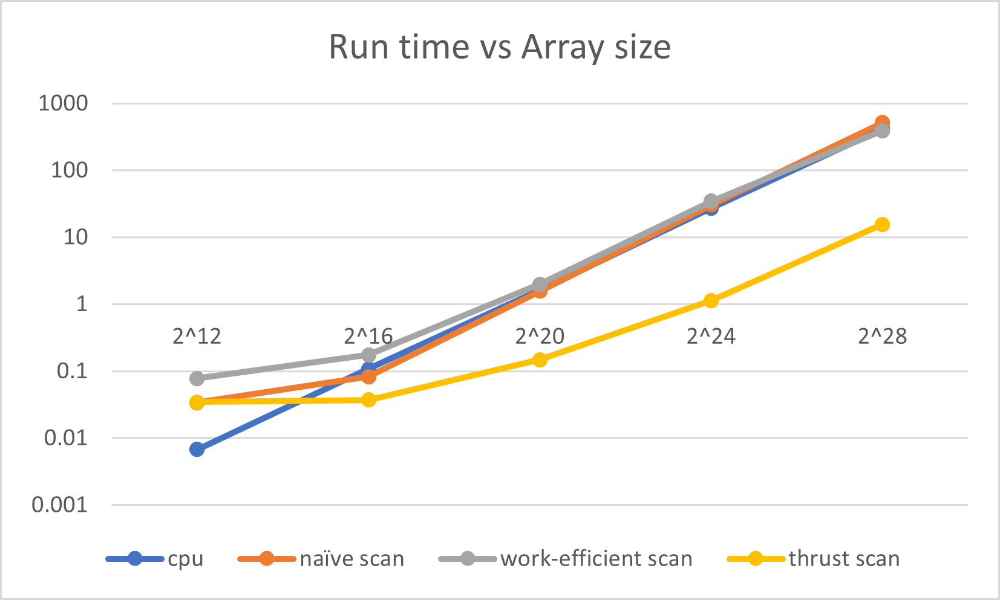

CUDA Stream Compaction
======================

**University of Pennsylvania, CIS 565: GPU Programming and Architecture, Project 2**

* Zhiyu Lei
  * [LinkedIn](https://www.linkedin.com/in/zhiyu-lei/), [Github](https://github.com/Zhiyu-Lei)
* Tested on: Windows 22, i7-2222 @ 2.22GHz 22GB, GTX 222 222MB (CETS Virtual Lab)

### Project Description

### Performance Analysis
#### Roughly optimize the block sizes of each of your implementations for minimal run time on your GPU.
The following table shows a comparison of run time (in milliseconds) between various block sizes for each of the implementations. The run time is measured by scanning an array of size $2^{20}$. The block size does not affect performance very significantly, but a block size of 128 seems to be optimal.
block size|naive scan|work-efficient scan|thrust scan
:---:|:---:|:---:|:---:
64|1.6761|3.0861|0.1686
128|1.5749|1.9997|0.1480
256|1.8605|2.1077|0.1639
512|1.6586|2.5638|0.1679

#### Compare all of these GPU Scan implementations to the serial CPU version of Scan. Plot a graph of the comparison (with array size on the independent axis).
