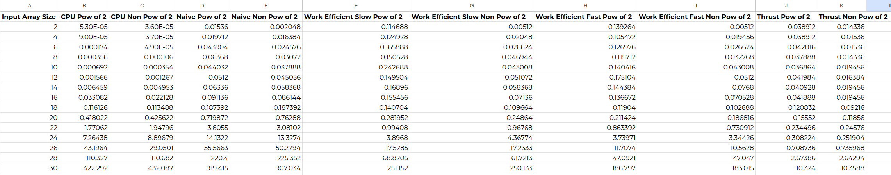
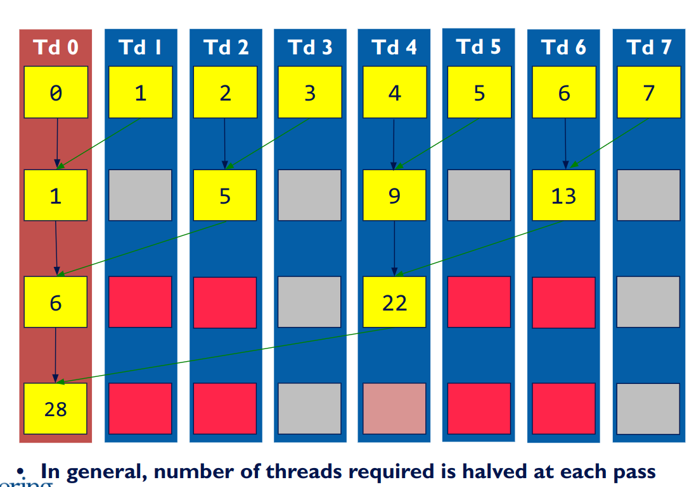

CUDA Stream Compaction
======================

**University of Pennsylvania, CIS 565: GPU Programming and Architecture, Project 2**

* Xinran Tao
  - [LinkedIn](https://www.linkedin.com/in/xinran-tao/), [Personal Website](https://www.xinrantao.com/), [GitHub](https://github.com/theBoilingPoint).
* Tested on: 
  - Ubuntu 22.04, i7-11700K @ 3.60GHz × 16, RAM 32GB, GeForce RTX 3080 Ti 12GB (Personal)

# Base Credit
In order to count only the algorithm runtime, GPU timers are put inside the initialisation and memory copy functions. For example:
```cpp
cudaMalloc((void**)&dev_data, n * sizeof(int));
cudaMemcpy(dev_data, data, n * sizeof(int), cudaMemcpyHostToDevice);

timer().startGpuTimer();
// The actual algorithm
timer().endGpuTimer();

cudaFree(dev_data);
```

## Block Size Optimisation
A quick block size optimisation is done for the naive and efficient scan. The range of the block size tested is from 32 to 1024 (inclusive), with each step being the power of 2. The size of the input array is fixed at 2^20. The best block size for each algorithm is selected based on the average runtime between array size that is the power of 2 and non-power of 2 (i.e. the power of 2 size - 3). The result is as follows:
| Block Size    | Naive     | Work Efficient Slow | Work Efficient Fast |
| --------------| --------- | ------------------- | ------------------- |
| 32            | 0.059808	| 0.584002            |	0.602928            |
| 64            | 0.519168	| 0.665728            | 0.35776             |
| 128           | 0.442368	| 0.32856	            | 0.322176            |
| 256           | 0.451072	| 0.262784            |	0.199088            |
| 512           | 0.44856	  | 0.268496            |	0.255712            |
| 1024          | 0.488448	| 0.389296            |	0.278512            |

Therefore, the block size chosen for naive scan is **32**, and **256** for both work efficient slow and fast scan. The block sizes are fixed for all subsequent experiments.

## Analysis of the CPU, Naive, Work Efficient, and Thrust Scan


-Runtime%20Graph%20for%20CPU,%20Naive,%20Work%20Efficient,%20and%20Thrust%20Implementation.png)

-Runtime%20Graph%20for%20CPU,%20Naive,%20Work%20Efficient,%20and%20Thrust%20Implementation.png)

The **CPU implementation**, both for power-of-two and non-power-of-two sizes, shows a predictable linear increase in runtime as the input size grows. This suggests that the CPU implementation is computation-bound, scaling consistently with the size of the input array. However, for very large inputs, especially beyond size 24, the non-power-of-two runtimes are slightly slower than power-of-two runtimes, which could indicate some inefficiencies in memory handling or alignment issues for irregular sizes. Still, the primary bottleneck here seems to be the inherent computational complexity of the algorithm, as it scales naturally with input size.

For the **Naive implementation**, the performance bottlenecks are quite clear. The power-of-two version exhibits a steep increase in runtime as the input size grows, becoming particularly inefficient for larger sizes, as seen by the runtime at size 30 (~919 ms). This steep increase suggests that the Naive implementation is computation-bound and inefficiently parallelized, with large overhead in processing each element. Moreover, it might also suffer from poor memory access patterns, as its performance significantly worsens with increased input sizes, indicating that both computation and memory I/O are bottlenecks. The non-power-of-two Naive implementation performs better, which could be attributed to better handling of irregular data sizes, possibly benefiting from more efficient memory management. However, as input sizes increase, this advantage diminishes, and the overall computational inefficiencies of the Naive approach remain evident.

The **Work Efficient Slow implementation** shows an improvement over the Naive implementation, particularly for larger input sizes. For power-of-two inputs, it performs moderately well, though its runtime increases more slowly than the Naive version, suggesting that it optimizes the computational workload better. However, the slowdown observed at larger sizes implies that memory I/O might still be a bottleneck, as efficient computation becomes less useful if memory access patterns aren't optimized. The non-power-of-two version of Work Efficient Slow performs slightly better, indicating better handling of irregular input sizes, but the performance gap narrows as input sizes grow, suggesting that at larger scales, both computational and memory inefficiencies become more pronounced.

The **Work Efficient Fast implementation** offers significant performance gains over both the Naive and Slow versions, particularly for larger inputs. For power-of-two sizes, its scaling is far more controlled, and even for larger sizes, it remains competitive with the CPU. This suggests that the Work Efficient Fast implementation has effectively optimized both computation and memory access. It likely uses more efficient memory patterns, reducing the overhead caused by memory I/O, while also optimizing the computational workload, which allows it to remain fast even for larger inputs. The non-power-of-two version of Work Efficient Fast performs similarly, with only marginal degradation for irregular input sizes. This demonstrates that this implementation is relatively well-balanced and doesn't suffer from the same memory I/O bottlenecks that are apparent in the Naive and Slow approaches.

Finally, the **Thrust implementation** consistently outperforms all other implementations for both power-of-two and non-power-of-two input sizes, particularly for small and medium-sized arrays. It maintains an almost constant runtime for smaller inputs, which indicates that the computational workload is highly optimized and that memory I/O is not a bottleneck, at least for smaller inputs. As input sizes grow, the runtime increases, but it remains the fastest or near the fastest implementation for most input sizes. This suggests that Thrust effectively handles both computation and memory I/O, optimizing for both types of input sizes. However, for the largest input sizes, the Work Efficient Fast implementation surpasses Thrust, indicating that while Thrust is optimized for general efficiency, very large data sets might still cause some memory bottlenecks.

### Thrust's Implementation
From the Thrust implementation's performance behavior, particularly its near-constant runtime for smaller input sizes and gradual increase as the input size grows, we can infer that Thrust likely has highly optimized memory management and computational routines. The near-constant runtime at smaller sizes suggests minimal overhead for memory allocation and data transfers at this scale, implying that these stages are either negligible or well-pipelined.

However, for larger input sizes, where the performance begins to degrade, we can speculate that some internal operations—such as repeated memory allocations or device-host memory copies—become more expensive. The increased data transfer costs between the host and device could be a bottleneck as input size increases. Moreover, the parallel computation itself may reach a point where it is bounded by the hardware's memory bandwidth rather than computational power, which Nsight might reveal as periods of memory transfer in the timeline.

## Test Program Output
Here the input array size is 2^20, and 2^20 - 3 for the non-power of 2 size. 
```
****************
** SCAN TESTS **
****************
==== Input ====
    [  28   8  45  47  22  24  13  45  29  46  22  48  25 ...  35   0 ]
==== cpu scan, power-of-two ====
   elapsed time: 0.552226ms    (std::chrono Measured)
    [   0  28  36  81 128 150 174 187 232 261 307 329 377 ... 25694240 25694275 ]
==== cpu scan, non-power-of-two ====
   elapsed time: 0.5049ms    (std::chrono Measured)
    [   0  28  36  81 128 150 174 187 232 261 307 329 377 ... 25694195 25694198 ]
    passed 
==== naive scan, power-of-two ====
   elapsed time: 0.720896ms    (CUDA Measured)
    [   0  28  36  81 128 150 174 187 232 261 307 329 377 ... 25694240 25694275 ]
    passed 
==== naive scan, non-power-of-two ====
   elapsed time: 0.765952ms    (CUDA Measured)
    [   0  28  36  81 128 150 174 187 232 261 307 329 377 ...   0   0 ]
    passed 
==== work-efficient scan, power-of-two ====
Using FAST work efficient scan
   elapsed time: 0.413472ms    (CUDA Measured)
    [   0  28  36  81 128 150 174 187 232 261 307 329 377 ... 25694240 25694275 ]
    passed 
==== work-efficient scan, non-power-of-two ====
Using FAST work efficient scan
   elapsed time: 0.18592ms    (CUDA Measured)
    [   0  28  36  81 128 150 174 187 232 261 307 329 377 ... 25694195 25694198 ]
    passed 
==== thrust scan, power-of-two ====
   elapsed time: 0.82944ms    (CUDA Measured)
    [   0  28  36  81 128 150 174 187 232 261 307 329 377 ... 25694240 25694275 ]
    passed 
==== thrust scan, non-power-of-two ====
   elapsed time: 0.099328ms    (CUDA Measured)
    [   0  28  36  81 128 150 174 187 232 261 307 329 377 ... 25694195 25694198 ]
    passed 

*****************************
** STREAM COMPACTION TESTS **
*****************************
==== Input ====
    [   1   3   2   1   1   2   3   1   2   3   2   1   1 ...   1   0 ]
==== cpu compact without scan, power-of-two ====
   elapsed time: 2.05752ms    (std::chrono Measured)
    [   1   3   2   1   1   2   3   1   2   3   2   1   1 ...   3   1 ]
    passed 
==== cpu compact without scan, non-power-of-two ====
   elapsed time: 2.08289ms    (std::chrono Measured)
    [   1   3   2   1   1   2   3   1   2   3   2   1   1 ...   3   3 ]
    passed 
==== cpu compact with scan ====
   elapsed time: 4.46571ms    (std::chrono Measured)
    [   1   3   2   1   1   2   3   1   2   3   2   1   1 ...   3   1 ]
    passed 
==== work-efficient compact, power-of-two ====
   elapsed time: 0.3528ms    (CUDA Measured)
    [   1   3   2   1   1   2   3   1   2   3   2   1   1 ...   3   1 ]
    passed 
==== work-efficient compact, non-power-of-two ====
   elapsed time: 0.233184ms    (CUDA Measured)
    [   1   3   2   1   1   2   3   1   2   3   2   1   1 ...   3   3 ]
    passed 
```

# Extra Credit

## GPU Slower than CPU?
As explained in week 4's lecture, the original version of the work efficient scan is launching threads that are not doing any work, as shown below:

Only the threads coloured in yellow are doing useful work (in this case the sum operation). And as stated in the slide, the number of threads required is halved at each pass.

Therefore, to optimise the original work efficient scan, we need to launch a smaller kernel size at each iteration, and read the numbers for adding by offsetting the thread index. The original implementation is the `upsweep_slow` function and the improved version is the `upsweep` function inside `efficient.cu`. To toggle between the two, change the `USE_FAST_UPSWEEP` macro in on top of the file.

The runtime comparison between the original, the improved, and the cpu version can be found in Section _Analysis of the CPU, Naive, Work Efficient, and Thrust Scan_. It's clear to see that the advantage of using the improved version of the work-efficient scan starts showing when the input array size is large (i.e. above 2^18).

For small input sizes, the overheads associated with GPU execution—kernel launch, memory transfer, underutilization, and synchronization—can outweigh the benefits of parallel computation. The CPU, in contrast, can handle small workloads more efficiently due to its ability to process data directly in memory with minimal overhead. Therefore, while your Work Efficient Fast implementation is optimized for larger datasets, the GPU's inherent overhead for smaller arrays results in slower performance compared to the CPU.

## Radix Sort
The `sort.h` and `sort.cu` files are added to the `stream_compaction` directory. It's a simple version that uses the global memory and the fast version of the work-efficient scan. 

## Test Program Output
For the easy case, the input array size is 8. For the other two tests, the input array size is 2^20. The range of values for the normal range test is [0, 50) and [0, 2147483648) for the large range test. The implementation from thrust is used as the reference for correctness.
```
*****************************
** RADIX SORT TESTS **
*****************************
==== Input ====
    [   4   7   2   6   3   5   1   0 ]
==== radix sort thrust, easy case ====
    [   0   1   2   3   4   5   6   7 ]
==== radix sort with work-efficient scan, easy case ====
    [   0   1   2   3   4   5   6   7 ]
    passed 
==== Input ====
    [   0   0   1   1   0   3   0   1   0   2   1   2   0 ...   3   0 ]
==== radix sort thrust ====
    [   0   0   0   0   0   0   0   0   0   0   0   0   0 ...   3   3 ]
==== radix sort with work-efficient scan ====
    [   0   0   0   0   0   0   0   0   0   0   0   0   0 ...   3   3 ]
    passed 
==== Input ====
    [ 2030340076 367405552 870298961 958594477 1919490608 650582255 502155192 1038962173 812028104 979602990 45151013 1940063754 445481300 ... 1491375275 1238713711 ]
==== radix sort thrust, large range ====
    [ 128 9077 11470 13673 16336 20082 23386 25138 25834 27486 28982 30125 31576 ... 2147481763 2147483586 ]
==== radix sort with work-efficient scan, large range ====
    [ 128 9077 11470 13673 16336 20082 23386 25138 25834 27486 28982 30125 31576 ... 2147481763 2147483586 ]
    passed 
```
