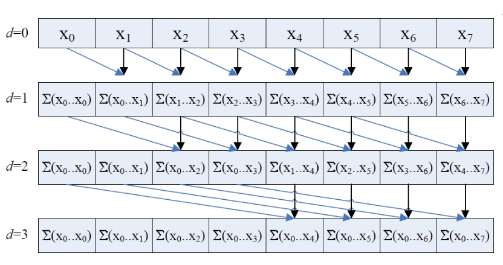
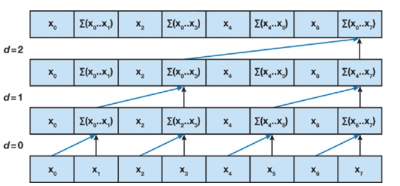
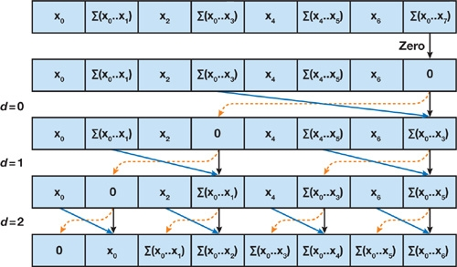
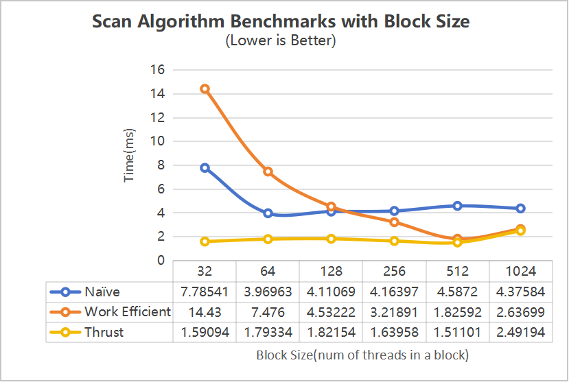
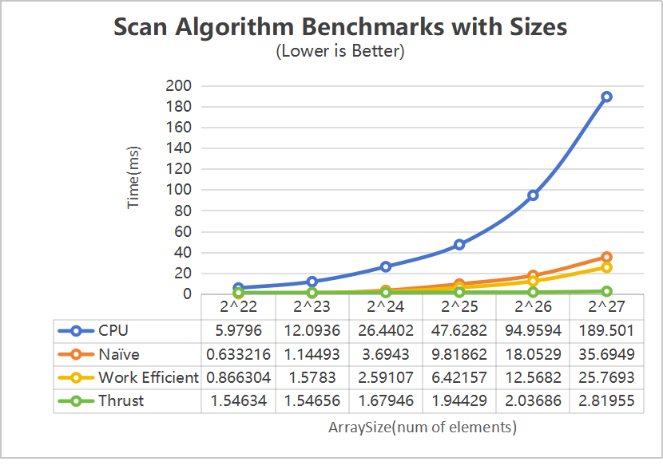
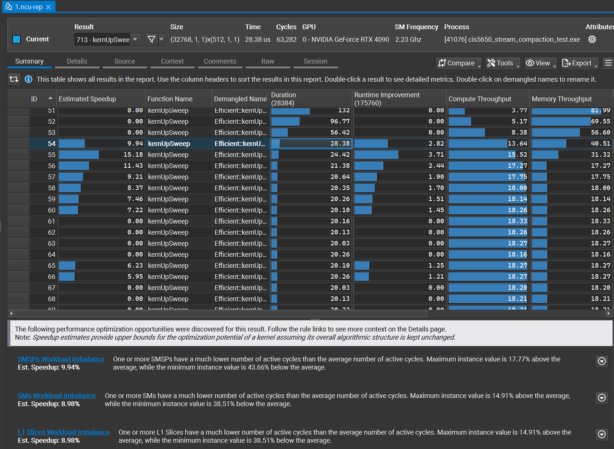

CUDA Stream Compaction
======================

**University of Pennsylvania, CIS 565: GPU Programming and Architecture, Project 2**

* Jichu Mao
  * [LinkedIn](https://www.linkedin.com/in/jichu-mao-a3a980226/)
  *  [Personal Website](https://jichu.art/)
* Tested on: Windows 11,  i7-13700K @ 3.40 GHz, 32GB, RTX 4090 24GB

## Overview
In this project, I implemented GPU-based stream compaction and scan algorithms using CUDA.
Stream compaction is a critical operation in GPU programming, particularly for applications like path tracing where it's necessary to efficiently remove inactive elements (e.g., terminated rays) from large datasets.

The primary goal was to implement several versions of the scan (prefix sum) algorithm and use them to perform stream compaction:

 * **CPU Scan and Stream Compaction**: Baseline implementations for correctness verification.
 * **Naive GPU Scan**: A straightforward GPU implementation using global memory.
 * **Work-Efficient GPU Scan and Stream Compaction**: An optimized GPU implementation that reduces redundant computations.
 * **Thrust Scan**: Utilizing NVIDIA's Thrust library for comparison.
 * **Optimizations**(Extra): Investigated and optimized performance bottlenecks in the GPU implementations.


## Descripitions 

### CPU Scan and Stream Compaction
 * Exclusive Scan: Implemented a CPU version of the exclusive prefix sum using a simple for-loop.
 * Stream Compaction without Scan: Removed zero elements from an array without using scan.
 * Stream Compaction with Scan: Used the scan result to efficiently compact an array by mapping, scanning, and scattering.

### Naive GPU Scan Algorithm
 * Implemented the naive scan algorithm on the GPU based on a straightforward parallel prefix sum approach.
 * Used global memory and multiple kernel launches for each step of the algorithm.
 * Handled non-power-of-two array sizes by padding the input array.

First do exclusive scan, then do shift right to get inclusive scan array.



### Work-Efficient GPU Scan and Stream Compaction

Implemented the work-efficient scan algorithm using a balanced binary tree approach (up-sweep and down-sweep phases).

   
#### Step 1. Up-Sweep Phase
This builds a sum in a tree structure.
Starting from the leaves, each level of the tree computes partial sums of its two children and stores the result at the parent node. 
This process continues until the root contains the total sum of the array.



#### Step 2. Down-Sweep Phase
This phase propagates partial sums back down the tree.
The total sum at the root is replaced with zero, and each parent passes its original value to its left child,
while the new value for the right child is the sum of the parent's original value and the left child’s value. This produces the final exclusive prefix sum.



#### Step 3. Convert the exclusive scan to an inclusive scan
After conversion, we can output the results.

### Thrust Scan Implementation
Simply used the thrust::exclusive_scan(first, last, result) function from the Thrust library for performance comparison.

### Stream Compaction
Implemented GPU-based stream compaction using the work-efficient scan, including mapping to booleans and scattering.

## Performance Analysis
### Block Size Opimization for each Implementation


From the graph, we observe that the Naïve algorithm shows significant performance improvements as the block size increases from 32 to 128, reaching its optimal performance at a block size of 64. However, further increases in block size do not result in any additional performance gains for this algorithm.

On the other hand, the Work Efficient algorithm continues to improve as the block size increases, achieving its best performance at 512 threads per block. The Thrust algorithm consistently outperforms both custom implementations across all block sizes, with relatively stable performance. Notably, a block size of 1024 does not yield ideal results for any of the algorithms, likely due to the excessive block size reducing GPU parallelism and leaving computational resources underutilized.

### Scan Implementations Comparasion Bottlenecks



The test is set on with power of 2 array size, block size of 256, threads reduction opitmization on. 

The Naïve algorithm exhibits steady performance improvements for smaller array sizes, but as the array size increases beyond 
**2<sup>25</sup>**
 , its performance starts to degrade more rapidly. This degradation is likely due to the algorithm's inefficient use of GPU resources, particularly in handling global memory. In the Naïve approach, each iteration operates independently, which results in poor memory access patterns and a lack of synchronization optimization. As array sizes increase, the amount of memory access grows, and this inefficiency becomes more pronounced, leading to slower runtimes.

The Work Efficient algorithm, on the other hand, significantly improves upon the Naïve implementation by optimizing memory access and parallelism. It better utilizes memory access within each block, which reduces the overhead caused by global memory access. This allows for more efficient data exchange between threads, especially in larger array sizes. However, while this algorithm performs better than Naïve for most cases, it still experiences a noticeable performance increase beyond 
**2<sup>25</sup>**
 . This is likely due to the constant thread allocation across iterations, which causes unnecessary thread activity during certain phases of the scan (e.g., up-sweep and down-sweep phases). Idle threads could create overhead, contributing to the performance slowdown.

In comparison, Thrust performs consistently across all array sizes, likely due to its sophisticated memory management and internal optimizations such as dynamically adapting thread usage or leveraging efficient data transfers. However, without diving deeper into the implementation or utilizing tools like Nsight to investigate specific execution timelines, the exact reasons behind its superior performance remain speculative.

### Analysis with Nsight Compute



The above Nsight Compute result highlights the performance profiling of the work-efficient scan algorithm, focusing on the upsweep and downsweep phases. The upsweep phase consumes the majority of the execution time, averaging 28.38 ms per kernel execution. One of the main bottlenecks identified is SM workload imbalance, where some Streaming Multiprocessors (SMs) are underutilized by as much as 43.66%, leading to inefficient use of GPU resources. Additionally, the high memory throughput indicates non-optimal memory access patterns, which further hinders performance during this phase.

In contrast, the downsweep phase is shorter, averaging 20.26 ms, but shows lower compute and memory throughput. While workload imbalance is still present, it is less severe than in the upsweep phase. The lack of full GPU resource utilization, especially in terms of active threads, contributes to lower performance in this stage. This analysis suggests potential optimizations like balancing the SM workload and improving memory access efficiency to enhance overall algorithm performance.

### Output Results
The following tests were ran on：
* Array size of **2<sup>27</sup>**
* A non-power-of-two array size of **2<sup>27</sup> - 3**
* A block size of **256**
* With thread reduction mode **on**.

```
****************
** SCAN TESTS **
****************
    [  43  21  19   5  12   0  25  24  36  44  25  38  44 ...  32   0 ]
==== cpu scan, power-of-two ====
   elapsed time: 190.116ms    (std::chrono Measured)
    [   0  43  64  83  88 100 100 125 149 185 229 254 292 ... -1007916206 -1007916174 ]
==== cpu scan, non-power-of-two ====
   elapsed time: 190.262ms    (std::chrono Measured)
    [   0  43  64  83  88 100 100 125 149 185 229 254 292 ... -1007916281 -1007916249 ]
    passed
==== naive scan, power-of-two ====
   elapsed time: 35.0255ms    (CUDA Measured)
    passed
==== naive scan, non-power-of-two ====
   elapsed time: 34.8509ms    (CUDA Measured)
    passed
==== work-efficient scan, power-of-two ====
   elapsed time: 26.2033ms    (CUDA Measured)
    passed
==== work-efficient scan, non-power-of-two ====
   elapsed time: 25.4444ms    (CUDA Measured)
    passed
==== thrust scan, power-of-two ====
   elapsed time: 2.90944ms    (CUDA Measured)
    passed
==== thrust scan, non-power-of-two ====
   elapsed time: 2.24038ms    (CUDA Measured)
    passed

*****************************
** STREAM COMPACTION TESTS **
*****************************
    [   1   0   3   2   2   1   3   0   1   0   2   0   3 ...   3   0 ]
==== cpu compact without scan, power-of-two ====
   elapsed time: 251.32ms    (std::chrono Measured)
    [   1   3   2   2   1   3   1   2   3   3   2   3   2 ...   2   3 ]
    passed
==== cpu compact without scan, non-power-of-two ====
   elapsed time: 246.755ms    (std::chrono Measured)
    [   1   3   2   2   1   3   1   2   3   3   2   3   2 ...   1   1 ]
    passed
==== cpu compact with scan ====
   elapsed time: 565.44ms    (std::chrono Measured)
    [   1   3   2   2   1   3   1   2   3   3   2   3   2 ...   2   3 ]
    passed
==== work-efficient compact, power-of-two ====
   elapsed time: 31.3884ms    (CUDA Measured)
    passed
==== work-efficient compact, non-power-of-two ====
   elapsed time: 30.1025ms    (CUDA Measured)
    passed
```
