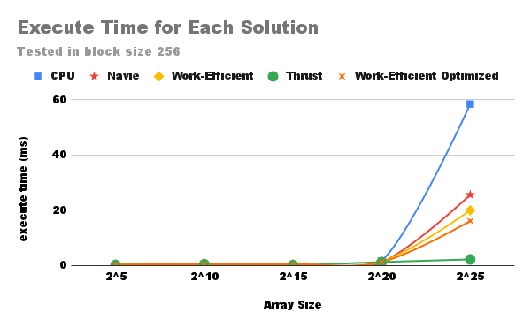
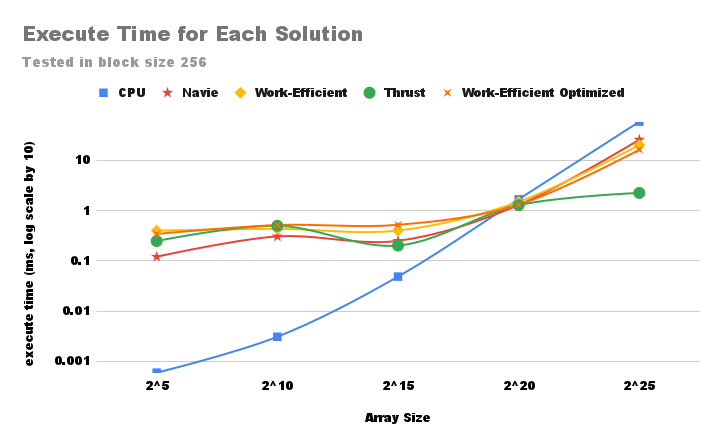
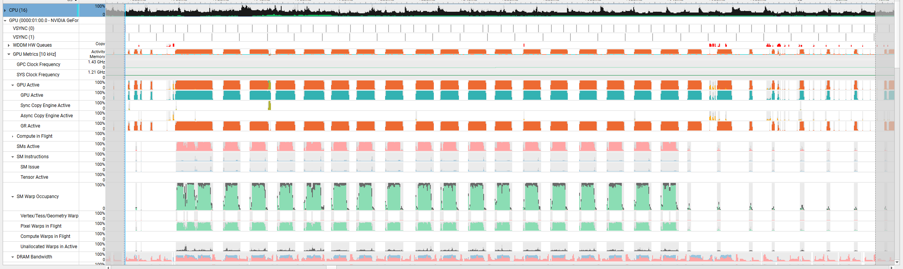
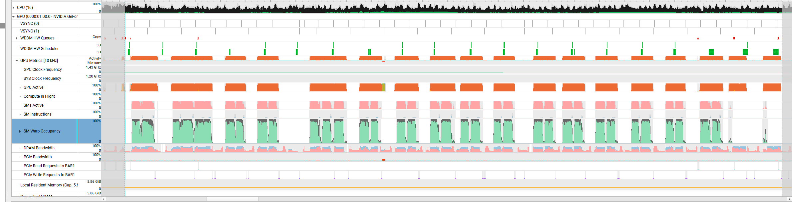

CUDA Stream Compaction
======================

**University of Pennsylvania, CIS 565: GPU Programming and Architecture, Project 2**

* Yifan Lu
  * [LinkedIn](https://www.linkedin.com/in/yifan-lu-495559231/), [personal website](http://portfolio.samielouse.icu/)
* Tested on: Windows 11, AMD Ryzen 7 5800H 3.20 GHz, Nvidia GeForce RTX 3060 Laptop GPU (Personal Laptop)

## Project Feature
- CPU Scan & Stream Compaction
- Naive GPU Scan Algorithm
- Work-Efficient GPU Scan & Stream Compaction
- Thrust Scan
- **[Extra Credit]** Optimized work-efficient with bitwise kernel operations and dynamic launching block numbers

## Introduction

### Scan
Scan is to process elements of an array to generate a new array where each position contains an aggregation like a sum, product, or logical operation of elements up to that position in the original array. in this project, we are doing a scan for sum. 

There are two main variaty of scan:

 - **Inclusive Scan**

Each element in the output array includes the corresponding element from the input array in the sum.

 - **Exclusive Scan**

Each element in the output array does not include the corresponding element from the input array, starting with an initial value (like zero for sum).
 

### Compaction
Compaction is to remove or filter out unwanted elements from an array or list, creating a new array that contains only the elements that satisfy a specific condition.

### Parallelization
Parallelizing the scan and compaction process can significantly improve its performance, especially on large datasets. In parallel implementations, the array can be divided among multiple processors or threads, each performing the mapping, scanning, and scattering on a segment of the array. 


## Performance Analysis

### Blocksize Optimization

For my implement and hardware setting, when block size reaches 256, the operations are showing better performance. The performance will not change significantly if the block size continues increasing.

This is the GPU time for work-efficient method on array size $2^{15}$, which reaches its lowest point at block size 256.


### Compare GPU Scan Implementations

The following chart shows the time for CPU, GPU Navie, GPU work-efficient and thrust scan.




Naive scan needs $O(log2(n))$ passes.  Each pass has $O(n)$ computations. Work-efficient uses a 'binary tree' structure and we only need to do $O(n)$ computations for a single traverse of the tree.

Work-efficient has a significant upgrade when the array size are getting larger.

### Performance Bottlenecks

To trace the GPU bottlenecks when doing scanning, I used Nsight Systems to launch release build.



The above screenshots are taken from nsight systems which time period are related to work-efficient scan.

From the graph we can see that there are time gaps between GPU SM executions. That is probably because non-coalesced memory accesses to global memory.

In order for each kernel to have faster computations, I switch operations such as mod and multiply/divide into bit-wise operations.

For example, change ``` index % offset == 0 ``` into ``` (index & (offset - 1)) == 0 ```. This is because ```offset``` is always the power of 2, so the ```index``` we are looking for is also power of 2. By AND the ```index``` and ```offset - 1```, which is a bunch of 1s, we can check the result to see if it is 0. If it is, then ```index``` can be divided by ```offset```.

Also to avoid too much threads idling, I **dynamically change the number of blocks that kernel will launch in the work-efficient method**.

After the optimization, the timeline looks like the graph below, which has longer SM active time. However, the time gaps will exists because the memory latency. 



### Test Output

The test is done under the configuration of array size 2^10 and block size 256.

```

****************
** SCAN TESTS **
****************
    [  16  47   5  34  25  42  48  11  36  49  39  23   0 ...  42   0 ]
==== cpu scan, power-of-two ====
   elapsed time: 0.0008ms    (std::chrono Measured)
    [   0  16  63  68 102 127 169 217 228 264 313 352 375 ... 25401 25443 ]
==== cpu scan, non-power-of-two ====
   elapsed time: 0.0008ms    (std::chrono Measured)
    [   0  16  63  68 102 127 169 217 228 264 313 352 375 ... 25372 25394 ]
    passed
==== naive scan, power-of-two ====
   elapsed time: 0.342016ms    (CUDA Measured)
    [   0  16  63  68 102 127 169 217 228 264 313 352 375 ... 25401 25443 ]
    passed
==== naive scan, non-power-of-two ====
   elapsed time: 0.105472ms    (CUDA Measured)
    [   0  16  63  68 102 127 169 217 228 264 313 352 375 ...   0   0 ]
    passed
==== work-efficient scan, power-of-two ====
   elapsed time: 0.897024ms    (CUDA Measured)
    [   0  16  63  68 102 127 169 217 228 264 313 352 375 ... 25401 25443 ]
    passed
==== work-efficient scan, non-power-of-two ====
   elapsed time: 0.27648ms    (CUDA Measured)
    [   0  16  63  68 102 127 169 217 228 264 313 352 375 ... 25372 25394 ]
    passed
==== thrust scan, power-of-two ====
   elapsed time: 0.121856ms    (CUDA Measured)
    passed
==== thrust scan, non-power-of-two ====
   elapsed time: 0.04096ms    (CUDA Measured)
    passed

*****************************
** STREAM COMPACTION TESTS **
*****************************
    [   3   1   3   1   1   3   1   1   0   1   1   1   3 ...   0   0 ]
==== cpu compact without scan, power-of-two ====
   elapsed time: 0.0028ms    (std::chrono Measured)
    [   3   1   3   1   1   3   1   1   1   1   1   3   1 ...   1   1 ]
    passed
==== cpu compact without scan, non-power-of-two ====
   elapsed time: 0.0022ms    (std::chrono Measured)
    [   3   1   3   1   1   3   1   1   1   1   1   3   1 ...   1   1 ]
    passed
==== cpu compact with scan ====
   elapsed time: 0.0005ms    (std::chrono Measured)
    [   3   1   3   1   1   3   1   1   1   1   1   3   1 ...   1   1 ]
    passed
==== work-efficient compact, power-of-two ====
   elapsed time: 0.27648ms    (CUDA Measured)
    [   3   1   3   1   1   3   1   1   1   1   1   3   1 ...   1   1 ]
    passed
==== work-efficient compact, non-power-of-two ====
   elapsed time: 0.27648ms    (CUDA Measured)
    [   3   1   3   1   1   3   1   1   1   1   1   3   1 ...   1   1 ]
    passed
```

