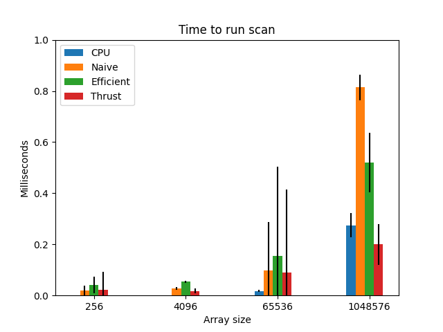
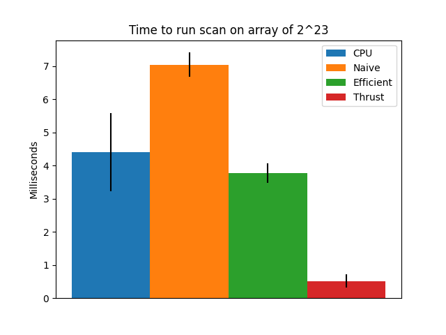

CUDA Stream Compaction
======================

**University of Pennsylvania, CIS 565: GPU Programming and Architecture, Project 2**

* Nicholas Liu
  * [Linkedin](https://www.linkedin.com/in/liunicholas6/)
* Tested on: Linux Mint 22 Wilma, AMD Ryzen 7 5800X @ 2.512GHz, 32GB RAM, GeForce GTX 1660 Ti

# Project Description

This project implements scan (prefix-sum) in a variety of different ways. We test a CPU implementation, a GPU naive version, and a GPU work-efficient version against the implementation from the Thrust library.

# Performance Analysis

At very small array sizes, the CPU scan performs the best. As we increase the size of the array, the CPU begins to perform relatively worse, and is quickly eclipsed in speed by the Thrust implementation.

Error bars shown are 1 sigma with 1000 runs of scan.

Once we reach a number of elements on the order of 2^23 or so, the work-efficient scan implemented also performs better than the CPU scan

| 256     | CPU       | 7.585e-05           | 1.684521478821987e-05  |   |
|---------|-----------|---------------------|------------------------|---|
| 256     | Naive     | 0.019890368         | 0.018129259603148012   |   |
| 256     | Efficient | 0.041029536         | 0.03196243203484814    |   |
| 256     | Thrust    | 0.022883072         | 0.07034156396333269    |   |
| 4096    | CPU       | 0.00092551          | 0.00017840902353771144 |   |
| 4096    | Naive     | 0.02674304          | 0.005283869080783783   |   |
| 4096    | Efficient | 0.053911488         | 0.0037359112841419267  |   |
| 4096    | Thrust    | 0.0177352           | 0.009973741521411908   |   |
| 65536   | CPU       | 0.017869165         | 0.003946497566300506   |   |
| 65536   | Naive     | 0.099199506         | 0.18741031849147752    |   |
| 65536   | Efficient | 0.15358839999999999 | 0.34961337456361957    |   |
| 65536   | Thrust    | 0.089322486         | 0.3254493673567683     |   |
| 1048576 | CPU       | 0.27509278          | 0.048449150282649026   |   |
| 1048576 | Naive     | 0.814048116         | 0.04939857649465461    |   |
| 1048576 | Efficient | 0.520357476         | 0.11646960803214108    |   |
| 1048576 | Thrust    | 0.199752738         | 0.07898137835466129    |   |
| 8388608 | CPU       | 4.41064898          | 1.176601505235431      |   |
| 8388608 | Naive     | 7.03792806          | 0.37055519290846245    |   |
| 8388608 | Efficient | 3.77427417          | 0.2990962226148862     |   |
| 8388608 | Thrust    | 0.519275972         | 0.20947768302315156    |   |