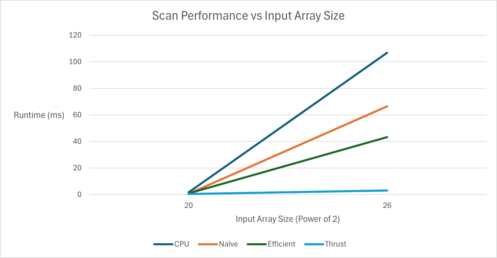

CUDA Stream Compaction
======================

**University of Pennsylvania, CIS 565: GPU Programming and Architecture, Project 2**

* Logan Cho
  * [LinkedIn](https://www.linkedin.com/in/logan-cho/)
  * [Personal Website](https://www.logancho.com/)
* Tested on: Windows 11, 13th Gen Intel(R) Core(TM) i7-13700H, 2.40 GHz, RTX 4060 Laptop GPU

# Sample Output
```
****************
** SCAN TESTS **
****************
    [  48  27  47   0  26  20   5  27  18  47  10   9  22 ...  35   0 ]
==== cpu scan, power-of-two ====
   elapsed time: 0.0004ms    (std::chrono Measured)
    [   0  48  75 122 122 148 168 173 200 218 265 275 284 ... 6629 6664 ]
==== cpu scan, non-power-of-two ====
   elapsed time: 0.0004ms    (std::chrono Measured)
    [   0  48  75 122 122 148 168 173 200 218 265 275 284 ... 6562 6595 ]
    passed
==== naive scan, power-of-two ====
   elapsed time: 0.08192ms    (CUDA Measured)
    passed
==== naive scan, non-power-of-two ====
   elapsed time: 0.02048ms    (CUDA Measured)
    passed
==== work-efficient scan, power-of-two ====
   elapsed time: 0.191232ms    (CUDA Measured)
    passed
==== work-efficient scan, non-power-of-two ====
   elapsed time: 0.137216ms    (CUDA Measured)
    passed
==== thrust scan, power-of-two ====
   elapsed time: 0.071904ms    (CUDA Measured)
    passed
==== thrust scan, non-power-of-two ====
   elapsed time: 0.04608ms    (CUDA Measured)
    passed

*****************************
** STREAM COMPACTION TESTS **
*****************************
    [   0   3   3   0   0   2   1   1   0   3   2   1   2 ...   1   0 ]
==== cpu compact without scan, power-of-two ====
   elapsed time: 0.0006ms    (std::chrono Measured)
    passed
==== cpu compact without scan, non-power-of-two ====
   elapsed time: 0.0003ms    (std::chrono Measured)
    passed
==== cpu compact with scan ====
   elapsed time: 0.001ms    (std::chrono Measured)
    passed
==== work-efficient compact, power-of-two ====
   elapsed time: 0.188416ms    (CUDA Measured)
    passed
==== work-efficient compact, non-power-of-two ====
   elapsed time: 0.084992ms    (CUDA Measured)
    passed
```

# Charts



# In-Depth Performance Analysis
 * CUDA Block Size Optimization
   * Through trial and error, I narrowed down the optimal block sizes for each of my implementations of scan/compaction.
     * Naive: (256, 1, 1)
     * Efficient: (256, 1, 1)
 * Comparison of all Scan Implementations (CPU, GPU (Naive, Efficient, Thrust)):
   *  
   *  This chart plots the time taken/runtime of different Scan implementations across different input array sizes. We can draw a conclusion that the GPU methods have a significant performance boost over the serial CPU method for larger array sizes, larger than 2 to the power of 14.
   *  
   *  We can also see from this additional chart that between the GPU methods, Thrust is the most performant by far. And we also see that fficient outpaces Naive once the size of the array exceeds 2 to the power of 20.
