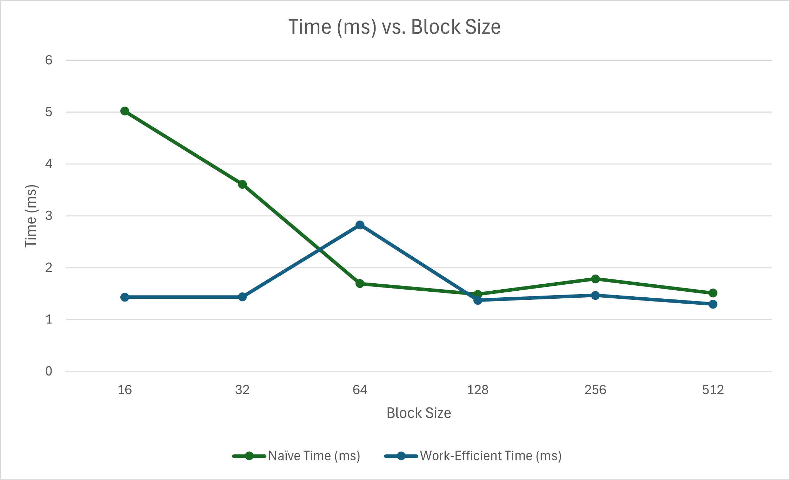

CUDA Stream Compaction
======================

**University of Pennsylvania, CIS 565: GPU Programming and Architecture, Project 2**

* Nadine Adnane
  * [LinkedIn](https://www.linkedin.com/in/nadnane/)
* Tested on my personal laptop (ASUS ROG Zephyrus M16):
* **OS:** Windows 11
* **Processor:** 12th Gen Intel(R) Core(TM) i9-12900H, 2500 Mhz, 14 Core(s), 20 Logical Processor(s) 
* **GPU:** NVIDIA GeForce RTX 3070 Ti Laptop GPU

### Results

Note: I am using a late day on this assignment.

## Part 1: CPU Scan & Stream Compaction

## Part 2: Naive GPU Scan Algorithm

## Part 3: Work-Efficient GPU Scan & Stream Compaction
  # 3.1. Scan
  # 3.2. Stream Compaction

## Part 4: Using Thrust's Implementation

## Part 7: Write-up
# Comparing Implementations
# Performance Analysis



# Test Program Output
```****************
** SCAN TESTS **
****************
    [   3   7  33  47  27   3  16  21  20  14  40  30  20 ...  29   0 ]
==== cpu scan, power-of-two ====
   elapsed time: 13.8246ms    (std::chrono Measured)
    [   0   3  10  43  90 117 120 136 157 177 191 231 261 ... 102740616 102740645 ]
==== cpu scan, non-power-of-two ====
   elapsed time: 13.7131ms    (std::chrono Measured)
    [   0   3  10  43  90 117 120 136 157 177 191 231 261 ... 102740526 102740542 ]
    passed
==== naive scan, power-of-two ====
   elapsed time: 4.41216ms    (CUDA Measured)
    passed
==== naive scan, non-power-of-two ====
   elapsed time: 4.15386ms    (CUDA Measured)
    passed
==== work-efficient scan, power-of-two ====
   elapsed time: 2.04285ms    (CUDA Measured)
    passed
==== work-efficient scan, non-power-of-two ====
   elapsed time: 1.68448ms    (CUDA Measured)
    passed
==== thrust scan, power-of-two ====
   elapsed time: 76.0596ms    (CUDA Measured)
    passed
==== thrust scan, non-power-of-two ====
   elapsed time: 46.633ms    (CUDA Measured)
    passed

*****************************
** STREAM COMPACTION TESTS **
*****************************
    [   2   3   1   2   1   0   1   1   2   2   0   2   3 ...   3   0 ]
==== cpu compact without scan, power-of-two ====
   elapsed time: 26.062ms    (std::chrono Measured)
    [   2   3   1   2   1   1   1   2   2   2   3   1   1 ...   3   3 ]
    passed
==== cpu compact without scan, non-power-of-two ====
   elapsed time: 26.0387ms    (std::chrono Measured)
    [   2   3   1   2   1   1   1   2   2   2   3   1   1 ...   2   3 ]
    passed
==== cpu compact with scan ====
   elapsed time: 71.3503ms    (std::chrono Measured)
    [   2   3   1   2   1   1   1   2   2   2   3   1   1 ...   3   3 ]
    passed
==== work-efficient compact, power-of-two ====
   elapsed time: 2.31478ms    (CUDA Measured)
    passed
==== work-efficient compact, non-power-of-two ====
   elapsed time: 2.08794ms    (CUDA Measured)
    passed```