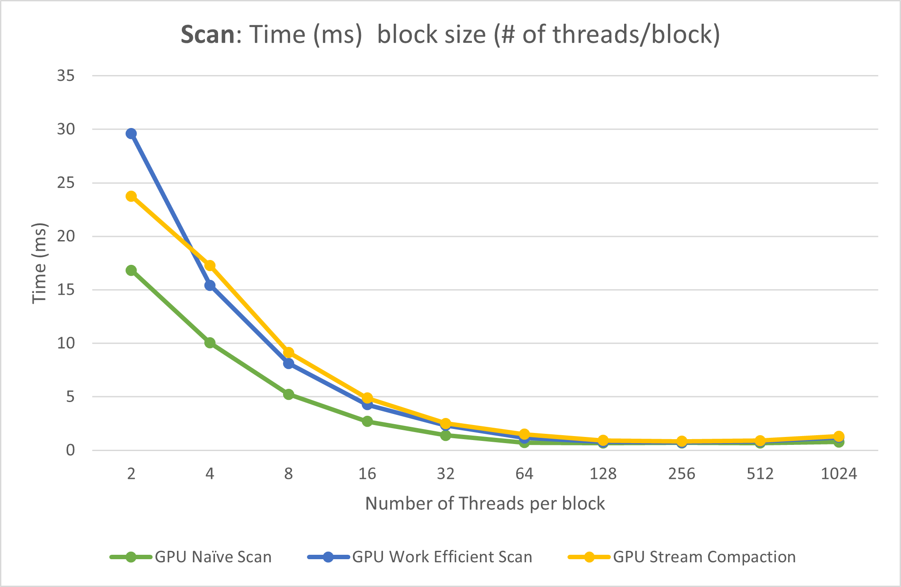
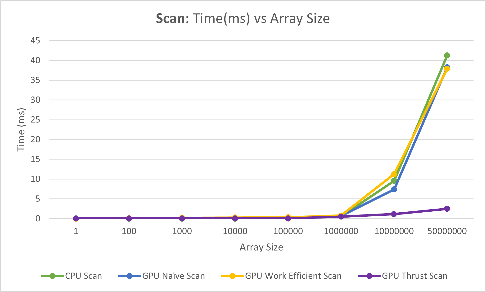
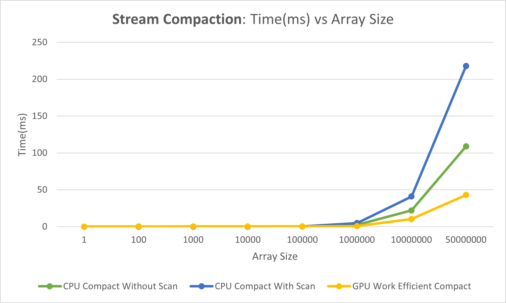

CUDA Stream Compaction
======================

**University of Pennsylvania, CIS 565: GPU Programming and Architecture, Project 2**

* Utkarsh Dwivedi
  * [LinkedIn](https://www.linkedin.com/in/udwivedi/), [personal website](https://utkarshdwivedi.com/)
* Tested on: Windows 11 Home, AMD Ryzen 7 5800H @ 3.2GHz 16 GB, Nvidia GeForce RTX 3060 Laptop GPU 6000 MB

# Introduction

This project is an implementation of the scan and stream compaction algorithms, both sequentially on the CPU as well as in parallel on the GPU using CUDA, and a performance analysis and comparison of different implementations of the algorithm.

## Algorithms

### Scan
Scan computes the prefix sum of the array so that each element in the resulting array is the sum of all the elements occuring before it. This project contains the following implementations of scan:

1. **Sequential CPU scan**: A simple scan algorithm that runs sequentially on the CPU using a for loop.
2. **Naive parallel scan**: A scan algorithm that runs in parallel on the GPU and sums over adjacent elements while halving the array size each iteration
3. **Work efficient parallel scan**: A more performant parallel scan on the GPU that treats the array like a binary tree and runs in two steps: an "up-sweep" and then a "down-sweep"

### Stream Compaction
Stream compaction is an algorithm that, given an array and some condition, creates and returns a new array that contains only those elements from the original array that satisfy the given condition, and the order of the elements in the resulting array is preserved. In this project, stream compaction simply removes all `0s` from an array of integers, but it can easily be extended to work as a template on any given conditions. This project contains the following implementations of stream compaction:

1. **Simple CPU stream compaction**: A simple algorithm that runs sequentially on the CPU using a for loop and simply removes all elements that are 0
2. **CPU stream compaction using CPU scan**: A CPU side imitation of stream compaction in parallel, using the scan algorithm
3. **GPU stream compaction using GPU work efficient scan**: Proper implementation of stream compaction in parallel using the parallel scan algorithm on the GPU

# Performance Analysis

## Time(ms) vs Block Size (optimizing block size)

This project was first executed on an array of size **2<sup>20</sup>different** with different block sizes to roughly optimize them.

|  |
|:--:|
| **Scan**: time (ms) vs block size (# of threads per block)

There is little gain in performance beyond 128 threads, so further performance analysis was done with block size set to **128**. 

## Time (ms) vs Array Size

### Scan

Each of the scan implementations (CPU, GPU Naive, GPU Work-Efficient) was compared against each other with increasing array sizes. Additionally, the results were also compared against Nvidia's thrust library's `exclusive_scan`.

|  |
|:--:|
| **Scan**: time (ms) vs array size, Block Size: 128 |

### Stream Compaction

Each of the stream compaction implementations was compared against each other with increasing array sizes.

|  |
|:--:|
| **Stream Compaction**: time (ms) vs array size, Block Size: 128 |

Include analysis, etc. (Remember, this is public, so don't put
anything here that you don't want to share with the world.)

# Sample Output

This output was obtained with a block size of **128**, power of 2 array size of **2<sup>16</sup>**, and non-power of array size of **2<sup>16</sup> - 3**.

```
****************
** SCAN TESTS **
****************
    [  19  33  49  24  24  41   7  27  48   8  21  34  25 ...  17   0 ]
==== cpu scan, power-of-two ====
   elapsed time: 0.0379ms    (std::chrono Measured)
    [   0  19  52 101 125 149 190 197 224 272 280 301 335 ... 1605490 1605507 ]
==== cpu scan, non-power-of-two ====
   elapsed time: 0.0317ms    (std::chrono Measured)
    [   0  19  52 101 125 149 190 197 224 272 280 301 335 ... 1605434 1605446 ]
    passed
==== naive scan, power-of-two ====
   elapsed time: 0.158912ms    (CUDA Measured)
    [   0  19  52 101 125 149 190 197 224 272 280 301 335 ... 1605490 1605507 ]
    passed
==== naive scan, non-power-of-two ====
   elapsed time: 0.193856ms    (CUDA Measured)
    [   0  19  52 101 125 149 190 197 224 272 280 301 335 ... 1605434 1605446 ]
    passed
==== work-efficient scan, power-of-two ====
   elapsed time: 0.326432ms    (CUDA Measured)
    [   0  19  52 101 125 149 190 197 224 272 280 301 335 ... 1605490 1605507 ]
    passed
==== work-efficient scan, non-power-of-two ====
   elapsed time: 0.247808ms    (CUDA Measured)
    [   0  19  52 101 125 149 190 197 224 272 280 301 335 ... 1605434 1605446 ]
    passed
==== thrust scan, power-of-two ====
   elapsed time: 0.059744ms    (CUDA Measured)
    [   0  19  52 101 125 149 190 197 224 272 280 301 335 ... 1605490 1605507 ]
    passed
==== thrust scan, non-power-of-two ====
   elapsed time: 0.051552ms    (CUDA Measured)
    [   0  19  52 101 125 149 190 197 224 272 280 301 335 ... 1605434 1605446 ]
    passed

*****************************
** STREAM COMPACTION TESTS **
*****************************
    [   3   1   3   2   0   3   3   3   2   2   1   0   3 ...   1   0 ]
==== cpu compact without scan, power-of-two ====
   elapsed time: 0.1817ms    (std::chrono Measured)
    [   3   1   3   2   3   3   3   2   2   1   3   3   1 ...   3   1 ]
    passed
==== cpu compact without scan, non-power-of-two ====
   elapsed time: 0.1807ms    (std::chrono Measured)
    [   3   1   3   2   3   3   3   2   2   1   3   3   1 ...   3   3 ]
    passed
==== cpu compact with scan ====
   elapsed time: 0.2497ms    (std::chrono Measured)
    [   3   1   3   2   3   3   3   2   2   1   3   3   1 ...   3   1 ]
    passed
==== work-efficient compact, power-of-two ====
   elapsed time: 0.31232ms    (CUDA Measured)
    [   3   1   3   2   3   3   3   2   2   1   3   3   1 ...   3   1 ]
    passed
==== work-efficient compact, non-power-of-two ====
   elapsed time: 0.395264ms    (CUDA Measured)
    [   3   1   3   2   3   3   3   2   2   1   3   3   1 ...   3   3 ]
    passed
Press any key to continue . . .
```