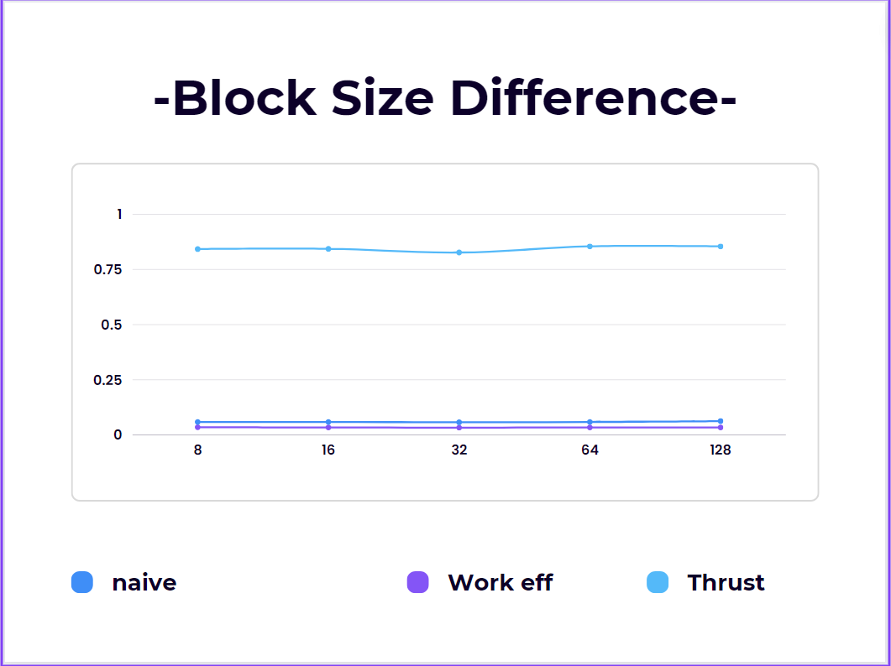

CUDA Stream Compaction
======================

**University of Pennsylvania, CIS 565: GPU Programming and Architecture, Project 2**

Han Wang

Tested on: Windows 11, 11th Gen Intel(R) Core(TM) i9-11900H @ 2.50GHz 22GB, GTX 3070 Laptop GPU

### Analysis
**Roughly optimize the block sizes of each of your implementations for minimal run time on your GPU.**

**(You shouldn't compare unoptimized implementations to each other!)
Compare all of these GPU Scan implementations (Naive, Work-Efficient, and Thrust) to the serial CPU version of Scan. Plot a graph of the comparison (with array size on the independent axis).**

Based on my observation in my text, there are three phenomenons:
1. The block size seems to not influence the output that much.
2. The naive gpu approach is slower than the efficient approach.
3. Though I didn't plot out the output of the CPU scan, the CPU operation seems to be actually faster than the GPU operation.

The first phenomenon seems not really reasonable. I expect that with more block size, we can improve the run time speed in the parallel operation. But I think I need to keep the truth I just  post the real output. The second phenomenon seems reasonable. The book explained the high-speed algorithm. The third phenomenon might be because the GPU approach might spend more time accessing the shared memory compared to the CPU's fast access. For the current  data size, the benefit of the parallel operation cannot cover the loss of that.

**Don't mix up CpuTimer and GpuTimer.
To guess at what might be happening inside the Thrust implementation (e.g. allocation, memory copy), take a look at the Nsight timeline for its execution. Your analysis here doesn't have to be detailed, since you aren't even looking at the code for the implementation.
Write a brief explanation of the phenomena you see here.**

The observation is that the thrust implementation is slower than the GPU and CPU approach. Based on my knowledge, I think it is more possible that the thrust implementation might spend large amounts of time on memory I/O operation. I trust that the algorithm of the thrust might be fast and reliable.

**
Can you find the performance bottlenecks? Is it memory I/O? Computation? Is it different for each implementation?
Paste the output of the test program into a triple-backtick block in your README.**

Because our time check excludes the init and end memory operation, based on my observation and my hypothesis, I think that the memory I/O computation might be there but didn't actually influence me. At least I didn't observe the performance bottlenecks.

