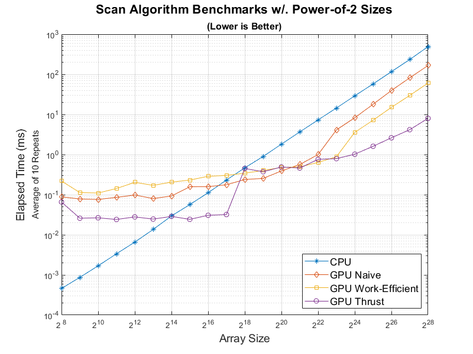
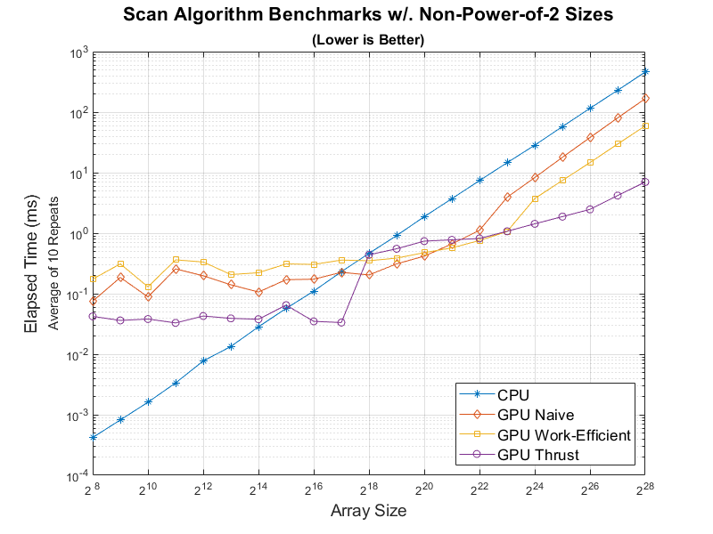
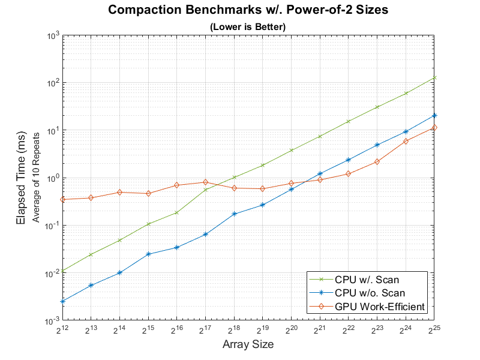
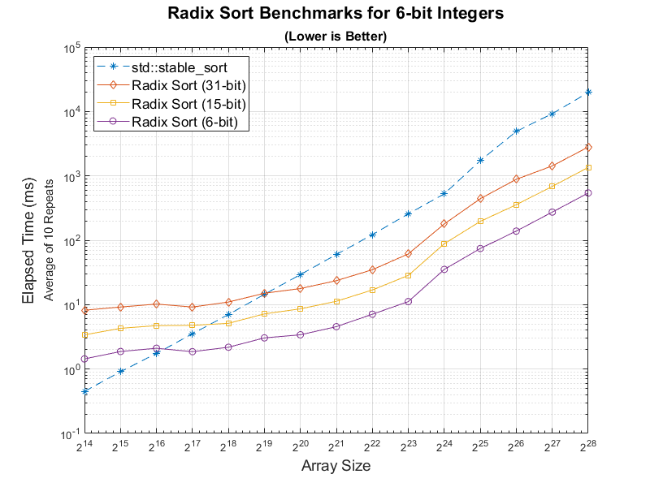
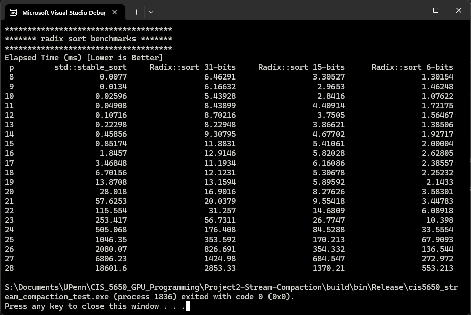

CUDA Stream Compaction
======================

**University of Pennsylvania, CIS 565: GPU Programming and Architecture, Project 2**

* Mufeng Xu
  * [LinkedIn](https://www.linkedin.com/in/mufeng-xu/)
* Tested on: Windows 11, i9-13900H @ 2.6GHz 32GB, RTX 4080 Laptop 12282MB (Personal Computer)

> *GPU parallel algorithms have significantly better performance when the array sizes are large!*
> 
>.png)
>.png)

In this project, I implemented the following features:
- CPU Scan & Stream Compaction
- Naive GPU Scan Algorithm
- Work-Efficient GPU Scan & Stream Compaction
- GPU Scan and Compaction with `Thrust`
- [Extra Credit +5] Improved the performance of GPU scans with some index calculation tweaks.
- [Extra Credit +10] GPU **Radix Sort**, and compared it with `std::stable_sort`.
- Benchmarking the implementations, repeat tests to get more reliable results.

## Performance Benchmarks

For each implementation, I tested different block sizes for array `SIZE = 1 << 26` and chose optimized one for them.
For naive implementation, the block size is `1024`, and for the work-efficient, it is `512`.

### Scan Algorithms





From the benchmarks we can find that when the array size is larger than $2^{18}$, 
GPU algorithms perform better than the CPU implementations.
When the array size is smaller than $2^{17}$, 
the GPU algorithms' performance are bottlenecked,
possibly because of memory overhead.
As the array size increases, the benefits of massive parallelization become apparent. 
Additionally, the Work-Efficient algorithm is roughly twice as fast as the Naive implementation. 
Notably, the Thrust implementation outperforms my implementation by a significant margin.

I believe this automatically meets the requirement of Part 5 extra credits, 
since I'm avoided calling redundant threads, 
making the GPU algorithms perform better than the CPU when the array size is large.

### Stream Compaction



For smaller array sizes (up to $2^{17}$), the CPU without Scan implementation outperforms the GPU Work-Efficient algorithm due to lower overhead and the inefficiency of GPU parallelization for small datasets. However, as the array size increases beyond $2^{18}$, the GPU Work-Efficient method starts to leverage its parallel processing capabilities, eventually surpassing the CPU w/o. Scan around $2^{20}$. For larger arrays, the GPU algorithm demonstrates significantly better scalability, with a slower growth in elapsed time compared to the CPU, making it the superior choice for handling large datasets.

I also implemented the stream compaction with `thrust::remove_if`. 
But after benchmarking, I found it performs exactly like the CPU algorithms.
And my observation is supported by Nsight Profiling, which warns "No kernels were profiled",
and that means `thrust::remove_if` runs on the CPU.

### Radix Sort



For smaller datasets, std::stable_sort provides better performance. 
However, as the array size increases, Radix Sort proves to be more efficient, maintaining lower elapsed times and scaling much better with large datasets compared to std::stable_sort, which becomes significantly slower.

The fewer bits the numbers in the array have, the faster Radix Sort will perform. In this test case, the numbers range from 0 to 50, requiring a minimum of 6 bits. If the maximum number (or its bit approximation) in an array is known, Radix Sort can be optimized proportionally, allowing for more efficient sorting.

Radix Sort is implemented in `radix.h` and `radix.cu`. The interfaces for calling the Radix sort are 
```c++
void StreamCompaction::Radix::sort(int n, int bits, int* odata, const int* idata);
void StreamCompaction::Radix::sort(int n, int* odata, const int* idata);  // bits = 31
```

And it is tested in `main.cpp`, `#define BENCHMARK 1` to run the automatic benchmarks.
Here is the output for Radix Sort Benchmarks:




## Test Program Output

The console output with array `SIZE = 1 << 24`:

```
****************
** SCAN TESTS **
****************
    [  47  34  40  37   0  23  36  44  21  48  49  48  26 ...  20   0 ]
==== cpu scan, power-of-two ====
   elapsed time: 29.0478ms    (std::chrono Measured)
    [   0  47  81 121 158 158 181 217 261 282 330 379 427 ... 410811186 410811206 ]
==== cpu scan, non-power-of-two ====
   elapsed time: 28.7367ms    (std::chrono Measured)
    [   0  47  81 121 158 158 181 217 261 282 330 379 427 ... 410811143 410811179 ]
    passed
==== naive scan, power-of-two ====
   elapsed time: 8.26326ms    (CUDA Measured)
    passed
==== naive scan, non-power-of-two ====
   elapsed time: 8.32848ms    (CUDA Measured)
    passed
==== work-efficient scan, power-of-two ====
   elapsed time: 4.50995ms    (CUDA Measured)
    passed
==== work-efficient scan, non-power-of-two ====
   elapsed time: 3.71853ms    (CUDA Measured)
    passed
==== thrust scan, power-of-two ====
   elapsed time: 1.42131ms    (CUDA Measured)
    passed
==== thrust scan, non-power-of-two ====
   elapsed time: 1.31478ms    (CUDA Measured)
    passed

*****************************
** STREAM COMPACTION TESTS **
*****************************
    [   1   0   0   1   0   1   2   2   3   2   1   2   2 ...   0   0 ]
==== cpu compact without scan, power-of-two ====
   elapsed time: 33.4106ms    (std::chrono Measured)
    [   1   1   1   2   2   3   2   1   2   2   3   2   3 ...   2   3 ]
    passed
==== cpu compact without scan, non-power-of-two ====
   elapsed time: 34.1384ms    (std::chrono Measured)
    [   1   1   1   2   2   3   2   1   2   2   3   2   3 ...   2   2 ]
    passed
==== cpu compact with scan ====
   elapsed time: 94.494ms    (std::chrono Measured)
    [   1   1   1   2   2   3   2   1   2   2   3   2   3 ...   2   3 ]
    passed
==== work-efficient compact, power-of-two ====
   elapsed time: 5.81114ms    (CUDA Measured)
    passed
==== work-efficient compact, non-power-of-two ====
   elapsed time: 5.72454ms    (CUDA Measured)
    passed
==== thrust::remove_if compact, power-of-two ====
   elapsed time: 35.2823ms    (CUDA Measured)
    passed
==== thrust::remove_if compact, non-power-of-two ====
   elapsed time: 37.1602ms    (CUDA Measured)
    passed

*****************************
****** RADIX SORT TESTS *****
*****************************
    [   1  32   4  32  15   0  49  17  14   0   1  42  15 ...  16   0 ]
==== std::stable_sort, power-of-two, 6 bits ====
   elapsed time: 502.405ms    (std::chrono Measured)
    [   0   0   0   0   0   0   0   0   0   0   0   0   0 ...  49  49 ]
==== radix sort, power-of-two, 6 bits ====
   elapsed time: 34.2919ms    (CUDA Measured)
    passed
==== std::stable_sort, non-power-of-two, 6 bits ====
   elapsed time: 508.689ms    (std::chrono Measured)
    [   0   0   0   0   0   0   0   0   0   0   0   0   0 ...  49  49 ]
==== radix sort, non-power-of-two, 6 bits ====
   elapsed time: 34.576ms    (CUDA Measured)
    passed
```

## Modifications To Project Structures

- Added `radix.h` and `radix.cu` to `stream_compaction/`
- Added the entries of the above files to `stream_compaction/CMakeLists.txt`