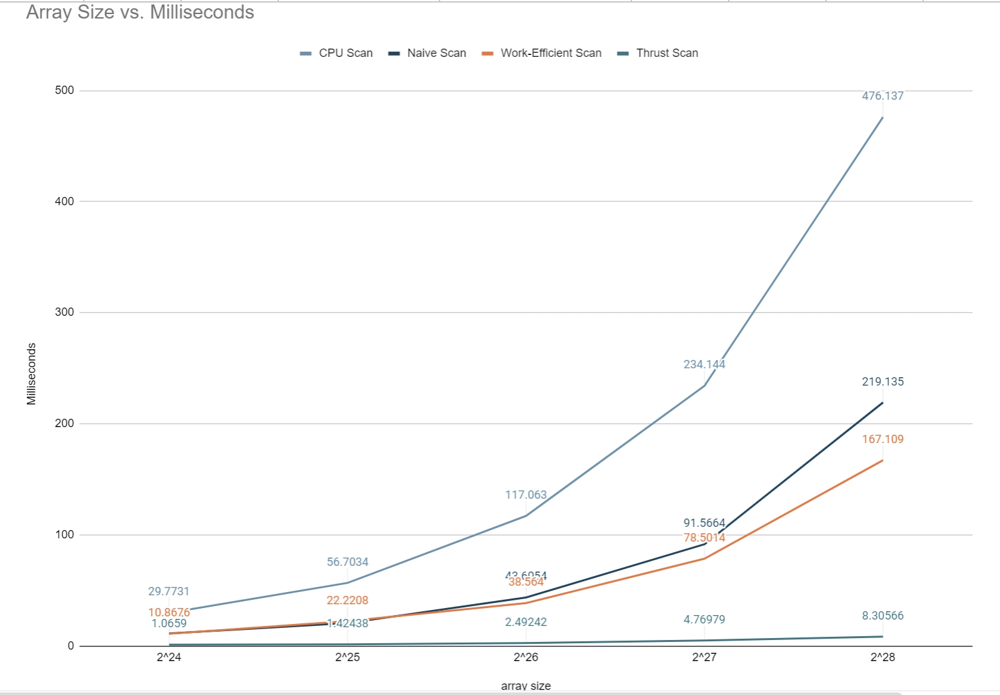
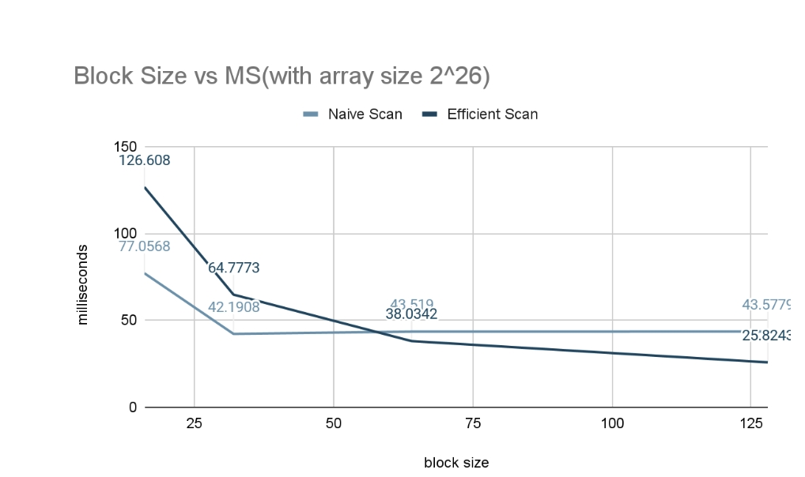
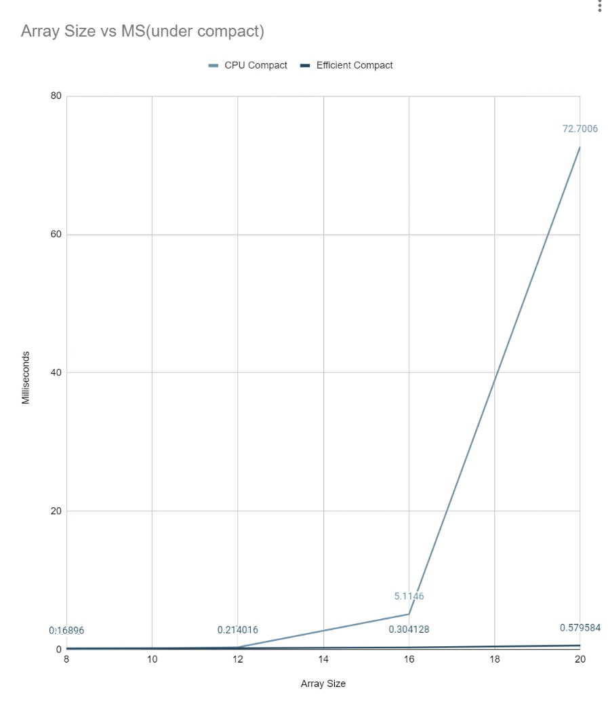

CUDA Stream Compaction
======================

**University of Pennsylvania, CIS 565: GPU Programming and Architecture, Project 2**

* Runjie Zhao
  * [Linkedin]: https://www.linkedin.com/in/runjie-zhao-sde/ [Website]: https://runjiezhao1.github.io/portfolio.github.io/
* Tested on: Windows 11, i9 185H 2500 Mhz, GTX 4080 Laptop GPU

### In this project, I have implemented following features:

* cpu scan
* naive scan in gpu
* efficient scan and compact in gpu
* thrust inclusive scan.
* map and scatter functions in common.h

### Graph and Correponding Analysis

At first, we change the input array size while making the size of block fixed and want to see how this influences the speed of calculation. Then, we get the following image. From the image, we can tell that as the size of the input array increases, the number of times we spent increases. The increasing rate from high to low is cpu scan, naive scan, work-efficient scan and thrust scan.

<br />

Secondly, we compare the block size with speed of calculation while making the size of input array fixed. From the graph, when we increase the size of block, the time spent on calculation decreases.

<br />

Finally, we compare the input array size with the speed of calculation under compact while making the size of input array fixed. From the graph, when we increase the size of array, cpu compact increases faster than work-efficient compact


<br />

### Output of test program

Here is the output of the program with array size 2^16 and block size 128

```
****************
** SCAN TESTS **
****************
    [  12   1   8  35  46  15  34  46  32  23  38  47  16 ...  34   0 ]
==== cpu scan, power-of-two ====
   elapsed time: 0.1235ms    (std::chrono Measured)
    [  12  13  21  56 102 117 151 197 229 252 290 337 353 ... 1610721 1610721 ]
==== cpu scan, non-power-of-two ====
   elapsed time: 0.1416ms    (std::chrono Measured)
    [  12  13  21  56 102 117 151 197 229 252 290 337 353 ... 1610614 1610638 ]
    passed
==== naive scan, power-of-two ====
   elapsed time: 0.6112ms    (CUDA Measured)
    passed
==== naive scan, non-power-of-two ====
   elapsed time: 0.140448ms    (CUDA Measured)
    passed
==== work-efficient scan, power-of-two ====
   elapsed time: 1.31958ms    (CUDA Measured)
    passed
==== work-efficient scan, non-power-of-two ====
   elapsed time: 0.293792ms    (CUDA Measured)
    passed
==== thrust scan, power-of-two ====
   elapsed time: 0.095232ms    (CUDA Measured)
    passed
==== thrust scan, non-power-of-two ====
   elapsed time: 0.111616ms    (CUDA Measured)
    passed

*****************************
** STREAM COMPACTION TESTS **
*****************************
    [   0   1   2   1   2   1   0   2   0   3   0   1   2 ...   2   0 ]
==== cpu compact without scan, power-of-two ====
   elapsed time: 0.2132ms    (std::chrono Measured)
    [   1   2   1   2   1   2   3   1   2   3   2   3   1 ...   1   2 ]
    passed
==== cpu compact without scan, non-power-of-two ====
   elapsed time: 0.21ms    (std::chrono Measured)
    [   1   2   1   2   1   2   3   1   2   3   2   3   1 ...   2   2 ]
    passed
==== cpu compact with scan ====
   elapsed time: 4.7239ms    (std::chrono Measured)
    [   1   2   1   2   1   2   3   1   2   3   2   3   1 ...   1   2 ]
    passed
==== work-efficient compact, power-of-two ====
   elapsed time: 0.688128ms    (CUDA Measured)
    passed
==== work-efficient compact, non-power-of-two ====
   elapsed time: 0.29184ms    (CUDA Measured)
    passed
```

Include analysis, etc. (Remember, this is public, so don't put
anything here that you don't want to share with the world.)

