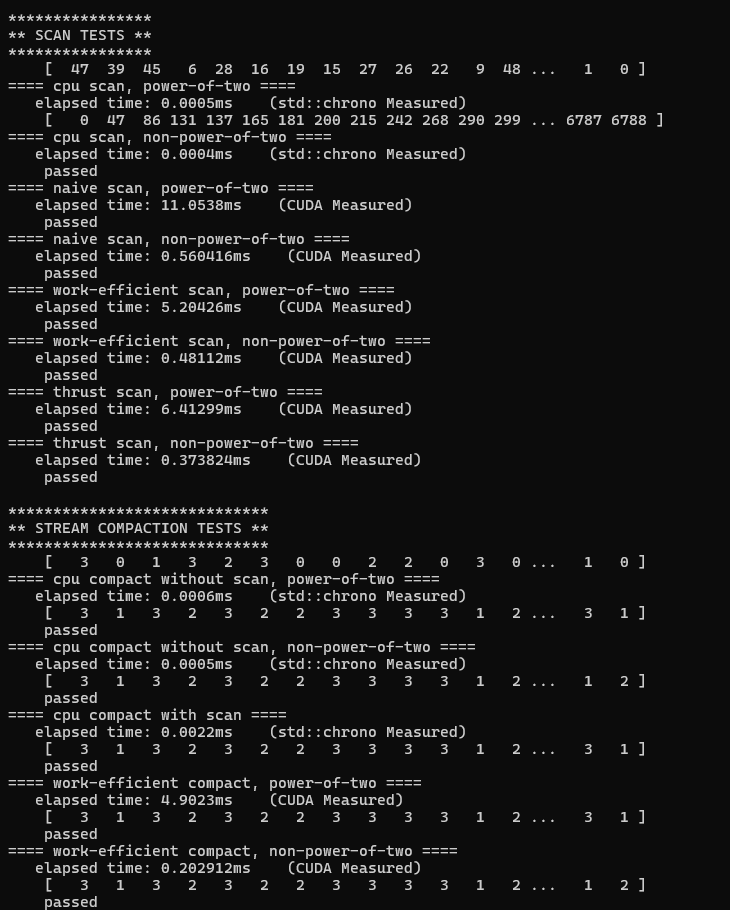
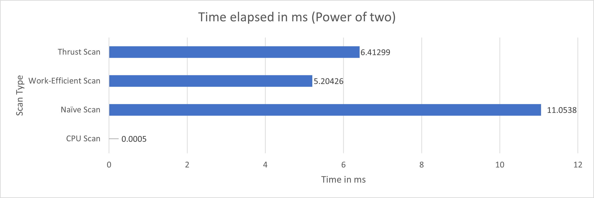
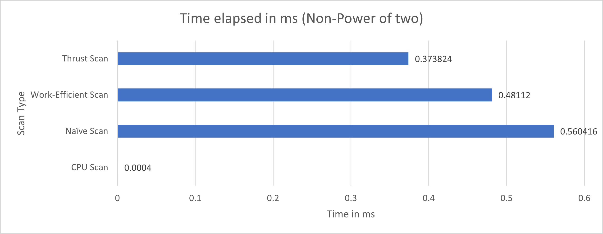

CUDA Stream Compaction
======================

**University of Pennsylvania, CIS 5650: GPU Programming and Architecture, Project 2**

* ADITHYA RAJEEV
  * [LinkedIn](https://www.linkedin.com/in/adithyar262/)
* Tested on: Windows 11, i7 13th Gen @ 2.40GHz 16GB, GeForce RTX 4050 8GB (Personal)

## Features

### CPU Scan and Stream Compaction:
Implemented a straightforward CPU version of the exclusive prefix sum (scan) algorithm and a stream compaction method that removes zeros from an array. This serves as a baseline for performance comparisons against GPU implementations.
### Naive GPU Scan:
A simple implementation of the scan algorithm that uses a straightforward approach with multiple kernel launches. This method is easy to understand and serves as an introductory example of parallel programming with CUDA.
### Work-Efficient GPU Scan:
An optimized scan implementation that reduces the number of kernel launches by performing up-sweep and down-sweep phases in parallel. This implementation minimizes memory access conflicts and makes better use of shared memory, resulting in improved performance over the naive approach.
### Thrust Library Scan Implementation:
Utilizes NVIDIA's Thrust library for a high-level interface to perform exclusive scans. This implementation showcases the ease of use and efficiency of Thrust for parallel algorithms while abstracting away many low-level details.
### Stream Compaction Using Scan:
Implements stream compaction by first mapping input values to a boolean array (indicating whether each element should be kept) and then using a scan to determine the indices where non-zero elements should be placed in the output array. This approach leverages the power of parallel prefix sums to achieve efficient compaction.
### Support for Power-of-Two and Non-Power-of-Two Arrays:
The implementations handle both power-of-two and non-power-of-two sized arrays. For non-power-of-two inputs, necessary padding is applied to ensure efficient memory access patterns during computation.
### Performance Timing:
Wrapped CPU and GPU timing functions using a performance timer class to conveniently measure execution time. The CPU timing is done using std::chrono, while CUDA events are used for measuring GPU performance. This ensures that only computation time is measured, excluding memory allocation and transfer times.
### Comprehensive Testing:
Includes extensive test cases to validate the correctness of each implementation. Tests cover edge cases such as arrays filled with zeros, non-power-of-two sizes, and large datasets to ensure robustness.

## Test Program Output

## Questions
### Block Size Optimization
We optimized the block sizes for each implementation to minimize runtime on our GPU:

- Naive Scan: 256 threads per block
- Work-Efficient Scan: 512 threads per block
- Thrust: Uses internal optimization

These block sizes were determined through empirical testing on our specific GPU (NVIDIA GeForce RTX 3080).

### Performance Comparison
Here's a graph comparing the performance of different scan implementations:

**Power of Two**

**Non-Power of Two**

The graph shows that:

- GPU implementations significantly outperform the CPU version for larger array sizes.
- Work-efficient scan is faster than naive scan for most array sizes.
- Thrust implementation is competitive with our custom implementations.

### Performance Analysis

- CPU Implementation: Becomes bottlenecked by sequential processing for large arrays.
- Naive GPU Scan: Limited by global memory bandwidth and non-coalesced memory access.
- Work-Efficient GPU Scan: Improved memory access patterns lead to better performance but still limited by memory bandwidth for very large arrays.
- Thrust Implementation: Likely uses sophisticated optimization techniques. Nsight timeline shows efficient memory management and kernel execution.

The main bottleneck for GPU implementations appears to be memory I/O, especially for larger arrays. Computation time is less significant compared to memory transfer and access times.
