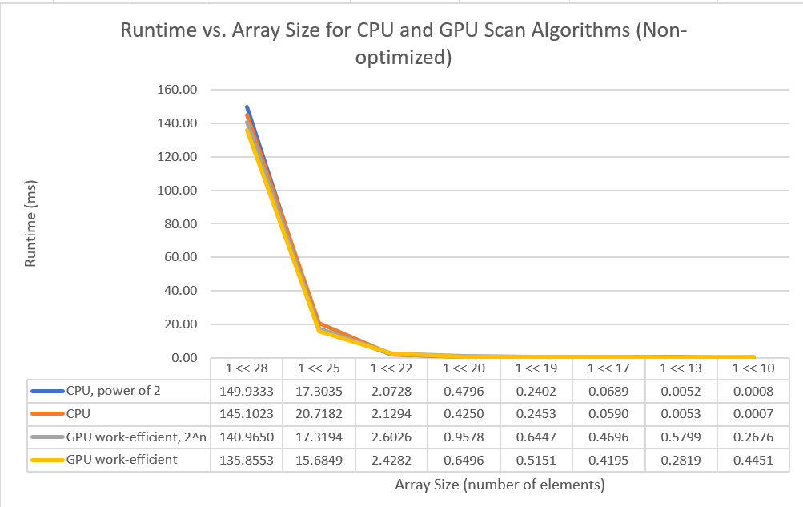
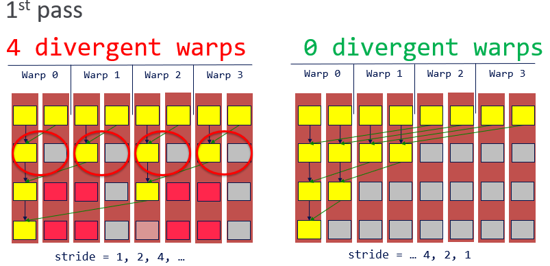
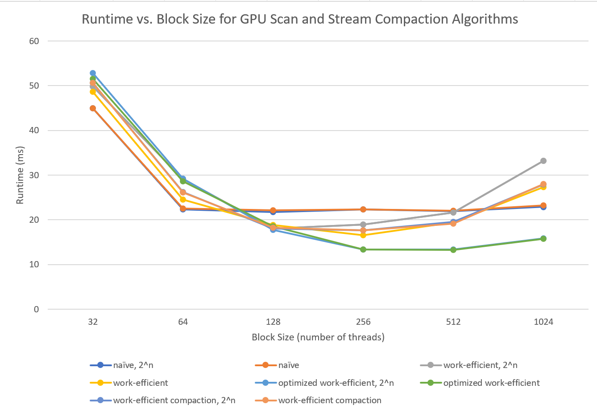

CUDA Stream Compaction
======================

**University of Pennsylvania, CIS 565: GPU Programming and Architecture, Project 2**

* Linda Zhu
* Tested on: Windows 11, i7-12800H @ 2.40GHz 16GB, NVIDIA GeForce RTX 3070 Ti (Personal Laptop)

## Results
Test case configuration: block size = 512, array size = 2<sup>25</sup>
I added 2 corner cases for my optimized GPU efficient scan in the printouts with the label "optimized work-efficient scan ...".

```
****************
** SCAN TESTS **
****************
    [  39  25  44  23  36  32  15  35  41  19   6  20  21 ...   8   0 ]
==== cpu scan, power-of-two ====
   elapsed time: 17.503ms    (std::chrono Measured)
    [   0  39  64 108 131 167 199 214 249 290 309 315 335 ... 821771882 821771890 ]
==== cpu scan, non-power-of-two ====
   elapsed time: 20.5698ms    (std::chrono Measured)
    [   0  39  64 108 131 167 199 214 249 290 309 315 335 ... 821771783 821771828 ]
    passed
==== naive scan, power-of-two ====
   elapsed time: 22.0729ms    (CUDA Measured)
    passed
==== naive scan, non-power-of-two ====
   elapsed time: 22.8742ms    (CUDA Measured)
    passed
==== work-efficient scan, power-of-two ====
   elapsed time: 21.3687ms    (CUDA Measured)
    passed
==== work-efficient scan, non-power-of-two ====
   elapsed time: 17.9821ms    (CUDA Measured)
    passed
==== optimized work-efficient scan, power-of-two ====
   elapsed time: 13.8136ms    (CUDA Measured)
    passed
==== optimized work-efficient scan, non-power-of-two ====
   elapsed time: 13.4661ms    (CUDA Measured)
    passed
==== thrust scan, power-of-two ====
   elapsed time: 1.61328ms    (CUDA Measured)
    passed
==== thrust scan, non-power-of-two ====
   elapsed time: 1.93814ms    (CUDA Measured)
    passed


*****************************
** STREAM COMPACTION TESTS **
*****************************
    [   0   1   1   0   1   1   0   0   3   1   0   0   0 ...   3   0 ]
==== cpu compact without scan, power-of-two ====
   elapsed time: 68.2749ms    (std::chrono Measured)
    [   1   1   1   1   3   1   2   3   2   3   2   2   1 ...   1   3 ]
    passed
==== cpu compact without scan, non-power-of-two ====
   elapsed time: 68.3939ms    (std::chrono Measured)
    [   1   1   1   1   3   1   2   3   2   3   2   2   1 ...   3   2 ]
    passed
==== cpu compact with scan ====
   elapsed time: 117.265ms    (std::chrono Measured)
    [   1   1   1   1   3   1   2   3   2   3   2   2   1 ...   1   3 ]
    passed
==== work-efficient compact, power-of-two ====
   elapsed time: 19.442ms    (CUDA Measured)
    passed
==== work-efficient compact, non-power-of-two ====
   elapsed time: 18.6701ms    (CUDA Measured)
    passed
```

## Performance Analysis

### 1. Preliminary runs of non-optimized CPU vs GPU scan implementations
Test case configuration: default block size = 128, array size = [1024, 2<sup>28</sup>]. 3 runs for each array size and plotting using their averages.



*Figure 1: Runtime vs Array Size for CPU and GPU Efficient Scan*

If just implementing the GPU scan version following the described algorithm above, my "efficient" GPU scan is actually not that efficient -- it is even slower than the cpu approach. From the graph we can see that only when the data size is larger than `~5K` (2<sup>22</sup>) did the GPU approach start to show a slight advantage over CPU scan in terms of the runtime. Nevertheless, the small advantage can be trivial.

There can be multiple reasons behind this phenomenon. A major one relates to warp partitioning. In the Up-sweep and Down-sweep phases of the original GPU work-efficient scan, the way we write in the data, i.e. dividing in half/ doubling the number of active threads through array indexing, causes warp divergence (Figure 2). The occupancy is high (active warps / maximum warps available) yet not all threads in each warp are performing some work. To optimize this approach, we partition threads based on consecutive increasing `threadIdx` such that we minimize divergent branches and retire unused warps early. Retired warps can then be scheduled to run something else, thus better hardware utilization and hiding latency.



*Figure 2: Left is the original parallel reduction (up-sweep) algorithm. Right is a reworked algorithm. In the 1st pass, the original method leads to 4 divergent warps while the tweaked implementation has no divergence. Instead, the reworked method retires 2 warps early. For easy understanding and illustration purposes, we assume warp size = 2 here.*

Instead of doing the indexing below during up-sweep (similar for down-sweep),

```
for (int stride = 1; stride < blockDim.x; stride *= 2) {
  if (t % (2 * stride) == 0)
	  partialSum[t] += partialSum[t + stride];
}
// stride = 1, 2, 4, ...
```
we can change the condition to determine which thread we should write or not like this: 
```
for (int stride = blockDim.x / 2; stride > 0; stride /= 2) {
  if (t < stride)
    partialSum[t] += partialSum[t + stride];
}
// stride = ... 4, 2, 1
```

In addition, we no longer need to check `modulo %`, which is an expensive operation that can take 100s of cycle/ up to 20 instructions on GPU. Less-than is considerably faster. **Theoretically speaking**, by changing some index calculation hacks we can then achieve a significant performance boost. **However, my attempt to optimize indexing (for part 5 extra credit) seems failed because my reworked implementation is even slower than the non-optimized (tested with data size = [2<sup>17</sup>, 2<sup>28</sup>]). Due to time constraint, I couldn't confirm why but it is likely that I did not do my math correctly. Therefore, for the rest of the performance analysis although I have included optimized GPU efficient implementation, I will not put much weight on it because of accuracy.**


### 2. Block size optimization for minimal runtime

Test case configuration: power-of-two array size = **2<sup>25</sup> (33,554,432)**, non-power-of-tow array size = (array size - 3), 3 runs for each array size and plotting using their averages.



*Figure 3: Runtime vs Block Size (multiples of 32) for GPU Efficient Scan and Stream Compaction*

For GPU scan, the optimal block size was **128** for the naive, **256** for unoptimized work-efficient, and **512** (teeny-tiny faster than 256) for optimized work-efficient implementations. For GPU stream compaction, it was also at block size = **256** that the non-optimized work-efficient algorithm has the best performance. It is worth noting that from increasing block size past 256 (512 for optimized efficient scan), there seems no performance gain and in fact, the application starts to slow down quite much. This is well-founded because when too big a block size leads to a lower occupancy of the multiprocessor, it is a BAD approach. Remeber increasing number of threads also heavily affects throughput and available resource, e.g. number of registers each thread will use. 

