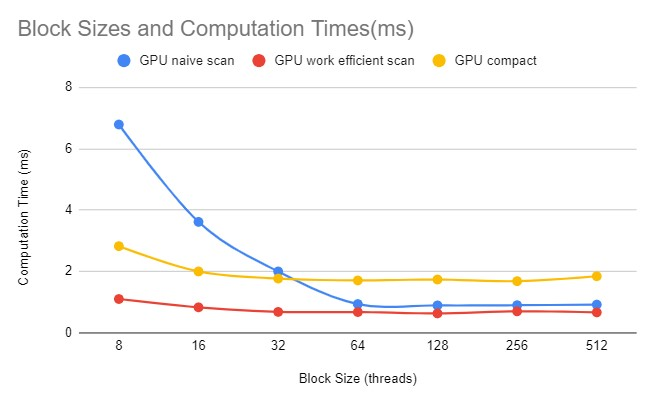
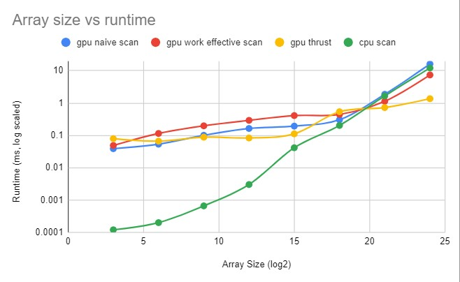

CUDA Stream Compaction
======================

**University of Pennsylvania, CIS 565: GPU Programming and Architecture, Project 2**

* Helena Zhang
* Tested on: Windows 11, i7-10750 @ 2.6GHz 16GB, Geforce RTX 2060 6GB

### Performance analysis

First up, I compared the runtimes of different GPU implementations (naive scan, work efficient scan, and stream compaction) on an array size of 2^20 and took the average of three runs each to find the optimal block size on my GPU:



Although the runtimes past 64 threads per block were similar, 64 threads per block narrowly beat out the larger blocksizes.

Next, using the optimal blocksize of 64, I compared the runtimes of the base CPU exclusive scan, and the three GPU scan implementations: naive, work efficient, and thrust. I ran each implementation on each array size 5 times and took the average to account for any potential outliers. 



The CPU runtime scaled linearly with the increase in array size, so the trendline appeared to be linear on a chart with log-scaled runtime on log-scaled array size. The GPU implementation all ran slower than the CPU implementation on small array sizes, and only the naive implementation showed a large spike in runtime at the end. The work efficient implementation runtime increased slowly towards the end, and the thrust runtime remained the fastest at the end. 

In regards to the optimized work efficient GPU implementation, I managed to minimize the number of blocks needed at small numbers of threads. During the upstream / downstream summation, there were only a few additions done at the top levels of the tree. Instead of taking the 2^d th thread to run in the kernel, I scaled each thread with a factor of 2^(d-1), so that only k threads are needed. In addition, instead of launching approximately N / blocksize blocks at each level of summation, I launched only **1 << (ilogceil(N) - d - log(blocksize) - 1)** blocks, which is significantly fewer blocks. For any d, only every other 2^d numbers will get incremented, meaning there should be at most **1 << (ilogceil(N) - d - 1)** threads. Since the max number of threads in each block is **blocksize**, we will scale down the number of threads by a factor of that, leaving each level only launching **1 << (ilogceil(N) - d - log(blocksize) - 1)** blocks, and every thread in those blocks are used. 

For the fastest implementation, **thrust::exclusive_scan**, I've observed its execution in Nsight:


Assuming **cudeEventRecord** are the GPU timer operations, there are 5 operations within exclusive scan: **cudaMalloc**, **DeviceScanInitKernel**, **DeviceScanKernel**, **cudaStreamSynchronize**, **cudaFree**. Since **idata** was copied into device memory prior to starting the GPU timer, **cudaMalloc** was likely an operation to store temporary data within the operation since that memory was freed at the end of this function. The two scan operations were likely performing the addition, and they took the least time, meaning the **cudaMalloc** most likely allocated some shared memory for these operations to execute quickly. 

Based on the increased runtimes of all the implementations, a large bottleneck seems to be caused by excessive yet unproductive blocks, hence reducing and packing blocks enhanced the runtime. 

Finally, an overview of all the runtimes: 
```

****************
** SCAN TESTS **
****************
    [   1   6   1  30  17   6  13  30  37   3  40  40  21 ...  29  12 ]
==== cpu scan, power-of-two ====
   elapsed time: 14.2981ms    (std::chrono Measured)
    [   0   1   7   8  38  55  61  74 104 141 144 184 224 ... 410838503 410838532 ]
==== cpu scan, non-power-of-two ====
   elapsed time: 13.4163ms    (std::chrono Measured)
    [   0   1   7   8  38  55  61  74 104 141 144 184 224 ... 410838422 410838469 ]
    passed
==== naive scan, power-of-two ====
   elapsed time: 16.1973ms    (CUDA Measured)
    [   0   1   7   8  38  55  61  74 104 141 144 184 224 ... 410838503 410838532 ]
    passed
==== naive scan, non-power-of-two ====
   elapsed time: 16.1932ms    (CUDA Measured)
    [   0   1   7   8  38  55  61  74 104 141 144 184 224 ...   0   0 ]
    passed
==== work-efficient scan, power-of-two ====
   elapsed time: 7.42416ms    (CUDA Measured)
    [   0   1   7   8  38  55  61  74 104 141 144 184 224 ... 410838503 410838532 ]
    passed
==== work-efficient scan, non-power-of-two ====
   elapsed time: 7.27318ms    (CUDA Measured)
    [   0   1   7   8  38  55  61  74 104 141 144 184 224 ... 410838422 410838469 ]
    passed
==== thrust scan, power-of-two ====
   elapsed time: 1.18771ms    (CUDA Measured)
    [   0   1   7   8  38  55  61  74 104 141 144 184 224 ... 410838503 410838532 ]
    passed
==== thrust scan, non-power-of-two ====
   elapsed time: 1.35674ms    (CUDA Measured)
    [   0   1   7   8  38  55  61  74 104 141 144 184 224 ... 410838422 410838469 ]
    passed

*****************************
** STREAM COMPACTION TESTS **
*****************************
    [   0   0   3   1   2   3   0   1   2   1   0   0   0 ...   2   2 ]
==== cpu compact without scan, power-of-two ====
   elapsed time: 36.814ms    (std::chrono Measured)
    [   3   1   2   3   1   2   1   2   2   3   2   2   3 ...   2   2 ]
    passed
==== cpu compact without scan, non-power-of-two ====
   elapsed time: 37.0357ms    (std::chrono Measured)
    [   3   1   2   3   1   2   1   2   2   3   2   2   3 ...   1   2 ]
    passed
==== cpu compact with scan ====
   elapsed time: 77.7415ms    (std::chrono Measured)
    [   3   1   2   3   1   2   1   2   2   3   2   2   3 ...   2   2 ]
    passed
==== work-efficient compact, power-of-two ====
   elapsed time: 14.5762ms    (CUDA Measured)
    [   3   1   2   3   1   2   1   2   2   3   2   2   3 ...   2   2 ]
    passed
==== work-efficient compact, non-power-of-two ====
   elapsed time: 14.472ms    (CUDA Measured)
    [   3   1   2   3   1   2   1   2   2   3   2   2   3 ...   1   2 ]
    passed
```
