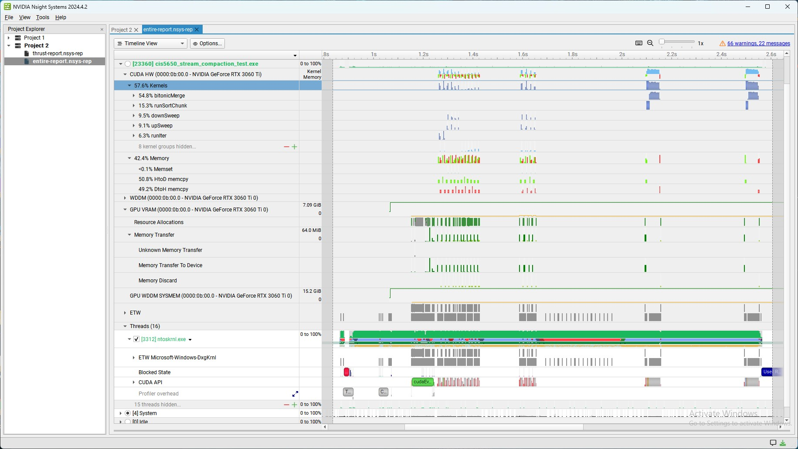
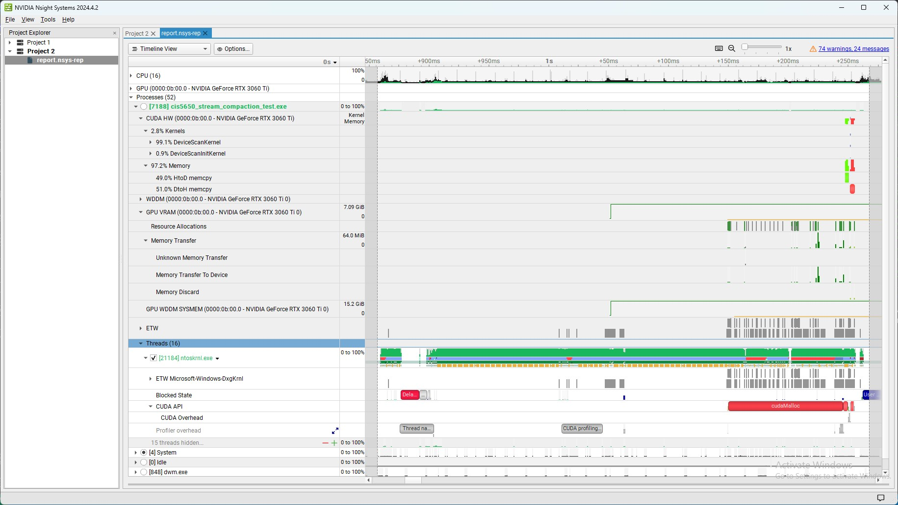

CUDA Stream Compaction
======================

**University of Pennsylvania, CIS 565: GPU Programming and Architecture, Project 2 - Stream Compaction**

- Jordan Hochman
  - [LinkedIn](https://www.linkedin.com/in/jhochman24), [Personal Website](https://jordanh.xyz), [GitHub](https://github.com/JHawk0224)
- Tested on: Windows 11, Ryzen 7 5800 @ 3.4GHz 32GB, GeForce RTX 3060 Ti 8GB (Compute Capability: 8.6)

## Welcome to my Stream Compaction Project!



This project investigates many different implementations of the scan and compact algorithms, along with optimizations. Additionally, it also implements [Radix sort](https://en.wikipedia.org/wiki/Radix_sort).

First I will explain what exactly scan and compact do, and then I'll walk through the different implementations of them. They both act on an array.

Scan computes the partial sums up to each element, and stores these partial sums either in another array or modifies the original in place. Additionally, there are two types of scans, inclusive and exclusive. Exclusive always starts with a 0, and the partial sums are only of all the elements strictly before the current index, while inclusive scan includes the current index. For example, for the list [4, 7, 12], the inclusive scan would be [4, 11, 23] while the exclusive scan would be [0, 4, 11].

Compact takes in an array and returns an array containing only the elements which meet a certain criteria, in the same order. For this project, that criteria will always be that it's non-zero. For example, Compacting [5, 2, 8, 3, 11, 9] where we only want the even elements would give the array [2, 8].

Now why do we care about these? Well at first, you might be tempted to implement each one as a simple list that iterates through the given array. While this works, and is serially the best we can do, we don't need to run them serially! By parallelizing these algorithms, we can make them run much faster. This is something that we want to do because these two algorithms occur very frequently in other areas.

This project implements scan and compact using many different methods, some on the CPU and some on the GPU. I will break down how each implementation works below, but feel free to check out `INSTRUCTION.md` for more details about scan and compact.

## Running the Implementations

If you are interested in running these implementations and the test cases for them, you may first want to ensure your computer is set up to do so. To do this, you can follow the instructions in [Project 0](https://github.com/JHawk0224/CIS5650-Project0-Getting-Started/blob/main/INSTRUCTION.md). After that, you may want to read through the [instructions](INSTRUCTION.md) for this project.

Additionally, you can tweak parameters found in `main.cpp` to change the program settings:

- `SIZE` - a power-of-2 size of array to test on
- `NPOT` - a non-power-of-2 size of array to test on
- `SORTMAXVAL` - the maximum possible value generated in the list for the sort test cases (only affects sorting!)

You may also be interested in changing `blockSize` in each of the following files: `naive.cu`, `efficient.cu`, `efficient-thread-optimized.cu`, and `radix-sort.cu`. This value affects the number of threads per block for each of these versions which are implemented on the GPU.

Note that before running the performance analysis, the block sizes were optimized for each implementation to give the best results, but feel free to change them. I explain more in depth how this was done in the corresponding section below. I will now walk through the different implementations of scan.

## Scan Implementations

### CPU Scan

In this approach, the most simple solution one might think of is implemented. On the CPU, the we iterate through the array serially, adding each element to a running total and writing that to the output. As one might guess, this has O(n) time as it runs linearly in the length of the array.

This can be very inefficient especially for long arrays, and it makes much more sense to somehow parallelize this. In the performance analysis below, we use this method as the baseline to compare everything to.

### Naive Scan

This approach involves the first version of scan one might think of when trying to parallelize it. It works by running passes over the array.

In the first pass, elements 0 and 1 are added and stored in index 1, elements 1 and 2 are added and stored in index 2, and so on until every neighboring pair is added. Note that this is all done in parallel with one thread for every pair, so it should run quickly. In the second pass, elements 0 and 2 are added and stored in 2, 1 and 3 are added and stored in 3, and so on for every gap of 2 (again with one thread per pair). In each subsequent pass, this same thing happens but for gaps that are powers of 2 (so the third pass would be for elements with a gap of 4).

At the end of this process, we end up with an inclusive scan of the original list (which we then can convert to an exclusive one). This works because for any given element of the array, every preceding element was added to it at some point in one of the prior passes. This is exactly what we want in a scan.

Since passes each run in parallel, we can consider them to run in constant time. Then the passes must be run serially after each other, and there are log(n) passes. This gives a runtime of O(log(n)), ignoring things like memory accesses and the like on the GPU.

For more details about this implementation, see `INSTRUCTION.md`.

### Work-Efficient Scan

In this approach, a slightly more convoluted algorithm is performed, but we see it actually runs faster than the naive implementation. This Work-Efficient Scan is composed of two stages, the "upsweep" (parallel reduction) and the "downsweep."

In the upsweep phase, it runs log(n) passes. The first pass adds elements 0 and 1 and stores in index 1, elements 2 and 3 to store in index 3, elements 4 and 5 to store in index 5, and so on (with one thread for each pair again). The second pass now does the same exact thing but this time only looking at the cells which were set on the previous iteration. For example, it now takes cells 1 and 3 and adds them and stores in 3, elements 5 and 7 and stores them in 7, and so on.

Each subsequent pass does the same thing but with gaps that become larger and larger, so eventually the last pass stores the sum of the middle element and the last element into the last index. At the end, we see that this last index will contain the sum of the list. Remember, each pass runs in parallel with one thread per pair.

Before the second phase is run, the last element is set to 0 (explained later).

In the second, downsweep phase, the elements are combined backwards. The first pass only acts on the middle and last element. The two are added and stored in the last index, and the middle index is set to the original final value (which was 0). In the second pass, this same operation is done but this time on two different pairs, the first pair being the first-quarter element and the middle element, and the second being the third-quarter element and the last one.

Each subsequent pass does the same thing but working on twice the number of elements of the previous pass, and at the end of this process, the array will be left as an exclusive scan of the original version.

This works because first of all, the 0 that is always first in an exclusive scan comes from setting the last element to 0 as mentioned above, which was then swapped all the way to the left of the array. Then, for every other element of the array, each preceding block of elements was added to it in some pass of the downsweep, where each block's sum was calculated in the upsweep.

For more details about this implementation, see `INSTRUCTION.md`.

Now even though this method has two separate phases, note the amount of work that's done in each phase. In this version, the upsweep stage 1 has n/2 operations, the next pase n/4, and so on down to 1. Adding these up gives O(n) operations _total_ for the entire upsweep. The story is the same for the downsweep. Thus we would expect this algorithm to actually run pretty quickly.

### Thread Optimized Work-Efficient Scan (Part 5 EC)

Now after implementing the Work-Efficient Scan, one might run into an issue. That issue is that the runtime didn't actually improve at all. You might get an "efficient" gpu scan that is actually not that efficient (being slower than the cpu approach).

The reason for this is that if you implement this method without thought, you might end up with something like this for the upsweep phase (and very similar for the downsweep)

```cpp
// on the host (CPU) side
for (int d = 0; d < numIters; d++) {
  upSweep<<<numBlocks, blockSize>>>(n, d, dev_scanResult);
}

// on the kernel (GPU) side
__global__ void upSweep(int n, int d, int *data) {
  int index = threadIdx.x + (blockIdx.x * blockDim.x);
  // ...
  if (index % (1 << (d + 1)) == 0) {
    data[index + (1 << (d + 1)) - 1] += data[index + (1 << d) - 1];
  }
}
```

The important thing to note here is the `blockSize` and `numBlocks`. In the actual algorithm, each pass requires less and less work, ranging from only needing 1 thread to up to the array size over 2. Thus it doesn't make sense to allocate the same number of threads and blocks for every single call of upsweep and downsweep.

The issue with this original implementation is that we are creating TONS of threads, most of which are doing nothing. Note the `if (index % pow2d1 == 0)` statement in the kernel. Most of the threads aren't actually doing anything, because VERY few of them pass this if check. Even if they do nothing, it is still a very big waste of GPU resources.

Therefore, a truly optimized implementation of the work-efficient scan would only create the necessary amount of threads for each invocation of upsweep and downsweep. Then the indexing on the kernel side might need to be different (e.g. multiply them by the correct multiples so they line up), but we can spawn many fewer threads.

Therefore, this implementation fixes this issue. The Thread Optimized Work-Efficient Scan uses only the required number of threads at each stage, so we don't starve the GPU of resources. This is implemented in the `efficient-thread-optimized.cu` file (and the corresponding header file). Note that I did add some test cases to compare the performance, and this will be analyzed later.

To give a comparison, the upsweep stage now looks something like

```cpp
int threadsNeeded = 1 << numIters;
for (int d = 0; d < numIters; d++) {
  threadsNeeded >>= 1;
  int numBlocks = (threadsNeeded + blockSize - 1) / blockSize;
  upSweep<<<numBlocks, blockSize>>>(nPowOf2, d, dev_data);
}
```

It outputs the identical thing that the normal Work-Efficient Scan does, it's just implemented slightly differently. You can call it extremely similarly to how Work-Efficient Scan is called, like so:

```cpp
StreamCompaction::EfficientThreadOptimized::scan(SIZE, out, in);
```

### Thrust Scan

This implementation is just a wrapper around the `thrust` library's implementation of scan. We will use this as a benchmark for comparison later in the performance analysis.

How does this scan implementation work though? Well we can look at the output from [Nsight Systems](https://docs.nvidia.com/nsight-systems/UserGuide/index.html) generated from running it:



If you would like to see the full generated report, it is included [here](thrust-report.nsys-rep) as `thrust-report.nsys-rep`.

Looking at this report, we can see that most of the kernel time is spent in `DeviceScanKernel`. The approximately equal amounts of host to device and device to host memory transfers are from the setup to run the `thrust` scan. We can thus infer that the `thrust` scan implementation uses the GPU to run it efficiently. Further analysis of this is possible by looking at the [actual implementation](https://github.com/NVIDIA/thrust) of the function.

### Memory Optimized Naive Scan (Part 6 EC 2)

Now all of the methods we've previously discussed on the GPU have a decent flaw. That is that they rely on lots global memory reads and writes. Just like in any GPU program, it is extremely important to minimize global memory access as this is extremely slow. The usual way to do this is to use shared memory instead of global memory.

The way this works is that we first split up the target array into chunks (such that each chunk will fit into shared memory). Then we can have many threads populate the shared memory from the input in parallel, and then we can run our algorithm on shared memory. Running it on shared memory will be much quicker since it doesn't need to access global memory. Finally, at the end, the threads can take care of writing back the shared memory to global memory.

The difficulty with this is actually splitting up the array into chunks. After we split up the array into chunks, that's all well and good. However, when we run our scan algorithm on the chunk, it will only scan that chunk of course! Thus if we run this in parallel, we will be left with an array where each individual chunk had scan run on it, but not the entire array as a whole.

Luckily, this problem isn't too difficult to remedy. If we store the total sums for each chunk of the original array, we can then run an exclusive scan on these total sums. Then we can take the result of this scan, and add each value in it to the entire chunk it corresponds to in the chunk-scanned array. This works because in the chunk-scanned array, each chunk was missing the total values from everything before it, and this value is exactly what's provided by the new scan.

Thus what's needed to implement this algorithm is to smartly choose the block size, and then partition the array over each block and run the scan in each block. Then get the sums of each block, run scan on them, and re-add these sums back in.

This is exactly what the Memory Optimized Naive Scan does. It takes the original Naive Scan, but it replaces the global memory accesses with this new version using shared memory.

This function is implemented in the `naive.cu` file. It outputs the identical thing that the normal Naive Scan method does, it's just implemented slightly differently. You can call it in the same way you would with the normal scan but with

```cpp
StreamCompaction::Naive::scanShared(SIZE, out, in);
```

Note that I did add some test cases to compare the performance, and this will be analyzed later.

### Memory Optimized Work-Efficient Scan (Part 6 EC 2)

Now just like how we could implement a memory-optimized version of the Naive Scan, we can also do the same thing with the Work-Efficient Scan! That is exactly what this implementation does, it takes the Work-Efficient Scan and replaces the global memory accesses with shared memory accesses, in the same way discussed previously.

This function is implemented in the `efficient.cu` file. It outputs the identical thing that the normal Work-Efficient Scan method does, it's just implemented slightly differently. You can call it in the same way you would with the normal scan but with

```cpp
StreamCompaction::Efficient::scanShared(SIZE, out, in);
```

Note that I did add some test cases to compare the performance, and this will be analyzed later.

Now another thing that's interesting to discuss is bank conflicts. While I did not analyze them for this project, it is something worth noting. We can further optimize the memory access on the GPU by changing the access pattern to avoid bank conflicts. You can find more details about bank conflicts and avoiding them [here](https://developer.nvidia.com/gpugems/gpugems3/part-vi-gpu-computing/chapter-39-parallel-prefix-sum-scan-cuda), and this is something I would like to look into in the future.

## Compact Implementations

### CPU Compact without Scan

In this implementation of compact, it runs on the CPU. This method does not use scan, and all it does is iterate through the original array checking the condition, if it's met, then the value is added to the output array at the end. This just repeats on loop until the entire array is calculated (the end of the output is just a pointer that's increased each time).

As you can imagine, this can be pretty inefficient as it runs in linear time with the length of the array. It has to iterate through the entire original array, but we can parallelize this.

### CPU Compact with Scan

This implementation of compact also runs on the CPU. However, it uses scan and then a function called scatter to compute the output. Here, scan is the normal CPU Scan discussed above.

It works by first taking the input and calculating an array of booleans that are 1 if the element should be in the output and otherwise 0. Then, it runs scan on this array. This output gives us an array of which index the element should go in for the output array, if it actually belongs there. Then the scatter function runs which does just this. It iterates through the original array, and if the boolean flag is true, it places it in the output array at the location specified by the scan.

For more details about this algorithm, see `INSTRUCTION.md`

### Compact with Work-Efficient Scan

This implementation does the same thing as CPU Compact with Scan, except that it uses the GPU and the Work-Efficient Scan method previously discussed. Here, the Work-Efficient Scan runs on the GPU, and scatter was also implemented on the GPU for this function.

### Compact with Thread Optimized Work-Efficient Scan

This implementation does the same thing as the previous two compact implementations, except that it uses the GPU and the Thread Optimized Work-Efficient Scan method previously discussed. Here, scatter was also implemented on the GPU for this function.

Note that I did add some test cases to compare the performance of this method with the other ones. This is implemented in the `efficient-thread-optimized.cu` file (and the corresponding header file). 

It outputs the identical thing that the normal Compact with Work-Efficient Scan does, it's just implemented slightly differently. You can call it extremely similarly the other one is called, like so:

```cpp
int count = StreamCompaction::EfficientThreadOptimized::compact(SIZE, out, in);
```

## Radix Sort (Part 6 EC 1)

I also implemented the [Radix Sort](https://en.wikipedia.org/wiki/Radix_sort) function. This function sorts an array by going through it bit by bit (pun intended).

It takes the input array where each element is represented in bits, and first looks at the least-significant (right-most) bit. It partitions the input into two halves, where the first half is all the elements where that bit was a 0 and the second half is the elements where that bit was a 1 (note that it doesn't necessarily have to be exactly half and half if the balance of elements is uneven). Within these two halves, the order is preserved.

Then, it runs a second iteration but this time looking at the second bit, and moving elements in the same exact way. It then continues to do this same operation but for each bit, and at the end, we are left with a sorted array. To see more details on why this algorithm works, check out the [link above](https://en.wikipedia.org/wiki/Radix_sort) and the `INSTRUCTION.md` file.

Now note that in each iteration, we can run the operation in parallel to speed it up on the GPU. However, exactly like what we had to do with the shared-memory optimizations earlier, we need to split up the input array into chunks and run Radix sort on each chunk. Finally, after each chunk is sorted, we can merge them back together.

This merging was done with a parallel bitonic merge, and we are then left with the output. The actual operation in each iteration can be implemented with a combination of a scan and a specialized scatter, and for this implementation we used the Memory Optimized Work-Efficient Scan for Radix Sort.

Now note that I did add some test cases check that my Radix Sort was functioning correctly, and to check it's performance. To do this, I also implemented a quick CPU Sort which is just a wrapper around `std::sort`. The test case compares the Radix Sort with the output of the CPU Sort.

The Radix Sort function, along with `bitonicMerge`, is implemented in the `radix-sort.cu` file (and the corresponding header file). It outputs the sorted version of the input array, and it does not work in place.

There are two methods of calling it. This is because Radix Sort depends on the number of bits of the data it stores. Thus for default integers in C++ (which are 32 bits), it will run 32 iterations. However, most of the time we know our data is capped at some value. Thus if we know this maximum cap, we can limit the number of iterations to the ceiling of the log of this maximum value. Thus we have two ways to call Radix Sort, one without knowing the limit, and one with. Here are the two methods:

```cpp
StreamCompaction::RadixSort::sort(SIZE, out, in);
StreamCompaction::RadixSort::sort(SIZE, SORTMAXVAL, out, in);
```

The CPU Sort was implemented in the `cpu.cu` file and can be called with:

```cpp
StreamCompaction::CPU::sort(SIZE, out, in);
```

Here is an example of how to run the Radix Sort:

```cpp
int in[7] = {3, 12, 7, 5, 10, 12, 8};
int out[7];

// without knowing maximum, will perform 32 iterations
StreamCompaction::RadixSort::sort(7, out, in);
printArray(7, out, true);
// [3, 5, 7, 8, 10, 12, 12]

// knowing maximum, will perform ceil(log_2(12)) iterations
StreamCompaction::RadixSort::sort(7, 12, out, in);
printArray(7, out, true);
// [3, 5, 7, 8, 10, 12, 12]
```

## Scan Performance Analysis

discuss how it was performed (average of 3)
discuss using timers from readme
discuss how memcpy and other operations weren't included
when include graphs mention lower is better

First I will discuss the measurement of performance used for the analysis below. They are all comparing FPS (frames per second), where the time is measured by the GLFW timer. The numbers given below correspond to the average FPS over the first 10 seconds of running the program (averaged over 3 tries due to the random generation of boid positions). To find the average FPS over the first 10 seconds, first the number of frames is stored (which is how many iterations of the loop finished), divided by the total time it took to compute all those frames (so not quite 10 but very close, as this should be the total time for every frame to have been computed).

For the below comparisons, they were all done in Release mode. The specs of the computer they were run on is mentioned at the very top. All of the raw data for these runs can be found in the `execution-data.xlsx` file [here](execution-data.xlsx), although screenshots are provided throughout for convenience.

Answer Q2 analysis part
Answer Q3

### Optimizing Block Sizes

Answer Q1

### Appendix

Here is the out from running the tests found in `main.cpp`. Note that I did add my own test cases for many of the extra methods I implemented. These include: ... mention exact tests.

ALSO INCLUDE entire-report
INCLUDE IN PR extra tests implemented, ec features, changes to cmakelists

- description of project including list of features
- performance analysis
- extra credits documented, with performance comparison, show how it works (show how radix sort is called and output)
- paste output and explicitly mention I included my own tests
