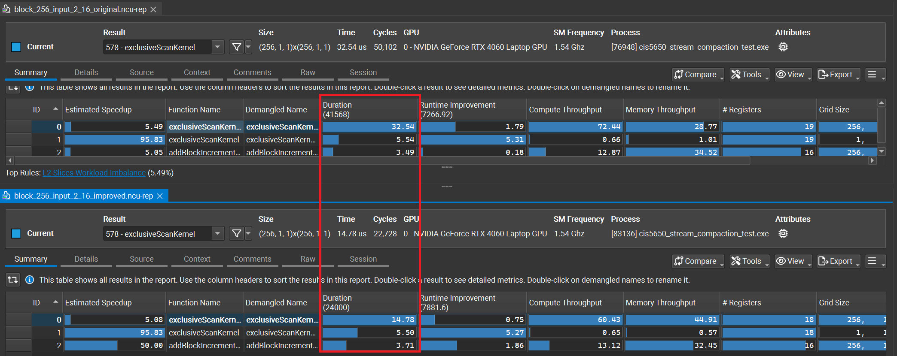
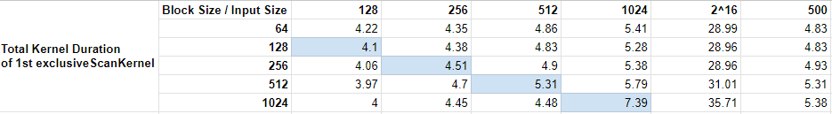
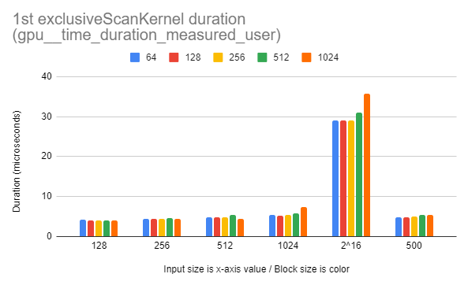

CUDA Stream Compaction
======================

**University of Pennsylvania, CIS 565: GPU Programming and Architecture, Project 2**

* CARLOS LOPEZ GARCES
  * [LinkedIn](https://www.linkedin.com/in/clopezgarces/)
  * [Personal website](https://carlos-lopez-garces.github.io/)
* Tested on: Windows 11, 13th Gen Intel(R) Core(TM) i9-13900HX @ 2.20 GHz, RAM 32GB, NVIDIA GeForce RTX 4060, personal laptop.

Include analysis, etc. (Remember, this is public, so don't put
anything here that you don't want to share with the world.)

- Determine best block size for each implementation.
- Evaluate Efficient, then deal with blocks and depth levels that operate only on padding, and compare.
- Memory bank conflicts.
- Don't process extra padding in addBlockINcrementsKernel.
- In the current code, you store the block sum in blockSumDevice[blockIdx.x] = blockSharedMem[lastThreadIdxInBlock] + idata[globalThreadIdx];. However, globalThreadIdx may be out of bounds for threads in padded sections. You should check whether globalThreadIdx < n before accessing idata.
- Check for coalesced access.
- Check that shared memory size is not exceeded.

### Description

This project implements several versions of the ***exclusive parallel prefix sum*** algorithm (aka parallel scan):

- `StreamCompaction::Naive::scan`

- `StreamCompaction::Efficient::scan`

- `StreamCompaction::Thrust::scan`

Using the work-efficient scan version, this project also implements ***stream compaction*** for efficiently removing 0s from an array of integers. StreamCompaction::Efficient::compact

To test them for correctness, their outputs have been compared to CPU versions of these algorithms, which are more straighforward and thus more likely to be correct.

### Improving the efficient scan

When I originally wrote the efficient scan with 0-padding to deal with non-power-of-two input sizes, I was aware that there would be entire blocks of 0-padding elements. In my original implementation, my algorithm would perform all the steps of the up-sweep and down-sweep for these 0-padding elements; since these elements are all 0s, operating on them as if they were genuine input elements did not influence the result. Still, the blocks of 0-padding elements and threads assigned to them are scheduled and thus take up compute time and resources. 

In my final version, I deal with these threads more carefully so that they 

To determine the gains in efficiency of the improved version, I ran Nsight Compute for a single call of the original version and a single call of the improved version for a large input size (2^16). In the report, `Duration` reports the `gpu__time_duration_measured_user` metric in microseconds and represents total time spent in this invocation of the kernel across the GPU. The improved version decreased duration signifcantly for the first `exclusiveScanKernel` invocation (although it increased it a little for the `addBlockIncrementsKernel` kernel).



### Determining block size for naive scan

To try to determine the best block size for the naive implementation of the scan, I ran Nsight Compute on a single invocation of the scan, for each block size in {64, 128, 256, 512, 1024} and input size in {128, 256, 500, 512, 1024, 2^16} (I included 500 to see if a non-power-of-two input size made any difference). From the reports, among all of the available metrics, I chose the `Duration` metric for the first invocation of `exclusiveScanKernel` (which is where the bulk of the work takes place; it's also the most complex kernel). `Duration` reports the `gpu__time_duration_measured_user` metric in microseconds and represents total time spent in this invocation of the kernel across the GPU.

This table shows input sizes from left to right and block sizes from top to bottom. In blue is marked the case where the block size equals the input size (so that only one block is used). 



This chart shows multiple color bars per input size on the horizontal axis; each color represents a different block size. On the vertical axis, kernel duration is represented.



There is no clear winner, but we can choose one block size by elimination: a 1024 block size takes a noticeable longer time to process an input of equal size (1024); it is not a good sign when a kernel that can run for the entire input using only one block performs badly; a 512 block size takes significantly longer to process the largest input (2^16) than smaller block sizes; between block sizes 64 and 128, **I choose 128** because it yields slightly shorter duration than 64 across all input sizes (compare blue and red bars across input sizes).

### Determining block size for efficient scan

Following a similar procedure, I arrived at a block size of 256 for the work-efficient implementation.

### Test program output

All original tests pass when GPU scan and compact outputs are compared to reference outputs obtained using the CPU versions of the code.

```
****************
** SCAN TESTS **
****************
    [   6  23  12   1  47   5  17  25  14  22   5  22  12 ...  41   0 ]
==== cpu scan, power-of-two ====
   elapsed time: 0.0021ms    (std::chrono Measured)
    [   0   6  29  41  42  89  94 111 136 150 172 177 199 ... 5758 5799 ]
==== cpu scan, non-power-of-two ====
   elapsed time: 0.0022ms    (std::chrono Measured)
    [   0   6  29  41  42  89  94 111 136 150 172 177 199 ... 5688 5694 ]
    passed
==== naive scan, power-of-two ====
   elapsed time: 1.2056ms    (CUDA Measured)
    passed
==== naive scan, non-power-of-two ====
   elapsed time: 0.431104ms    (CUDA Measured)
    passed
==== work-efficient scan, power-of-two ====
   elapsed time: 0.643136ms    (CUDA Measured)
    passed
==== work-efficient scan, non-power-of-two ====
   elapsed time: 0.389312ms    (CUDA Measured)
    passed
==== thrust scan, power-of-two ====
   elapsed time: 1.09962ms    (CUDA Measured)
    passed
==== thrust scan, non-power-of-two ====
   elapsed time: 0.311904ms    (CUDA Measured)
    passed

*****************************
** STREAM COMPACTION TESTS **
*****************************
    [   2   3   0   1   1   3   1   1   2   0   3   0   2 ...   3   0 ]
==== cpu compact without scan, power-of-two ====
   elapsed time: 0.0007ms    (std::chrono Measured)
    [   2   3   1   1   3   1   1   2   3   2   1   1   2 ...   2   3 ]
    passed
==== cpu compact without scan, non-power-of-two ====
   elapsed time: 0.0007ms    (std::chrono Measured)
    [   2   3   1   1   3   1   1   2   3   2   1   1   2 ...   3   2 ]
    passed
==== cpu compact with scan ====
   elapsed time: 0.0018ms    (std::chrono Measured)
    [   2   3   1   1   3   1   1   2   3   2   1   1   2 ...   2   3 ]
    passed
==== work-efficient compact, power-of-two ====
   elapsed time: 0.714784ms    (CUDA Measured)
    passed
==== work-efficient compact, non-power-of-two ====
   elapsed time: 0.467104ms    (CUDA Measured)
    passed
```

### Extra tests

I modified `main.cpp` to run the original set of tests for a range of input sizes (power of 2 and non-power-of-2): from `MIN_SIZE = 4` (so that NPOT>=1) to `MAX_SIZE = 1 << 16`. 

All tests pass in that range of sizes.

```
for (int SIZE = MIN_SIZE; SIZE <= MAX_SIZE; SIZE <<= 1) { ... scanTests(SIZE, NPOT, a, b, c, d); }

for (int SIZE = MIN_SIZE; SIZE <= MAX_SIZE; SIZE <<= 1) { ... compactionTests(SIZE, NPOT, a, b, c, d); }
```

Unfortunately, for larger sizes, I get errors like `failed to mempcy odataDevice to odata: invalid configuration argument` from the naive implementation. I couldn't determine the cause.