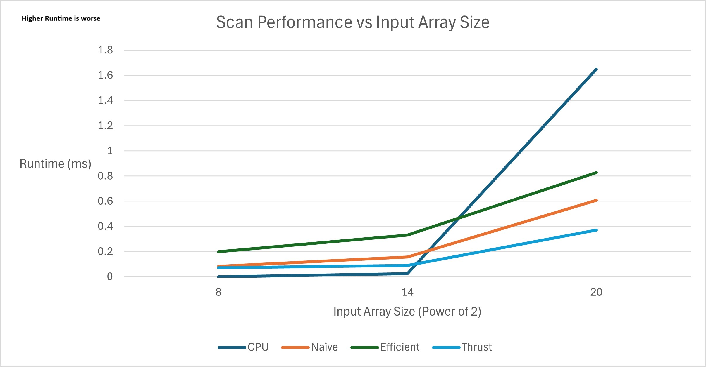

CUDA Stream Compaction
======================

**University of Pennsylvania, CIS 565: GPU Programming and Architecture, Project 2**

* Logan Cho
  * [LinkedIn](https://www.linkedin.com/in/logan-cho/)
  * [Personal Website](https://www.logancho.com/)
* Tested on: Windows 11, 13th Gen Intel(R) Core(TM) i7-13700H, 2.40 GHz, RTX 4060 Laptop GPU

# Description

# Charts

# In-Depth Performance Analysis
 * CUDA Block Size Optimization
   * Through trial and error, I narrowed down the optimal block sizes for each of my implementations of scan/compaction.
     * Naive: (256, 1, 1)
     * Efficient: (256, 1, 1)
 * Comparison of all Scan Implementations (CPU, GPU (Naive, Efficient, Thrust)):
   *  
   *  This chart plots the time taken/runtime of different Scan implementations across different input array sizes. We can draw a conclusion that the GPU methods have a significant performance boost over the serial CPU method for larger array sizes, larger than 2 to the power of 14.
