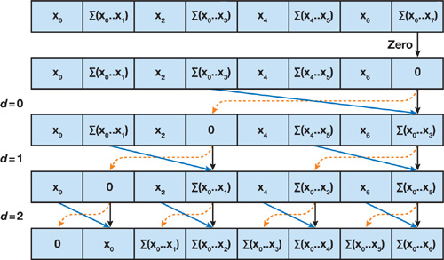
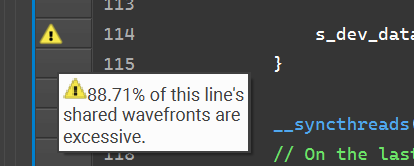
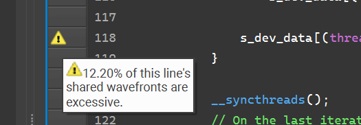

CUDA Stream Compaction
======================

**University of Pennsylvania, CIS 565: GPU Programming and Architecture, Project 2**

* Matt Schwartz
  * [LinkedIn](https://www.linkedin.com/in/matthew-schwartz-37019016b/)
  * [Personal website](https://mattzschwartz.web.app/)
* Tested on: Windows 10 22H2, Intel(R) Core(TM) i7-10750H CPU @ 2.60GHz, NVIDIA GeForce RTX 2060

<p align="center">
  
</p>

*Image source [GPU Gems 3 Chapter 39](https://developer.nvidia.com/gpugems/gpugems3/part-vi-gpu-computing/chapter-39-parallel-prefix-sum-scan-cuda)*  


# Background

In this repository, I implement several variations of a prescan algorithm: a CPU-based version, a naive implementation on the GPU, and a work-efficient GPU implementation, as well as the built-in Thrust library implementation (for comparision). Aftewards, I build upon this prescan algorithm to develop a parallel stream-compaction implementation (again, compared against the CPU). 

Prescans and stream compaction have a variety of uses in data analysis and computer graphics. To learn more about these algorithms, give the [GPU Gems 3 chapter](https://developer.nvidia.com/gpugems/gpugems3/part-vi-gpu-computing/chapter-39-parallel-prefix-sum-scan-cuda) a read.

# The Data

Let's take a high-level glance at the data, and then follow up with more detail on some of the steps taken along the way to optimize these results. 

A note on measurement taking: all tests are repeated 20 times, and the median data point from each test is recorded and plotted. I chose to use the median because I found that there was significant variance in the results from test to test, and I wanted to lessen the impact of outliers.

Before recording any data, I ran the (automated) test suite with varying kernel block sizes (for the naive and work-efficient algorithms), and used that data to determine optimal sizes for each algorithm. This way, we can compare apples-to-apples. For the naive scan, I found this to be around 256 threads per block. For the work-efficient scan, I found this to be around 512 threads per block. In both cases, performance was minimally affected by block sizes ranging from 128 - 1024.

## Prefix Scan

Perhaps unsurprisingly, the Thrust library is unanimously the winner at every array size, ranging from ~1 thousand elements to ~16 million. However, my work-efficient implementation isn't so far off - about 2x slower than the Thrust implementation (in fact, each successively slower algorithm is about a factor of 2x slower than the previous; a fun coincidence).

Interestingly, the CPU scan is actually faster across the board than the naive scan! This is attributable both to the greater algorithmic complexity of the naive scan (it has to do far more operations to achieve the same result, albeit in parallel), and to its excessive use of global memory.  

Originally, the work-efficient scan was also slower than the CPU scan, by quite a bit. There were three major improvements I made to get the time down:
1. Instead of using global memory reads, I switched to shared memory. This required completely restructing the scan algorithm so that it could run in independent blocks, and then use those independent partial scan results to compute the full scan. Also, instead of doing the two phases of the scan (upsweep and downsweep) in separate kernel invocations, it suddenly became advantageous to do it in a single invocation; this way, global memory only has to be read from and written to once. 
2. Shared memory comes with a caveat; bank conflicts. To address this, I added a variable offset to where data is being stored and read from in shared memory. (see images after graph for a visual!)
3. To accomodate arbritrarily large arrays, there's a recursive step that computes and joins the results of different partial scans together. I was using a pinned memory transfer here for some data that needs to be carried over between recursive invocations, but I realized I could find out a priori how much memory I would need for all iterations, and pre-allocate it.
4. (Bonus) Because I hate my readers, I tried to inline all math expressions in my kernels. Just kidding - I did it to avoid the use of extra registers, not to hurt readability :(


<p align="center">
  
</p>

According to NSight Compute, adding a variable offset to avoid shared memory bank conflicts decreased my "excessive shared wavefronts" from 88.7% to 12.2%!

<p align="center">
  
</p>

<p align="center">
  
</p>

## Compact

Not much to say here - since the compact algorithm depends on the prescan, most of the speed of the GPU compaction is due to the optimizations crafted in the scan itself!

<p align="center">
  
</p>


# Sample output (2^20 elements)

```
****************
** SCAN TESTS **
****************
    [  27  36  43  45  26  29  25  32   2  46  49  26  19 ...   5   0 ]
==== cpu scan, power-of-two ====
   elapsed time: 0.6881ms    (std::chrono Measured)
==== cpu scan, non-power-of-two ====
   elapsed time: 0.505ms    (std::chrono Measured)
    passed 
==== naive scan, power-of-two ====
   elapsed time: 1.11667ms    (CUDA Measured)
    passed 
==== naive scan, non-power-of-two ====
   elapsed time: 0.898528ms    (CUDA Measured)
    passed 
==== work-efficient scan, power-of-two ====
   elapsed time: 0.435392ms    (CUDA Measured)
    passed 
==== work-efficient scan, non-power-of-two ====
   elapsed time: 0.340064ms    (CUDA Measured)
    passed 
==== thrust scan, power-of-two ====
   elapsed time: 0.294304ms    (CUDA Measured)
    passed 
==== thrust scan, non-power-of-two ====
   elapsed time: 0.264192ms    (CUDA Measured)
    passed 

*****************************
** STREAM COMPACTION TESTS **
*****************************
    [   1   0   3   1   2   1   1   2   0   2   1   2   1 ...   3   0 ]
==== cpu compact without scan, power-of-two ====
   elapsed time: 2.191ms    (std::chrono Measured)
    passed 
==== cpu compact without scan, non-power-of-two ====
   elapsed time: 2.0626ms    (std::chrono Measured)
    passed 
==== cpu compact with scan ====
   elapsed time: 5.9357ms    (std::chrono Measured)
    passed 
==== work-efficient compact, power-of-two ====
   elapsed time: 0.717088ms    (CUDA Measured)
    passed 
==== work-efficient compact, non-power-of-two ====
   elapsed time: 0.518976ms    (CUDA Measured)
    passed 

*****************************
** RADIX TESTS **
*****************************
    [ 147 231  53 245 206  59   5 137  97 116  69 136 169 ...  10   0 ]
==== radix sort, power-of-two ====
   elapsed time: 22.694ms    (CUDA Measured)
    passed 
```