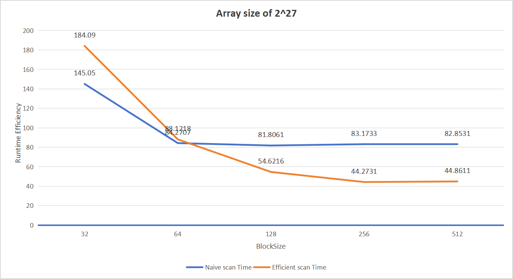
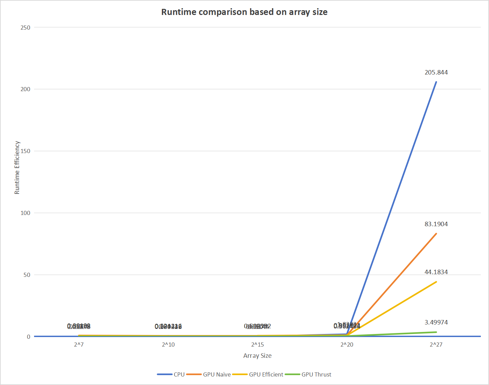
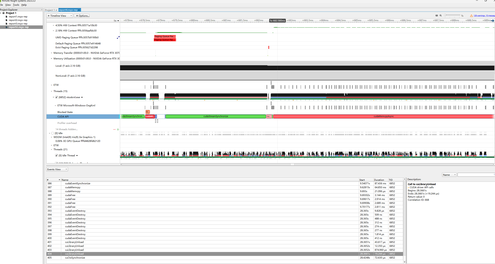

CUDA Stream Compaction
======================

**University of Pennsylvania, CIS 565: GPU Programming and Architecture, Project 2**

* Akiko Zhu
  * [LinkedIn](https://www.linkedin.com/in/geming-akiko-zhu-b6705a255/)
* Tested on: Windows 11, i9-12900H @ 2.50GHz 16GB, RTX 3070Ti 8GB (Personal)

### Features
This project contains GPU parallel algorithms including Scan and Stream Compaction.
- A CPU-based Non-parallelized Exclusive Scan, Stream Compaction without Scan, and with Scan.
- A GPU-based Naive Parallel Scan.
- A GPU-based Work-Efficient Parallel Scan.
- A GPU-based Stream Compaction.
- Using Thrust library, implemented Exclusive Scan

### Results (Array size of 2^27)

```
****************
** SCAN TESTS **
****************
    [  11  33  25   7  42  33  18  40  18  45  40  44  10 ...   7   0 ]
==== cpu scan, power-of-two ====
   elapsed time: 198.072ms    (std::chrono Measured)
    [   0  11  44  69  76 118 151 169 209 227 272 312 356 ... -1007970099 -1007970092 ]
==== cpu scan, non-power-of-two ====
   elapsed time: 232.51ms    (std::chrono Measured)
    [   0  11  44  69  76 118 151 169 209 227 272 312 356 ... -1007970171 -1007970171 ]
    passed
==== naive scan, power-of-two ====
   elapsed time: 89.8661ms    (CUDA Measured)
    passed
==== naive scan, non-power-of-two ====
   elapsed time: 81.4132ms    (CUDA Measured)
    passed
==== work-efficient scan, power-of-two ====
   elapsed time: 60.4823ms    (CUDA Measured)
    passed
==== work-efficient scan, non-power-of-two ====
   elapsed time: 54.2374ms    (CUDA Measured)
    passed
==== thrust scan, power-of-two ====
   elapsed time: 3.2186ms    (CUDA Measured)
    passed
==== thrust scan, non-power-of-two ====
   elapsed time: 3.5937ms    (CUDA Measured)
    passed

*****************************
** STREAM COMPACTION TESTS **
*****************************
    [   2   3   0   0   2   2   2   3   0   1   1   2   1 ...   0   0 ]
==== cpu compact without scan, power-of-two ====
   elapsed time: 283.499ms    (std::chrono Measured)
    [   2   3   2   2   2   3   1   1   2   1   2   2   2 ...   2   1 ]
    passed
==== cpu compact without scan, non-power-of-two ====
   elapsed time: 270.86ms    (std::chrono Measured)
    [   2   3   2   2   2   3   1   1   2   1   2   2   2 ...   2   1 ]
    passed
==== cpu compact with scan ====
   elapsed time: 465.234ms    (std::chrono Measured)
    [   2   3   2   2   2   3   1   1   2   1   2   2   2 ...   2   1 ]
    passed
==== work-efficient compact, power-of-two ====
   elapsed time: 72.7748ms    (CUDA Measured)
    passed
==== work-efficient compact, non-power-of-two ====
   elapsed time: 64.1773ms    (CUDA Measured)
    passed
```

### Performance Analysis
- The optimal BlockSize on my GPU is 256. The following chart compares my GPU naive scan algorithm and GPU efficient scan algorithm. Under the condition of adjusting the array size to 2^27, when BlockSize is equal to and larger than 64, the naive scan algorithm has an average runtime of 82 ms, while the BlockSize is equal to and larger than 256, the efficient scan algorithm has an average runtime of 44 ms, which means the optimal BlockSize on my GPU for the best runtime efficiency should be 256 while using efficient scan algorithm.

- In the beginning, when the array size is less than 2^20, the CPU-based scan algorithm is far faster than any GPU-based scan algorithm. However, as the array size increases, when it hits the size of over 2^20, the difference between CPU runtime efficiency and GPU runtime efficiency starts to become observable. As in the following chart, when the array size is 2^27, the CPU-based scan algorithm runtime is 205.844 ns, while the GPU-efficient scan algorithm runtime only needs 44.1834 ns.

- The interesting thing is, even though the array size is 2^27, GPU Thrust implementation needs 3.49974 ns. Therefore, I launched the Nsight System and analyzed the CUDA API execution part. I guess, maybe it's because of something about the device and host memory syncronization. Maybe inside of the Thrust Library, they have a better way to read and load data between host and device? Or maybe it's because the algorithm designer optimized the data storage based on the GPU store architecture?

- 
