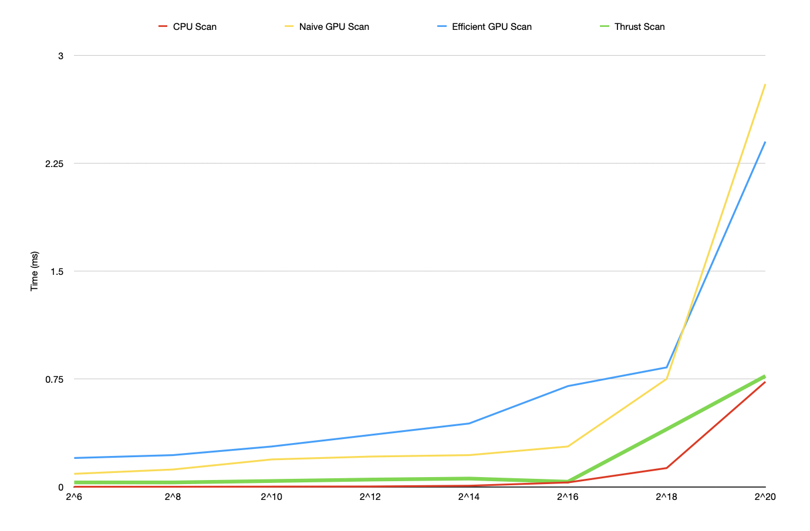

CUDA Stream Compaction
======================

**University of Pennsylvania, CIS 565: GPU Programming and Architecture, Project 2**

* Deze Lyu
* Tested on: Windows 11, AMD Ryzen 5 5600U @ 2.30GHz 16GB, NVIDIA GeForce MX450 9142MB

### Deze Lyu

#### Description

This project implements scan and stream compaction algorithms for both CPU and GPU. The features include:

 - CPU Scan & Stream Compaction
 - Naive GPU Scan Algorithm
 - Work-Efficient GPU Scan & Stream Compaction
 - Thrust's Stream Compaction
 - Threads Compaction (Why is My GPU Approach So Slow?)

#### Performance Analysis

**Note: My GPU model, the MX450, is not very powerful, resulting in slow performance for all GPU-based implementations, including the one using the Thrust library. I have verified that all memory operations are excluded from the GPU timers. Despite this, the CPU-based implementation remains faster than the Thrust library's implementation for an array size of 2^20. Therefore, although I made every effort to complete the performance analysis, the results may not be very meaningful.**

##### **Task:** Roughly optimize the block sizes of each of your implementations for minimal run time on your GPU.

A block size of 256 in all GPU-based implementations appears to slightly improve performance, though it remains slower than the CPU-based implementation for the reasons mentioned above.

##### **Task:** Compare all of these GPU Scan implementations (Naive, Work-Efficient, and Thrust) to the serial CPU version of Scan.

The graph is attached below. It shows that, on my underperforming MX450 GPU, the CPU-based implementation is consistently faster than the GPU-based implementation, despite excluding memory operations from the GPU timers and optimizing thread usage for efficient scanning.

##### **Task:** Detailed Analysis Using Nsight System
