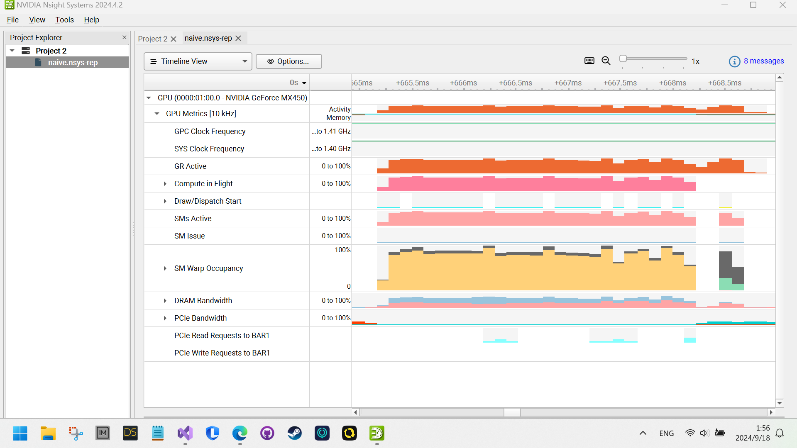
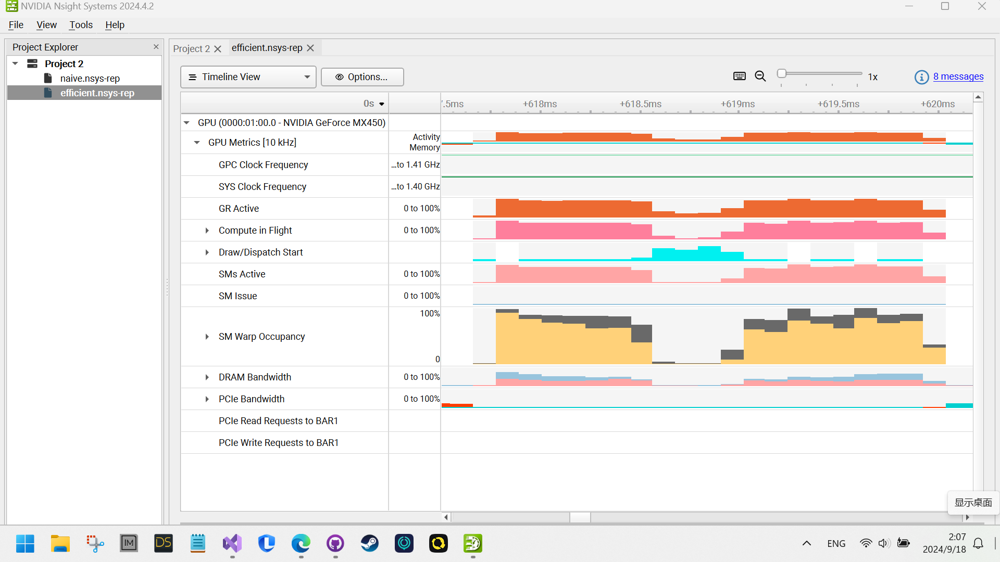
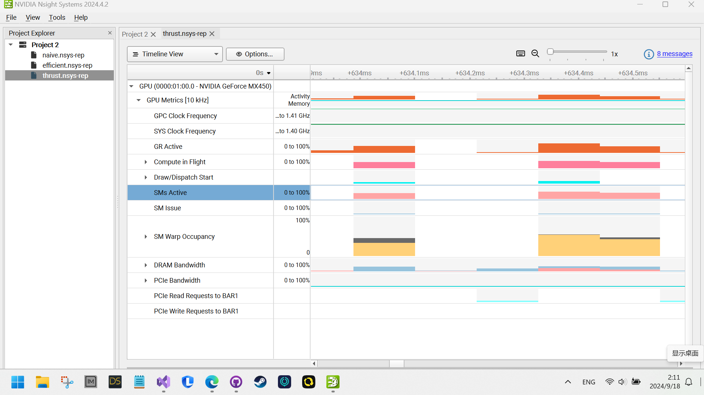
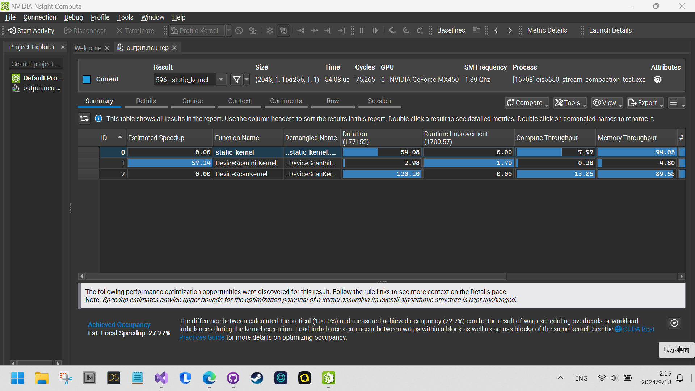

CUDA Stream Compaction
======================

**University of Pennsylvania, CIS 565: GPU Programming and Architecture, Project 2**

* Deze Lyu
* Tested on: Windows 11, AMD Ryzen 5 5600U @ 2.30GHz 16GB, NVIDIA GeForce MX450 9142MB

### Deze Lyu

**Note: My GPU model, the MX450, is not very powerful, resulting in slow performance for all GPU-based implementations, including the one using the Thrust library. I have verified that all memory operations are excluded from the GPU timers. Despite this, the CPU-based implementation remains faster than the Thrust library's implementation for an array size of 2^20. Therefore, although I made every effort to complete the performance analysis, the results may not be very meaningful.**

**Fun fact: The MX450 is slower than the GTX 950, about 5 times slower than the RTX 3060, and roughly 10 times slower than the RTX 4090.**

#### Description

This project implements scan and stream compaction algorithms for both CPU and GPU. The features include:

 - CPU Scan & Stream Compaction
 - Naive GPU Scan Algorithm
 - Work-Efficient GPU Scan & Stream Compaction
 - Thrust's Stream Compaction
 - Threads Compaction (Why is My GPU Approach So Slow?)

#### Performance Analysis

##### **Task:** Roughly optimize the block sizes of each of your implementations for minimal run time on your GPU.

A block size of 256 in all GPU-based implementations appears to slightly improve performance, though it remains slower than the CPU-based implementation for the reasons mentioned above.

##### **Task:** Compare all of these GPU Scan implementations (Naive, Work-Efficient, and Thrust) to the serial CPU version of Scan.

The graph is attached below. It shows that, on my underperforming MX450 GPU, the CPU-based implementation is consistently faster than the GPU-based implementation, despite excluding memory operations from the GPU timers and optimizing thread usage for efficient scanning.


##### **Task:** Detailed Analysis Using Nsight System

In the native GPU-based implementation, as shown in the Nsight Systems timeline below, there is high SM Warp Occupancy and DRAM Bandwidth usage around 33% for both read and write. This suggests that the implementation is compute-bound, likely due to conditional branching in the kernel or the MX450's limited computational performance.



For the efficient scan implementation, Nsight Systems shows a relatively high number of Unallocated Warps in Active SMs. This is likely because, when the layer level \(d\) is high, the total number of threads used is less than the fixed block size, leading to idle threads. Additionally, frequent and scattered global memory reads could be an issue, as Nsight Systems indicates slightly higher DRAM Bandwidth for reading compared to writing.



Finally, for Thrust's scan implementation, it appears that Thrust first uses a kernel to initialize the data, as there is no DRAM Read Bandwidth observed. The scan phase shows very low Unallocated Warps in Active SMs, suggesting that the algorithm is highly optimized. However, the SM Warp Occupancy is only around 50%, indicating room for improvement. The DRAM Read and Write Bandwidths switch between the phases, starting at 25% and 15%, and then shifting to 15% and 25%. This may be due to the different use of up-sweep and down-sweep operations or could be attributed to the MX450's interesting performance characteristics.



Using Nsight Compute, we can distinguish between the different stages of the process by noting the distinct kernel names that appear.



##### **Task:**  Paste the output of the test program

```
```
