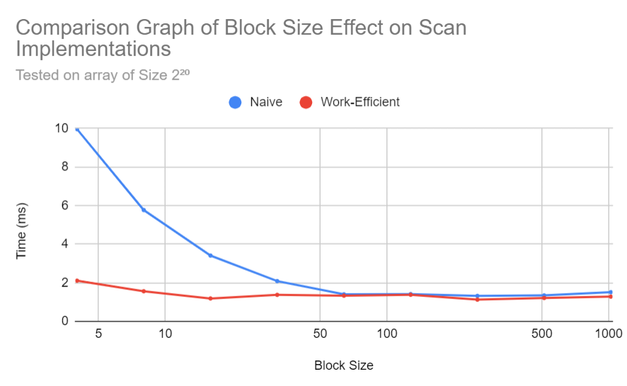
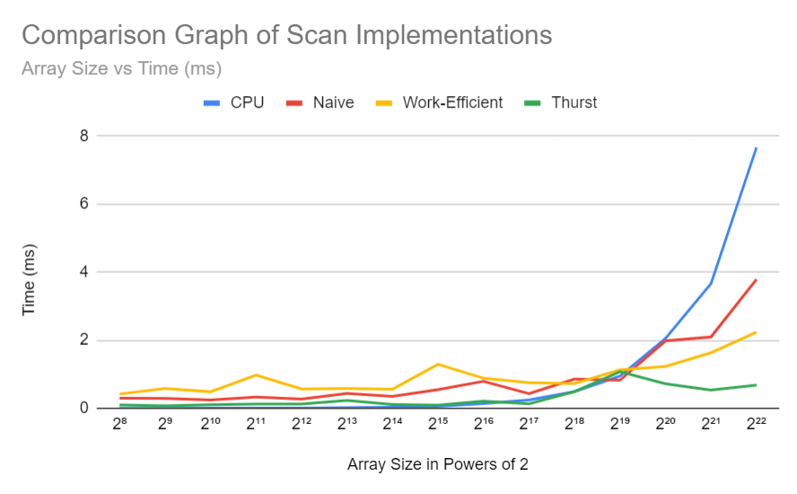
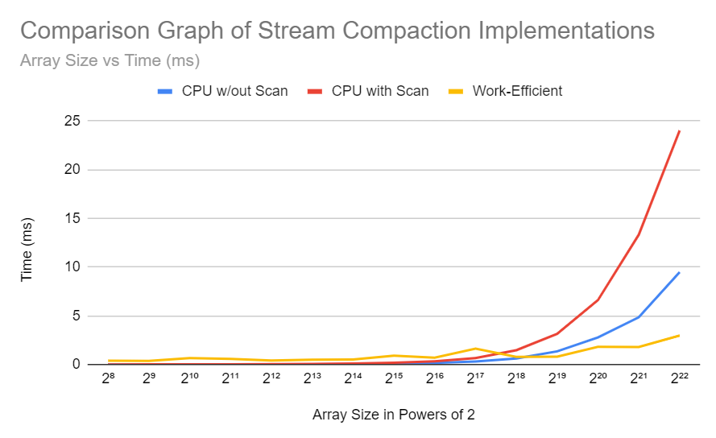

CUDA Stream Compaction
======================

**University of Pennsylvania, CIS 565: GPU Programming and Architecture, Project 2**

* Joanna Fisch
  * [LinkedIn](https://www.linkedin.com/in/joanna-fisch-bb2979186/), [Website](https://sites.google.com/view/joannafischsportfolio/home)
* Tested on: Windows 11, i7-12700H @ 2.30GHz 16GB, NVIDIA GeForce RTX 3060 (Laptop)

## Overview

This project implements GPU stream compaction using CUDA to remove zeros from an array of integers. Stream compaction is a crucial optimization technique, particularly useful for high-performance computing tasks like path tracing. By implementing various scan (prefix sum) algorithms, this project explores different strategies to leverage GPU parallelism efficiently.

## Features
#### 1. CPU Scan & Stream Compaction
* CPU Scan: Implements a simple exclusive prefix sum using a for loop.
* Compact Without Scan: A basic CPU method that removes zeros without relying on a scan operation.
* Compact With Scan: A more advanced method using scan to optimize the stream compaction process.

#### 2. Naive GPU Scan
* Implements a naive GPU scan algorithm based on the description in GPU Gems 3, Section 39.2.1. This implementation uses global memory and repeatedly swaps input/output arrays across several kernel launches.

#### 3. Work-Efficient GPU Scan & Stream Compaction
* Work-Efficient Scan: Implements a more optimized version using the tree-based approach from GPU Gems 3, Section 39.2.2.
* Stream Compaction Using Scan: Uses the work-efficient scan to perform stream compaction by mapping the input array to boolean values, scanning the array, and then scattering the valid elements.
* Handles non-power-of-two sized arrays efficiently.

#### 4. Thrust Library Integration
* Uses the Thrust library's exclusive_scan function to perform stream compaction with GPU-accelerated thrust primitives.

## Performance Analysis

### Optimize Block Size

There is a significant decrease in time as block size increases until about 64 threads per block and then the time has little to no change or effect.

### Scan Implementation Comparison


### Stream Compaction Implementation Comparison


#### Key Insights:
1. CPU Scan:
* The CPU implementation shows a steep increase in execution time as the array size grows. For larger arrays, the CPU scan is significantly slower than the GPU implementations, making it unsuitable for large datasets
2. Naive GPU Scan:
* While the naive approach is simple, it suffers from inefficiencies due to its multiple kernel launches and use of global memory. The Naive GPU scan performs better than the CPU scan but still exhibits slower scaling for larger arrays compared to other GPU methods. The performance bottleneck could arise from inefficient memory access patterns and redundant computations.
3. Work-Efficient GPU Scan:
* The Work-Efficient GPU scan outperforms the Naive version, especially for large arrays. This suggests that it optimizes memory access and reduces unnecessary computation, improving parallel efficiency.
4. Thrust GPU Scan:
* The Thrust scan (from the CUDA Thrust library) is the fastest across all tested array sizes. Thrust is highly optimized for both memory management and computation, making it ideal for general use, but it lacks flexibility for customization.

#### Bottlenecks Identified:
* CPU Scan: The bottleneck is the computation itself due to the lack of parallelism.
* Naive GPU Scan: Likely suffers from inefficient memory I/O and computation, as the algorithm involves redundant work that could be avoided with more optimized approaches. The excessive amount of global memory reads/writes leads to slower performance.
* Work-Efficient GPU Scan: More optimized but could still be limited by global memory access times, though it balances computation more effectively.
* Thrust GPU Scan: Appears to minimize both computation and memory I/O overhead, making it the most efficient, likely because it uses optimized kernels and memory management under the hood.

The differences in these bottlenecks suggest that the GPU methods are increasingly limited by memory I/O rather than raw computation, especially for large data sizes.

#### Optimizations Explored:
* Adjusted block size to optimize shared memory usage and improve the occupancy of each streaming multiprocessor.
* Adjusted kernels to only include shifting operators instead of multiplication and division.

## Output
The follow output is from an array size of **2<sup>21</sup>**, a non-power-of-two array size of **2<sup>21</sup> - 3**, and a block size of **64**.
```
****************
** SCAN TESTS **
****************
    [  41  47  37  30  49  44  12   6  29  14   6  13  20 ...  31   0 ]
==== cpu scan, power-of-two ====
   elapsed time: 4.9157ms    (std::chrono Measured)
    [   0  41  88 125 155 204 248 260 266 295 309 315 328 ... 51348803 51348834 ]
==== cpu scan, non-power-of-two ====
   elapsed time: 3.9709ms    (std::chrono Measured)
    [   0  41  88 125 155 204 248 260 266 295 309 315 328 ... 51348711 51348742 ]
    passed
==== naive scan, power-of-two ====
   elapsed time: 2.6129ms    (CUDA Measured)
    passed
==== naive scan, non-power-of-two ====
   elapsed time: 1.68922ms    (CUDA Measured)
    passed
==== work-efficient scan, power-of-two ====
   elapsed time: 1.79622ms    (CUDA Measured)
    passed
==== work-efficient scan, non-power-of-two ====
   elapsed time: 1.00659ms    (CUDA Measured)
    passed
==== thrust scan, power-of-two ====
   elapsed time: 1.1992ms    (CUDA Measured)
    passed
==== thrust scan, non-power-of-two ====
   elapsed time: 0.56832ms    (CUDA Measured)
    passed

*****************************
** STREAM COMPACTION TESTS **
*****************************
    [   3   3   1   2   3   2   0   0   3   0   0   3   2 ...   1   0 ]
==== cpu compact without scan, power-of-two ====
   elapsed time: 5.0553ms    (std::chrono Measured)
    [   3   3   1   2   3   2   3   3   2   2   2   3   2 ...   3   1 ]
    passed
==== cpu compact without scan, non-power-of-two ====
   elapsed time: 4.7574ms    (std::chrono Measured)
    [   3   3   1   2   3   2   3   3   2   2   2   3   2 ...   3   1 ]
    passed
==== cpu compact with scan ====
   elapsed time: 18.7201ms    (std::chrono Measured)
    [   3   3   1   2   3   2   3   3   2   2   2   3   2 ...   3   1 ]
    passed
==== work-efficient compact, power-of-two ====
   elapsed time: 1.69056ms    (CUDA Measured)
    passed
==== work-efficient compact, non-power-of-two ====
   elapsed time: 1.59232ms    (CUDA Measured)
    passed
```
