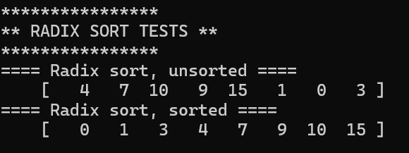
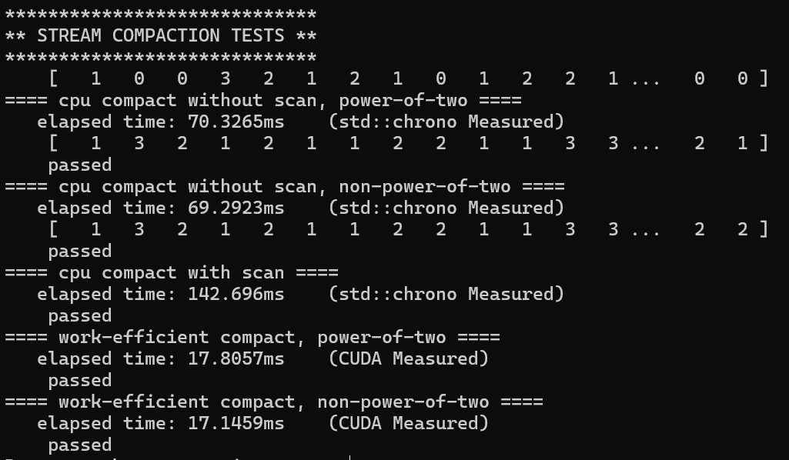

CUDA Stream Compaction
======================

**University of Pennsylvania, CIS 565: GPU Programming and Architecture, Project 2**

* Annie Qiu
   * [LinkedIn](https://github.com/AnnieQiuuu/Project0-Getting-Started/blob/main/www.linkedin.com/in/annie-qiu-30531921a)
* Tested on: Windows 11, i9-12900H @2500 Mhz, 16GB, RTX 3070 Ti 8GB (Personal)

## Overview
This project focuses on the implementation of GPU stream compaction using CUDA. It includes multiple variations of the Scan (Prefix Sum) algorithm, such as a CPU implementation, a 'naive' GPU version, a 'work-efficient' GPU version, and an implementation using Thrust. These Scan algorithms are utilized to perform efficient GPU-based stream compaction. Radix Sort is also implemented with the use of work efficient scan.
### List of Features
  - CPU Scan and Stream Compaction
  - Naive GPU Scan
  - Work-Efficient GPU Scan
  - Optimized Work-Efficient GPU Scan
  - Thrust-Based Scan
  - GPU Stream Compaction
  - Radix Sort (Extra Credit)

## Description
### Feature 1: CPU Scan & Stream Compaction
In this part, the CPU implementation of Scan (Prefix Sum) and Stream Compaction is developed to serve as a baseline for performance comparison with GPU versions. The stream compaction method will remove 0s from an array of ints.
- StreamCompaction::CPU::scan: compute an exclusive prefix sum. For performance comparison, this is supposed to be a simple for loop.
- StreamCompaction::CPU::compactWithoutScan: stream compaction without using the scan function.
- StreamCompaction::CPU::compactWithScan: stream compaction using the scan function. Map the input array to an array of 0s and 1s, scan it, and use scatter to produce the output.

### Feature 2: Naive GPU Scan Algorithm
This part implements the Naive Scan Algorithm in CUDA with global memory and `ilog2ceil(n)` was separated from kernel invocations to complete the scan process. To avoid the race condition, I used two device arrays and wapped them at each iteration.
- StreamCompaction::Naive::scan: compute exclusive prefix sum in CUDA.

### Feature 3: Work-Efficient GPU Scan
This part implements the Work-Efficient Scan Algorithm which operates on a binary tree structure and works best with arrays with power-of-two-length. This can be done in place - it doesn't suffer from the race conditions of the naive method, since there won't be a case where one thread writes to and another thread reads from the same location in the array.
- StreamCompaction::Efficient::scan: uses the "Work-Efficient" algorithm from GPU Gems3, Section 39.2.2.
    - Up-Sweep (Reduce): A binary tree structure is built where partial sums are computed in a bottom-up fashion.
    - Down-Sweep: The array is traversed from top to bottom to generate the final prefix sums.

### Feature 4: GPU Stream Compaction
In this part, I implemented GPU stream compaction, which removes 0s from an integer array, leaving only non-zero elements in the final result. This is achieved by mapping the input array to a boolean array, scanning it, and then scattering the non-zero elements to their correct positions.
- StreamCompaction::Efficient::compact: The stream compaction method works on the GPU will remove 0s from an array of ints.
    - Map to Boolean
    - Scan
    - Scatter
- StreamCompaction::Common::kernMapToBoolean: This kernel maps the input array to a boolean array (1 for non-zero, 0 for zero).
- StreamCompaction::Common::kernScatter: This kernel scatters the non-zero elements from the input array to their new positions based on the scanned boolean array.

### Feature 5: Thrust's Implementation
This part wraps a call to the Thrust library function thrust::exclusive_scan(first, last, result).
- StreamCompaction::Thrust::scan

### Feature 6: Optimized Work - Efficient GPU Scan (Part 5 extra credit)
I provided an optimized version of the scan function, which utilizes more efficient indexing in the up-sweep and down-sweep phases to reduce unnecessary memory operations.
- StreamCompaction::Efficient::scanOptimized: This optimized scan function enhances the standard work-efficient scan by refining the index calculations during both the up-sweep and down-sweep phases. By doing so, it minimizes memory access and improves the efficiency of the algorithm.
    - kernUpSweepOptimized
    - kernDownSweepOptimized
This optimized implementation works best at maximizing GPU performance for large datasets, further improving the already efficient work-efficient scan 
algorithm.

### Feature 7: Radix Sort (Part 6 extra credit)
The Radix Sort is implemented in the StreamCompaction::RadixSort::radixSort function and can handle arrays of varying bit sizes. Tests have been added in main to verify its correctness.
    kernMapToReverseBoolean: This maps each element's bits to a reverse boolean array.
    StreamCompaction::Efficient::scan: Scanning the boolean array using the work-efficient scan algorithm to generate indices.
    kernMaptoTrues: This is used to get t array.
    kernScatter: This scatters the elements to their correct positions based on the scan results.

## Results
### Radix Sort
- BitSize = 4;
- ArraySize = 8;


### Scan result
- block size = 256
- ArraySize = 2^25


### Stream Compaction result
- block size = 256
- ArraySize = 2^25


```
****************
** RADIX SORT TESTS **
****************
==== Radix sort, unsorted ====
    [   4   7  10   9  15   1   0   3 ]
==== Radix sort, sorted ====
    [   0   1   3   4   7   9  10  15 ]

****************
** SCAN TESTS **
****************
    [  41  20  11  20  24  30  43  43   0   3  14  27  26 ...  23   0 ]
==== cpu scan, power-of-two ====
   elapsed time: 49.701ms    (std::chrono Measured)
    [   0  41  61  72  92 116 146 189 232 232 235 249 276 ... 821689158 821689181 ]
==== cpu scan, non-power-of-two ====
   elapsed time: 51.8831ms    (std::chrono Measured)
    passed
==== naive scan, power-of-two ====
   elapsed time: 22.2455ms    (CUDA Measured)
    [   0  41  61  72  92 116 146 189 232 232 235 249 276 ... 821689158 821689181 ]
    passed
==== naive scan, non-power-of-two ====
   elapsed time: 22.5873ms    (CUDA Measured)
    passed
==== work-efficient scan, power-of-two ====
   elapsed time: 20.5759ms    (CUDA Measured)
    [   0  41  61  72  92 116 146 189 232 232 235 249 276 ... 821689158 821689181 ]
    passed
==== work-efficient scan, non-power-of-two ====
   elapsed time: 14.9873ms    (CUDA Measured)
    passed
==== work-efficient scan Optimized, power-of-two ====
   elapsed time: 9.044ms    (CUDA Measured)
    passed
==== work-efficient scan Optimized, non-power-of-two ====
   elapsed time: 8.71014ms    (CUDA Measured)
    passed
==== thrust scan, power-of-two ====
   elapsed time: 1.3824ms    (CUDA Measured)
    passed
==== thrust scan, non-power-of-two ====
   elapsed time: 1.42954ms    (CUDA Measured)
    passed

*****************************
** STREAM COMPACTION TESTS **
*****************************
    [   0   1   1   0   1   2   1   3   1   1   2   1   1 ...   2   0 ]
==== cpu compact without scan, power-of-two ====
   elapsed time: 69.5104ms    (std::chrono Measured)
    [   1   1   1   2   1   3   1   1   2   1   1   1   3 ...   2   2 ]
    passed
==== cpu compact without scan, non-power-of-two ====
   elapsed time: 67.8946ms    (std::chrono Measured)
    [   1   1   1   2   1   3   1   1   2   1   1   1   3 ...   3   2 ]
    passed
==== cpu compact with scan ====
   elapsed time: 140.232ms    (std::chrono Measured)
    passed
==== work-efficient compact, power-of-two ====
   elapsed time: 17.444ms    (CUDA Measured)
    passed
==== work-efficient compact, non-power-of-two ====
   elapsed time: 17.1397ms    (CUDA Measured)
    passed
Press any key to continue . . .
```
## Analysis
### Result of Scan in Power-of-Two Arrays

- block size = 256
- x axis: ArraySize
- y axis: Exlapsed time
- tested with: CPU Scan, Naive GPU Scan, Work Efficient GPU Scan, Optimized Work Efficient GPU Scan, Thrust

### Result of Scan in Non-Power-of-Two Arrays

- block size = 256
- x axis: ArraySize
- y axis: Exlapsed time
- tested with: CPU Scan, Naive GPU Scan, Work Efficient GPU Scan, Optimized Work Efficient GPU Scan, Thrust

### Stream Compaction Performance

- block size = 256
- x axis: ArraySize
- y axis: Exlapsed time
- tested with: CPU Stream Compaction with Scan, CPU Stream Compaction without Scan, Work Efficient GPU Stream Compaction

### Conlusion
- Block Size Optimization: I chosed blocksize as 256 as it work best with my program.
- Comparison: As the array size increases, the elapsed time also increases.Thrust outperforms the other implementations overall.  For smaller array sizes, the CPU implementation is faster than the GPU versions, but once the array size exceeds 2^20, the GPU implementations become significantly faster. Among the GPU algorithms, the Optimized Work-Efficient implementation performs the best, followed by the Work-Efficient version, with the Naive method being the slowest.
- Bottlenecks: The CPU and Naive GPU Scan are slower primarily because they require multiple memory accesses during the scan operation. In contrast, the Work-Efficient scan reduces the number of memory accesses so to increase the performace.The Optimized Work-Efficient implementation further enhances this by minimizing memory accesses even more efficiently.

## Test Cases
I defined the test cases for Radix Sort and Optimized Work Efficient Scan in main.cpp.

### Radix Sort Test Case:
- Test cases choices
  ```
  #define ThreebitCase 0;
  #define FourbitCase 1;
  #define EightbitCase 0;
  ```
- Output test case
  ```
  #if ThreebitCase
      // Test 3 bit case
      int unsortedArray[8] = { 4, 7, 2, 6, 3, 5, 1, 0 };  // Binary equivalents: 100, 111, 010, 110, 011, 101, 001, 000
      int sortedArray[8];
      int bitSize = 3; 
  #endif
  #if FourbitCase
      // Test 4 bit case
      int unsortedArray[8] = { 4, 7, 10, 9, 15, 1, 0, 3 };  // Binary equivalents: 0100, 0111, 1010, 1001, 1111, 0001, 0000, 0011
      int sortedArray[8];
      int bitSize = 4;
  #endif
  #if EightbitCase
      // Test 8 bit case
      int unsortedArray[8] = { 68, 119, 170, 153, 255, 1, 0, 51 };  // Binary equivalents: 01000100, 01110111, 10101010, 10011001, 11111111, 00000001, 00000000, 00110011
      int sortedArray[8];
      int bitSize = 8;
  #endif
      // Input array and bitSize
      StreamCompaction::RadixSort::radixSort(8, sortedArray, unsortedArray, bitSize);
  ```

### Optimized Work Efficient Scan Test Case:
  ```
      StreamCompaction::Efficient::scanOptimized(SIZE, c, a);
      StreamCompaction::Efficient::scanOptimized(NPOT, c, a);
  ```

### CMake file modification
- To solve the PTX issue, I modified the CMakeLists.txt with # Force CUDA architecture to sm_86 for RTX 3070 Ti (Ampere)
set_target_properties(${CMAKE_PROJECT_NAME} PROPERTIES CUDA_ARCHITECTURES 86).
- I added radix.cu and radix.h in stream_compaction/CMakeLists.txt.