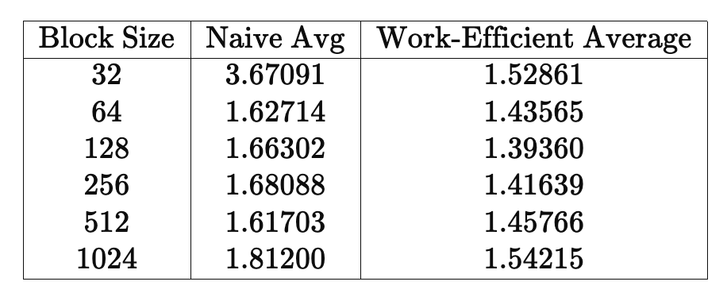
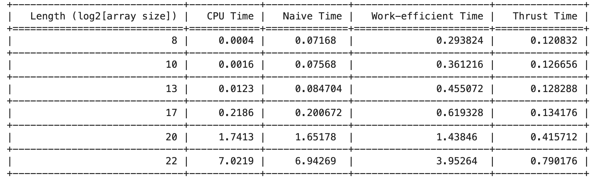
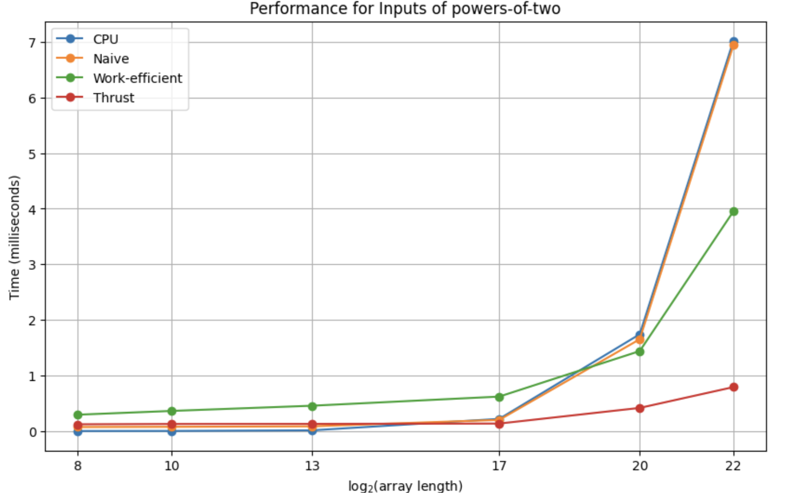
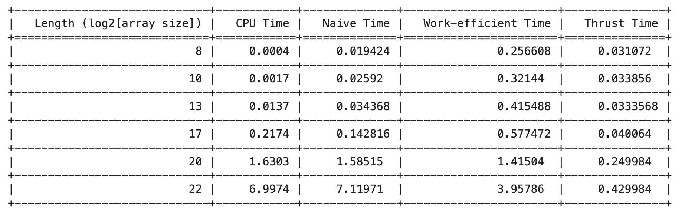
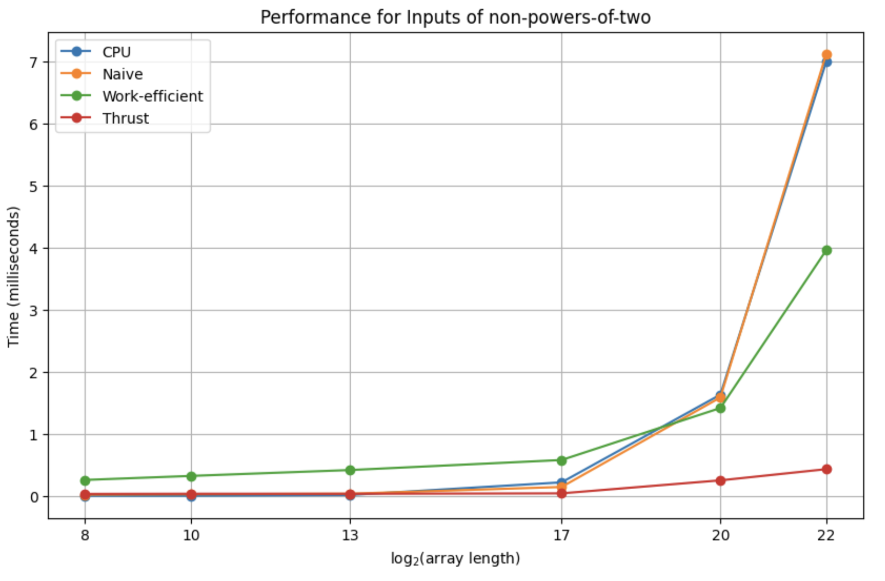
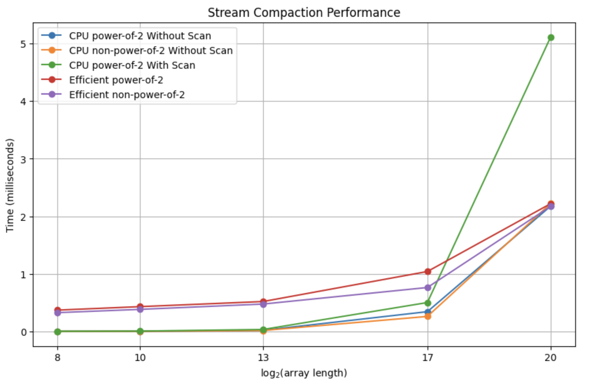

CUDA Stream Compaction
======================

**University of Pennsylvania, CIS 565: GPU Programming and Architecture, Project 2**

* Shreyas Singh
  * [LinkedIn](https://linkedin.com/in/shreyassinghiitr), [Personal Website](https://github.com/shreyas3156).
* Tested on: Windows 10, i7-12700 @ 2.1GHz 32GB, T1000 (CETS Lab)

### About
This project features an implementation of all-prefix-sums operation on an array of data, often known as
_Scan_, followed by _Stream Compaction_, which refers to creating a new array with elements from the input that are filtered using a given criteria, preserving the order of elements in the process. We use _scan_ interchangeably with _exclusive scan_ throughout the project, where each element _k_ in the result array is the sum
of all elements up to but excluding _k_ itself in the input array.

We would see three different implementations of Scan, the first being a trivial sequential CPU-Scan and the other two being
"Naive" and "Work-Efficient" CUDA implementations of a parallel scan algorithm that leverage GPU's data parallelism, thus giving huge performance improvement
for large inputs.

Our Stream Compaction algorithm would remove `0`s from an array of `int`s, using CPU and Work-Efficient parallel scans using CUDA.
For a detailed version of Scan and further reading, check out [GPU Gems 3, Ch-39](https://developer.nvidia.com/gpugems/gpugems3/part-vi-gpu-computing/chapter-39-parallel-prefix-sum-scan-cuda).


## Performance Analysis

The algorithms have been timed with respect to various parameters like blockSize and input length using the custom `timer()` API. We have only timed the algorithms and not the memory allocations and other computations 
since we assume that compute on GPU is for free. Time units are in 'milliseconds(ms)'.

### Optimal Block size 
The `blockSize` parameter was roughly optimized for both parallel algorithms for an array length of 2^20. I chose to take an average of the time for power-of-two (POT) inputs and non-power-of-two (NPOT) inputs. 
The optimal block size was found to be 512 for Naive parallel scan and 128 for Work-Efficient scan. 



### Scan implementations vs Array Size
We compare the various implementations of Scan (Naive, Work-Efficient and Thrust) with respect to the CPU Scan algorithm.
Thrust is a C++ template library for CUDA based on the Standard Template Library (STL) and it allows you 
to implement high performance parallel applications. 

Both GPU and CPU timing functions were wrapped up as a performance timer class. We have used 
`std::chrono` to provide CPU high-precision timing and CUDA event to measure the CUDA performance.

The power-of-two inputs and non-power-of-two inputs have been analyzed separately for better
comparability of the CPU, GPU and Thrust implementations.





Analysis for NPOT arrays follows:



Clearly, the CPU implementation is faster for shorter input lengths until around an array size
of 2^13. Following this, the CPU Scan is slightly slower than Naive Parallel Scan but still faster than Work-Efficient Parallel Scan
until an array size of 2^20. However, the Thrust scan always has the
fastest performance among all the GPU algorithms and the CPU scan beyond 2^13.

The *Work-Efficient scan has been optimized for thread usage* such that it only launches the
required number of threads and no unused thread have to wait for other threads to terminate. This
is why it is faster than all but the Thrust Scan algorithm at arrays of large lengths.

The major *performance bottleneck* here is the global memory I/O for all parallel algorithms. This can be improved upon
by utilising the shared memory as the size of shared memory is dynamic and is related to the block size. This overhead is overcome
at arrays of larger sizes when the Work-Efficient and Thrust Scan run faster than the CPU Scan.

The *Thrust* library's performance through `exclusive_scan()` shows remarkable consistency as the input size increases upto 
2^17, following which there is a marginal increase in performance time. The possible explanation is optimal memory management
by Thrust, avoiding possible global memory I/O overheads. The slower performance at larger array sizes could be because of
memory allocation and copying latency between the host and the device.


### Stream Compaction Performance

Here, we show a comparison of the stream compaction algorithms implemented through CPU (With and Without Scan) and through the Work-Efficient Algorithm.
.

As one would expect from the discussion above, the CPU algorithms take much lesser time than their GPU
counterparts for smaller array sizes (<2^20). This trend appears to flip at array sizes > 2^20 as the optimized
thread usage for the efficient-algorithm produces improved performance.
```
****************
** SCAN TESTS **
****************
    [  10  32  23  43  28  33  17   0  35  37  44   0  23 ...  33   0 ]
==== cpu scan, power-of-two ====
   elapsed time: 1.7358ms    (std::chrono Measured)
    [   0  10  42  65 108 136 169 186 186 221 258 302 302 ... 25672547 25672580 ]
==== cpu scan, non-power-of-two ====
   elapsed time: 1.7335ms    (std::chrono Measured)
    [   0  10  42  65 108 136 169 186 186 221 258 302 302 ... 25672508 25672513 ]
    passed
==== naive scan, power-of-two ====
   elapsed time: 1.57238ms    (CUDA Measured)
    passed
==== naive scan, non-power-of-two ====
   elapsed time: 1.51142ms    (CUDA Measured)
    passed
==== work-efficient scan, power-of-two ====
   elapsed time: 1.42707ms    (CUDA Measured)
    passed
==== work-efficient scan, non-power-of-two ====
   elapsed time: 1.36602ms    (CUDA Measured)
    passed
==== thrust scan, power-of-two ====
   elapsed time: 0.596ms    (CUDA Measured)
    passed
==== thrust scan, non-power-of-two ====
   elapsed time: 0.176128ms    (CUDA Measured)
    passed

*****************************
** STREAM COMPACTION TESTS **
*****************************
    [   3   1   1   2   2   0   1   3   1   1   0   0   0 ...   0   0 ]
==== cpu compact without scan, power-of-two ====
   elapsed time: 2.146ms    (std::chrono Measured)
    [   3   1   1   2   2   1   3   1   1   3   3   2   1 ...   3   3 ]
    passed
==== cpu compact without scan, non-power-of-two ====
   elapsed time: 2.171ms    (std::chrono Measured)
    [   3   1   1   2   2   1   3   1   1   3   3   2   1 ...   1   3 ]
    passed
==== cpu compact with scan ====
   elapsed time: 5.0626ms    (std::chrono Measured)
    [   3   1   1   2   2   1   3   1   1   3   3   2   1 ...   3   3 ]
    passed
==== work-efficient compact, power-of-two ====
   elapsed time: 2.25693ms    (CUDA Measured)
    passed
==== work-efficient compact, non-power-of-two ====
   elapsed time: 1.92234ms    (CUDA Measured)
    passed
Press any key to continue . . .
```

