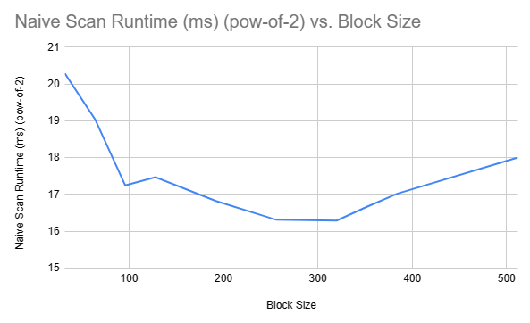
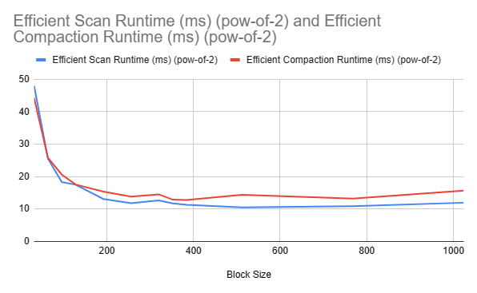
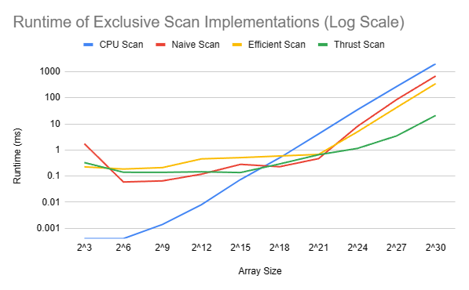
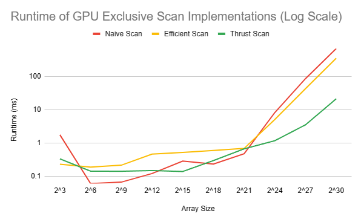
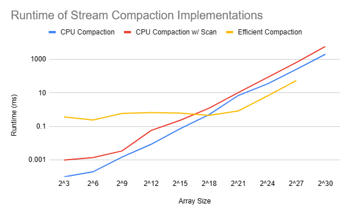
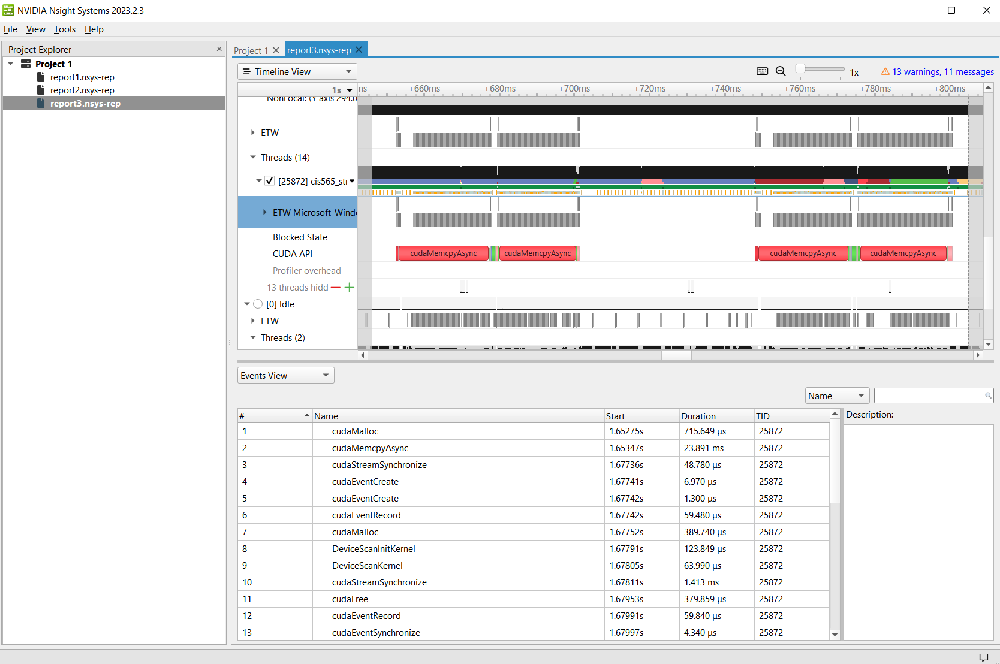

CUDA Stream Compaction
======================

**University of Pennsylvania, CIS 565: GPU Programming and Architecture, Project 2**

Jason Li   ([LinkedIn](https://linkedin.com/in/jeylii))
* Tested on: Windows 10, Ryzen 5 3600X @ 3.80GHz 32 GB, NVIDIA RTX 4070 

## **Implementation and Performance Analysis**

Four different implementations of exclusive scan are considered:
- A CPU implementation, which simply loops through the elements of the input array and sums them;
- A Naive GPU implementation, which performs O(nlogn) addition operations in parallel;
- A Work-efficient GPU implementation, which performsn O(n) addition operations in parallel;
- The NVIDIA Thrust library's implementation.

Futhermore, we are considering three different implementations of stream compaction:
- A CPU implementation without using the CPU implementation of exclusive scan;
- A CPU implementation using the CPU implementation of exclusive scan;
- A GPU work-efficient implementation, using our work-efficient implementation of exclusive scan.

For extra credit, our work-efficient GPU implementation is sufficiently faster than our naive and CPU implementations, especially for higher array sizes.

### **Performance for Increasing Array Sizes**
Below we analyze the performance differences between these three implementations.

First, we roughly optimize the block size for each of our GPU implementations. This is done here by scanning through a range of block sizes, executing the test program, and comparing runtimes throughout the range.

 


As seen in the first graph above, for our naive implementations of exclusive scan, the fastest runtime was observed using a block size of **320**, which we will be using for any further comparisons.
As seen in the second graph above, for both our work-efficient implementation of exclusive scan and stream compaction, the fastest runtimes were seen when using a block size of **512**, whch we will be using in any further comparisons. 



From this graph, we can see that while the CPU implementation is much faster for small array sizes on the order of 100K or less, the GPU implementation quickly takes over in terms of speed afterwards and is an order of magnitude faster for large array sizes.
The CPU implementation is likely much faster for small array sizes due to the overhead universal to all GPU implementations, such as memory copying within the GPU, thread scheduling, and kernel calls from the CPU to GPU.
However, once the array sizes become large, the parallelism inherent to the GPU implementations quickly make them much faster than the CPU implementation.



When we compare within GPU implementations, as in the graph above, we see that for small array sizes (on the order of 1M or less), the differences between the GPU scan implementations is negligible, and the work-efficient scan is in fact generally the slowest implementation. However, after the array sizes become large, the differences between the implementations become clear - with the naive implementation being the slowest, followed by the work-efficient scan, and then followed by the thrust library implementation, which is by far the fastest by an order of magnitude.

This is expected, as the naive implementation contains several inefficiencies, such as the need to ping-pong between buffers to avoid a race condition, unused threads, and more operations than necessary. The efficient scan eliminates these inefficiencies but runs into additional overhead with memory operations and kernel calls. This is likely why it is slower than the naive implementation on small array sizes. The thrust library's implementation is fastest by a large margin - for the largest array size tested of 2<sup>30</sup>, it was about 15-16 times faster than our work-efficient scan. This is likely due to the use of shared memory as opposed to the global memory used by our GPU implementations.



When comparing runtimes of stream compaction implementations, we see that similarly to our scan analysis, the CPU implementations are much faster for small array sizes, while the work-efficient GPU implementation becomes faster one array sizes become large. This is expected due to both the overhead, such as memory operations, and parallelism that come with the GPU implementation. 

Some improvements that could be made to our work-efficient GPU implementations of the exclusive scan and stream compaction are changing the order that we access indices during our passes and removing memory operations. Changing the order of index access could be done such that the active threads in each pass are contained in less warps, which reduces the scheduling work as more warps terminate. In addition, currently we are accessing GPU memory to return our final array size during stream compaction, and to set the last array index to 0 during the "up-sweep" step of the scan operation. These costly memory operations could be optimized out to speed up runtime.

### Profiling of Thrust Implementation 



When looking into the Nsight timeline for the Thrust implementation's execution on an array of size 2<sup>25</sup>, we can see that for the two calls to the thrust scan shown in the timeline, over 90% of the time is taken up by memory operations. Here, for the two memory operations which run for >20 ms, the DeviceScanKernel itself only runs for about 63 us. While the thrust library's calculations themselves are extremely optimized, the function is ultimately bottlenecked by I/O operations such as cudaMemcpy. Our other GPU implementations are likely similarly bottlenecked; they require extensive costly global memory access as we are not using shared memory and multiple kernel calls, so computation is likely not the bottleneck here.

## Test Program Output
This is the test program's output for an array size of 2<sup>27</sup>, with no additional tests added.
```
****************
** SCAN TESTS **
****************
    [  33  20  46   0   6   2  18  12  18  44  29  43  34 ...   9   0 ]
==== cpu scan, power-of-two ====
   elapsed time: 261.214ms    (std::chrono Measured)
    [   0  33  53  99  99 105 107 125 137 155 199 228 271 ... -1007576195 -1007576186 ]
==== cpu scan, non-power-of-two ====
   elapsed time: 257.151ms    (std::chrono Measured)
    [   0  33  53  99  99 105 107 125 137 155 199 228 271 ... -1007576245 -1007576214 ]
    passed
==== naive scan, power-of-two ====
   elapsed time: 73.2ms    (CUDA Measured)
    passed
==== naive scan, non-power-of-two ====
   elapsed time: 72.0187ms    (CUDA Measured)
    passed
==== work-efficient scan, power-of-two ====
   elapsed time: 41.301ms    (CUDA Measured)
    passed
==== work-efficient scan, non-power-of-two ====
   elapsed time: 41.2993ms    (CUDA Measured)
    passed
==== thrust scan, power-of-two ====
   elapsed time: 3.54906ms    (CUDA Measured)
    passed
==== thrust scan, non-power-of-two ====
   elapsed time: 3.20854ms    (CUDA Measured)
    passed

*****************************
** STREAM COMPACTION TESTS **
*****************************
    [   3   0   3   0   1   1   2   2   0   0   1   2   0 ...   1   0 ]
==== cpu compact without scan, power-of-two ====
   elapsed time: 248.794ms    (std::chrono Measured)
    [   3   3   1   1   2   2   1   2   1   2   3   3   3 ...   2   1 ]
    passed
==== cpu compact without scan, non-power-of-two ====
   elapsed time: 249.189ms    (std::chrono Measured)
    [   3   3   1   1   2   2   1   2   1   2   3   3   3 ...   1   1 ]
    passed
==== cpu compact with scan ====
   elapsed time: 690.428ms    (std::chrono Measured)
    [   3   3   1   1   2   2   1   2   1   2   3   3   3 ...   2   1 ]
    passed
==== work-efficient compact, power-of-two ====
   elapsed time: 69.2437ms    (CUDA Measured)
    passed
==== work-efficient compact, non-power-of-two ====
   elapsed time: 51.8314ms    (CUDA Measured)
    passed
```

