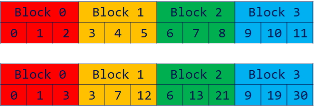
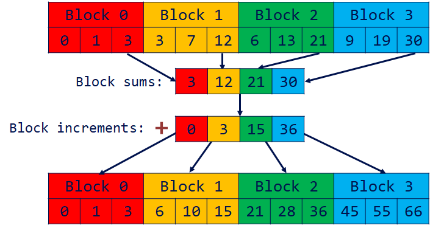
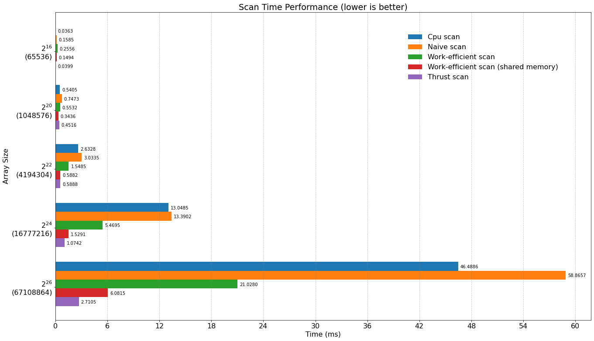
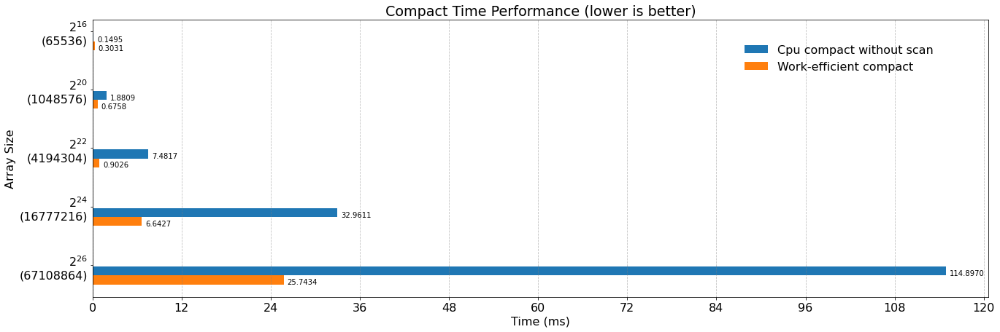
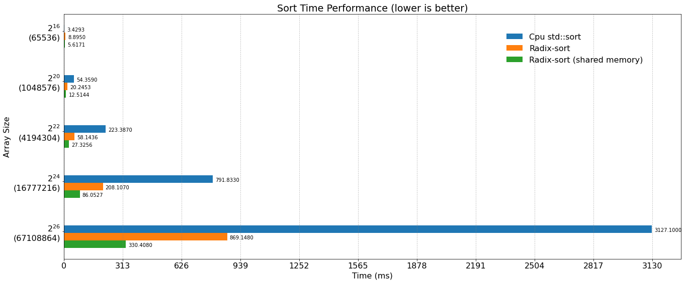
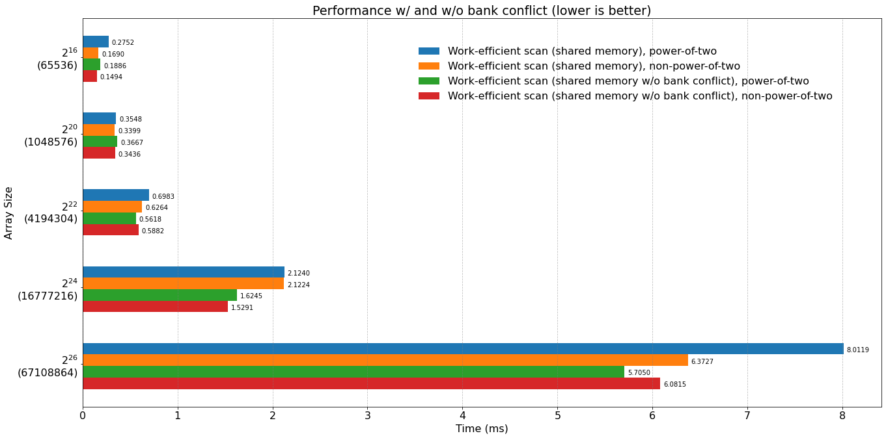
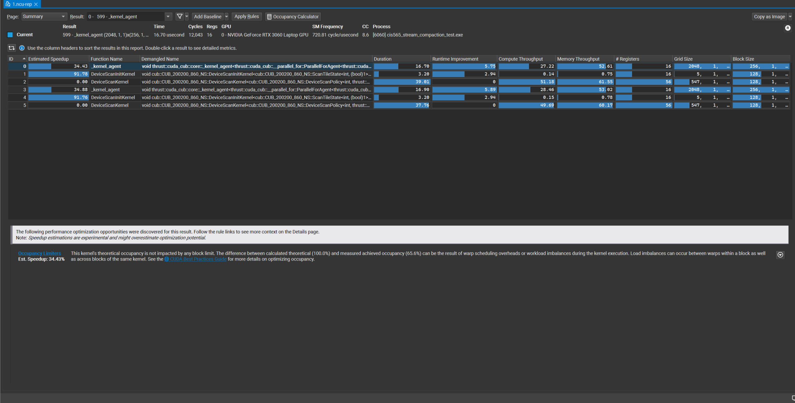

CUDA Stream Compaction
======================

**University of Pennsylvania, CIS 565: GPU Programming and Architecture, Project 2**

* Gehan Zheng
  * [LinkedIn](https://www.linkedin.com/in/gehan-zheng-05877b24a/), [personal website](https://grahamzen.github.io/).
* Tested on: Windows 10, AMD Ryzen 7 5800H @ 3.2GHz 16GB, GeForce RTX 3060 Laptop 6144MB (Personal Laptop)

## Features

This project implements the following algorithms on CPU and GPU. All extra parts are implemented:

* Scan

  * CPU Scan (Part 1)
  * Naive GPU Scan (Part 2)
  * Efficient GPU Scan (Part 3, 5)
  * Thrust Scan (Part 4)
  * GPU Scan Using Shared Memory && Hardware Optimization (Part 7)
* Stream Compaction

  * CPU Stream Compaction (Part 1)
  * GPU Stream Compaction (Part 3)
* Radix Sort (Part 6)
  * Shared Memory Optimization

### Comments on Part 5

When writing kernel functions, I use stride to compact threads in less warps from the beginning so it is faster than cpu approach for larger array size. 

### Comments on Part 7

GPU Scan Using Shared Memory is implemented through  using following scheme (courtesy of slides(Parallel Algorithms)):



 We can perform action of storing data into shared memory for each block, and then perform scan on each block.
 Instead of performing inclusive scan as in the slides, I perform exclusive scan on each block, so that in the last step, the result is naturally exclusive scan on the whole array. Within this step, we can also compute the sum of each block inside the same kernel. Since I am performing exclusive scan, Block sums needed to be computed instead of simply using the last element of each block (still in the same kernel).



After we have the block sums, we can perform exclusive scan on the block sums, and then add the result to each block. However, when # of elements is large like $2^{28}$, a better way is to reuse the kernel we have written for the first step since # of block sums is still large. We will do this until # of block sums is small enough to be computed on CPU. Obviously, we should also continuously add the block sums back to the array until we get the final result. It requires much more cudaMalloc if we call cudaMalloc for computing each block sum. So I use a buffer to store both the block sums and the array, and using different offset to access them. Thanks Chang Liu for this idea.

For reducing bank conflict, I simply add an offset to the index of shared memory. I have tried using the scheme in [GPU Gem Ch 39](https://developer.nvidia.com/gpugems/gpugems3/part-vi-gpu-computing/chapter-39-parallel-prefix-sum-scan-cuda), but it is not faster than the scheme I am using now.

## Performance Analysis

### Choosing Block Size

I tested the performance of different block sizes on scan. In the table below, time is in milliseconds.

| Block Size                                            |       32 |      64 |      128 |      256 |      512 |
| ----------------------------------------------------- | -------: | ------: | -------: | -------: | -------: |
| Naive scan, power-of-two                              |  353.852 |  263.32 |  259.132 |  266.057 |   259.93 |
| Naive scan, non-power-of-two                          |  354.332 | 265.482 |  260.186 |  262.097 |  259.205 |
| Work-efficient scan, power-of-two                     |  81.0401 | 82.6295 |  83.5005 |  83.4684 |  83.6312 |
| Work-efficient scan, non-power-of-two                 |  81.1159 | 82.5769 |   84.338 |  83.9051 |  83.9558 |
| Work-efficient scan (shared memory), power-of-two     |  46.8579 | 27.9556 |  22.0506 |  23.4973 |  26.1206 |
| Work-efficient scan (shared memory), non-power-of-two |  46.3985 | 28.2063 |  22.0158 |  23.4613 |   26.032 |
| Thrust scan, power-of-two                             |  9.61946 | 9.43411 |  9.40954 |  9.66554 |  9.69523 |
| Thrust scan, non-power-of-two                         |   9.2928 | 9.81402 |  9.55187 |  9.22931 |  9.29382 |
| Average                                               | 122.8136 | 96.1773 | 93.77304 | 95.17262 | 94.73296 |

Though the performance difference is not significant, from the table above, we can still easily find that the best block size is 128, which outperforms other block sizes in most cases.

### Comparing different algorithms

* Scan

For clarity, I only plot the performance of non-power-of-two scan.



Excitingly, in several cases ($2^{20}, 2^{22}$), work-efficient scan using shared memory is faster than Thrust scan. My guess is that Thrust scan isn't well-optimized for these array sizes because it is designed for larger array sizes and it's hard to optimize for every array size.

* Stream Compaction


* Radix Sort

For Radix sort, I tested performance of sorting integers within range [0, 2^31-1].



From the figure above, we can see that Radix sort is much faster than std::sort when array size is comparatively large, and it is even faster when optimizing for shared memory. 


* Comparing Scan w/ and w/o bank conflict reduction



We can see a roughly 20% performance improvement when using bank conflict reduction, and the performance improvement is more significant when array size is large.
#### Guess about implementation of Thrust Scan



From the profile we can see that Thrust Scan launches 3 kernels. I confirm that they are launched in this order by observing the order of the kernels while profiling.
Since DeviceScanKernel uses 56 registers, much more than any other kernels, I guess it is the kernel for computing scan. From the name I guess what another two kernels has done is to prepare for the context of DeviceScanKernel kernel.


Since I don't know any details about the implementation of Thrust Scan, I will not explain the performance of Thrust Scan.

### Phenomena we can observe from the figure of Scan
* For small array size, CPU scan is much faster than GPU scan. 
  * It is because the overhead of launching kernel is much larger than the time spent on computing scan. As the array size increases, the time spent on computing scan becomes more significant, and GPU scan outperforms CPU scan.

* Naive scan is always slower than CPU scan, and work-efficient scan is faster than CPU scan when array size is large enough. 
  * It is because Naive scan launches kernel much more times than work-efficient scan, and when array size is large enough, the time spent on computing scan is much larger than the overhead of launching kernel. Though work-efficient scan is faster than CPU scan, it accesses data using global memory, which has a much lower bandwidth than shared memory.

### Bottleneck of Scans

* Naive Scan
  * Memory I/O: Global Memory Bandwidth
  * Computation: Warps' Low Occupancy due to memory access pattern (large stride).

* Work-efficient Scan
  * Memory I/O: Global Memory Bandwidth.

* Work-efficient Scan Using Shared Memory: 
  * Computation: Overhead of launching kernels.


### Output of the test program

I added tests for work-efficient scan with shared memory(both power-of-two and non-power-of-two), std::sort, and Radix sort with and without shared memory(both power-of-two and non-power-of-two).

```

****************
** SCAN TESTS **
****************
    [  23  22   5  42  29  39   9  20  41  37  14   4  27 ...  22   0 ]
==== cpu scan, power-of-two ====
   elapsed time: 245.021ms    (std::chrono Measured)
    [   0  23  45  50  92 121 160 169 189 230 267 281 285 ... -2015456254 -2015456232 ]
==== cpu scan, non-power-of-two ====
   elapsed time: 195.01ms    (std::chrono Measured)
    [   0  23  45  50  92 121 160 169 189 230 267 281 285 ... -2015456389 -2015456348 ]
    passed
==== naive scan, power-of-two ====
   elapsed time: 260.406ms    (CUDA Measured)
    passed
==== naive scan, non-power-of-two ====
   elapsed time: 259.134ms    (CUDA Measured)
    passed
==== work-efficient scan, power-of-two ====
   elapsed time: 83.6105ms    (CUDA Measured)
    passed
==== work-efficient scan, non-power-of-two ====
   elapsed time: 83.6329ms    (CUDA Measured)
    passed
==== work-efficient scan (shared memory), power-of-two ====
   elapsed time: 22.0134ms    (CUDA Measured)
    passed
==== work-efficient scan (shared memory), non-power-of-two ====
   elapsed time: 21.939ms    (CUDA Measured)
    passed
==== thrust scan, power-of-two ====
   elapsed time: 9.83552ms    (CUDA Measured)
    passed
==== thrust scan, non-power-of-two ====
   elapsed time: 9.20576ms    (CUDA Measured)
    passed

*****************************
** STREAM COMPACTION TESTS **
*****************************
    [   3   0   2   0   3   3   3   2   3   0   2   3   1 ...   1   0 ]
==== cpu compact without scan, power-of-two ====
   elapsed time: 461.709ms    (std::chrono Measured)
    [   3   2   3   3   3   2   3   2   3   1   1   3   3 ...   2   1 ]
    passed
==== cpu compact without scan, non-power-of-two ====
   elapsed time: 461.435ms    (std::chrono Measured)
    [   3   2   3   3   3   2   3   2   3   1   1   3   3 ...   3   1 ]
    passed
==== cpu compact with scan ====
   elapsed time: 834.647ms    (std::chrono Measured)
    [   3   2   3   3   3   2   3   2   3   1   1   3   3 ...   2   1 ]
    passed
==== work-efficient compact, power-of-two ====
   elapsed time: 102.577ms    (CUDA Measured)
    passed
==== work-efficient compact, non-power-of-two ====
   elapsed time: 103.391ms    (CUDA Measured)
    passed

*****************************
** RADIX-SORT TESTS **
*****************************
    [ 22645 21411 14651 15547 10324 2673 8146 27956 23148 22752 30878 16323 20512 ... 24259   0 ]
==== cpu std::sort, power-of-two ====
   elapsed time: 12380.9ms    (std::chrono Measured)
==== radix-sort, power-of-two ====
   elapsed time: 3215.3ms    (CUDA Measured)
    passed
==== radix-sort (shared memory), power-of-two ====
   elapsed time: 1301.83ms    (CUDA Measured)
    passed
==== cpu std::sort, non-power-of-two ====
   elapsed time: 12305.5ms    (std::chrono Measured)
==== radix-sort, non-power-of-two ====
   elapsed time: 3214.63ms    (CUDA Measured)
==== radix-sort (shared memory), non-power-of-two ====
   elapsed time: 1301.99ms    (CUDA Measured)
    passed
```
