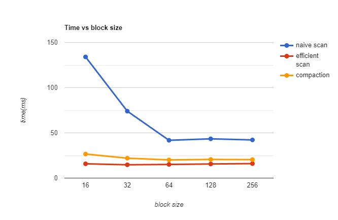
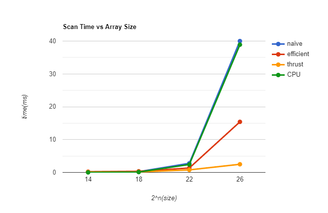
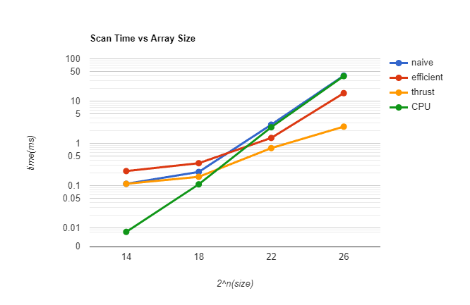

CUDA Stream Compaction
======================

**University of Pennsylvania, CIS 565: GPU Programming and Architecture, Project 2**

* Tianyi Xiao
  * [LinkedIn](https://www.linkedin.com/in/tianyi-xiao-20268524a/), [personal website](https://jackxty.github.io/), [Github](https://github.com/JackXTY).
* Tested on: Windows 11, i9-12900H @ 2.50GHz 16GB, Nvidia Geforce RTX 3070 Ti 8032MB (Personal Laptop)

### Description

This is a project where I implement several parallel calculation algorithms using CUDA, which includes:

- Scan (calculate exclusive prefix sum) (with CPU, naive GPU, and work effcient GPU version)
- Stream Compaction (remove 0 from given array) (with CPU, GPU work effcient, and thrust version)
- Update for work effcient version, to make it faster than CPU version
- GPU Radix sort

### Question & Analysis

- #### Block Size Optimization



I have done the test with diagram above, where array size is 2^26, which is sufficiently big enough to show the advantage of GPU calculation.

And we can see that, when block size is bigger than 64, there is no big difference. Therefore I just choose 64 as block size for following tests.

- #### Array Size Optimization





The 2 graphs are same. I just want to show the detail data more clearly.

When the data size is quite small, like smaller than 2^20, GPU is generally slower since accessing the global memory make GPU speed slower than CPU.

However, as the data size grows larger, the advantage of GPU shows up, where data is handled simultaneously. The naive approach is slower than effcient version and thrust without doubt, according to its algorithm. The naive algorithm is O(NlogN), and the efficient one is actually O(N).

And, I think, the reason why thrust version is faster than effcient algorithm is that, it utilize the local memory to speed up.

- #### Stream Compaction Analysis

Generally speaking, when array size is large enough (like 2^26), the GPU version is faster than CPU version. And the CPU non-scan version is faster the scan version.

First of all, without parallel algorithm, the CPU scan version needs to travser array 3 times, and non-scan version just needs to traverse once. So appearently CPU non-scan version is faster than CPU scan version.

And thanks to the parallel calculation, the GPU version is faster with no doubt. Though the total calculation times is much more, but all work are divided into multiple SM. So the work for each SM to calculate is quite few, and it's much more faster.

- #### Radix Sort Analysis

For the CPU version, I just use ``sort(begin, end)`` in C++ standard library. My GPU radix sort is faster than CPU version, with utilizing the parallel ability of GPU programming.

However, the thrust version is faster. I think, first, thrust might utilize the shared memory to speed up. What's more, it might modify the sort algorithm for faster speed. For example, it's possible that it divide the array into several parts, sort each part and then merge them together.

### Output

Run with block size 64, and array size 2^26.

```
****************
** SCAN TESTS **
****************
    [  32  27  21   1  19  17  27   2  22  13   4   8  48 ...   7   0 ]
==== cpu scan, power-of-two ====
   elapsed time: 33.9077ms    (std::chrono Measured)
    [   0  32  59  80  81 100 117 144 146 168 181 185 193 ... 1643585129 1643585136 ]
==== cpu scan, non-power-of-two ====
   elapsed time: 34.1126ms    (std::chrono Measured)
    [   0  32  59  80  81 100 117 144 146 168 181 185 193 ... 1643585075 1643585084 ]
    passed
==== naive scan, power-of-two ====
   elapsed time: 40.1357ms    (CUDA Measured)
    passed
==== naive scan, non-power-of-two ====
   elapsed time: 39.4772ms    (CUDA Measured)
    passed
==== work-efficient scan, power-of-two ====
   elapsed time: 16.2426ms    (CUDA Measured)
    passed
==== work-efficient scan, non-power-of-two ====
   elapsed time: 15.7951ms    (CUDA Measured)
    passed
==== thrust scan, power-of-two ====
   elapsed time: 2.32221ms    (CUDA Measured)
    passed
==== thrust scan, non-power-of-two ====
   elapsed time: 2.38698ms    (CUDA Measured)
    passed

*****************************
** STREAM COMPACTION TESTS **
*****************************
    [   2   2   1   2   0   1   0   3   3   3   0   0   1 ...   2   0 ]
==== cpu compact without scan, power-of-two ====
   elapsed time: 139.773ms    (std::chrono Measured)
    [   2   2   1   2   1   3   3   3   1   2   1   3   1 ...   1   2 ]
    passed
==== cpu compact without scan, non-power-of-two ====
   elapsed time: 139.991ms    (std::chrono Measured)
    [   2   2   1   2   1   3   3   3   1   2   1   3   1 ...   1   3 ]
    passed
==== cpu compact with scan ====
   elapsed time: 271.2ms    (std::chrono Measured)
    [   2   2   1   2   1   3   3   3   1   2   1   3   1 ...   1   2 ]
    passed
==== work-efficient compact, power-of-two ====
   elapsed time: 20.2947ms    (CUDA Measured)
    passed
==== work-efficient compact, non-power-of-two ====
   elapsed time: 20.7249ms    (CUDA Measured)
    passed

****************
** RADIX SORT **
****************
    [  45   3  42   0  10   6  27  43  32  39  12  34  17 ...  40   0 ]
==== thrust sort, power-of-two ====
   elapsed time: 16.6655ms    (CUDA Measured)
    [   0   0   0   0   0   0   0   0   0   0   0   0   0 ...  49  49 ]
==== cpu sort, power-of-two ====
   elapsed time: 1206.99ms    (std::chrono Measured)
    passed
==== gpu radix sort, power-of-two ====
   elapsed time: 233.331ms    (CUDA Measured)
    passed
```


Include analysis, etc. (Remember, this is public, so don't put
anything here that you don't want to share with the world.)

