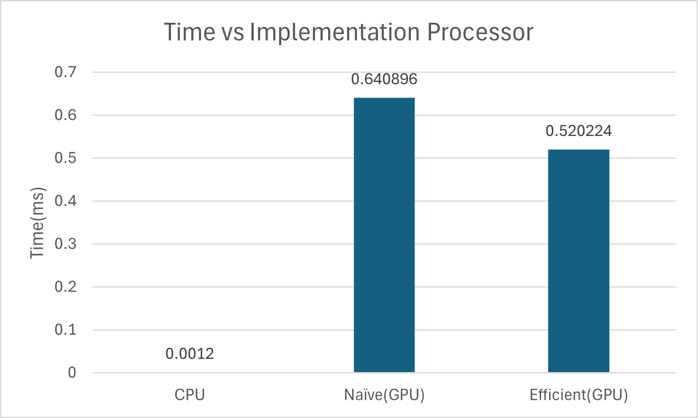

CUDA Stream Compaction
======================

**University of Pennsylvania, CIS 565: GPU Programming and Architecture, Project 2**

* MANVI AGARWAL
  * [LinkedIn](https://www.linkedin.com/in/manviagarwal27/)
* Tested on: Windows 11, AMD Ryzen 5 7640HS @ 4.30GHz 16GB, GeForce RTX 4060 8GB(personal)

### Performance Analysis

This repository compares the implementation of scan or prefix scan algorithm on CPU and GPU. The code in `main.cpp` does correctness check as well as profiles individual implementations to compute the time. The output for the test code is:

```
****************
** SCAN TESTS **
****************
    [  31  35  17  38   8  45   8  15  34  30  36  13  29 ...   7   0 ]
==== cpu scan, power-of-two ====
   elapsed time: 0.0012ms    (std::chrono Measured)
    [   0  31  66  83 121 129 174 182 197 231 261 297 310 ... 6271 6278 ]
==== cpu scan, non-power-of-two ====
   elapsed time: 0.0013ms    (std::chrono Measured)
    [   0  31  66  83 121 129 174 182 197 231 261 297 310 ... 6206 6242 ]
    passed
==== naive scan, power-of-two ====
   elapsed time: 0.640896ms    (CUDA Measured)
    passed
==== naive scan, non-power-of-two ====
   elapsed time: 0.16288ms    (CUDA Measured)
    passed
==== work-efficient scan, power-of-two ====
   elapsed time: 0.245184ms    (CUDA Measured)
    passed
==== work-efficient scan, non-power-of-two ====
   elapsed time: 0.115168ms    (CUDA Measured)
    passed
==== thrust scan, power-of-two ====
   elapsed time: 16.073ms    (CUDA Measured)
    passed
==== thrust scan, non-power-of-two ====
   elapsed time: 1.03667ms    (CUDA Measured)
    passed

*****************************
** STREAM COMPACTION TESTS **
*****************************
    [   3   1   1   2   0   3   2   1   0   0   0   1   3 ...   1   0 ]
==== cpu compact without scan, power-of-two ====
   elapsed time: 0.0012ms    (std::chrono Measured)
    [   3   1   1   2   3   2   1   1   3   3   2   3   3 ...   3   1 ]
    passed
==== cpu compact without scan, non-power-of-two ====
   elapsed time: 0.0011ms    (std::chrono Measured)
    [   3   1   1   2   3   2   1   1   3   3   2   3   3 ...   2   2 ]
    passed
==== cpu compact with scan ====
   elapsed time: 0.0055ms    (std::chrono Measured)
    [   3   1   1   2   3   2   1   1   3   3   2   3   3 ...   3   1 ]
    passed
==== work-efficient compact, power-of-two ====
   elapsed time: 0.077728ms    (CUDA Measured)
    passed
==== work-efficient compact, non-power-of-two ====
   elapsed time: 0.083264ms    (CUDA Measured)
    passed
```

## Computation comparison



## Insights

The results favor CPU implementation heavily in terms of timing. There are a couple of reasons for GPU implementation to be much slower than CPU one. All these limitations can be explored to look for optimization for GPU implementation.

Following are some of the reasons for GPU implementation to be much slower:

**1. Expensive memory operations:**
 For the implementation, I've used global memory and before calling GPU, the data is transferred from CPU memory to global memory which adds to the latency of GPU implementation.

 **2. Small computations and small data set:**
 Since each thread doesn't have a lot of computation, the time it takes to transfer data from host to device and back ends up surpassing the reduction in time that parallelization of computation attempts to achieve.

**3. Warp Partitioning:** 
With each iteration, number of threads working reduce but the corresponding warps remain active. This causes divergent wraps and hence the GPU is under-utilized. 


