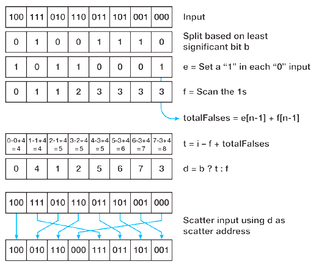
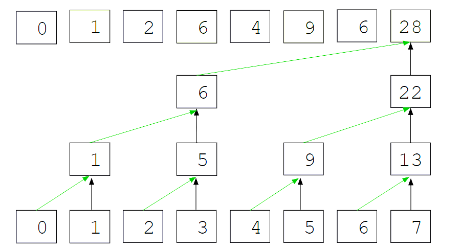
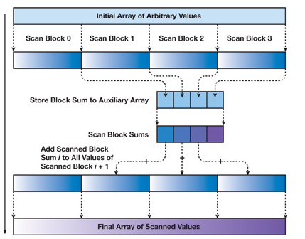
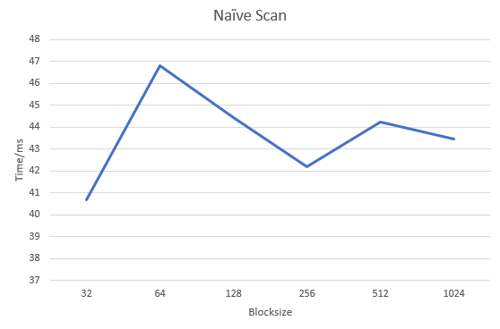
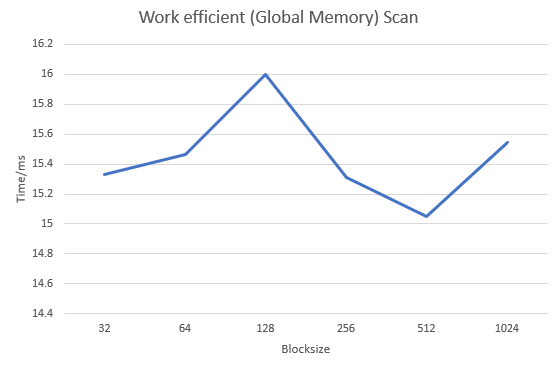
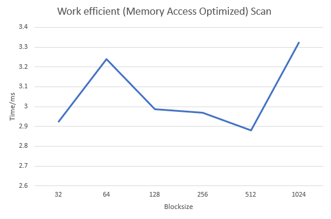
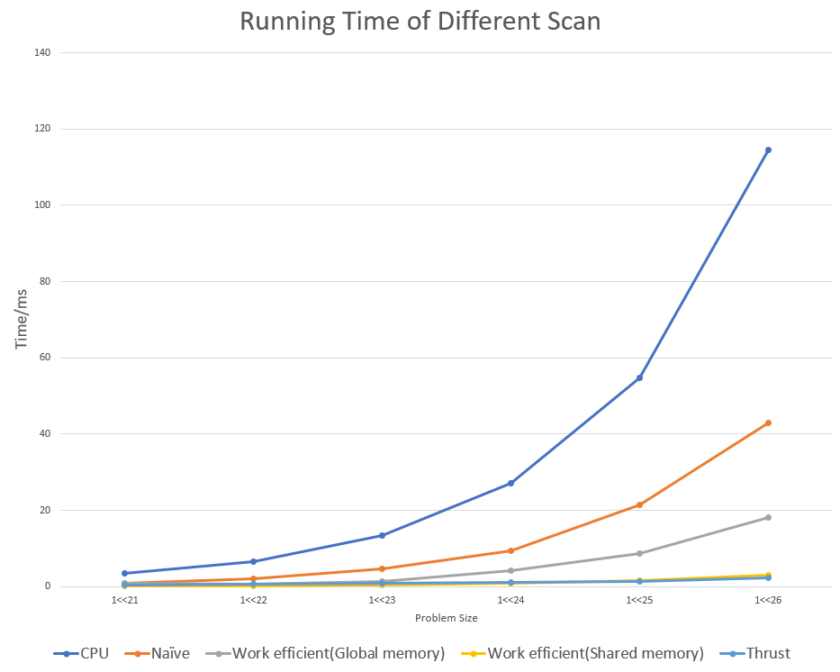

CUDA Stream Compaction
======================

**University of Pennsylvania, CIS 565: GPU Programming and Architecture, Project 2**

* Han Yang
  *  [LinkedIn](https://www.linkedin.com/in/han-yang-0031231a3/), [personal website](https://bdwhst.wixsite.com/portfolio), etc.
* Tested on: Windows 11, i9-12900HX @ 2.30GHz 16GB, RTX4080 laptop 12GB

### Principles

[Parallel Prefix Sum]([Chapter 39. Parallel Prefix Sum (Scan) with CUDA | NVIDIA Developer](https://developer.nvidia.com/gpugems/gpugems3/part-vi-gpu-computing/chapter-39-parallel-prefix-sum-scan-cuda))

### New Files

`radix_sort.cu, radix_sort.h`: CUDA source files for parallel radix sort

`efficient_sharedmem.cu, efficient_sharedmem.h`: CUDA source files for work efficient parallel scan with shared memory optimazition

### Extra Credits

**Part 5: Launch Least Number of Threads**

Use different number of blocks and different block size to launch kernel at each loop depth

**Part 6: Radix Sort**



Based on part7 (optimized work efficient scan). Deal with one bit a time, use parallel scan to put numbers with zeros before numbers with ones. Generate prefix scan with zero array. If current bit is zero, then this bit's position is indicated by the scaned array. If current bit is one, then this bit's position equals to zeros and ones ahead of it.

The result of GPU radix sort is compared with std::sort on CPU.

**Part 7: Optimized Work Efficient Scan**

Use shared memory per thread block to reduce global memory access. Every thread loads two elements from global memory, thus shared memory size is the twice of block size. Zip the CPU loop in part 3 into GPU code.



In up sweep, for each level there is only a certain number of threads that actual do work. Use threadIdx.x to identify these threads, and perform addition on shared memory. This process is similar for down sweep. Don't forget to set shared array's last element to zero. And don't forget to synchronize threads at each tree level.

Process above can only deal with array size less than 2048 (Maximum number of threads in a block is 1024, each thread can process two array elements). For array with arbitrary size, we need to scan each block separately, then merge them. This will create a hierarchy of scan.



For each level of scan, if the current array size is less or equal to 2*blocksize, then this can be done in one block, otherwise, a new level of scan should be created. To handle memory allocation swiftly and elegantly, I choose to implement a RAII class that can help the scan process. So creating a instance of this class will automatically allocate all the space we need for the whole scan hierarchy, and the malloced space will be automatically freed when the instance dies out.

After implemented shared memory optimization, another problem becomes important: bank conflict.


This is because the shared memory is divided into 32 banks (continuous address falls into banks for every four byte word), and in each clock cycle, one bank can only allow one write to the bank. In this case, memory access (especially writes) with a stride greater than 1(two's powers) will suffer from bank write conflicts.

Here I chose to use a xor and bit shift operation `x ^ (x >> 3)` to shuffle the address, in order to reduce conflicts. It can be proven that this function can map [0,2^n] to [0,2^n], and it is bijective. So we don't need to worry about illegal memory access (buffer overflow) after using it.

After shuffling the address, the performance of work efficient scan is improved a bit.

### Answers to questions:

1. **Roughly optimize the block sizes of each of your implementations for minimal run time on your GPU.**

   Tested when N=1<<26 with non-power-of-two







2. **Compare all of these GPU Scan implementations (Naive, Work-Efficient, and Thrust) to the serial CPU version of Scan. Plot a graph of the comparison**
   **(with array size on the independent axis).**

   

3. **Write a brief explanation of the phenomena you see here. Can you find the performance bottlenecks? Is it memory I/O? Computation? Is**
   **it different for each implementation?**

   Bottle neck for naive implementation: computation, memory IO

   Bottle neck for basic work efficient implementation: memory IO

   Bottle neck for shared memory work efficient implementation: bank conflict (although it has been reduced by index shuffle)

4. **Paste the output of the test program into a triple-backtick block in your README.**

   Results when n=1<<26:

   ***Optimized Work Efficient Performance running time = Thrust Implementation Running Time x 1.5***
   
   ```
   ****************
   ** SCAN TESTS **
   ****************
       [  12  10  10  45  24  47   6  40  43  10  15  45   4 ...   0   0 ]
   ==== cpu scan, power-of-two ====
      elapsed time: 112.537ms    (std::chrono Measured)
       [   0  12  22  32  77 101 148 154 194 237 247 262 307 ... 1643389832 1643389832 ]
   ==== cpu scan, non-power-of-two ====
      elapsed time: 115.05ms    (std::chrono Measured)
       [   0  12  22  32  77 101 148 154 194 237 247 262 307 ... 1643389755 1643389798 ]
       passed
   ==== naive scan, power-of-two ====
      elapsed time: 44.3228ms    (CUDA Measured)
       passed
   ==== naive scan, non-power-of-two ====
      elapsed time: 41.4715ms    (CUDA Measured)
       passed
   ==== work-efficient scan, power-of-two ====
      elapsed time: 15.1124ms    (CUDA Measured)
       passed
   ==== work-efficient scan, non-power-of-two ====
      elapsed time: 15.0784ms    (CUDA Measured)
       passed
   ==== work-efficient with shared memory scan, power-of-two ====
      elapsed time: 3.34458ms    (CUDA Measured)
       passed
   ==== work-efficient with shared memory scan, non-power-of-two ====
      elapsed time: 3.06925ms    (CUDA Measured)
       passed
   ==== thrust scan, power-of-two ====
      elapsed time: 2.15645ms    (CUDA Measured)
       passed
   ==== thrust scan, non-power-of-two ====
      elapsed time: 2.54874ms    (CUDA Measured)
       passed
   
   *****************************
   ** STREAM COMPACTION TESTS **
   *****************************
       [   2   3   3   0   3   3   1   0   1   2   0   3   3 ...   0   0 ]
   ==== cpu compact without scan, power-of-two ====
      elapsed time: 134.329ms    (std::chrono Measured)
       [   2   3   3   3   3   1   1   2   3   3   1   1   2 ...   1   2 ]
       passed
   ==== cpu compact without scan, non-power-of-two ====
      elapsed time: 135.326ms    (std::chrono Measured)
       [   2   3   3   3   3   1   1   2   3   3   1   1   2 ...   3   1 ]
       passed
   ==== cpu compact with scan ====
      elapsed time: 303.47ms    (std::chrono Measured)
       [   2   3   3   3   3   1   1   2   3   3   1   1   2 ...   1   2 ]
       passed
   ==== work-efficient compact, power-of-two ====
      elapsed time: 19.226ms    (CUDA Measured)
       passed
   ==== work-efficient compact, non-power-of-two ====
      elapsed time: 18.8528ms    (CUDA Measured)
       passed
   ==== work-efficient with shared memory compact, power-of-two ====
      elapsed time: 6.82803ms    (CUDA Measured)
       passed
   ==== work-efficient with shared memory compact, non-power-of-two ====
      elapsed time: 6.3039ms    (CUDA Measured)
       passed
   
   *****************************
   ** RADIX SORT TESTS **
   *****************************
       [ 20225 32636 11831 32563 23464 25404 5138 3981 1304 30385 19624 9771 13405 ... 12783 30982 ]
   ==== cpu std::sort, power-of-two ====
      elapsed time: 3066.8ms    (std::chrono Measured)
       [   0   0   0   0   0   0   0   0   0   0   0   0   0 ... 32767 32767 ]
   ==== cpu std::sort, non-power-of-two ====
      elapsed time: 3058.15ms    (std::chrono Measured)
       [   0   0   0   0   0   0   0   0   0   0   0   0   0 ... 32767 32767 ]
   ==== radix sort, power-of-two ====
      elapsed time: 506.653ms    (CUDA Measured)
       passed
   ==== radix sort, non-power-of-two ====
      elapsed time: 313.52ms    (CUDA Measured)
       passed
   ```
   
   
