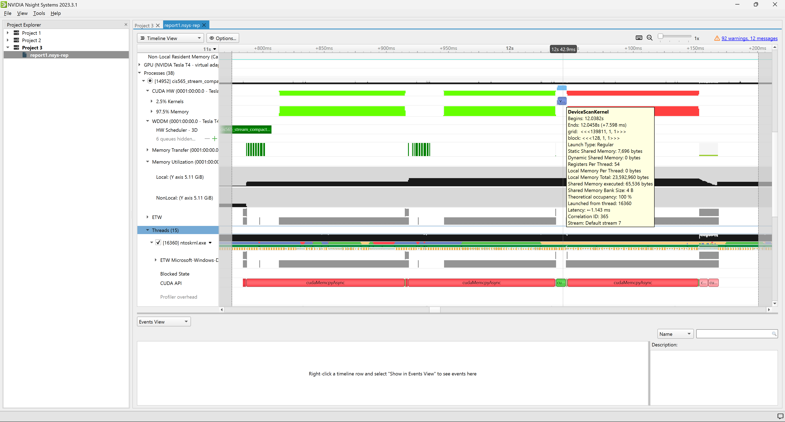

CUDA Stream Compaction
======================

**University of Pennsylvania, CIS 565: GPU Programming and Architecture, Project 2**

* Zhenzhong Tang
  * [LinkedIn](https://www.linkedin.com/in/zhenzhong-anthony-tang-82334a210), [Instagram](https://instagram.com/toytag12), [personal website](https://toytag.net/)
* Tested on: Windows 11 Pro 22H2, AMD EPYC 7V12 64-Core Processor (4 vCPU cores) @ 2.44GHz 28GiB, Tesla T4 16GiB (Azure)

## Implementations

We have five different implementations to compare:
- CPU Scan: iterates through the array and add the previous element to the current element.
- GPU Naive Scan: each thread add its element to an element at some offset.
- GPU Work Efficient Scan from Lecture: up-sweep and down-sweep.
- GPU Work Efficient Scan from GPU Gems3
  - Rearranged threads to prevent **warp partitioning**.
  - Implemented **shared memory** acceleration.
  - Optimized shared memory access to avoid **bank conflicts**.
  - Recursive call to handle arbitrary array size without rounding to the next power of 2.
- Thrust Scan: optimized implementation from NVIDIA.

### Sample Output
Tested with `int[2^29]` and CUDA Block Size 128.

```
****************
** SCAN TESTS **
****************
    [  39  29  12  48  27  43  42  11   9   8   5   1   5 ...  11   0 ]
==== cpu scan, power-of-two ====
   elapsed time: 1370.71ms    (std::chrono Measured)
    [   0  39  68  80 128 155 198 240 251 260 268 273 274 ... 263761477 263761488 ]
==== cpu scan, non-power-of-two ====
   elapsed time: 1369.71ms    (std::chrono Measured)
    [   0  39  68  80 128 155 198 240 251 260 268 273 274 ... 263761350 263761388 ]
    passed
==== naive scan, power-of-two ====
   elapsed time: 508.908ms    (CUDA Measured)
    passed
==== naive scan, non-power-of-two ====
   elapsed time: 506.161ms    (CUDA Measured)
    passed
==== work-efficient scan, power-of-two ====
   elapsed time: 48.7929ms    (CUDA Measured)
    passed
==== work-efficient scan, non-power-of-two ====
   elapsed time: 48.7834ms    (CUDA Measured)
    passed
==== thrust scan, power-of-two ====
   elapsed time: 17.1458ms    (CUDA Measured)
    passed
==== thrust scan, non-power-of-two ====
   elapsed time: 16.7649ms    (CUDA Measured)
    passed

*****************************
** STREAM COMPACTION TESTS **
*****************************
    [   3   0   0   0   1   3   1   3   3   1   3   0   1 ...   0   0 ]
==== cpu compact without scan, power-of-two ====
   elapsed time: 1345.11ms    (std::chrono Measured)
    [   3   1   3   1   3   3   1   3   1   3   2   3   3 ...   2   2 ]
    passed
==== cpu compact without scan, non-power-of-two ====
   elapsed time: 1300.07ms    (std::chrono Measured)
    [   3   1   3   1   3   3   1   3   1   3   2   3   3 ...   1   2 ]
    passed
==== cpu compact with scan ====
   elapsed time: 2031.72ms    (std::chrono Measured)
    [   3   1   3   1   3   3   1   3   1   3   2   3   3 ...   2   2 ]
    passed
==== work-efficient compact, power-of-two ====
   elapsed time: 183.325ms    (CUDA Measured)
    passed
==== work-efficient compact, non-power-of-two ====
   elapsed time: 180.469ms    (CUDA Measured)
    passed
```


## Performance Analysis
Tests done with CUDA block size as 128 unless otherwise specified. And we choose to test array size with non-power-of-2 to represent more general use cases.

### Array Size

First, not shown in the graph, with less than or around a few thousands of elements, the CPU sequential scan is actually faster than the GPU implementations. This is because the overhead of copying data to GPU and back is too large compared to the actual computation time. The GPU implementations are all faster than the CPU sequential scan when the array size is large enough.


Now let's look at the graph. With over 1 million elements, the CPU sequential scan starts to show inefficiency. Naive GPU implementation is actually a bit faster than the work efficient version from lecture. Based on GPU Gems3 Scan, the optimized work efficient scan is much faster than any previous methods. Thrust scan is the fastest and optimized implementation from NVIDIA.


In conclusion, using thrust implementation as a baseline, the work efficient scan from lecture is around 10x to 20x slower. The optimized work efficient scan from gems3 is only around 1.5x to 3x slower than thrust, which is a big leap.

### Block Size

The influence of block size on performance is generally associated with hardware. It usually does not have a significant effect on the outcome.

In our case, especially with work efficient scan based on gems3, the block size has a relatively large impact on performance. The optimal point is around 128, and the runtime is half as block size 16 and two thirds as block size 1024. This is because, the work efficient scan based on gems3 runs a full up-sweep and down-sweep scan in one kernel call. If block size is too small, then the kernel would be called recursively many times to complete the task. If block size is too large, then in the middle of the scan, a number of threads would be idle, waiting for other threads to finish. This is a waste of resources.


All in All, the three GPU scan implementations follow the same trend, showing that the block size around 128 is the optimal point.

### Why is My GPU Approach So Slow?

This is true for relatively small size array and implementations from lecture slides. Copying to and from GPU, synchronizing threads, and other overheads are too large compared to the actual computation time. With a few thousand elements, the CPU could even store most of them in cache and run the computation even faster.

However, when the array size is significantly bigger, to beyond 1 million, CPU starts to fall short. All GPU implementations are faster than CPU sequential scan. Thrust absolutely dominates the game. Our optimized work efficient scan from gems3 is only around 1.5x to 3x slower than thrust, not bad.

So, fortunately, we did not encounter such issue. :D

### Trace of the Thrust Scan




We see the that thrust kernel call is very short. Our kernel is much slower. Thrust used static shared memory and more shared memory in total, and used more registers per thread. All these factors contribute to the performance difference.
