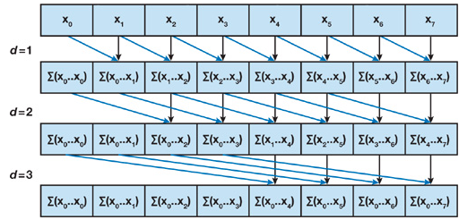
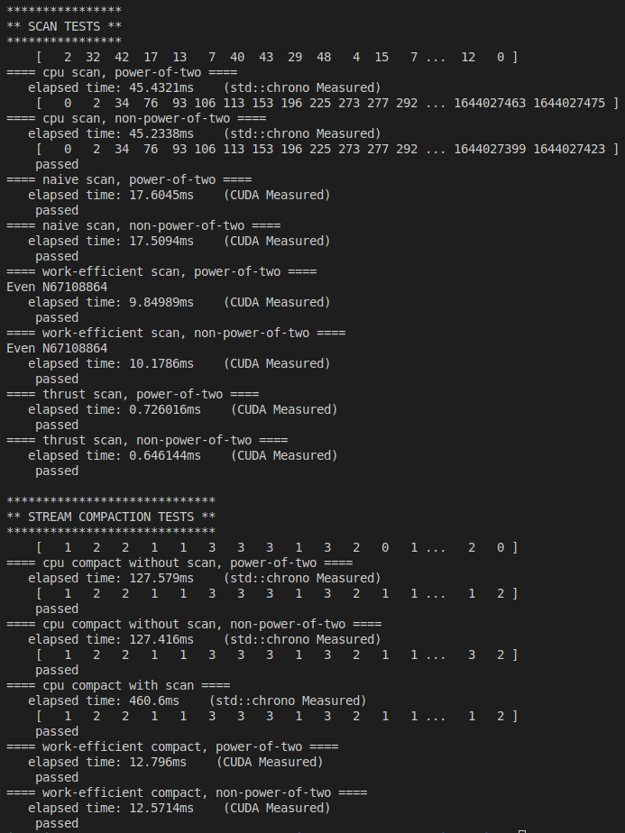

CUDA Stream Compaction
======================
**University of Pennsylvania, CIS 5650: GPU Programming and Architecture,
Project 2 - Stream Compaction**

* Joshua Smith
  * [LinkedIn](https://www.linkedin.com/in/joshua-smith-32b165158/)
* Tested on: Ubuntu 20.04, Ryzen 9 3900x @ 4.6GHz, 24GB RTX 4090 (Personal)
----
### README
**Project Description**

In this project, we aim to implement efficient efficient scan (prefix sum) and stream compaction (conditional array inclusion). 

We first solve both problems with a simple cpu algorithm. This serves as our reference implementation for correctness and time efficiency. Additionally, stream compaction scatter indices can be determined via taking the prefix sum of the original array converted to a binary array indicating whether the corresponding element should be included. Because of this, our prefix sum implementation can be used for both cpu and gpu scan. We implement cpu scan with and without using prefix sum. We implement a 'work efficient' scan implementation that does less total additions compared to our naive implementation. Naive and work-efficient scan correspond to algorithms 39.2.1 and 39.2.2 respectively in [GPUGems39](https://developer.nvidia.com/gpugems/gpugems3/part-vi-gpu-computing/chapter-39-parallel-prefix-sum-scan-cuda). Finally, we implement scan using thrust::exclusive_scan to compare to a professionally optimized solution. 

**Items Completed**:
  * CPU Scan
  * CPU Stream Compaction (with/without scan)
  * Naive GPU Scan
  * Work Efficient GPU Scan
  * Thrust Scan
  * Performance Analysis 

----

**Performance Analysis**

In order to fairly compare our various algorithms considered, we must first optimize the hyperparameters of the respective algorithms. Specifically, for Naive and Work-Efficient GPU scan, we must set the blocksize. In both of these implementations, we heavily read from global memory. Too small of a block size may not allow efficient hiding of memory latency. However, too high of a block size, and we may exhaust registers leading to fewer active blocks and reducing gpu occupancy. Below, we test the runtime of scan for an array length of 2^22. 

Here we can see that a block size of 512 is performant for both naive and work-efficient scan. This block size will be chosen for further benchmarking. 

**Comparing Scan Implementations**
* CPU scan
  * This method performs the prefix sum sequentially with by accumlating the running sum and writing to a seperate array as it iterates through the list. This method is simple to implement and can be surpisingly fast for smaller array sizes given that it avoids the overhead of specialized parallel algorithms and CUDA invokations. 

* Naive GPU scan
  * This method parallelizes the prefix sum operation by parallely computing sums of seperate subsets of the array such that multiple threads can perform additions simultaneously. It only requires log2(n) iterations to completely compute the prefix sum. However, this method does many more total adds than the simple cpu implementation, so while it is parallelized, it is doing significantly more total work. Parallel depth: log2(n). Illustrated Below:

    

* Work-Efficient GPU scan
  * This method improves upon the Naive GPU method by doing less total work. The amount of total adds done is similar to that of the sequential implementation. It performs an up and down sweep operation each taking log2(n) iterations. Parallel depth: 2 * log2(n).

    UpSweep:

    

    DownSweep:

    

  * Thrust Scan
    * This method is simply a wrapper around the thrust::exclusive_scan kernel. First, the cpu arrays are moved onto the gpu as device vectors. The gputimer is then used to only time the function call on the gpu. Finally, the output scan array is moved back to the cpu. There is likely advanced optimizations that have been made to improve the runtime of this method. However, this likely causes significant overhead that may make the approach slower for small array sizes. 

**Runtime Analysis**

| Array Size log2 | CPU | Naive GPU | Work Eff GPU | Thrust |
| --- | --- | --- | --- | --- |
| 8 | 0.00042 | 0.155 | 0.178 | 0.064 |
| 12 | 0.00312 | 0.184 | 0.228 | 0.058 |
| 16 | 0.0309 | 0.200 | 0.282 | 0.187 |
| 18 | 0.127 | 0.190 | 0.277 | 0.195 |
| 20 | 0.677 | 0.368 | 0.396 | 0.198 |
| 22 | 2.70 | 0.552 | 0.823 | 0.285 |
| 24 | 12.0 | 4.02 | 2.31 | 0.316 |
| 26 | 45.4 | 17.6 | 9.85 | 0.646 |

* CPU Scan:
  * Unsurprisingly cpu scan scales fairly linearly with input size. This is expected as it is a sequential algorithm. We also see that cpu scan outperforms all gpu methods for array sizes <= 2^18. This is unsurpising as their is no gpu invocation overhead, as well as overhead related to modified parallel algorithms. However, for larger array sizes, all gpu methods eventually outperform the naive cpu method.

* Naive&Work Efficient GPU Scan:
  * Naive and Work Efficient gpu scan performed relatively similarly compared to the CPU and Thrust methods. This suggests that the improvement made by work-efficient scan over naive scan was not a significant improvements relative to the improvements made in Thrust.
  * Both methods make many global memory reads without the use of shared memory which may be a performance bottleneck effecting both methods relative performance compared to Thrust. 
  * Both methods run many more threads than are necessary for a given sweep layer call. This causes many threads in a given warp to be waiting for the others to finish their conditional execution. This lowers the occupancy of the gpu and causes all gpu resources to not be used efficiently. Improving this aspect of the algorithm (num threads launched and indexing) would likely help close the gap between these custom implementations and Thrust. 
  * Given that layers yielded deltas that required modding by a power of 2, I tried a faster mod operation using bitwise and. This yielded negligible performance improvement, suggesting that either the kernel was not compute bound or the compile recognizes this performance improvement.
  * Both were consistently outperformed by Thrust, which likely had further optimizations made to the scan algorithm.

* Thrust:
  * Thrust was consistenly the most efficient algorithm beyond 2^18 array size. While there was likely some overhead, this was eventually insignificant once array sizes that could fully make use of the gpu were tested. 
  * Thrust likely uses shared memory and launches neighboring threads with similar terminal depths in the scan tree. This would maximum non-waiting threads in a given warp and also reduce memory read and write times. 

Term Output with Arr Size (2^22)

