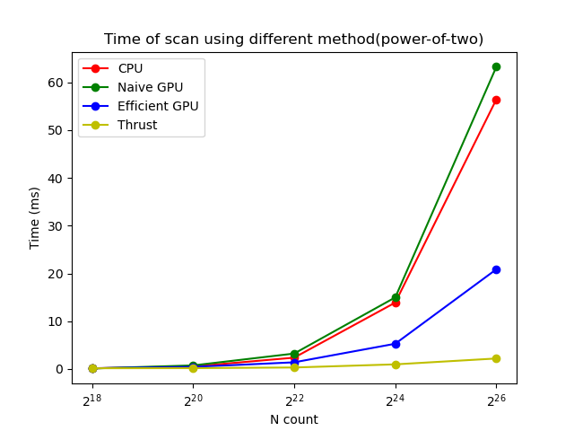
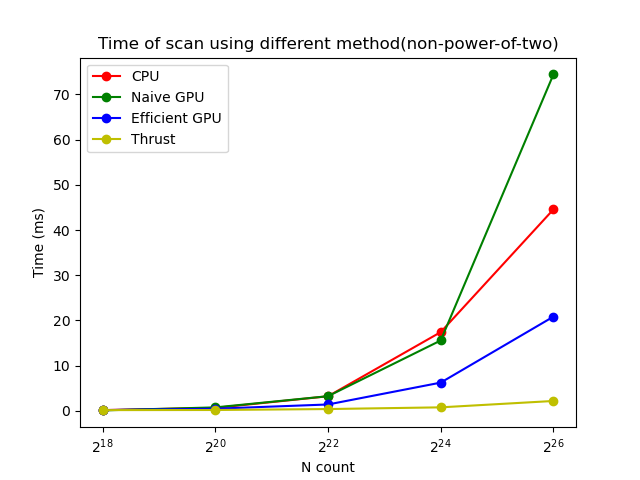

CUDA Stream Compaction
======================

**University of Pennsylvania, CIS 565: GPU Programming and Architecture, Project 2**

* Yian Chen
  * [LinkedIn](https://www.linkedin.com/in/yian-chen-33a31a1a8/), [personal website](https://sydianandrewchen.github.io/) etc.
* Tested on: Windows 10, AMD Ryzen 5800 HS with Radeon Graphics CPU @ 3.20GHz 16GB, NVIDIA GeForce RTX3060 Laptop 8GB

### Questions


* Compare all of these GPU Scan implementations (Naive, Work-Efficient, and
  Thrust) to the serial CPU version of Scan. Plot a graph of the comparison
  (with array size on the independent axis).
  
  
  * To guess at what might be happening inside the Thrust implementation (e.g.
    allocation, memory copy), take a look at the Nsight timeline for its
    execution. Your analysis here doesn't have to be detailed, since you aren't
    even looking at the code for the implementation.
  - Timeline of `thrust::exclusive_scan`:
    
    From the graph we can see that there are three scans launched at the same time and ended at the same time. 
    I guess probably that `thrust::exclusive_scan` implemented an algorithm that uses Up Sweep, Down Sweep and Shifting at the same time.

* Write a brief explanation of the phenomena you see here.
  - As the size of data grow exponentially, the time of CPU scanning algorithm and GPU naive scan will increase most rapidly. 
    - The CPU scanning algorithm can beaet GPU naive scan algorithm when data size is large. I guess that might be caused by the full exploitation of locality in the CPU scanning algorithm. On the contrary, GPU naive scan will usually cause a lot of global memory acceesses.  
  - The time of GPU efficient scan and `thrust` scan increase much slower. `thrust` performs the best.  
* Can you find the performance bottlenecks? Is it memory I/O? Computation? Is it different for each implementation?
  The performance bottlenecks should exist within the design of each implementation.
  - For CPU method, the bottlenecks appear because of the lack of parallellism, comparing with GPU methods.
  - For Naive Scan, the bottlenecks appear because of:
    - Double buffering. On the positive side, this trick can save us a large amount of time copying memory. However, two large double-bufferr will cause a stable global memory access within each thread. 
    - Time complexity.
  - For Efficient Scan:
    - Redundant thread launching(settled).
    - Shared memory.
  

* Paste the output of the test program into a triple-backtick block in your
  README.
  - Output of the scan (`SIZE = 1 << 26`)
```
****************
** SCAN TESTS **
****************
    [   6  12  22   4  21   5  23  32  32  36  46  37  34 ...  47   0 ]
==== cpu scan, power-of-two ====
   elapsed time: 48.9518ms    (std::chrono Measured)
    [   0   6  18  40  44  65  70  93 125 157 193 239 276 ... 1643792958 1643793005 ]
==== cpu scan, non-power-of-two ====
   elapsed time: 45.263ms    (std::chrono Measured)
    [   0   6  18  40  44  65  70  93 125 157 193 239 276 ... 1643792920 1643792939 ]
    passed
==== naive scan, power-of-two ====
   elapsed time: 63.2586ms    (CUDA Measured)
    [   0   6  18  40  44  65  70  93 125 157 193 239 276 ... 1643792958 1643793005 ]
    passed
==== naive scan, non-power-of-two ====
   elapsed time: 62.9893ms    (CUDA Measured)
    passed
==== work-efficient scan, power-of-two ====
   elapsed time: 24.2463ms    (CUDA Measured)
    passed
==== work-efficient scan, non-power-of-two ====
   elapsed time: 22.6304ms    (CUDA Measured)
    passed
==== thrust scan, power-of-two ====
   elapsed time: 2.46502ms    (CUDA Measured)
    passed
==== thrust scan, non-power-of-two ====
   elapsed time: 2.53338ms    (CUDA Measured)
    passed

*****************************
** STREAM COMPACTION TESTS **
*****************************
    [   1   0   1   1   3   0   1   0   1   0   0   3   1 ...   2   0 ]
==== cpu compact without scan, power-of-two ====
   elapsed time: 120.001ms    (std::chrono Measured)
    [   1   1   1   3   1   1   3   1   3   3   2   3   3 ...   3   2 ]
    passed
==== cpu compact without scan, non-power-of-two ====
   elapsed time: 123.921ms    (std::chrono Measured)
    [   1   1   1   3   1   1   3   1   3   3   2   3   3 ...   3   3 ]
    passed
==== cpu compact with scan ====
   elapsed time: 219.142ms    (std::chrono Measured)
    [   1   1   1   3   1   1   3   1   3   3   2   3   3 ...   3   2 ]
    passed
==== work-efficient compact, power-of-two ====
   elapsed time: 22.6714ms    (CUDA Measured)
    passed
==== work-efficient compact, non-power-of-two ====
   elapsed time: 22.6632ms    (CUDA Measured)
    passed
```