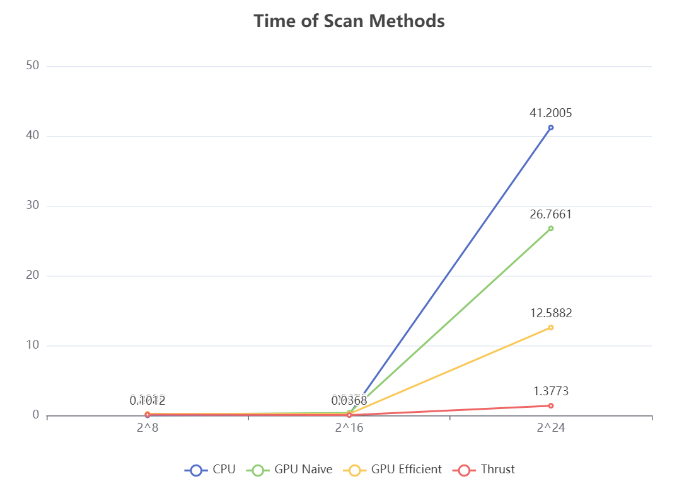
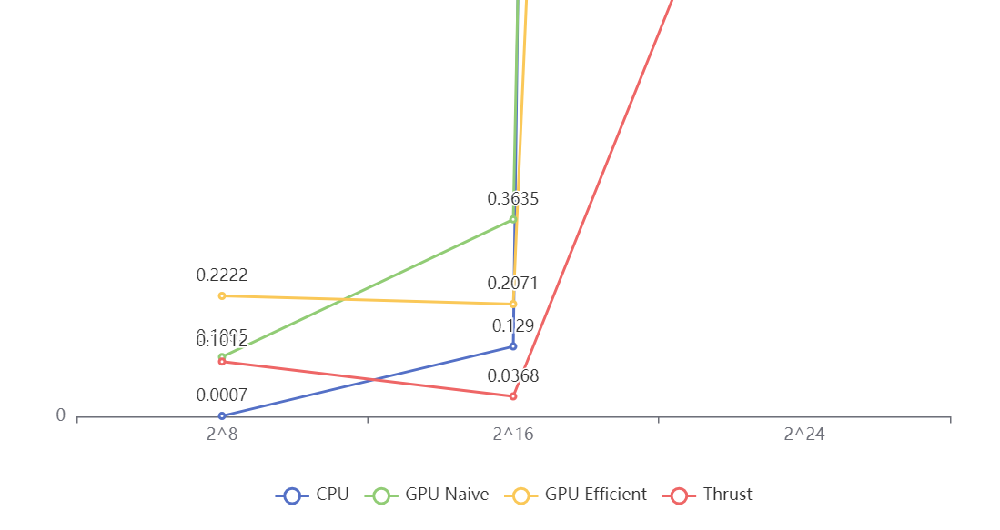
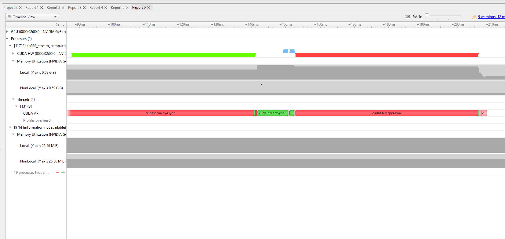

CUDA Stream Compaction
======================

**University of Pennsylvania, CIS 565: GPU Programming and Architecture, Project 2**

* Janet Wang
  * https://xchennnw.github.io/
* Tested on: Windows 11, i7-12700H @ 2.30GHz 16GB, Nvidia Geforce RTX 3070 Ti  8054MB

### TODO implemented
* CPU Scan & Stream Compaction
* Naive GPU Scan Algorithm
* Work-Efficient GPU Scan & Stream Compaction
* Scan using Thrust
  
### Project Description 
This project is about GPU stream compaction in CUDA, including a few different versions of the Scan (Prefix Sum) algorithm: a CPU version, GPU naive scan, GPU "work-efficient" scan, and GPU scan using thrust. It also includes GPU stream compaction using the above algorithms.

### Performance Analysis 

