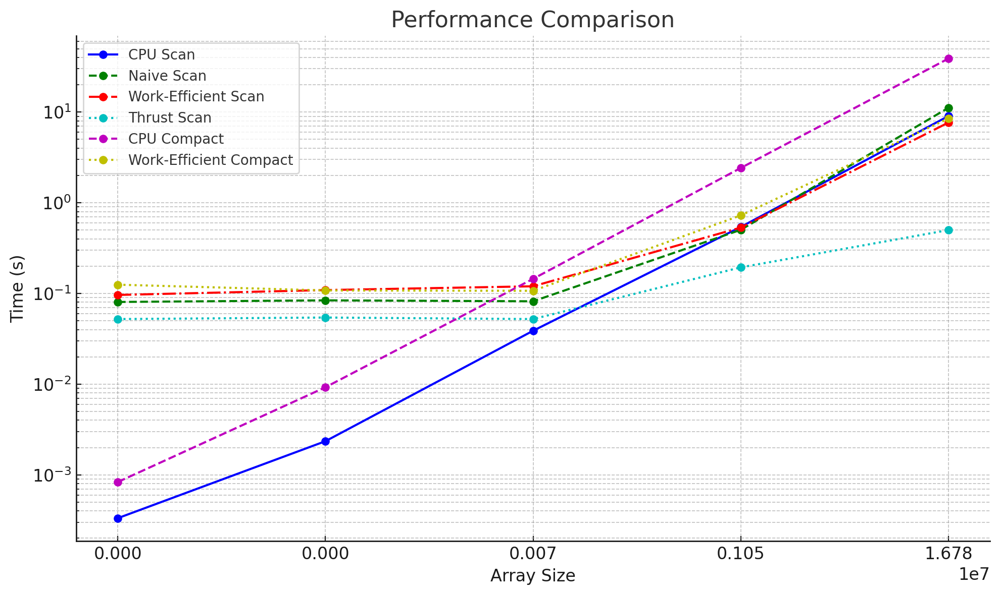
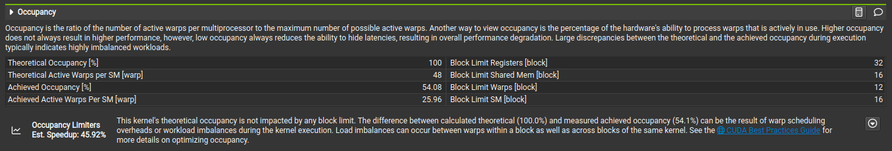

CUDA Stream Compaction
======================


**Jason Xie**

[🤓 LinkedIn](https://linkedin.com/in/jia-chun-xie)

[😇 my website](https://jchunx.dev)

[🥵 X (formerly 🐦)](https://x.com/codemonke_)

Tested on: Ubuntu 22.04, i5-8400, RTX 3060Ti, personal machine


## About

CUDA implementation of stream compaction & scan.

## Performance Analysis

### Block Size

For all kernels, I found that 128 was the optimal block size.

### Time vs. Array Size


| Array Size | CPU Scan | Naive Scan | Work-Efficient Scan | Thrust Scan | CPU Compact | Work-Efficient Compact |
| ---------- | -------- | ---------- | ------------------- | ----------- | ----------- | ---------------------- |
| 2^8        | 0.000333 | 0.0806 | 0.0963 | 0.0522 | 0.000834 | 0.125 |
| 2^12 | 0.00235 | 0.0840 | 0.109 | 0.0543 | 0.00924 | 0.108 |
| 2^16 | 0.0388 | 0.0820 | 0.120 | 0.0522 | 0.145 | 0.107 |
| 2^20 | 0.541 | 0.503 | 0.533 | 0.194 | 2.42 | 0.726 |
| 2^24 | 9.033 | 11.134 | 7.661 | 0.500 | 38.880 | 8.487 |

## What is going on here?

Unoptimized GPU scanning actually performs worse than CPU scanning. A bit of Nsight shows that the kernels have low warp occupancy (esp. up / down sweeps):


The hypothesis here is that the kernels are being bottlenecked by global memory access and warp divergence.

## Test Program Outputs

```
****************
** SCAN TESTS **
****************
    [  38  28  32  41  11   4  49  31  48   8  42  48  22 ...  25   0 ]
==== cpu scan, power-of-two ====
   elapsed time: 4.48317ms    (std::chrono Measured)
    [  38  66  98 139 150 154 203 234 282 290 332 380 402 ... 205516747 205516747 ]
==== cpu scan, non-power-of-two ====
   elapsed time: 4.44224ms    (std::chrono Measured)
    [  38  66  98 139 150 154 203 234 282 290 332 380 402 ... 205516679 205516703 ]
    passed 
==== naive scan, power-of-two ====
   elapsed time: 4.82586ms    (CUDA Measured)
    a[4194304] = 102760269, b[4194304] = 102760231
    FAIL VALUE 
==== naive scan, non-power-of-two ====
   elapsed time: 4.18042ms    (CUDA Measured)
    a[4194304] = 102760269, b[4194304] = 102760231
    FAIL VALUE 
==== work-efficient scan, power-of-two ====
   elapsed time: 3.68918ms    (CUDA Measured)
    passed 
==== work-efficient scan, non-power-of-two ====
   elapsed time: 3.61574ms    (CUDA Measured)
    passed 
==== thrust scan, power-of-two ====
   elapsed time: 0.346912ms    (CUDA Measured)
    passed 
==== thrust scan, non-power-of-two ====
   elapsed time: 0.310976ms    (CUDA Measured)
    passed 

*****************************
** STREAM COMPACTION TESTS **
*****************************
    [   0   0   2   1   1   0   3   1   2   0   2   2   0 ...   3   0 ]
==== cpu compact without scan, power-of-two ====
   elapsed time: 19.3632ms    (std::chrono Measured)
    [   2   1   1   3   1   2   2   2   2   2   2   1   3 ...   3   3 ]
    passed 
==== cpu compact without scan, non-power-of-two ====
   elapsed time: 19.8116ms    (std::chrono Measured)
    [   2   1   1   3   1   2   2   2   2   2   2   1   3 ...   3   2 ]
    passed 
==== cpu compact with scan ====
   elapsed time: 71.7739ms    (std::chrono Measured)
    [   2   1   1   3   1   2   2   2   2   2   2   1   3 ...   3   3 ]
    passed 
==== work-efficient compact, power-of-two ====
   elapsed time: 4.29862ms    (CUDA Measured)
    passed 
==== work-efficient compact, non-power-of-two ====
   elapsed time: 4.53734ms    (CUDA Measured)
    passed 
```