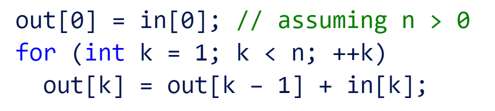
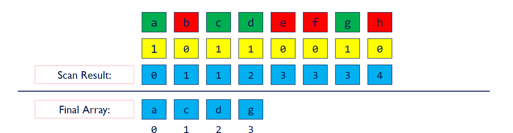
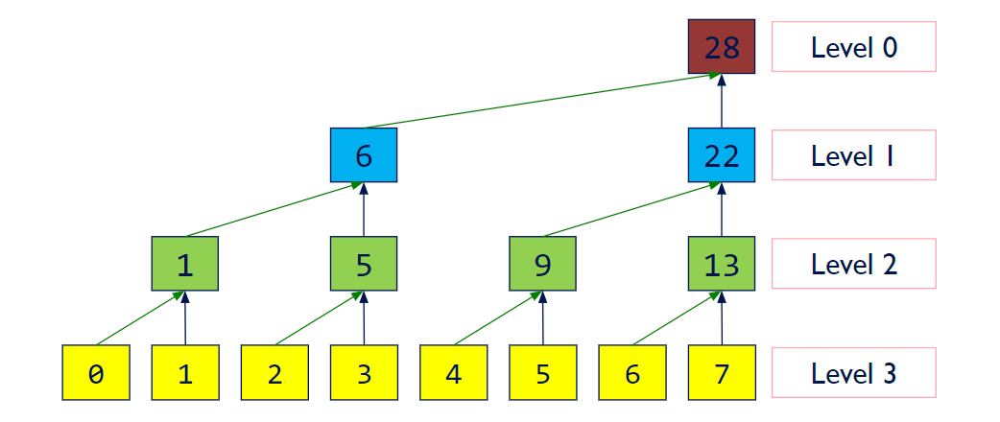
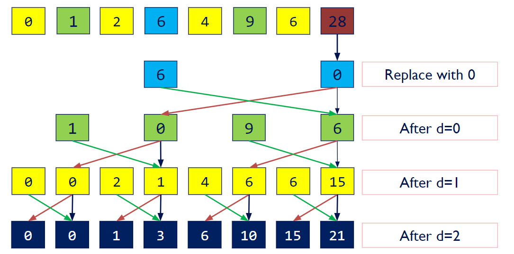
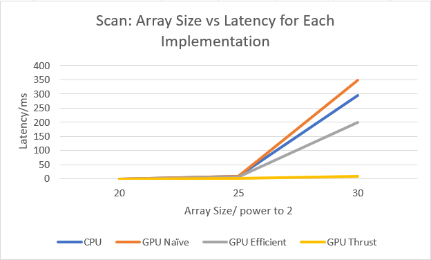

**University of Pennsylvania, CIS 565: GPU Programming and Architecture, Project 2 - CUDA Stream Compaction**

* Yin Tang
  * [Linkedin](https://www.linkedin.com/in/yin-tang-jackeyty/), [Github](https://github.com/JackeyTY), [Personal Website](https://jackeytang.com/)
* Tested on: Windows 11 Pro, AMD Ryzen 9 7950X @ 5.00GHz 64GB, NVIDIA GeForce RTX 4090 24GB (personal desktop)

### Overview

In this project, I implemented parallel algorithms scan and stream compaction, which basically takes out the zeros in the integer array, in both CPU and GPU. The CPU implementation is used as baseline for comparison, whereas three GPU implementation of scan, naive, efficient and thrust, and efficient stream compaction is benchmarked.

#### CPU Scan and Stream Compaction

Scan: Use for loop to compute an exclusive prefix sum.

Stream Compaction: Uses for loop to compute intermediate step sequentially for each step.



#### GPU Naive Scan

Use two buffers to scan the array and compute prefix sum. Each level is executed in parallel.


#### GPU Efficient Scan

Use two passes to reduce the number of operations needed. Each Level is executed in parallel.

***Step 1 Up-Sweep***

Perform parallel reduction on the array.



***Step 2 Down Sweep***

Starting from root, add left child to right child and set root to left child.



#### GPU Thrust Scan

Simply wrap a call to the Thrust library function thrust::exclusive_scan(first, last, result).

#### GPU Stream Compaction

The same steps as the CPU implementation, but execution in every level is parallel.

### Analysis

For scan, the CPU implementation is expected to have O(n) in runtime, whereas both GPU implementations are expected to have O(log(n)) in runtime. The CPU version has O(n) in number of operations, whereas GPU naive version has O(nlog(n)) in number of operations, and reduces to O(n) in GPU efficient version.

Tests are conducted using blockSize of 512 and array size of 2<sup>30</sup>

```
****************
** SCAN TESTS **
****************
    [   7  33  28   6  47  22   7  42  12  16  16  14   6 ...  46   0 ]
==== cpu scan, power-of-two ====
   elapsed time: 296.071ms    (std::chrono Measured)
    [   0   7  40  68  74 121 143 150 192 204 220 236 250 ... 526995663 526995709 ]
==== cpu scan, non-power-of-two ====
   elapsed time: 297.029ms    (std::chrono Measured)
    [   0   7  40  68  74 121 143 150 192 204 220 236 250 ... 526995607 526995635 ]
    passed
==== naive scan, power-of-two ====
   elapsed time: 342.291ms    (CUDA Measured)
    passed
==== naive scan, non-power-of-two ====
   elapsed time: 334.158ms    (CUDA Measured)
    passed
==== work-efficient scan, power-of-two ====
   elapsed time: 197.954ms    (CUDA Measured)
    passed
==== work-efficient scan, non-power-of-two ====
   elapsed time: 192.456ms    (CUDA Measured)
    passed
==== thrust scan, power-of-two ====
   elapsed time: 11.0674ms    (CUDA Measured)
    passed
==== thrust scan, non-power-of-two ====
   elapsed time: 9.81504ms    (CUDA Measured)
    passed

*****************************
** STREAM COMPACTION TESTS **
*****************************
    [   3   3   3   1   2   0   0   2   0   2   0   0   1 ...   3   0 ]
==== cpu compact without scan, power-of-two ====
   elapsed time: 1495.41ms    (std::chrono Measured)
    [   3   3   3   1   2   2   2   1   2   1   1   2   2 ...   3   3 ]
    passed
==== cpu compact without scan, non-power-of-two ====
   elapsed time: 1467.07ms    (std::chrono Measured)
    [   3   3   3   1   2   2   2   1   2   1   1   2   2 ...   3   3 ]
    passed
==== cpu compact with scan ====
   elapsed time: 2342.88ms    (std::chrono Measured)
    [   3   3   3   1   2   2   2   1   2   1   1   2   2 ...   3   3 ]
    passed
==== work-efficient compact, power-of-two ====
   elapsed time: 236.411ms    (CUDA Measured)
    passed
==== work-efficient compact, non-power-of-two ====
   elapsed time: 231.795ms    (CUDA Measured)
    passed
```

We can see that GPU naive scan is actually slower than the CPU scan, this is because the amount of computation is minimal in this project and the majority of the time is wasted scheduling and dispatching idle threads and also divergent. Therefore, an optimized implementation would be to spawn exactly one thread for one active operation, that is n threads in the first pass, n/2 threads in the second pass, etc., and decrease the number of divergent warps so that we can have early retirement as many as possible.

Below performance analysis is conducted using optimized blockSize within [32, 64, 128, 256, 512]




The GPU Naive version is actually slower than the CPU version, probably due to the unoptimized dispatching and scheduling, and GPU Efficient version is only faster then the CPU version when the array size is really big, so that the parallel efficiency can match up with the overheads.
