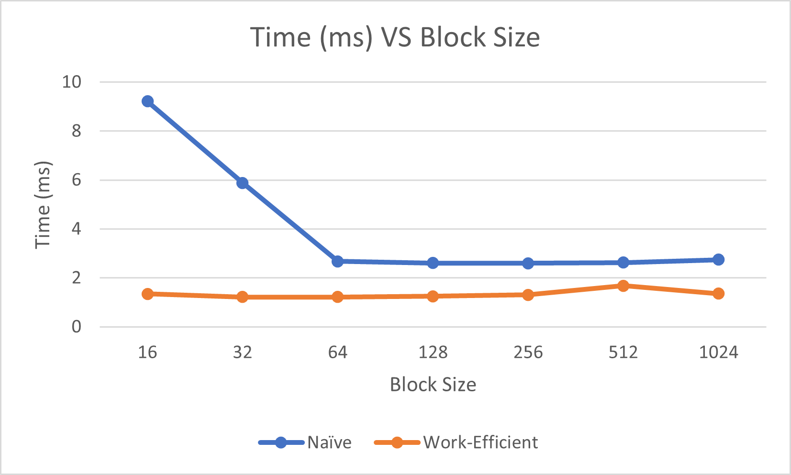
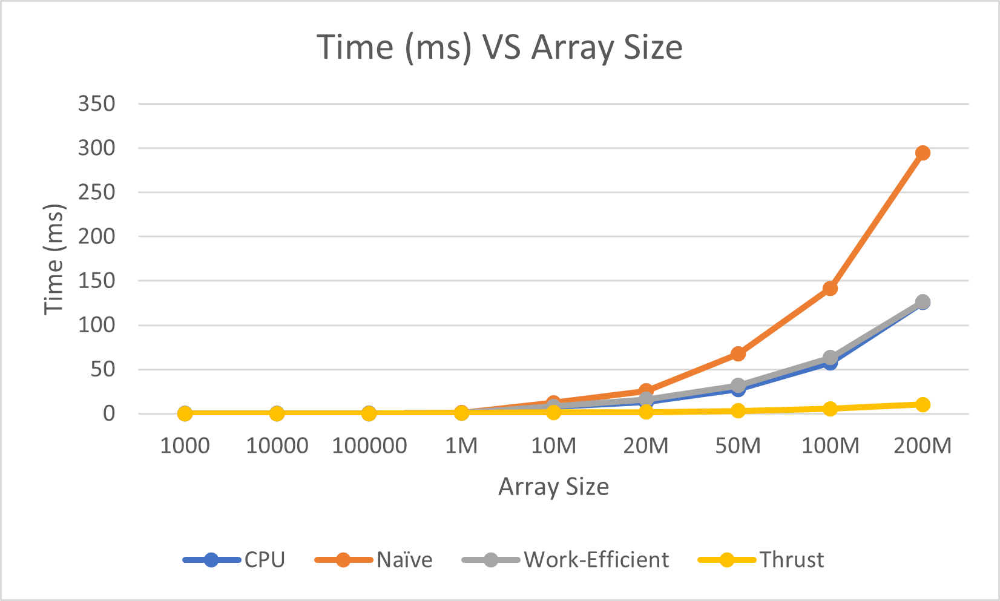
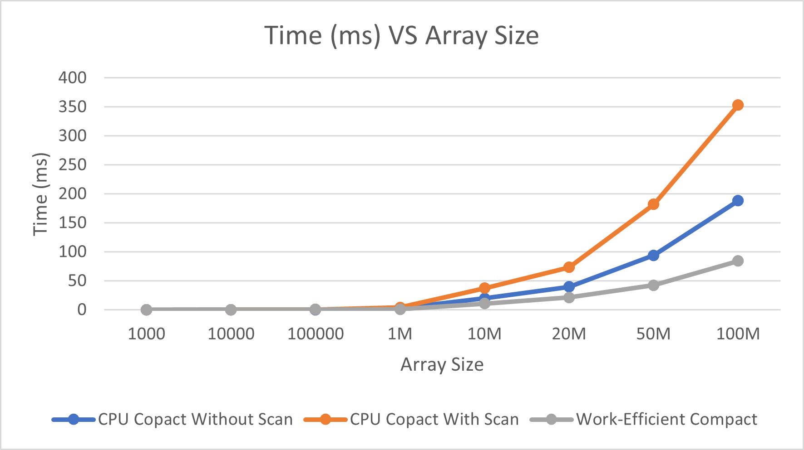

CUDA Stream Compaction
======================

**University of Pennsylvania, CIS 565: GPU Programming and Architecture, Project 2**

* Saksham Nagpal  
  * [LinkedIn](https://www.linkedin.com/in/nagpalsaksham/)
* Tested on: Windows 11 Home, AMD Ryzen 7 6800H Radeon @ 3.2GHz 16GB, NVIDIA GeForce RTX 3050 Ti Laptop GPU 4096MB

Introduction  
====
This project implements the **Scan (All-Prefix Sums)** and the **Stream Compaction** algorithms. We first implement the algorithms on the CPU, then they are implemented using CUDA to run on the GPU. A performance analysis comparing the different approaches is presented afterwards.

### Scan
The Scan algorithm operates on an array and computes the prefix-sum by applying an operator to all the preceding elements for each index. We implement this algorithm in 3 different ways:
1. <b>CPU Scan:</b> A CPU-side version of the algorithm that sequentially adds every number to the next index, accumulating the result.
2. <b>Naive Scan:</b> A naive implementation that translates the CPU-side algorithm to run on the GPU. Accumulates the result by dividing the array into smaller sub-arrays and adding the corresponding elements.
3. <b>Work-Efficient Scan:</b> An optimization of the naive scan that treats the input array as a balance binary tree and performs _up-sweep_ and _down-sweep_ to accumulate the result.


### Stream Compaction
Stream Compaction operates on an array based on a given condition and filters out the elements that do not meet that condition, thus 'compacting' the data stream. In this project, we compact arrays of integers and filter out any element if it is 0. We implement this algorithm in 3 different ways:
1. A simple CPU version,
2. A CPU version that imitates the parallelized version using _scan_ and _scatter_ passes, and
3. a GPU version that maps the input to booleans, runs _scan_ on the mapped boolean array, and then runs _scatter_ to get the compacted output.


Performance Analysis
====

* ## Figuring out the appropriate block size
First, we track the performace of our different implementations against varying block sizes to figure out the most suitable block size vefore continuing our comparison.

|  | 
|:--:| 
| *Time (ms) VS Block Size using an array of 2<sup>21</sup> elements* |

We see that there is a significant performance increase till increasing the block size to 64, and after that the gain is negligible. For further performance comparisons, we use a block size of 128.

* ## Comparing Scan implementations

|  | 
|:--:| 
| ***Scan:** Time (ms) VS Array Size using Block Size of 128* |

Next, we compare how our different implementations perform with respect to varying array sizes. It is clear that thrust's implementation is the fastest, while our naive implementation is the slowest. While it is interesting that the sequential CPU implementation outperforms both the Naive and the Work-Efficient GPU-based methods for the most part, we can see the Work-Efficient implementation catching up to it for larger sized arrays.

* ## Comparing Stream Compaction implementations

|  | 
|:--:| 
| ***Stream Compaction:** Time (ms) VS Array Size using Block Size of 128* |

Lastly, we compare the performance of our 3 different implementations of stream compaction. The GPU-based Work Efficient compaction outperforms the other 2 methods significantly.

#### Can you find the performance bottlenecks? Is it memory I/O? Computation? Is it different for each implementation?
As we can see, the GPU-based implementations (Naive and Work-Efficient) of the Scan algorithm are not that 'efficient' - even the CPU-based approach outperforms them. Some observations that cen be made in this regard are as follows:
1. One of the reasons for the above bottleneck could be **Warp-Partitioning**. Our  implementations divide our array into sub-arrays and add their corresponding elements. The way we do indexing could cause half of the threads in each warp to stall, thus causing warp divergence. The indexing can potentially be tweaked so that after each division step, we end up with totally free warps that can then be retired and used to schedule other warps.
2. As an optimization to the Work-Efficient method, we try to launch only as many threads as the number of elements in the divided sub-array at each iteration. This could potentially be the reason why we see this approach catching up to the CPU-implementation's performance in the second graph above, since the parallelized implementation would offset the sequential computation sepcially for larger sized arrays.

Output
====
The following tests were ran on array size of **2<sup>21</sup>**, a non-power-of-two array size of **2<sup>21</sup> - 3**, and a block size of **128**.
```
****************
** SCAN TESTS **
****************
    [  38  48   2   7   4  39  42   0  33   1   4  46  46 ...  37   0 ]
==== cpu scan, power-of-two ====
   elapsed time: 1.2294ms    (std::chrono Measured)
    [   0  38  86  88  95  99 138 180 180 213 214 218 264 ... 51329733 51329770 ]
==== cpu scan, non-power-of-two ====
   elapsed time: 1.2644ms    (std::chrono Measured)
    [   0  38  86  88  95  99 138 180 180 213 214 218 264 ... 51329672 51329705 ]
    passed
==== naive scan, power-of-two ====
   elapsed time: 2.62829ms    (CUDA Measured)
    [   0  38  86  88  95  99 138 180 180 213 214 218 264 ... 51329733 51329770 ]
    passed
==== naive scan, non-power-of-two ====
   elapsed time: 3.84182ms    (CUDA Measured)
    [   0  38  86  88  95  99 138 180 180 213 214 218 264 ... 51329672 51329705 ]
    passed
==== work-efficient scan, power-of-two ====
   elapsed time: 1.43606ms    (CUDA Measured)
    [   0  38  86  88  95  99 138 180 180 213 214 218 264 ... 51329733 51329770 ]
    passed
==== work-efficient scan, non-power-of-two ====
   elapsed time: 1.27795ms    (CUDA Measured)
    [   0  38  86  88  95  99 138 180 180 213 214 218 264 ... 51329672 51329705 ]
    passed
==== thrust scan, power-of-two ====
   elapsed time: 0.882496ms    (CUDA Measured)
    [   0  38  86  88  95  99 138 180 180 213 214 218 264 ... 51329733 51329770 ]
    passed
==== thrust scan, non-power-of-two ====
   elapsed time: 1.51619ms    (CUDA Measured)
    [   0  38  86  88  95  99 138 180 180 213 214 218 264 ... 51329672 51329705 ]
    passed

*****************************
** STREAM COMPACTION TESTS **
*****************************
    [   2   2   2   3   2   3   0   0   3   1   0   2   2 ...   1   0 ]
==== cpu compact without scan, power-of-two ====
   elapsed time: 4.7782ms    (std::chrono Measured)
    [   2   2   2   3   2   3   3   1   2   2   3   2   1 ...   3   1 ]
    passed
==== cpu compact without scan, non-power-of-two ====
   elapsed time: 4.5961ms    (std::chrono Measured)
    [   2   2   2   3   2   3   3   1   2   2   3   2   1 ...   1   3 ]
    passed
==== cpu compact with scan ====
   elapsed time: 9.5317ms    (std::chrono Measured)
    [   2   2   2   3   2   3   3   1   2   2   3   2   1 ...   3   1 ]
    passed
==== work-efficient compact, power-of-two ====
   elapsed time: 2.03965ms    (CUDA Measured)
    [   2   2   2   3   2   3   3   1   2   2   3   2   1 ...   3   1 ]
    passed
==== work-efficient compact, non-power-of-two ====
   elapsed time: 1.76128ms    (CUDA Measured)
    [   2   2   2   3   2   3   3   1   2   2   3   2   1 ...   1   3 ]
    passed
```
