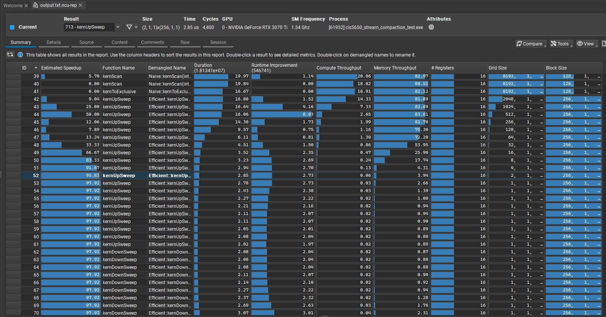

**University of Pennsylvania, CIS 565: GPU Programming and Architecture, Project 2**

* Alan Lee
  * [LinkedIn](https://www.linkedin.com/in/soohyun-alan-lee/)
* Tested on: Windows 10, AMD Ryzen 5 5600X 6-Core Processor @ 3.70GHz, 32GB RAM, NVIDIA GeForce RTX 3070 Ti (Personal Computer)

## CUDA Scan and Stream Compaction

Scan operation for this codebase refers to prefix sums implemented as reduction on an array of `n` elements using binary associative operator of addition.
This may refer to both exclusive and inclusive scans, but unless otherwise stated inside specific code segments, you may assume we are generally referring to the exclusive scan.

Stream compaction refers to the process of, given an array of elements, creating a new array with elements that meet a certain criteria while preserving the initial order.
For our implementations, the stream compaction method will remove `0`s from an array of `int`s.
This functionality can be extended for uses in path tracing, collision detection, sparse matrix compression, and so on.

The parallel algorithms are based on [GPU Gems 3](https://developer.nvidia.com/gpugems/gpugems3/part-vi-gpu-computing/chapter-39-parallel-prefix-sum-scan-cuda), with some known errors and bugs fixed.

### CPU Implementation

CPU scan is very straight forward. We linearly loop through every element in the array and track a running sum as we iterate.

CPU compaction without scan is also very simple. We linearly loop through every element in the input array and only write to the output array's next available index if the current index passes the given criteria, which for our purposes is non-zero.

CPU compaction with scan is broken down into three steps. We firstly create a binary mask (`bidata`) on the entire input data (`idata`) where each entry is true if the original input array at that index is non zero, and false otherwise. We then run our exclusive scan (`bodata`) on this binary array. Lastly, we loop through every element in the binary array, where if an entry is `true`, we write the corresponding value from the original input array into the output array (`odata`) at the index specified by the result of the exclusive scan. That is, `if (bidata[i]) odata[bodata[i]] = idata[i];`. This step is called *scatter*.

### Naive CUDA Parallelization


The naive parallelization on CUDA involves recursively summing element pairs at some offset apart. Above diagram showcases this idea for an inclusive scan implementation, though our implementation converts this to exclusive scan by push every element to right by one index and inserting a zero at the beginning. Observe that this approach performs O(nlog2(n)) additions and has an algorithmic complexity of O(log2(n)) where n is the length of the array.

### Work-Efficient CUDA Parallelization

The work-efficient parallelization scheme utilizes a balanced binary tree structure. The algorithm is split into two sections: *up-sweep* (which utilizes parallel reduction) and *down-sweep*.

The up-sweep stage is exactly the same as the in-place reduction scheme where we sum some pairs of elements at specified offsets at each iteration.


The down-sweep traverses back down the tree using partial sums to build the scan in-place. We first set the "root" node to zero, which is the last element of the array. Then, at each pass, a node passes its value to its left child, and sets the right child to the sum of the previous left child’s value and its value.


Observe that this method involves O(n) adds and O(n) swaps.

### Thrust Library

Thrust is an open-source C++ parallel algorithms library for CUDA based on the Standard Template Library (STL). We use [thrust library](https://nvidia.github.io/cccl/thrust/api/function_group__prefixsums_1ga8dbe92b545e14800f567c69624238d17.html#thrust-exclusive-scan)'s `exclusive_scan` function to better benchmark the performance of our own parallel exclusive scan.

### Radix Sort

Radix sort is a non-comparative sorting algorithm. Radix is the number of unique digits used to represent a number. We perform multiple passes starting from the least significant bit to the most significant bit. In each pass, we shuffle the numbers in the input array around while maintaining order using a bit mask corresponding to the digit of the pass. That is, we perform unary test on each entry's `k`th digit, where if the `k`th digit is `0` we move the entry to the left bucket and if `1` to the right, all while maintaining order.

In practice, parallel radix sort implementation can be broken down into the following steps:


Let us consider above diagram for conceptual understanding.

For `k = 0`, we are considering the least significant bit.
`i` array is our input array in binary representation.
`b` array contains the true/false result of applying an appropraite bit mask (for this example `0b1`).
`e` array is `b` array negated.
`f` array is the exclusive scan on `e` array.
`t` array is populated such that `t[idx] = idx - f[idx] + totalFalses`, where `totalFalses = e[n - 1] + f[n - 1]`.
`d` array is populated using `f` if the corresponding bit mask array's entry is true, and `t` otherwise.
Lastly, the final `output` array is computed by scattering `i` array based on the destination indices stored in `d` array.

Our implementation simplifies above procedure by combining multiple steps into single processes.
`kernBitMaskNot` takes input array `i` and applies a negated bit mask to output array `e`.
`kernScan` performs a naive parallel scan on `e` to output array `f`.
Based on `e` and `f` arrays' last elements, we comput `totalFalses`.
`kernScatter` takes these intermediate results and outputs final `output` array directly.

Code for above algorithm can be found inside `radix.cu`.
A basic cpu `sort` using the STL was used to compare our implementation's comparative performance gains.

## Running the Code

You should follow the regular setup guide as described in [Project 0](https://github.com/CIS5650-Fall-2024/Project0-Getting-Started/blob/main/INSTRUCTION.md#part-21-project-instructions---cuda).

`blockSize` for each implementation is defined at the top of respective `.cu` files.

Note that there may be illegal memory accesses for those implementations that compute index `k` if the array size and block sizes are too big such that there is an integer overflow. The limit is `blockSize 2` for `SIZE = 1 << 30`. Reducing `SIZE` by a factor of 2 (one less bit shift) allows `blockSize` to be doubled at most. (e.g. limit is `blockSize 8` for `SIZE = 1 << 28`).

## Performance Analysis

It should be noted that due to the randomness of array generation (the distribution of random numbers generated), the main program was ran *five* times, each time saving the recorded clock time for all configurations. The five runs were then averaged to be used for plotting of data below. The raw data stored in an excel file can be found at `writeup/rawdata.xlsx`.

Due to the nature of the array sizes being too big to fit in a regular independent axis scale, the array sizes are presented in the logarithmic scale with base 2.

Note that for every plot presented below, *the lower the value, the better the performance is*.

* Roughly optimize the block sizes of each of your implementations for minimal
  run time on your GPU.

The block size for each implementation was optimized to array size `1 << 20` (or 2^20). The relationships observed in the following analysis may be subject to change depending on the target of this optimization, though in general worse in performance unless the sizes are at either extremes.

* Compare all of these GPU Scan implementations (Naive, Work-Efficient, and
  Thrust) to the serial CPU version of Scan. Plot a graph of the comparison
  (with array size on the independent axis).


For our scan implementations, we first present you a plot of runtime for all dataset collected. However, this is not very useful for distinguishing interesting points and extracting meaningful explanations. Therefore, we extracted a specific subrange of power-of-two array sizes and normalized them with respect performance of our CPU scan for a closer observation.


This relative plot showcases that for lower array sizes (approximately up to 2^18), CPU scan implementation outperforms all other parallel schemes by a huge margin, especially at very small array sizes. However, once the array sizes become big enough that it actually takes the CPU a significant amount of time to process all entries serially, the benefit of parallelism kicks in. We can observe that from array size of 2^19 ~ 2^20 onwards, all parallel implementations out-scale the performance of CPU scan by multiple factors. Work-efficient parallelism outperforms CPU scan by more than a double (or less than halve the time taken).


We see a similar trend with our compact implementations.


By observing the trends and intersections on the relative performance plot, we can see that although work-efficient parallelism performs initially worse. However, again, once the array size passes a certain threshold (for our test runs around array sizes of 2^18 ~ 2^19), the work-efficient compaction outscales CPU's linear compaction by 2~3 times.


The exact same pattern can be seen for radix sort, except the threshold for sorting is lower at around 2^15~2^16 elements.


* Write a brief explanation of the phenomena you see here.
  * Can you find the performance bottlenecks? Is it memory I/O? Computation? Is
    it different for each implementation?

All parallelization schemes were implemented using global memory only. This incurs a lot of memory I/O overheads as we are not utilizing the potential of shared memory at all. Until the sheer cost of computation exceeds the overhead of memory transfers and read/write for the GPU, the performance gain of parallelism cannot catch up to the CPU compute power. This is the cause of above patterns where CPU initially dominates in performance but once the array size is big enough we see a flip - and the parallel approaches dominate.

The performance bottlenecks for our code can be observed by utilizing Nvidia Systems and Compute profiling features.

We can observe from the Nsight compute profiling below that our work-efficient parallelization scheme suffers from multiple kernel invocations with extremely small grid sizes, showing terrible memory throughput. This showcases the cost of so frequently requesting global memory I/O. This can also be explained by lack of memory coalescence due to the unoptimized nature of our indexing scheme.



On the other hand, we can observe from the following Nsight profile traces that `DeviceScanKernel` (the actual kernel invocation for thrust library's `exclusive_scan`) reaches theoretical occupancy limit. This means that our program is always actively trying to process the warps, but is limited by the memory throughput as shown in the low memory and cache throughput percentages.


* Paste the output of the test program into a triple-backtick block in your
  README.
  * If you add your own tests (e.g. for radix sort or to test additional corner
    cases), be sure to mention it explicitly.

The following snippet showcases a sample output generated with array size 2^20.
Additional test case for radix sort has been added at the end of the output stream, where we compare our radix sort output and performance with those of the STL's `sort` function.

```
****************
** SCAN TESTS **
****************
    [  14   3  34  11  30  10  26  38  33  19  35  16  23 ...   0  49  36   0 ]
==== cpu scan, power-of-two ====
   elapsed time: 0.6696ms    (std::chrono Measured)
    [   0  14  17  51  62  92 102 128 166 199 218 253 269 ... 25655020 25655020 25655069 25655105 ]
==== cpu scan, non-power-of-two ====
   elapsed time: 0.6335ms    (std::chrono Measured)
    [   0  14  17  51  62  92 102 128 166 199 218 253 269 ... 25654950 25654991 25655013 25655020 ]
    passed
==== naive scan, power-of-two ====
   elapsed time: 0.832512ms    (CUDA Measured)
    passed
==== naive scan, non-power-of-two ====
   elapsed time: 0.384ms    (CUDA Measured)
    passed
==== work-efficient scan, power-of-two ====
   elapsed time: 0.26624ms    (CUDA Measured)
    passed
==== work-efficient scan, non-power-of-two ====
   elapsed time: 0.195584ms    (CUDA Measured)
    passed
==== thrust scan, power-of-two ====
   elapsed time: 0.53008ms    (CUDA Measured)
    passed
==== thrust scan, non-power-of-two ====
   elapsed time: 0.133952ms    (CUDA Measured)
    passed

*****************************
** STREAM COMPACTION TESTS **
*****************************
    [   0   3   2   1   0   0   2   2   3   3   1   2   1 ...   0   1   0   0 ]
==== cpu compact without scan, power-of-two ====
   elapsed time: 1.5552ms    (std::chrono Measured)
    [   3   2   1   2   2   3   3   1   2   1   2   2   1 ...   1   3   1   1 ]
    passed
==== cpu compact without scan, non-power-of-two ====
   elapsed time: 1.8418ms    (std::chrono Measured)
    [   3   2   1   2   2   3   3   1   2   1   2   2   1 ...   1   1   3   1 ]
    passed
==== cpu compact with scan ====
   elapsed time: 3.7806ms    (std::chrono Measured)
    [   3   2   1   2   2   3   3   1   2   1   2   2   1 ...   1   3   1   1 ]
    passed
==== work-efficient compact, power-of-two ====
   elapsed time: 2.21901ms    (CUDA Measured)
    passed
==== work-efficient compact, non-power-of-two ====
   elapsed time: 0.543744ms    (CUDA Measured)
    passed

*****************************
** RADIX SORT TESTS **
*****************************
    [ 24764 29203 21834 27361 7580 22360 28426 26938 18183 22519 14285 27466 30473 ... 18100 10349 16436 11257 ]
==== cpu sort, power-of-two ====
   elapsed time: 44.8732ms    (std::chrono Measured)
    [   0   0   0   0   0   0   0   0   0   0   0   0   0 ... 32767 32767 32767 32767 ]
==== cpu sort, non-power-of-two ====
   elapsed time: 45.1742ms    (std::chrono Measured)
    [   0   0   0   0   0   0   0   0   0   0   0   0   0 ... 32767 32767 32767 32767 ]
==== radix sort, power-of-two ====
   elapsed time: 10.3455ms    (CUDA Measured)
    [   0   0   0   0   0   0   0   0   0   0   0   0   0 ... 32767 32767 32767 32767 ]
    passed
==== radix sort, non-power-of-two ====
   elapsed time: 10.6291ms    (CUDA Measured)
    [   0   0   0   0   0   0   0   0   0   0   0   0   0 ... 32767   0   0   0 ]
    passed
```