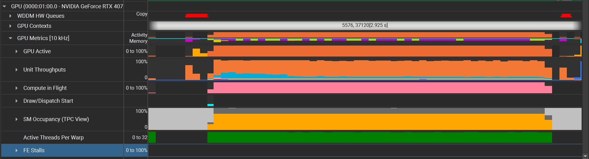

CUDA Stream Compaction
======================

**University of Pennsylvania, CIS 565: GPU Programming and Architecture, Project 2**

* Xinyu Niu
  * [personal website](https://xinyuniu6.wixsite.com/my-site-1)
* Tested on: Windows 11, i9-13980HX @ 2.20GHz 16GB, RTX 4070 16185MB (Personal)


## Introduction

This project focuses on implementing *Scan* (*Prefix Sum*) and *Stream Compaction* algorithms in CUDA. Scan algorithms are about doing prefix sum on an array, and Stream Compaction algorithm is about removing elements that meet some given conditions from an array. In this project, the stream compaction implementations will remove `0`s from an array of `int`s.

## Implemented Features

In this project, I completed the following features:

* CPU Scan & Stream Compaction
* Naive GPU Scan Algorithm
* Work-Efficient GPU Scan & Stream Compaction
* GPU Scan using Thrust
* Optimized Work-Efficient GPU Scan(Extra Credit)
* Radix Sort (Extra Credit)

## Performance Analysis


**Figure 1:** Change on Elapsed Time influenced by increasing blocksize with fixed array size(2^25)

From Figure 1, we can observe that before blocksize = 32 is reached, blocksize has relatively significant effect on time elapsed, and a larger blocksize leads to better performance for all three implementations. After 32 is reached, the blocksize no longer has considerable inflence on time elapsed. And we can also observe that before optimization, the efficient scan is not actually efficient. This is causing by the inefficient use of threads, since there will be idle threads as we always launch the same number of blocks for each iteration. By compacting threads, using shared memory etc. we can reduce this inefficiency.


**Figure 2:** Change on Elapsed Time influenced by increasing arraysize with fixed blocksize(256)

From Figure 2, we can observe that when arraysize gets larger and over a certain number(from the data collected it's about 2^22), there will be significant increase on elapsed time and we can clearly see the difference in performance of different scan method. From faster to slower, the rank of methods is: ```thrust > efficient GPU scan > Naive GPU scan > CPU scan```. When arraysize is smaller, although it's hard to observe from the graph, CPU appears to have a bit better performance than the two algorithm I implemented while thrust is still the fastest one.



**Figure 3:** NSight trace result of only allowing CPU scans and thrust scans

From Figure 3, we can see that the largest part of thrust is the use of ```cudaMemcpyAsync``` and ```cudaStreamSynchronize```, which allows control to be returned to the host thread immediately so we won't need to wait until the data copy is completed. Since we are using cudaMemcpy in our implementation, this waiting time might be a bottleneck.

## Output
```
****************
** SCAN TESTS **
****************
    [   0  13  20  46  19  36   9   0  15  22  27  38  11 ...  18   0 ]
==== cpu scan, power-of-two ====
   elapsed time: 428.08ms    (std::chrono Measured)
    [   0   0  13  33  79  98 134 143 143 158 180 207 245 ... -2015722115 -2015722097 ]
==== cpu scan, non-power-of-two ====
   elapsed time: 425.212ms    (std::chrono Measured)
    [   0   0  13  33  79  98 134 143 143 158 180 207 245 ... -2015722147 -2015722135 ]
    passed
==== naive scan, power-of-two ====
   elapsed time: 314.354ms    (CUDA Measured)
    passed
==== naive scan, non-power-of-two ====
   elapsed time: 334.496ms    (CUDA Measured)
    passed
==== work-efficient scan, power-of-two ====
   elapsed time: 96.6155ms    (CUDA Measured)
    passed
==== work-efficient scan, non-power-of-two ====
   elapsed time: 97.165ms    (CUDA Measured)
    passed
==== thrust scan, power-of-two ====
   elapsed time: 10.5397ms    (CUDA Measured)
    passed
==== thrust scan, non-power-of-two ====
   elapsed time: 12.058ms    (CUDA Measured)
    passed

*****************************
** STREAM COMPACTION TESTS **
*****************************
    [   2   0   0   0   0   0   0   0   2   0   0   2   0 ...   0   0 ]
==== cpu compact without scan, power-of-two ====
   elapsed time: 425.212ms    (std::chrono Measured)
    [   2   2   2   3   2   1   2   3   1   1   3   3   2 ...   1   3 ]
    passed
==== cpu compact without scan, non-power-of-two ====
   elapsed time: 425.212ms    (std::chrono Measured)
    [   2   2   2   3   2   1   2   3   1   1   3   3   2 ...   1   1 ]
    passed
==== cpu compact with scan ====
   elapsed time: 2080.47ms    (std::chrono Measured)
    [   2   2   2   3   2   1   2   3   1   1   3   3   2 ...   1   3 ]
    passed
==== work-efficient compact, power-of-two ====
   elapsed time: 202.213ms    (CUDA Measured)
    passed
==== work-efficient compact, non-power-of-two ====
   elapsed time: 188.192ms    (CUDA Measured)
    passed

```
## Extra Credit
**1. Optimized GPU Efficient Scan**

I attempted to optimize the performance by adjusting blocks launched at during the loop for upper sweep and down sweep. During upper sweep, each iteration the block number shrinks to half. During down sweep, each iteration the block number expands to twice.

**2. Radix Sort**

I have implemented the Radix Sort algorithm, which can be called using ```StreamCompaction::Efficient::radixSort()```.

The below output resulted from comparing the sorted arry using my implementation and std::sort.

```
*****************************
** RADIX SORT TESTS **
*****************************
    [   0  17   0  16  17   5  18   9   5  18  19  18  10 ...   3   0 ]
==== Radix Sort ====
   elapsed time: 8.7022ms    (std::chrono Measured)
    [   0   0   0   0   0   0   0   0   0   0   0   0   0 ...  19  19 ]
    passed
```