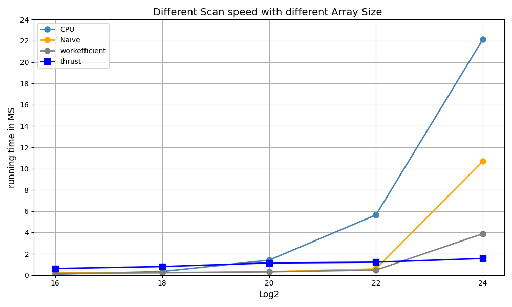

CUDA Stream Compaction
======================

**University of Pennsylvania, CIS 565: GPU Programming and Architecture, Project 2**

* Zixiao Wang
  * [LinkedIn](https://www.linkedin.com/in/zixiao-wang-826a5a255/)
* Tested on: Windows 11, i7-14700K @ 3.40 GHz 32GB, GTX 4070TI 12GB  4K Monitor (Personal PC)

### Background

* In this project, I implemented GPU stream compaction in CUDA, from scratch. This algorithm is widely used, and will be important for accelerating path tracer. I implemented several versions of the Scan (Prefix Sum) algorithm, a critical building block for stream compaction:
  * CPU Implementation: Begin by coding a CPU version of the Scan algorithm.
  * GPU Implementations:
     *  Naive Scan: Develop a straightforward GPU version that parallelizes the Scan operation.
     *  Work-Efficient Scan: Optimize GPU implementation to make better use of parallel resources, minimizing idle threads and redundant computations.
   
  * GPU Stream Compaction: Utilize Scan implementations to create a GPU-based stream compaction algorithm that efficiently removes zeros from an integer array.
* For more detail [GPU GEM](https://developer.nvidia.com/gpugems/gpugems3/part-vi-gpu-computing/chapter-39-parallel-prefix-sum-scan-cuda).

### Prefix-Sum(Scan)


The chart compares the execution time (in milliseconds) of different scan implementations (CPU, Naive, Work-Efficient, and Thrust) for various array sizes
* CPU Implementation shows a significant increase in running time as the array size increases. And it is the slowest among all implementations, particularly for larger array sizes.
* The Naive scan algorithm, which is a GPU implementation, performs better than the CPU version but still increases noticeably as the array size grows. This implementation does not utilize memory optimizations, and the iterative approach of the naive scan leads to suboptimal performance, especially for larger arrays.
* The Work-Efficient scan performs better than the Naive scan but is slightly slower than the Thrust implementation for larger array sizes. This approach is optimized for better memory access patterns and reduces the number of required operations.
* The Thrust library implementation is the fastest across all array sizes. The execution time remains almost constant even as the array size increases, which indicates very efficient scaling and use of GPU resources
#### Summary
Thrust is the clear winner for larger data sets, offering the best performance and scalability. For smaller arrays, the CPU implementation’s overhead isn’t as visible, but as the array size increases, the GPU’s parallel nature shows a dramatic improvement in running time. The Work-Efficient scan addresses some of the Naive algorithm's computational inefficiencies by reducing the number of redundant calculations and focusing on better parallelization techniques. However, memory I/O remains a limiting factor because it relies on frequent reads and writes to global memory.
### Extra Feature
#### Optimized Work Efficient Approach


As the Up Sweep Phase Picture shown, it is obvious the number of threads needed for different depths is not fixed. Most threads become idle as only a few elements need to be processed. For example, at level d, only N / 2^d threads are doing useful work out of the total threads launched. Adjust the number of threads and blocks launched at each level based on the workload as follows:
```
int step = 1 << (d + 1);
int threads = new_n / step;
dim3 fullBlocksPerGrid((threads + block_size - 1) / block_size);
```
However, once these value are not fixed, the calculation of index in the Kernel also need to be modified as follow:
```
int k = (blockIdx.x * blockDim.x) + threadIdx.x;
int step = 1 << (d + 1);
int index = k * step + (step - 1);
```

#### Implement the Radix Sort
### test result
test on size 1<<22 and block size 128
```bash
****************
** SCAN TESTS **
****************
    [  21  19  39  37  37  32   3  36   8  22  22   5  49 ...  20   0 ]
==== cpu scan, power-of-two ====
   elapsed time: 5.5752ms    (std::chrono Measured)
    [   0  21  40  79 116 153 185 188 224 232 254 276 281 ... 102730753 102730773 ]
==== cpu scan, non-power-of-two ====
   elapsed time: 5.5342ms    (std::chrono Measured)
    [   0  21  40  79 116 153 185 188 224 232 254 276 281 ... 102730634 102730677 ]
    passed
==== naive scan, power-of-two ====
   elapsed time: 0.57712ms    (CUDA Measured)
    passed
==== naive scan, non-power-of-two ====
   elapsed time: 0.496128ms    (CUDA Measured)
    passed
==== work-efficient scan, power-of-two ====
   elapsed time: 0.489792ms    (CUDA Measured)
    passed
==== work-efficient scan, non-power-of-two ====
   elapsed time: 0.549632ms    (CUDA Measured)
    passed
==== thrust scan, power-of-two ====
   elapsed time: 1.10934ms    (CUDA Measured)
    passed
==== thrust scan, non-power-of-two ====
   elapsed time: 0.57584ms    (CUDA Measured)
    passed

*****************************
** STREAM COMPACTION TESTS **
*****************************
    [   1   1   3   1   1   0   1   0   0   2   2   1   3 ...   2   0 ]
==== cpu compact without scan, power-of-two ====
   elapsed time: 6.5848ms    (std::chrono Measured)
    [   1   1   3   1   1   1   2   2   1   3   1   2   1 ...   2   2 ]
    passed
==== cpu compact without scan, non-power-of-two ====
   elapsed time: 6.5552ms    (std::chrono Measured)
    [   1   1   3   1   1   1   2   2   1   3   1   2   1 ...   1   2 ]
    passed
==== cpu compact with scan ====
   elapsed time: 17.0166ms    (std::chrono Measured)
    [   1   1   3   1   1   1   2   2   1   3   1   2   1 ...   2   2 ]
    passed
==== work-efficient compact, power-of-two ====
   elapsed time: 0.525504ms    (CUDA Measured)
    passed
==== work-efficient compact, non-power-of-two ====
   elapsed time: 0.521216ms    (CUDA Measured)
    passed
```
### Modification to CmakeList
Add `radixsort.cu` and `radixsort.h` and add entry for them in Cmakelist

