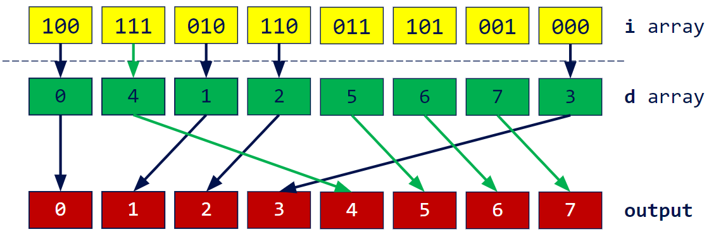

**University of Pennsylvania, CIS 565: GPU Programming and Architecture, Project 2**

* Alan Lee
  * [LinkedIn](https://www.linkedin.com/in/soohyun-alan-lee/)
* Tested on: Windows 10, AMD Ryzen 5 5600X 6-Core Processor @ 3.70GHz, 32GB RAM, NVIDIA GeForce RTX 3070 Ti (Personal Computer)

## CUDA Scan and Stream Compaction

This stream compaction method will remove `0`s from an array of `int`s.

### CPU Implementation


### Naive CUDA Parallelization

### Work-Efficient CUDA Parallelization

### Thrust Library

Thrust is an open-source C++ parallel algorithms library for CUDA based on the Standard Template Library (STL). We use [thrust library](https://nvidia.github.io/cccl/thrust/api/function_group__prefixsums_1ga8dbe92b545e14800f567c69624238d17.html#thrust-exclusive-scan)'s `exclusive_scan` function to better benchmark the performance of our own parallel exclusive scan.

### Radix Sort

Radix sort is a non-comparative sorting algorithm. Radix is the number of unique digits used to represent a number. We perform multiple passes starting from the least significant bit to the most significant bit. In each pass, we shuffle the numbers in the input array around while maintaining order using a bit mask corresponding to the digit of the pass. That is, we perform unary test on each entry's `k`th digit, where if the `k`th digit is `0` we move the entry to the left bucket and if `1` to the right, all while maintaining order.

In practice, parallel radix sort implementation can be broken down into the following steps:




Let us consider above diagram for conceptual understanding.

For `k = 0`, we are considering the least significant bit.
`i` array is our input array in binary representation.
`b` array contains the true/false result of applying an appropraite bit mask (for this example `0b1`).
`e` array is `b` array negated.
`f` array is the exclusive scan on `e` array.
`t` array is populated such that `t[idx] = idx - f[idx] + totalFalses`, where `totalFalses = e[n - 1] + f[n - 1]`.
`d` array is populated using `f` if the corresponding bit mask array's entry is true, and `t` otherwise.
Lastly, the final `output` array is computed by scattering `i` array based on the destination indices stored in `d` array.

Our implementation simplifies above procedure by combining multiple steps into single processes.
`kernBitMaskNot` takes input array `i` and applies a negated bit mask to output array `e`.
`kernScan` performs a naive parallel scan on `e` to output array `f`.
Based on `e` and `f` arrays' last elements, we comput `totalFalses`.
`kernScatter` takes these intermediate results and outputs final `output` array directly.

Code for above algorithm can be found inside `radix.cu`.
A basic cpu `sort` using the STL was used to compare our implementation's comparative performance gains.

## Running the Code

You should follow the regular setup guide as described in [Project 0](https://github.com/CIS5650-Fall-2024/Project0-Getting-Started/blob/main/INSTRUCTION.md#part-21-project-instructions---cuda).

`blockSize` for each implementation is defined at the top of respective `.cu` files.

Note that there may be illegal memory accesses for those implementations that compute index `k` if the array size and block sizes are too big such that there is an integer overflow. The limit is `blockSize 2` for `SIZE = 1 << 30`. Reducing `SIZE` by a factor of 2 (one less bit shift) allows `blockSize` to be doubled at most. (e.g. limit is `blockSize 8` for `SIZE = 1 << 28`).

## Performance Analysis

It should be noted that due to the randomness of array generation (the distribution of random numbers generated), the main program was ran *five* times, each time saving the recorded clock time for all configurations. The five runs were then averaged to be used for plotting of data below. The raw data stored in an excel file can be found at `writeup/rawdata.xlsx`.

* Roughly optimize the block sizes of each of your implementations for minimal
  run time on your GPU.

The block size for each implementation was optimized to array size `1 << 20` (or 2^20). The relationships observed in the following analysis may be subject to change depending on the target of this optimization.

* Compare all of these GPU Scan implementations (Naive, Work-Efficient, and
  Thrust) to the serial CPU version of Scan. Plot a graph of the comparison
  (with array size on the independent axis).
  * We wrapped up both CPU and GPU timing functions as a performance timer class for you to conveniently measure the time cost.
    * We use `std::chrono` to provide CPU high-precision timing and CUDA event to measure the CUDA performance.
    * For CPU, put your CPU code between `timer().startCpuTimer()` and `timer().endCpuTimer()`.
    * For GPU, put your CUDA code between `timer().startGpuTimer()` and `timer().endGpuTimer()`. Be sure **not** to include any *initial/final* memory operations (`cudaMalloc`, `cudaMemcpy`) in your performance measurements, for comparability.
    * Don't mix up `CpuTimer` and `GpuTimer`.
  * To guess at what might be happening inside the Thrust implementation (e.g.
    allocation, memory copy), take a look at the Nsight timeline for its
    execution. Your analysis here doesn't have to be detailed, since you aren't
    even looking at the code for the implementation.


* Write a brief explanation of the phenomena you see here.
  * Can you find the performance bottlenecks? Is it memory I/O? Computation? Is
    it different for each implementation?

* Paste the output of the test program into a triple-backtick block in your
  README.
  * If you add your own tests (e.g. for radix sort or to test additional corner
    cases), be sure to mention it explicitly.

The following snippet showcases a sample output generated with array size 2^20.
Additional test case for radix sort has been added at the end of the output stream, where we compare our radix sort output and performance with those of the STL's `sort` function.

```
****************
** SCAN TESTS **
****************
    [  14   3  34  11  30  10  26  38  33  19  35  16  23 ...   0  49  36   0 ]
==== cpu scan, power-of-two ====
   elapsed time: 0.6696ms    (std::chrono Measured)
    [   0  14  17  51  62  92 102 128 166 199 218 253 269 ... 25655020 25655020 25655069 25655105 ]
==== cpu scan, non-power-of-two ====
   elapsed time: 0.6335ms    (std::chrono Measured)
    [   0  14  17  51  62  92 102 128 166 199 218 253 269 ... 25654950 25654991 25655013 25655020 ]
    passed
==== naive scan, power-of-two ====
   elapsed time: 0.832512ms    (CUDA Measured)
    passed
==== naive scan, non-power-of-two ====
   elapsed time: 0.384ms    (CUDA Measured)
    passed
==== work-efficient scan, power-of-two ====
   elapsed time: 0.26624ms    (CUDA Measured)
    passed
==== work-efficient scan, non-power-of-two ====
   elapsed time: 0.195584ms    (CUDA Measured)
    passed
==== thrust scan, power-of-two ====
   elapsed time: 0.53008ms    (CUDA Measured)
    passed
==== thrust scan, non-power-of-two ====
   elapsed time: 0.133952ms    (CUDA Measured)
    passed

*****************************
** STREAM COMPACTION TESTS **
*****************************
    [   0   3   2   1   0   0   2   2   3   3   1   2   1 ...   0   1   0   0 ]
==== cpu compact without scan, power-of-two ====
   elapsed time: 1.5552ms    (std::chrono Measured)
    [   3   2   1   2   2   3   3   1   2   1   2   2   1 ...   1   3   1   1 ]
    passed
==== cpu compact without scan, non-power-of-two ====
   elapsed time: 1.8418ms    (std::chrono Measured)
    [   3   2   1   2   2   3   3   1   2   1   2   2   1 ...   1   1   3   1 ]
    passed
==== cpu compact with scan ====
   elapsed time: 3.7806ms    (std::chrono Measured)
    [   3   2   1   2   2   3   3   1   2   1   2   2   1 ...   1   3   1   1 ]
    passed
==== work-efficient compact, power-of-two ====
   elapsed time: 2.21901ms    (CUDA Measured)
    passed
==== work-efficient compact, non-power-of-two ====
   elapsed time: 0.543744ms    (CUDA Measured)
    passed

*****************************
** RADIX SORT TESTS **
*****************************
    [ 24764 29203 21834 27361 7580 22360 28426 26938 18183 22519 14285 27466 30473 ... 18100 10349 16436 11257 ]
==== cpu sort, power-of-two ====
   elapsed time: 44.8732ms    (std::chrono Measured)
    [   0   0   0   0   0   0   0   0   0   0   0   0   0 ... 32767 32767 32767 32767 ]
==== cpu sort, non-power-of-two ====
   elapsed time: 45.1742ms    (std::chrono Measured)
    [   0   0   0   0   0   0   0   0   0   0   0   0   0 ... 32767 32767 32767 32767 ]
==== radix sort, power-of-two ====
   elapsed time: 10.3455ms    (CUDA Measured)
    [   0   0   0   0   0   0   0   0   0   0   0   0   0 ... 32767 32767 32767 32767 ]
    passed
==== radix sort, non-power-of-two ====
   elapsed time: 10.6291ms    (CUDA Measured)
    [   0   0   0   0   0   0   0   0   0   0   0   0   0 ... 32767   0   0   0 ]
    passed
```