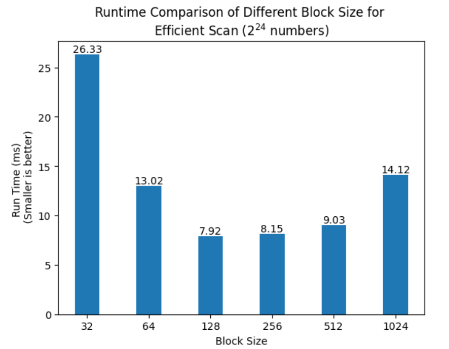

CUDA Stream Compaction
======================

**University of Pennsylvania, CIS 565: GPU Programming and Architecture, Project 2**

* Ruijun(Daniel) Zhong
    * [LinkedIn](https://www.linkedin.com/in/daniel-z-73158b152/)    
    * [Personal Website](https://www.danielzhongportfolio.com/)
* Tested on: Windows 11 pro, 12th Gen Intel(R) Core(TM) i7-12700K 3.61 GHz 32.0 GB, NVIDIA GeForce RTX 3070 Ti (personal computer)

# Analyze

### Why is My GPU Approach So Slow? (Extra Credit)

1. The UpSweep and DownSweep kernels are launched with certain number of blocks and threads which not all threads a utilized in every iteration due to the depth 'd' and the index of thread. 

2. I don't think implementing early termination for threads can work efficient, becuase the 'lazy' threads are still need to check the condition based on the thread index and depth 'd'. If not met, it won't do any work, it doesn't mean thread has been terminated early, it will still active and still using gpu resources.

3. The solution is changing the number of blocks and threads dynamically base on active thread.

### Block Size Impact (Array Size 26)

1. For all three algorithms, as the block size increases from 2 to 32, the performance time generally decreases.

After a block size of 32, the behavior starts to diverge for the algorithms:
* Naive Scan: the performance time continues to decrease slightly until a block size of 128, after which it starts to increase. Starts off as the slowest algorithm for smaller block sizes, but its performance improves significantly as the block size increases. However, it becomes slower again for the largest block sizes.
* Efficient Scan: the performance time decreases until a block size of 128, then starts to increase but shows a sudden jump at a block size of 1024. Its performance improves dramatically with increasing block sizes initially, and it becomes the fastest algorithm for block sizes between 64 and 512. But at a block size of 1024, its performance drops significantly.
* Efficient Compact: it shows a similar trend as the Efficient Scan but is slightly slower for most block sizes. This algorithm's performance closely mirrors the Efficient Scan, but it's consistently a little slower than Efficient Scan for every block size.

2. Even though Efficient Scan and Efficient Compact are faster than Naive Scan, but there might be some trade off like memory consumption and algorithm conplexity etc.

### Array Size Impact (Block Size 256)

1. For the smaller array size, GPU scans are slower than CPU scan, this is probably becuase it takes some times to setting up and launching gpu kernels.But when the array size getting larger and latger, cpu scan becomes slower and slower.
2. Based on the chart, Efficient Scan is faster than Naive Scan, and we can tell when array size getting bigger. But the Trust Scan is a lot faster than my implementation becuase I haven't done any optimization to both Naive Scan and Efiicient Scan yet.

### Analysis Trust Scan

1. Based on Nsight analysis, the Trust Scan called 3 kernel: 
* _kernel_agent for uninitialized_fill functor:It runs 1.910ms and used 524288 blocks and 256 threads per blocks. There are no shared memory allocated and local memory is 42.5 mb. The occupancy is 100 percent which means it's the optimal resource usage. This kernel function is to set up memory with default values.
* DeviceScanInitKernel: This kernel function runs 2.336 μs with 1093 blocks and 128 threads each. No shared memory allocated and local memory is 42.5 mb. Occupancy is also 100 percent. This function looks like another prepartory step for scan operation becuase it runs very short.
* DeviceScanKernel: The run time is 3.995 ms with 7696 shared memory. It uses 56 registers, 139811 blocks with 128 threads per block. The occupancy is 75 percent. It looks like the main scan operation based on the name and run time.

### Analysis my Scan compare Trust Scan
* Trust Scan

Kernel: 2.8%
Memory: 97.2%

* My Scans (both naive and work-efficient):

Kernel: 43.3%
Memory: 56.7%

The trust Scan majority of the time is spent on memory operations, which means the performance is primarily limited by memory access speed and not by computation. In contrast, my scan bottleneck is need to optimize the kernel operations.

### Output Example:

    ****************
    ** SCAN TESTS **
    ****************
        [  47  29  36  32  13  29  42  36  37  30  12  47  28 ...  16   0 ]
    ==== cpu scan, power-of-two ====
    elapsed time: 416.305ms    (std::chrono Measured)
        [   0  47  76 112 144 157 186 228 264 301 331 343 390 ... -2015623572 -2015623556 ]
    ==== cpu scan, non-power-of-two ====
    elapsed time: 413.905ms    (std::chrono Measured)
        [   0  47  76 112 144 157 186 228 264 301 331 343 390 ... -2015623656 -2015623615 ]
        passed
    ==== naive scan, power-of-two ====
    elapsed time: 190.653ms    (CUDA Measured)
        passed
    ==== naive scan, non-power-of-two ====
    elapsed time: 194.022ms    (CUDA Measured)
        passed
    ==== work-efficient scan, power-of-two ====
    elapsed time: 142.127ms    (CUDA Measured)
        passed
    ==== work-efficient scan, non-power-of-two ====
    elapsed time: 140.197ms    (CUDA Measured)
        passed
    ==== thrust scan, power-of-two ====
    elapsed time: 4.82509ms    (CUDA Measured)
        passed
    ==== thrust scan, non-power-of-two ====
    elapsed time: 5.13229ms    (CUDA Measured)
        passed

    *****************************
    ** STREAM COMPACTION TESTS **
    *****************************
        [   2   2   1   1   3   0   1   3   2   3   1   1   2 ...   0   0 ]
    ==== cpu compact without scan, power-of-two ====
    elapsed time: 554.655ms    (std::chrono Measured)
        [   2   2   1   1   3   1   3   2   3   1   1   2   2 ...   1   2 ]
        passed
    ==== cpu compact without scan, non-power-of-two ====
    elapsed time: 547.575ms    (std::chrono Measured)
        [   2   2   1   1   3   1   3   2   3   1   1   2   2 ...   1   2 ]
        passed
    ==== cpu compact with scan ====
    elapsed time: 966.209ms    (std::chrono Measured)
        [   2   2   1   1   3   1   3   2   3   1   1   2   2 ...   1   2 ]
        passed
    ==== work-efficient compact, power-of-two ====
    elapsed time: 163.552ms    (CUDA Measured)
        passed
    ==== work-efficient compact, non-power-of-two ====
    elapsed time: 156.472ms    (CUDA Measured)
        passed